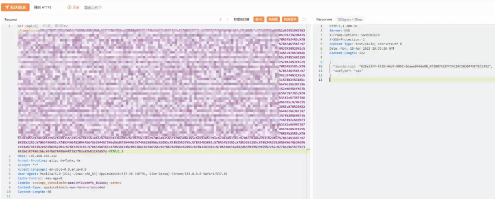
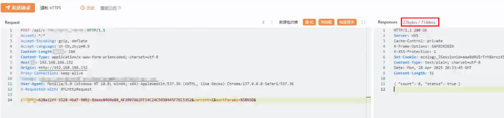

# 泛微e-cology9 未公开接口SQL注入通告

## 条目说明

- 对象与具体问题：泛微e-cology9；未公开接口SQL注入通告
- 版本、配置及部署条件：<v10.76；安全版本>=v10.76
- 认证与权限前提：CVSS说明无需权限
- 核验边界：已完成原始 Markdown 的文本审阅；未执行 PoC、未访问目标、未视检截图。来源所述影响与复现结果不等于本库独立验证。

## 证据边界与更正

以下记录原始资料的证据边界。可以由原文确定的产品、编号及格式问题已在本条修订；没有原始证据的版本、响应和补丁信息仍待核实。

- 正文安全版本>=10.76与修复方案官方尚未发布自相矛盾，需回原公告核对时间/模板
- WM-202507-000054为安恒ID，CVE/CNVD/CNNVD明确未分配，不应生成虚假编号
- 标题泛化、截图无可读接口；与QVD同期同补丁只能候选关联，POC已发现不是已公开
- HTML表格样式噪声应剥离

## 操作风险

现有材料未完整列明副作用；示例不保证只读或无状态变化。保留原示例供静态分析；仅可在明确授权的隔离测试环境验证，事先准备备份与回滚。

## 技术资料与来源记录

安恒研究院  安恒信息CERT   2025-07-09 11:04  
  
  
  
<table><tbody><tr style="-webkit-tap-highlight-color:transparent;"><td colspan="4" data-colwidth="100.0000%" width="100.0000%" style="-webkit-tap-highlight-color:transparent;word-break:break-all;hyphens:auto;border-color:#4577da;background-color:#4577da;"><section style="-webkit-tap-highlight-color:transparent;margin:5px 0px;"><section style="-webkit-tap-highlight-color:transparent;margin-top:0px;margin-right:0px;margin-bottom:unset;margin-left:0px;padding:0px 5px;font-size:14px;color:rgb(255, 255, 255);box-sizing:border-box;">
<strong style="-webkit-tap-highlight-color:transparent;">漏洞概述</strong>
</section></section></td></tr><tr style="-webkit-tap-highlight-color:transparent;"><td data-colwidth="25.0000%" width="25.0000%" style="-webkit-tap-highlight-color:transparent;word-break:break-all;hyphens:auto;border-color:#4577da;"><section style="-webkit-tap-highlight-color:transparent;margin:5px 0px;"><section style="-webkit-tap-highlight-color:transparent;margin-top:0px;margin-right:0px;margin-bottom:unset;margin-left:0px;padding:0px 5px;font-size:14px;box-sizing:border-box;">
<strong style="-webkit-tap-highlight-color:transparent;">漏洞名称</strong>
</section></section></td><td colspan="3" data-colwidth="75.0000%" width="75.0000%" style="-webkit-tap-highlight-color:transparent;word-break:break-all;hyphens:auto;border-color:#4577da;"><section style="-webkit-tap-highlight-color:transparent;margin:5px 0px;"><section style="-webkit-tap-highlight-color:transparent;margin-top:0px;margin-right:0px;margin-bottom:unset;margin-left:0px;padding:0px 5px;font-size:14px;box-sizing:border-box;">
泛微E-cology9存在SQL注入漏洞
</section></section></td></tr><tr style="-webkit-tap-highlight-color:transparent;"><td data-colwidth="25.0000%" width="25.0000%" style="-webkit-tap-highlight-color:transparent;word-break:break-all;hyphens:auto;border-color:#4577da;"><section style="-webkit-tap-highlight-color:transparent;margin:5px 0px;"><section style="-webkit-tap-highlight-color:transparent;margin-top:0px;margin-right:0px;margin-bottom:unset;margin-left:0px;padding:0px 5px;font-size:14px;box-sizing:border-box;">
<strong style="-webkit-tap-highlight-color:transparent;">安恒CERT评级</strong>
</section></section></td><td data-colwidth="25.0000%" width="25.0000%" style="-webkit-tap-highlight-color:transparent;word-break:break-all;hyphens:auto;border-color:#4577da;"><section style="-webkit-tap-highlight-color:transparent;margin:5px 0px;"><section style="-webkit-tap-highlight-color:transparent;margin-top:0px;margin-right:0px;margin-bottom:unset;margin-left:0px;padding:0px 5px;font-size:14px;box-sizing:border-box;">
2级
</section></section></td><td data-colwidth="25.0000%" width="25.0000%" style="-webkit-tap-highlight-color:transparent;word-break:break-all;hyphens:auto;border-color:#4577da;"><section style="-webkit-tap-highlight-color:transparent;margin:5px 0px;"><section style="-webkit-tap-highlight-color:transparent;margin-top:0px;margin-right:0px;margin-bottom:unset;margin-left:0px;padding:0px 5px;font-size:14px;box-sizing:border-box;">
<strong style="-webkit-tap-highlight-color:transparent;">CVSS3.1评分</strong>
</section></section></td><td data-colwidth="25.0000%" width="25.0000%" style="-webkit-tap-highlight-color:transparent;word-break:break-all;hyphens:auto;border-color:#4577da;"><section style="-webkit-tap-highlight-color:transparent;margin:5px 0px;"><section style="-webkit-tap-highlight-color:transparent;margin-top:0px;margin-right:0px;margin-bottom:unset;margin-left:0px;padding:0px 5px;font-size:14px;box-sizing:border-box;">
8.6（安恒自评）
</section></section></td></tr><tr style="-webkit-tap-highlight-color:transparent;"><td data-colwidth="25.0000%" width="25.0000%" style="-webkit-tap-highlight-color:transparent;word-break:break-all;hyphens:auto;border-color:#4577da;"><section style="-webkit-tap-highlight-color:transparent;margin:5px 0px;"><section style="-webkit-tap-highlight-color:transparent;margin-top:0px;margin-right:0px;margin-bottom:unset;margin-left:0px;padding:0px 5px;font-size:14px;box-sizing:border-box;">
<strong style="-webkit-tap-highlight-color:transparent;">CVE编号</strong>
</section></section></td><td data-colwidth="25.0000%" width="25.0000%" style="-webkit-tap-highlight-color:transparent;word-break:break-all;hyphens:auto;border-color:#4577da;"><section style="-webkit-tap-highlight-color:transparent;margin:5px 0px;">
未分配
<section style="-webkit-tap-highlight-color:transparent;margin-top:0px;margin-right:0px;margin-bottom:unset;margin-left:0px;padding:0px 5px;font-size:14px;overflow:hidden;line-height:0;box-sizing:border-box;"> </section></section></td><td data-colwidth="25.0000%" width="25.0000%" style="-webkit-tap-highlight-color:transparent;word-break:break-all;hyphens:auto;border-color:#4577da;"><section style="-webkit-tap-highlight-color:transparent;margin:5px 0px;"><section style="-webkit-tap-highlight-color:transparent;margin-top:0px;margin-right:0px;margin-bottom:unset;margin-left:0px;padding:0px 5px;font-size:14px;box-sizing:border-box;">
<strong style="-webkit-tap-highlight-color:transparent;">CNVD编号</strong>
</section></section></td><td data-colwidth="25.0000%" width="25.0000%" style="-webkit-tap-highlight-color:transparent;word-break:break-all;hyphens:auto;border-color:#4577da;"><section style="-webkit-tap-highlight-color:transparent;margin:5px 0px;"><section style="-webkit-tap-highlight-color:transparent;margin-top:0px;margin-right:0px;margin-bottom:unset;margin-left:0px;padding:0px 5px;font-size:14px;box-sizing:border-box;">
未分配
</section></section></td></tr><tr style="-webkit-tap-highlight-color:transparent;"><td data-colwidth="25.0000%" width="25.0000%" style="-webkit-tap-highlight-color:transparent;word-break:break-all;hyphens:auto;border-color:#4577da;"><section style="-webkit-tap-highlight-color:transparent;margin:5px 0px;"><section style="-webkit-tap-highlight-color:transparent;margin-top:0px;margin-right:0px;margin-bottom:unset;margin-left:0px;padding:0px 5px;font-size:14px;box-sizing:border-box;">
<strong style="-webkit-tap-highlight-color:transparent;">CNNVD编号</strong>
</section></section></td><td data-colwidth="25.0000%" width="25.0000%" style="-webkit-tap-highlight-color:transparent;word-break:break-all;hyphens:auto;border-color:#4577da;"><section style="-webkit-tap-highlight-color:transparent;margin:5px 0px;"><section style="-webkit-tap-highlight-color:transparent;margin-top:0px;margin-right:0px;margin-bottom:unset;margin-left:0px;padding:0px 5px;font-size:14px;box-sizing:border-box;">
未分配
</section></section></td><td data-colwidth="25.0000%" width="25.0000%" style="-webkit-tap-highlight-color:transparent;word-break:break-all;hyphens:auto;border-color:#4577da;"><section style="-webkit-tap-highlight-color:transparent;margin:5px 0px;"><section style="-webkit-tap-highlight-color:transparent;margin-top:0px;margin-right:0px;margin-bottom:unset;margin-left:0px;padding:0px 5px;font-size:14px;box-sizing:border-box;">
<strong style="-webkit-tap-highlight-color:transparent;">安恒CERT编号</strong>
</section></section></td><td data-colwidth="25.0000%" width="25.0000%" style="-webkit-tap-highlight-color:transparent;word-break:break-all;hyphens:auto;border-color:#4577da;"><section style="-webkit-tap-highlight-color:transparent;margin:5px 0px;"><section style="-webkit-tap-highlight-color:transparent;margin-top:0px;margin-right:0px;margin-bottom:unset;margin-left:0px;padding:0px 5px;font-size:14px;box-sizing:border-box;">
WM-202507-000054
</section></section></td></tr><tr style="-webkit-tap-highlight-color:transparent;"><td data-colwidth="25.0000%" width="25.0000%" style="-webkit-tap-highlight-color:transparent;word-break:break-all;hyphens:auto;border-color:#4577da;"><section style="-webkit-tap-highlight-color:transparent;margin:5px 0px;"><section style="-webkit-tap-highlight-color:transparent;margin-top:0px;margin-right:0px;margin-bottom:unset;margin-left:0px;padding:0px 5px;font-size:14px;box-sizing:border-box;">
<strong style="-webkit-tap-highlight-color:transparent;">POC情况</strong>
</section></section></td><td data-colwidth="25.0000%" width="25.0000%" style="-webkit-tap-highlight-color:transparent;word-break:break-all;hyphens:auto;border-color:#4577da;"><section style="-webkit-tap-highlight-color:transparent;margin:5px 0px;"><section style="-webkit-tap-highlight-color:transparent;margin-top:0px;margin-right:0px;margin-bottom:unset;margin-left:0px;padding:0px 5px;font-size:14px;box-sizing:border-box;">
已发现
</section></section></td><td data-colwidth="25.0000%" width="25.0000%" style="-webkit-tap-highlight-color:transparent;word-break:break-all;hyphens:auto;border-color:#4577da;"><section style="-webkit-tap-highlight-color:transparent;margin:5px 0px;"><section style="-webkit-tap-highlight-color:transparent;margin-top:0px;margin-right:0px;margin-bottom:unset;margin-left:0px;padding:0px 5px;font-size:14px;box-sizing:border-box;">
<strong style="-webkit-tap-highlight-color:transparent;">EXP情况</strong>
</section></section></td><td data-colwidth="25.0000%" width="25.0000%" style="-webkit-tap-highlight-color:transparent;word-break:break-all;hyphens:auto;border-color:#4577da;"><section style="-webkit-tap-highlight-color:transparent;margin:5px 0px;"><section style="-webkit-tap-highlight-color:transparent;margin-top:0px;margin-right:0px;margin-bottom:unset;margin-left:0px;padding:0px 5px;font-size:14px;box-sizing:border-box;">
已发现
</section></section></td></tr><tr style="-webkit-tap-highlight-color:transparent;"><td data-colwidth="25.0000%" width="25.0000%" style="-webkit-tap-highlight-color:transparent;word-break:break-all;hyphens:auto;border-color:#4577da;"><section style="-webkit-tap-highlight-color:transparent;margin:5px 0px;"><section style="-webkit-tap-highlight-color:transparent;margin-top:0px;margin-right:0px;margin-bottom:unset;margin-left:0px;padding:0px 5px;font-size:14px;box-sizing:border-box;">
<strong style="-webkit-tap-highlight-color:transparent;">在野利用</strong>
</section></section></td><td data-colwidth="25.0000%" width="25.0000%" style="-webkit-tap-highlight-color:transparent;word-break:break-all;hyphens:auto;border-color:#4577da;"><section style="-webkit-tap-highlight-color:transparent;margin:5px 0px;"><section style="-webkit-tap-highlight-color:transparent;margin-top:0px;margin-right:0px;margin-bottom:unset;margin-left:0px;padding:0px 5px;font-size:14px;box-sizing:border-box;">
未发现
</section></section></td><td data-colwidth="25.0000%" width="25.0000%" style="-webkit-tap-highlight-color:transparent;word-break:break-all;hyphens:auto;border-color:#4577da;"><section style="-webkit-tap-highlight-color:transparent;margin:5px 0px;"><section style="-webkit-tap-highlight-color:transparent;margin-top:0px;margin-right:0px;margin-bottom:unset;margin-left:0px;padding:0px 5px;font-size:14px;box-sizing:border-box;">
<strong style="-webkit-tap-highlight-color:transparent;">研究情况</strong>
</section></section></td><td data-colwidth="25.0000%" width="25.0000%" style="-webkit-tap-highlight-color:transparent;word-break:break-all;hyphens:auto;border-color:#4577da;"><section style="-webkit-tap-highlight-color:transparent;margin:5px 0px;"><section style="-webkit-tap-highlight-color:transparent;margin-top:0px;margin-right:0px;margin-bottom:unset;margin-left:0px;padding:0px 5px;font-size:14px;box-sizing:border-box;">
已复现
</section></section></td></tr><tr style="-webkit-tap-highlight-color:transparent;"><td data-colwidth="25.0000%" width="25.0000%" style="-webkit-tap-highlight-color:transparent;word-break:break-all;hyphens:auto;border-color:#4577da;"><section style="-webkit-tap-highlight-color:transparent;margin:5px 0px;"><section style="-webkit-tap-highlight-color:transparent;margin-top:0px;margin-right:0px;margin-bottom:unset;margin-left:0px;padding:0px 5px;font-size:14px;box-sizing:border-box;">
<strong style="-webkit-tap-highlight-color:transparent;">危害描述</strong>
</section></section></td><td colspan="3" data-colwidth="75.0000%" width="75.0000%" style="-webkit-tap-highlight-color:transparent;word-break:break-all;hyphens:auto;border-color:#4577da;"><section style="-webkit-tap-highlight-color:transparent;margin:5px 0px;"><section style="-webkit-tap-highlight-color:transparent;margin-top:0px;margin-right:0px;margin-bottom:unset;margin-left:0px;padding:0px 5px;font-size:14px;overflow:hidden;line-height:0;box-sizing:border-box;"> </section>
该漏洞由于E-cology9部分功能接口参数可控且通过一定构造可实现恶意SQL语句拼接，导致SQL注入漏洞产生，结合其相关后利用攻击者可实现远程代码执行。
<section style="-webkit-tap-highlight-color:transparent;margin-top:0px;margin-right:0px;margin-bottom:unset;margin-left:0px;padding:0px 5px;font-size:14px;overflow:hidden;line-height:0;box-sizing:border-box;"> </section></section></td></tr></tbody></table>  
  
该产  
品主要使用客户行业分布广泛，漏洞危害性高，  
建议客户尽快做好自查及防护。  
  
**安恒研究院卫兵实验室已复现此漏洞。**  
  
  
  
****  
  
  
  
  
**漏洞信息**  
  
  
  
  
泛微  
E-cology9  
是一款企业级协同办公（  
OA  
）平台，核心定位是智能化、全程数字化的组织管理。  
  
  
**漏洞描述**  
  
**漏洞危害等级：**  
高危  
  
**漏洞类型：**  
SQL注入  
  
  
**影响范围**  
  
**影响版本：**  
  
泛微  
E-cology9   
补丁版本   
< v10.7  
6  
  
**安全版本：**  
  
泛微E-cology9 补丁版本 >= v10.76  
  
  
**CVSS向量**  
  
访问途径（AV）：网络  
  
攻击复杂度（AC）：低  
  
所需权限（PR）：无  
  
用户交互（UI）：无  
  
影响范围 （S）：不变  
  
机密性影响 （C）：高  
  
完整性影响 （l）：低  
  
可用性影响 （A）：低  
  
  
  
**修复方案**  
  
  
  
  
**官方修复方案：**  
  
官方  
尚未  
发布修复方案，受影响的用户建议及时  
关注最新版本发布  
。  
  
https://www.weaver.com.cn/cs/securityDownload.html#  
  
  
**参考资料**  
  
  
  
  
  
https://www.weaver.com.cn/cs/securityDownload.html#  
  
  
  
**技术支持**  
  
  
  
  
如有漏洞相关需求支持请联系400-6059-110获取相关能力支撑。  
  
  

---

> 来源：gelusus/wxvl（微信公众号漏洞文章自动归档，原文见文首链接）
