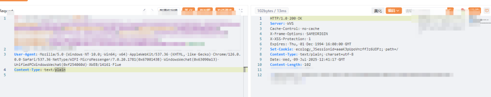
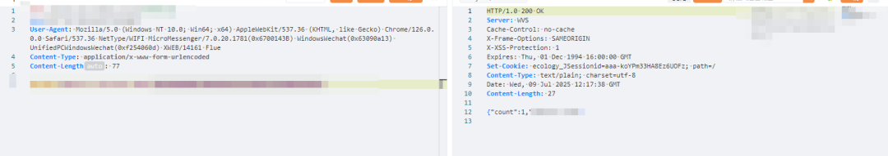
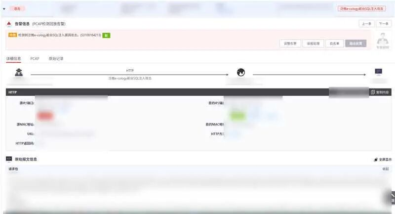

# 泛微e-cology9 前台SQL注入通告，接口未公开

## 条目说明

- 对象与具体问题：泛微e-cology9；前台SQL注入通告，接口未公开
- 版本、配置及部署条件：补丁<10.76；声称默认配置
- 认证与权限前提：无需认证/交互，通告声称无需绕过
- 核验边界：已完成原始 Markdown 的文本审阅；未执行 PoC、未访问目标、未视检截图。来源所述影响与复现结果不等于本库独立验证。

## 证据边界与更正

以下记录原始资料的证据边界。可以由原文确定的产品、编号及格式问题已在本条修订；没有原始证据的版本、响应和补丁信息仍待核实。

- XVE-2025-26658是主ID应结构化，不误记CNVD
- 属于微步通告，POC未公开/在野未发现；截图复现不等于仓库复现证据
- 与QVD-2025-26680等7月10.76通告只有候选关联，暂不确定同根因
- 保留厂商补丁链接和检测规则日期，裁掉服务营销尾部

## 操作风险

现有材料未完整列明副作用；示例不保证只读或无状态变化。保留原示例供静态分析；仅可在明确授权的隔离测试环境验证，事先准备备份与回滚。

## 技术资料与来源记录

原创 微步情报局  微步在线研究响应中心   2025-07-10 06:15  
  
  
  
  
**漏洞概况**  
  
  
  
泛微E-cology是一款企业级协同办公自动化系统，主要为中大型企业提供全面的信息化解决方案。它以智能化、平台化和全程数字化为特点，旨在提升组织的协同办公效率和管理水平。  
  
微步情报局监测到泛微E-cology官方近日发布补丁修复一处SQL注入漏洞。由于E-cology将用户可控的参数拼接SQL语句，造成SQL注入漏洞进而获取服务器权限，也可通过回显结果来读取敏感数据。  
  
  
该漏洞为前台SQL注入漏洞，无需身份认证  
，  
建议受影响用户尽快修复  
。  
  
**漏洞处置优先级(VPT)**  
  
  
  
**综合处置优先级：****高**  
  
<table><tbody><tr><td rowspan="2" data-colwidth="123" valign="middle"><section>基本信息</section></td><td data-colwidth="191"><section>微步编号</section></td><td data-colwidth="191"><section>XVE-2025-26658</section></td></tr><tr><td data-colwidth="191"><section>漏洞类型</section></td><td data-colwidth="191"><section>SQL注入</section></td></tr><tr><td rowspan="5" data-colwidth="123" valign="middle"><section>利用条件评估</section></td><td data-colwidth="191"><section>利用漏洞的网络条件</section></td><td data-colwidth="191"><section>远程</section></td></tr><tr><td data-colwidth="191"><section>是否需要绕过安全机制</section></td><td data-colwidth="191"><section>不需要</section></td></tr><tr><td data-colwidth="191"><section>对被攻击系统的需求</section></td><td data-colwidth="191"><section>默认配置</section></td></tr><tr><td data-colwidth="191"><section>利用漏洞的权限要求</section></td><td data-colwidth="191"><section>无需权限</section></td></tr><tr><td data-colwidth="191"><section>是否需要受害者配合</section></td><td data-colwidth="191"><section>否</section></td></tr><tr><td rowspan="2" data-colwidth="123"><section>利用情报</section></td><td data-colwidth="191"><section>POC是否公开</section></td><td data-colwidth="191"><section>否</section></td></tr><tr><td data-colwidth="191"><section>已知利用行为</section></td><td data-colwidth="191"><section>否</section></td></tr></tbody></table>  

****  
**漏洞影响范围**  
  
  
  
  
<table><tbody><tr><td data-colwidth="122"><section>产品名称</section></td><td data-colwidth="391"><section>上海泛微网络科技股份有限公司- E-cology</section></td></tr><tr><td data-colwidth="122"><section>受影响版本</section></td><td data-colwidth="391"><section>补丁版本&lt; v10.76</section></td></tr><tr><td data-colwidth="122"><section>有无修复补丁</section></td><td data-colwidth="391"><section>有</section></td></tr></tbody></table>  

漏洞复现  
  
  
  
  
  
通过回显读取敏感数据  
  
  
  
  
**修复方案**  
  
  
  
泛微官方已发布修复补丁，请尽快更新至v10.76版本补丁：  
  
https://www.weaver.com.cn/cs/securityDownload.html  
### 临时修复方案：  
- 可配置防护策略，限制访问漏洞相关路径。完整漏洞利用路径请通过微步漏洞情报查询。  
  
- 如非必要，避免将资产暴露在互联网。  
  
**微步产品侧支持情况**  
  
  
- 微步威胁感知平台TDP  
 已支持检测，检测ID：S3100164213，模型/规则高于20250709000000可检出。  
  
  
  
- END -  
  
  //    
  
**微步漏洞情报订阅服务**  
  
  
微步提供漏洞情报订阅服务，精准、高效助力企业漏洞运营：  
- 提供高价值漏洞情报，具备及时、准确、全面和可操作性，帮助企业高效应对漏洞应急与日常运营难题；  
  
- 可实现对高威胁漏洞提前掌握，以最快的效率解决信息差问题，缩短漏洞运营MTTR；  
  
- 提供漏洞完整的技术细节，更贴近用户漏洞处置的落地；  
  
- 将漏洞与威胁事件库、APT组织和黑产团伙攻击大数据、网络空间测绘等结合，对漏洞的实际风险进行持续动态更新  
。  
  
  
扫码在线沟通  
  
↓  
↓↓  
  
  
  
  
  
  
点此电话咨询  
  
  
  
  
**X漏洞奖励计划**  
  
  
“X漏洞奖励计划”是微步X情报社区推出的一款  
针对未公开  
漏洞的奖励计划，我们鼓励白帽子提交挖掘到的0day漏洞，并给予白帽子可观的奖励。我们期望通过该计划与白帽子共同努力，提升0day防御能力，守护数字世界安全。  
  
活动详情：  
https://x.threatbook.com/v5/vulReward  
  
  
  
  

---

> 来源：gelusus/wxvl（微信公众号漏洞文章自动归档，原文见文首链接）
