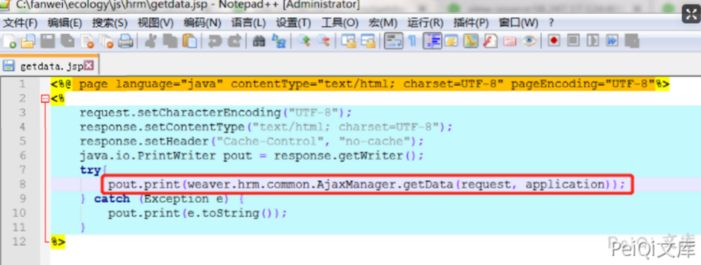
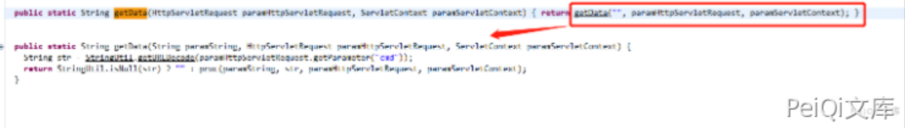
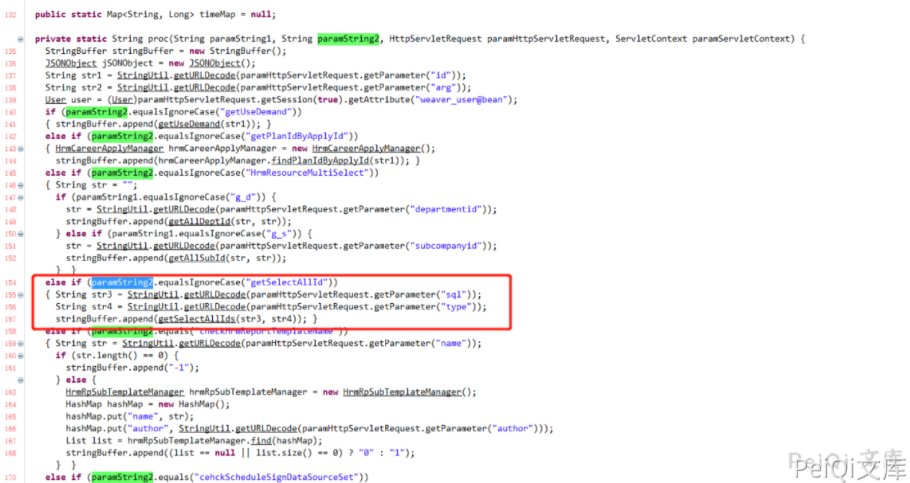
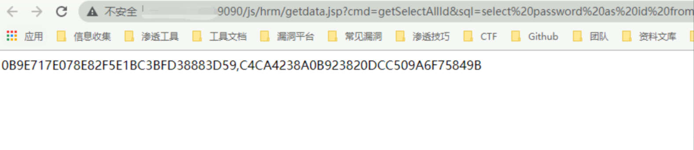
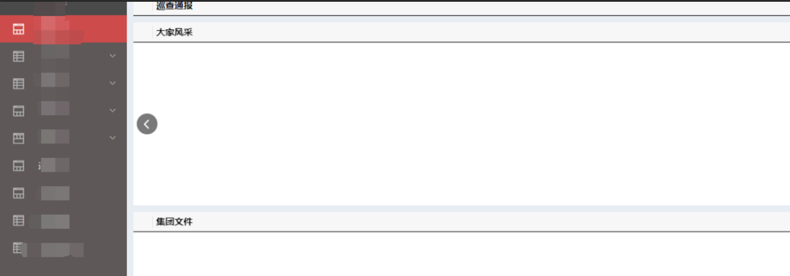

# 泛微e-cology getdata.jsp getSelectAllId任意SQL查询

## 条目说明

- 对象与具体问题：泛微e-cology；getdata.jsp getSelectAllId任意SQL查询
- 版本、配置及部署条件：V8声称；数据库权限影响返回范围
- 认证与权限前提：前台请求无cookie，未给全局鉴权分析
- 核验边界：已完成原始 Markdown 的文本审阅；未执行 PoC、未访问目标、未视检截图。来源所述影响与复现结果不等于本库独立验证。

## 证据边界与更正

以下记录原始资料的证据边界。可以由原文确定的产品、编号及格式问题已在本条修订；没有原始证据的版本、响应和补丁信息仍待核实。

- 比<=9.0短篇新增AjaxManager调用链；短篇cmd写getSelectAlld，与本篇getSelectAllId不一致，应以源码核对
- 读取密码字段不代表必能解密/登录，也不自动等于服务器权限；当前描述扩大影响
- 主证据为截图，缺修复范围；与2025同端点通告仅历史关联

## 操作风险

现有材料未完整列明副作用；示例不保证只读或无状态变化。保留原示例供静态分析；仅可在明确授权的隔离测试环境验证，事先准备备份与回滚。

## 技术资料与来源记录

### 漏洞描述

泛微OA V8 存在SQL注入漏洞，攻击者可以通过漏洞获取管理员权限和服务器权限

### 漏洞影响

```
泛微OA V8
```

### 网络测绘

```
app="泛微-协同办公OA"
```

### 漏洞复现

在getdata.jsp中，直接将request对象交给

**weaver.hrm.common.AjaxManager.getData(HttpServletRequest, ServletContext) :** 

方法处理




在getData方法中，判断请求里cmd参数是否为空，如果不为空，调用proc方法




Proc方法4个参数，(“空字符串”,”cmd参数值”,request对象，serverContext对象)

在proc方法中，对cmd参数值进行判断，当cmd值等于getSelectAllId时，再从请求中获取sql和type两个参数值，并将参数传递进getSelectAllIds（sql,type）方法中




根据以上代码流程，只要构造请求参数

?cmd= getSelectAllId&sql=select password as id from userinfo;

即可完成对数据库操控

POC

```plain
http://xxx.xxx.xxx.xxx/js/hrm/getdata.jsp?cmd=getSelectAllId&sql=select%20password%20as%20id%20from%20HrmResourceManager
```

查询HrmResourceManager表中的password字段，页面中返回了数据库第一条记录的值（sysadmin用户的password）


解密后即可登录系统




---

> 来源：Threekiii/Vulnerability-Wiki（https://github.com/Threekiii/Vulnerability-Wiki）
