# 泛微e-mobile6.5/6.6 client.do pullmsg udid SQL注入→H2 CSVWRITE写入

## 条目说明

- 对象与具体问题：泛微e-mobile6.5/6.6；client.do pullmsg udid SQL注入→H2 CSVWRITE写入
- 版本、配置及部署条件：6.5/6.6标题；H2文件写权限和Web目录存在
- 认证与权限前提：作者以未遇getsession断言未认证，未审全局拦截器
- 核验边界：已完成原始 Markdown 的文本审阅；未执行 PoC、未访问目标、未视检截图。来源所述影响与复现结果不等于本库独立验证。

## 证据边界与更正

以下记录原始资料的证据边界。可以由原文确定的产品、编号及格式问题已在本条修订；没有原始证据的版本、响应和补丁信息仍待核实。

- 与getupload/uploadID H2别名链不同方法/参数，必须独立漏洞实体关联而非直接合并
- 检测PoC、HTTP请求、hex脚本、旧版三次请求全部空代码块，严重内容丢失
- 空白页面/密码错误不能证明目录可写，200空msg不能证明SQLi；AUTH_VALUE_NAME残留也不能证明脚本执行
- 多个标识符被换行拆散，叙述引用第5步但正文到第4步结束；原文缺失

## 操作风险

现有材料未完整列明副作用；示例不保证只读或无状态变化。保留原示例供静态分析；仅可在明确授权的隔离测试环境验证，事先准备备份与回滚。

## 技术资料与来源记录

原创 Hyyrent  0xSecurity   2026-01-12 02:42  
  
## 漏洞分析  
  
可以知道 出现漏洞的地方是在   
client.do  
 这个页面  
  
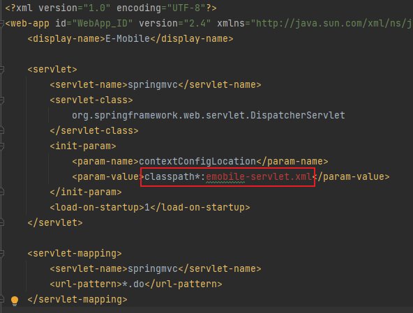  
  
由于泛微用的是spring框架，这里的   
*  
.do 都会指向 emobile-servlet.xml  
  
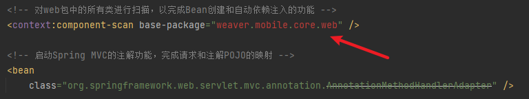  
  
Spring MVC 中会自动扫描指定包下所有的类，并形成对应的映射关系  
  
所以这个 weaver.mobile.core.web 相当于 webapps/ROOT/WEB-INF/classes/weaver/mobile/core/web  
  
在这个文件夹下就可以发现 ClientAction类下会有一个 @RequestMapping({"/client"}, 这个注解就是指向client.do  
  
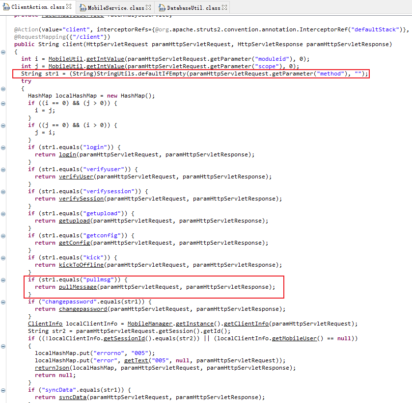  
  
从图中可以知道获取了method参数后，进行了一个判断，如果是 pullmsg ，则传入 pullMessage 函数内  
  
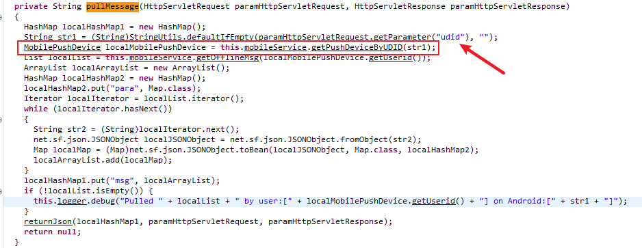  
  
这里接收了一个udid的参数，再传入了getPushDeviceByUDID的函数，跟进去看看  
  
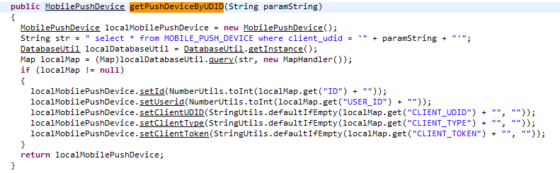  
  
这里就是漏洞产生的地方,这里对传入进来的udid没有进行过滤就直接进行了拼接和查询，最后导致了SQL注入的产生。并且在跟进函数的过程中，并没有遇到 getsession的函数，因此并没有身份上的认证，所以导致了前台未授权SQL注入。  
### H2数据库  
  
在分析这个漏洞之前，先来看一下e-mobile使用的数据库，数据库的名字是 H2  
  
在e-mobile下的 EMobile\webapps\ROOT\WEB-INF\classes  
\  
!\weaver\mobile\core\DatabaseUtil.class 文件中有着这个数据库的连接方式，  
  
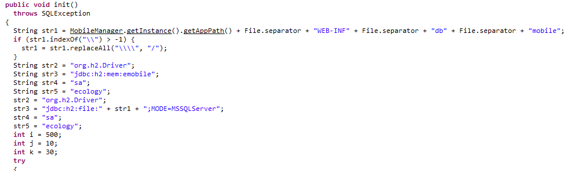  
  
在泛微e-mobile中会有一个数据库 webapps/ROOT/WEB-INF/db/mobile.h2.db ，使用H2客户端连接，不需要带有h2.db后缀。  
  
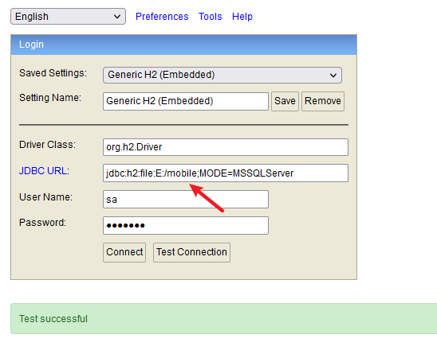  
  
尝试执行payload中的插入数据语句  
  
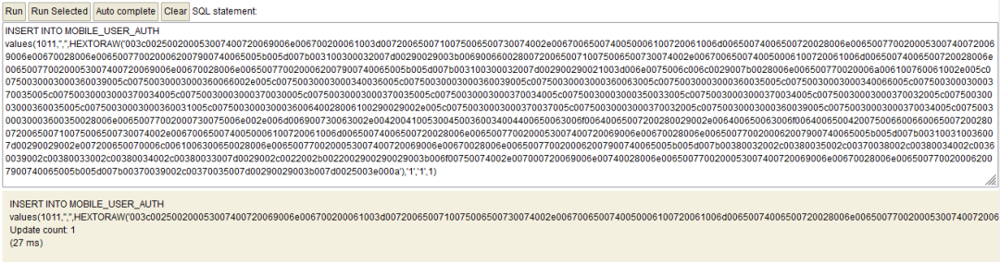  
  
可以看到webshell已经成功被写入AUTH  
_  
VALUE  
_  
NAME字段中  
  
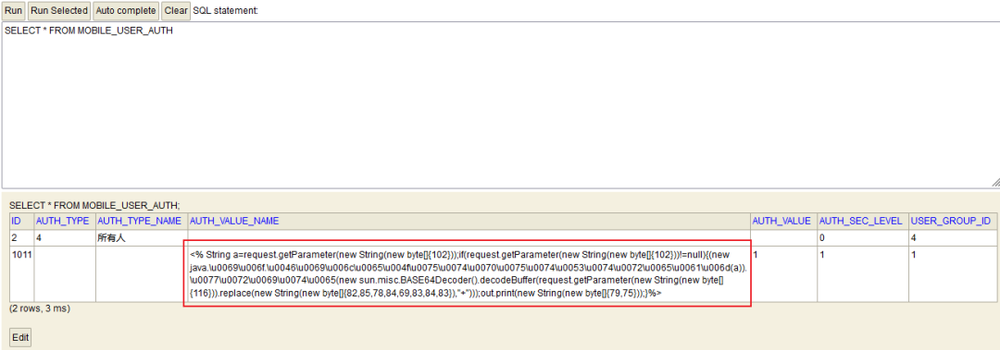  
  
使用CSVWRITE导出文件，但是这样导出的文件中不允许带有双引号，并且会带有 AUTH  
_  
VALUE  
_  
NAME的标识  
  
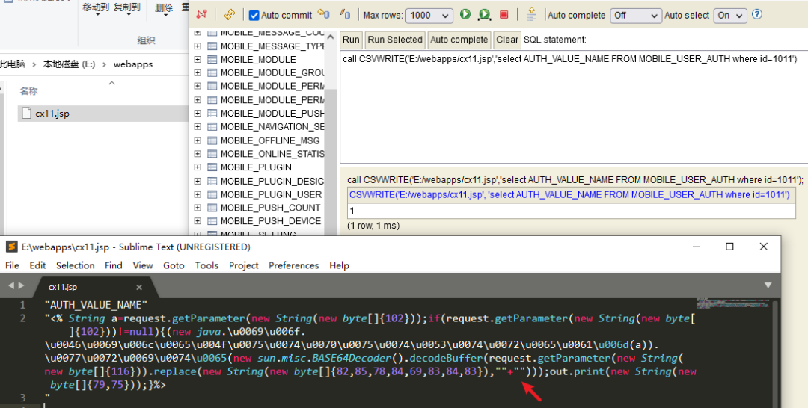  
  
用这样的方法是可以原版导出webshell文本的,这样就不用避免双引号的问题了  
  
**call**  
 CSVWRITE('E:/webapps/cx12.jsp','select AUTH  
_  
VALUE  
_  
NAME FROM MOBILE  
_  
USER  
_  
AUTH where id=1011','charset=UTF-8 escape=  fieldDelimiter=  writeColumnHeader=false  ')  
  
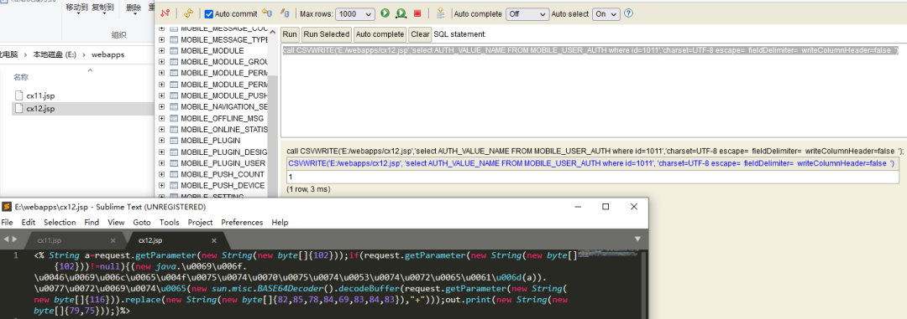  
### 漏洞复现步骤  
  
Fofa语法：app="泛微-EMobile" && title!="移动管理平台-企业管理"  
  
目标首页  
  
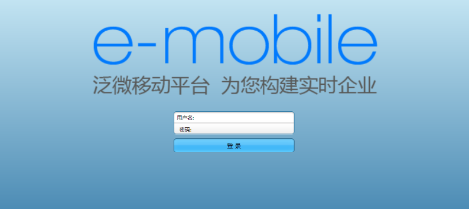  
  
访问以下路径可以获取版本信息  
  
/manager/login.do  
  
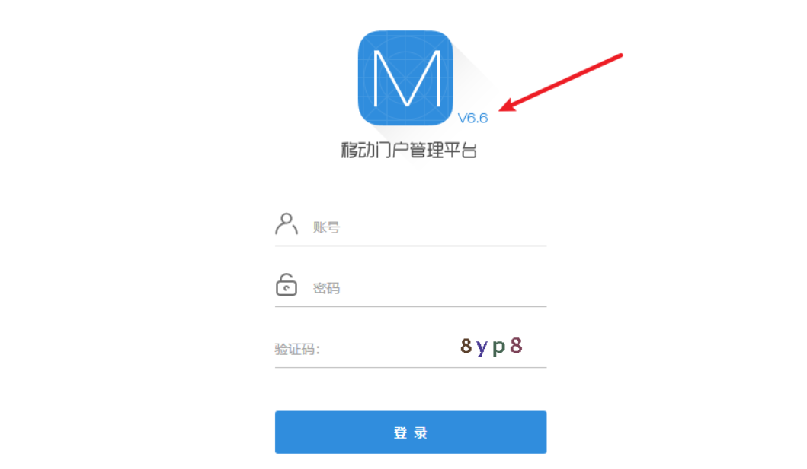  
  
访问以下路径，可以获取目标的系统信息  
  
/client.do?method=getconfig  
  
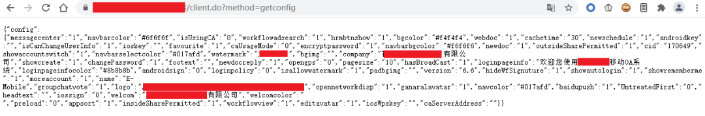  
### 检测  
  
由于此exp会把webshell写在weixin目录下，所以还需要探测一下 /weixin/cowechat.jsp  
  
出现空⽩或者是弹出密码 错误的框就说明可以写到weixin⽬录下  
  
若出现404页面，请结合利用方式的第5步进行利用。  
  
向client.do进行POST一个数据包，状态码响应200，并返回一个空的msg，则说明可能存在漏洞  
  
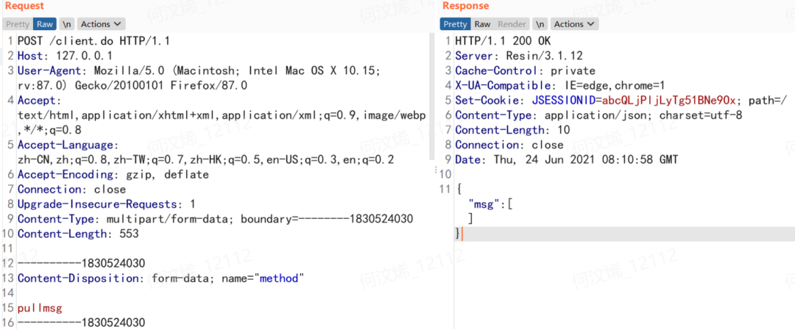  
  
检测poc如下：  
(原资料此处为空，未提供请求或代码。)
### 利用  
  
使用以下SQL语句可以完美导入webshell  
  
SQL语句中单引号是转义符  
  
3';call CSVWRITE('./webapps/ROOT/weixin/nix.jsp','select HEXTORAW(''003c002500200020006f00750074002e007000720069006e00740028002200360036003600360036003600360036003600220029003b00200025003e'')','charset=UTF-8 escape=  fieldDelimiter=  writeColumnHeader=false  ')--  
  
以下是发送的数据包  
(原资料此处为空，未提供请求或代码。)
  
生成hex的python脚本  
(原资料此处为空，未提供请求或代码。)
(原资料此处为空，未提供请求或代码。)
(原资料此处为空，未提供请求或代码。)
  
这里有一个坑点：木马里面有斜杠的，生成前需要把一条斜杠变成两条斜杠（如哥斯拉）  
  
下面是旧版的写入webshell利用方式  
  
1、发送第一个数据包  
(原资料此处为空，未提供请求或代码。)
  
  
目标返回空的msg则说明发送成功  
  
2、发送第二个数据包，让存储在数据库中的小马落地，此处的id应与插入的数据一样  
  
注意，这里的id要与上面插入的id相同，而数据包中的cx11.jsp则是webshell的名字  
(原资料此处为空，未提供请求或代码。)
  
  
3、发送删除数据包，此处的id应与插入的数据一样  
(原资料此处为空，未提供请求或代码。)
  
  
4、 访问 /weixin/cx11.jsp 该路径，若出现AUTH  
_  
VALUE  
_  
NAME则说明小马已经成功落地  
  
  

---

> 来源：gelusus/wxvl（微信公众号漏洞文章自动归档，原文见文首链接）
